# AWS EC2

---
## Launch instance

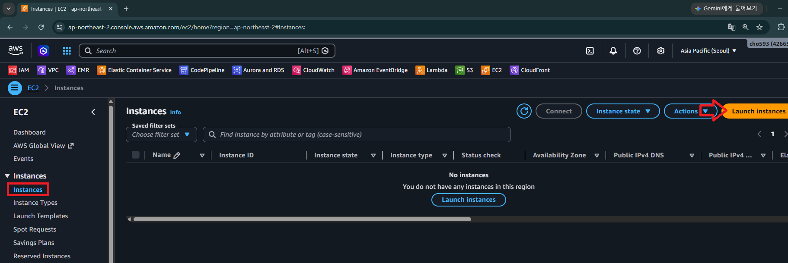

---
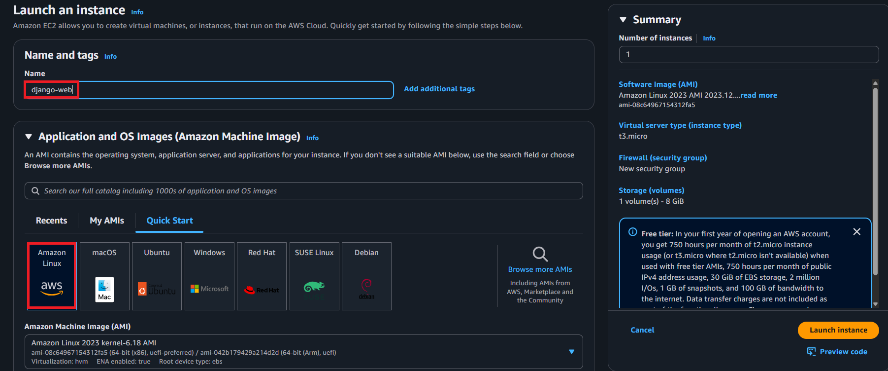

---
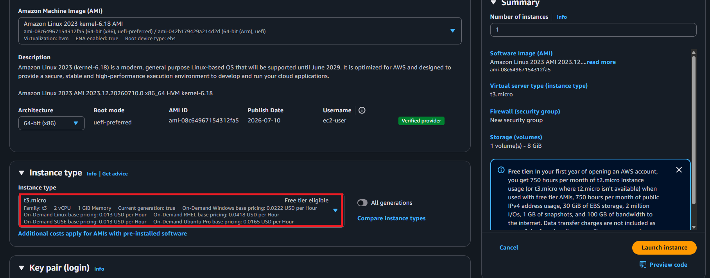

---
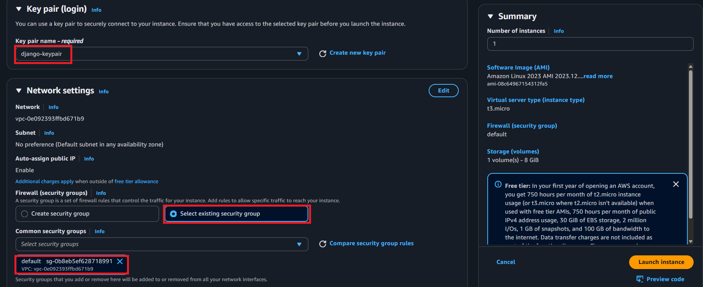

---
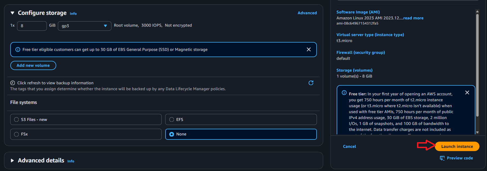

---
> 생성 중...

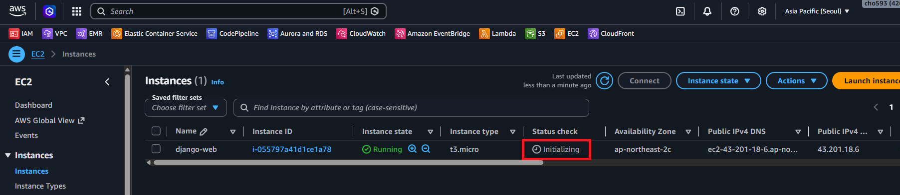

> 생성 완료 

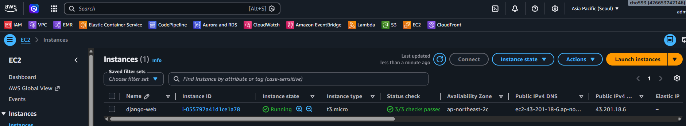

---
## Security Groups

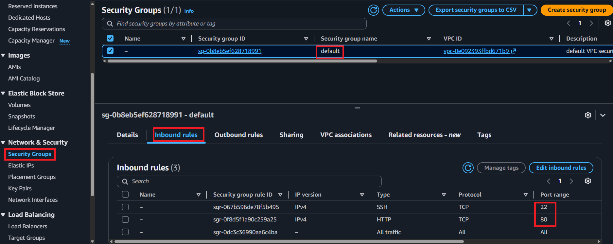

---
## 도커 설치 on EC2

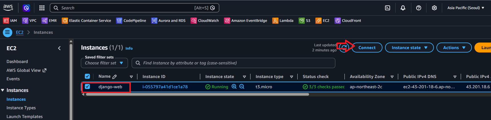

---
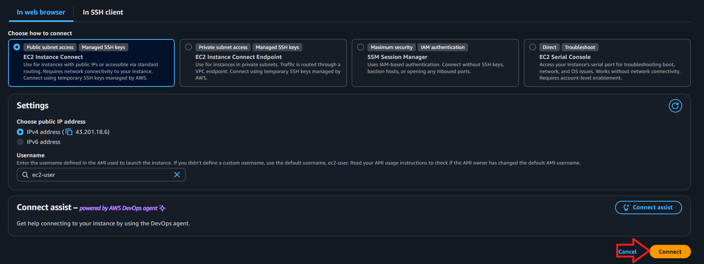

---
```shell
# 1. 패키지 업데이트
sudo dnf update -y
```

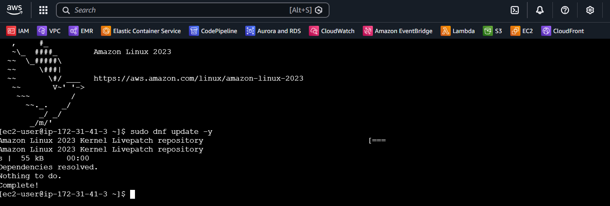

---
```shell
# 2. Docker 설치 (공식 apt 스크립트 필요 없음, dnf 리포에 바로 있음)
sudo dnf install -y docker
```
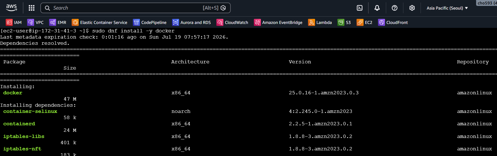

---
```shell
# 3. Docker 서비스 활성화 + 즉시 시작 (재부팅 시에도 자동 시작)
sudo systemctl enable --now docker
```
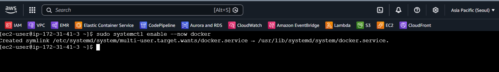

```shell
# 4. 기본 계정(ec2-user)을 docker 그룹에 추가 (sudo 없이 사용)
sudo usermod -aG docker ec2-user
```
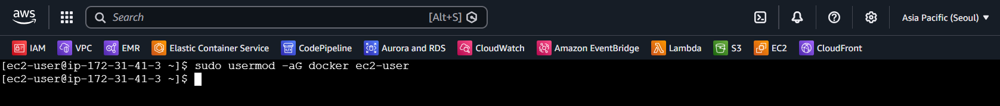

---
```shell
# 5. 설치 확인
docker --version
```
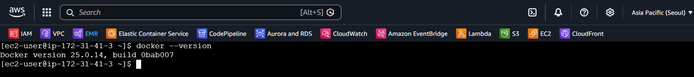

---
## 장고 프로젝트 설치 및 실행 

---
```shell
# 1. 이미지 pull
docker pull goodwon593/django-web:latest
```
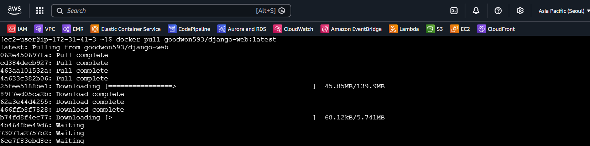

---
```shell
# 2. 컨테이너 실행 (nginx가 컨테이너 내부 80번에서 받아 gunicorn으로 프록시)
docker run -d --name django-server -p 80:80 goodwon593/django-web:latest
```
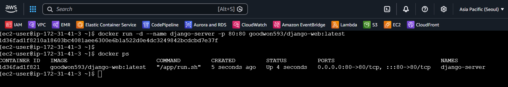

---
## 장고 웹서비스 접속 

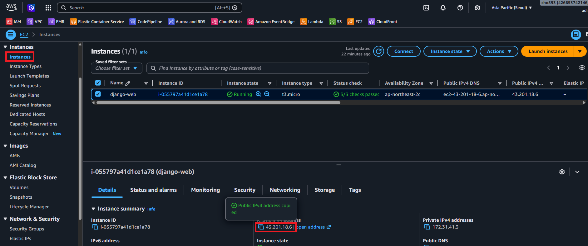

---
꼭 http로 접속해야함!
> http://[Public IPv4 address]

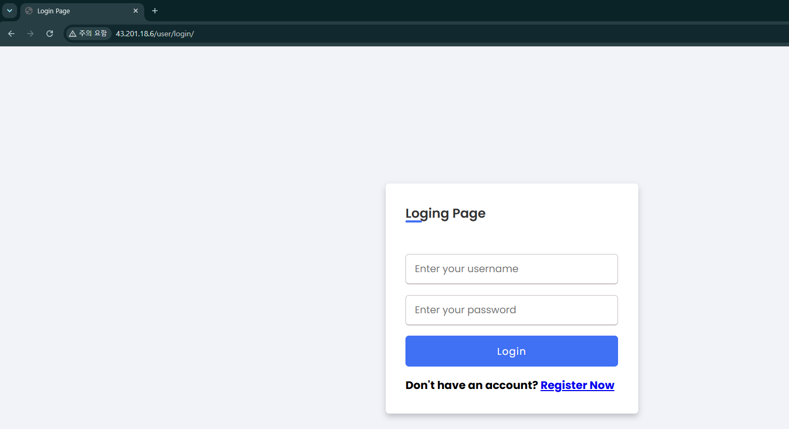
