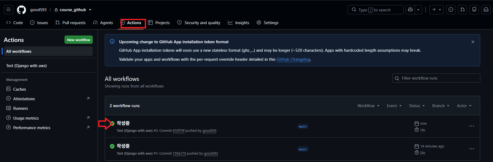
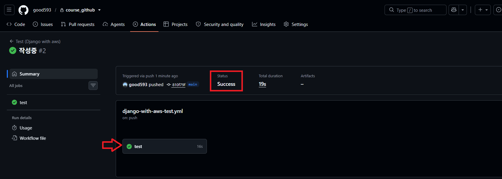
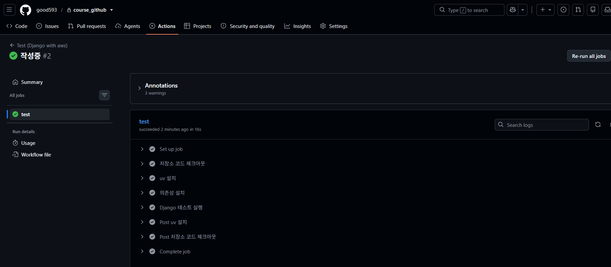

# GitHub Actions - CI

---

## 1. GitHub Actions CI 개념

- CI(Continuous Integration): 코드가 바뀔 때마다 자동으로 빌드/테스트를 실행하는 것
- `main` 브랜치에 push 하거나 PR을 올릴 때마다, 사람이 직접 테스트를 돌리지 않아도 GitHub이 대신 실행해줌
- 목표: "테스트를 깜빡하고 배포" 하는 실수를 방지

---
### (선택) 모노레포에서 예제별로 CI 나누기

- 한 저장소에 여러 예제 폴더가 있어도, 워크플로우 파일은 항상 저장소 루트 `.github/workflows/`에 위치
- 예제마다 `paths` 필터를 다르게 주면, 각 폴더 변경 시 해당 워크플로우만 실행됨

```
.github/workflows/
  ├── django-with-aws-test.yml   (paths: "Github Actions/Django with aws/**")
  └── (다른 예제)-test.yml
```

---

## 2. 워크플로우 파일 구조

`.github/workflows/django-with-aws-test.yml`

```yaml
on:
  push:
    branches: ["main"]
    paths: ["Github Actions/Django with aws/**"]
  pull_request:
    branches: ["main"]
    paths: ["Github Actions/Django with aws/**"]

jobs:
  test:
    runs-on: ubuntu-latest
    defaults:
      run:
        working-directory: Github Actions/Django with aws/django_server
```

---
### 각 항목 설명

- `on`: 워크플로우가 언제 실행될지 정의 (여기선 main에 push / PR)
- `paths`: 지정한 폴더가 변경됐을 때만 실행 (다른 예제 폴더 변경 시엔 실행 안 됨)
- `jobs`: 실제로 실행할 작업 목록 (여기선 `test` 하나)
- `working-directory`: 이후 `run` 스텝들이 실행될 기준 폴더 지정

---

## 3. 실행 결과 확인

- GitHub 저장소 → **Actions** 탭에서 워크플로우 실행 내역 확인
- 각 커밋/PR마다 성공(O) / 실패(X) 표시



---


---



