# GitHub Actions - CD

---
## 1. CD 개념

- CD(Continuous Deployment): 테스트를 통과한 코드를 자동으로 서버에 배포하는 것
- CI(테스트)가 성공한 뒤에만 이어서 실행 → "테스트 안 거친 코드가 배포되는" 사고 방지
- 흐름: 코드 push → **CI** 테스트 실행 → 성공 시 **CD** 배포 (Docker 이미지 빌드 → Docker Hub 푸시 → EC2 재배포)

---
## 2. 워크플로우 트리거: `workflow_run`

`.github/workflows/django-with-aws-deploy.yml`

```yaml
on:
  workflow_run:
    workflows: ["Test (Django with aws)"]
    types: [completed]
    branches: ["main"]

jobs:
  deploy:
    if: github.event.workflow_run.conclusion == 'success'
```

- `workflow_run`: 다른 워크플로우(여기선 CI)가 끝났을 때 트리거됨
- `if: ... == 'success'`: CI가 성공했을 때만 배포 잡을 실행 (실패하면 배포 건너뜀)

---

## 3. Docker 이미지 빌드 & Docker Hub 푸시

```yaml
- name: Docker Hub 로그인
  uses: docker/login-action@v3
  with:
    username: ${{ secrets.DOCKERHUB_USERNAME }}
    password: ${{ secrets.DOCKERHUB_TOKEN }}

- name: 이미지 빌드 & Docker Hub 푸시
  uses: docker/build-push-action@v5
  with:
    context: "Github Actions/Django with aws"
    push: true
    tags: ${{ secrets.DOCKERHUB_USERNAME }}/django-web:latest
```

- `docker build` → `docker login` → `docker push`를 그대로 자동화
- 계정 정보는 코드에 직접 쓰지 않고 **Secrets**로 관리 

---

## 4. EC2에 재배포

```yaml
- name: EC2 재배포
  uses: appleboy/ssh-action@v1
  with:
    host: ${{ secrets.EC2_HOST }}
    username: ${{ secrets.EC2_USERNAME }}
    key: ${{ secrets.EC2_SSH_KEY }}
    script: |
      docker pull ${{ secrets.DOCKERHUB_USERNAME }}/django-web:latest
      docker stop django-server || true
      docker rm django-server || true
      docker run -d --name django-server -p 80:80 ${{ secrets.DOCKERHUB_USERNAME }}/django-web:latest
```

- `appleboy/ssh-action`이 GitHub Actions 러너에서 EC2로 SSH 접속을 대신 처리
- `script`: EC2 안에서 실행할 명령 — 최신 이미지 pull → 기존 컨테이너 정리 → 새 컨테이너 실행

---
# 실습 

---
## Actions secrets and variables

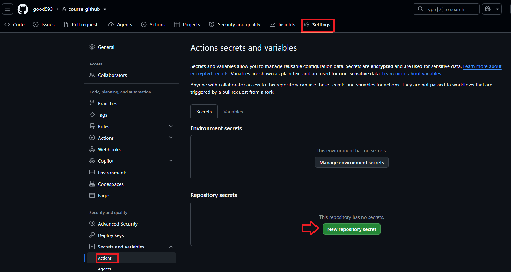

---
> DOCKERHUB_USERNAME

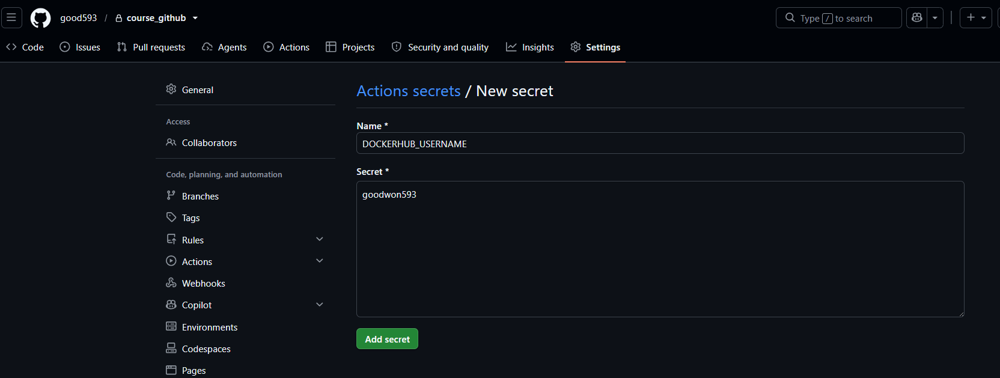

---
> DOCKERHUB_TOKEN

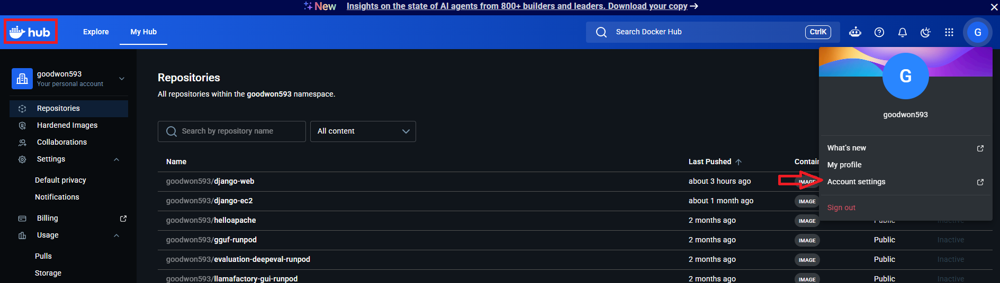

---
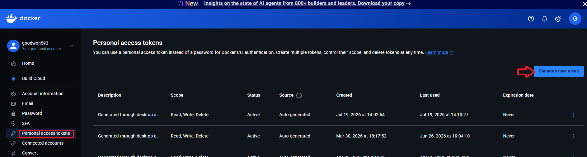

---
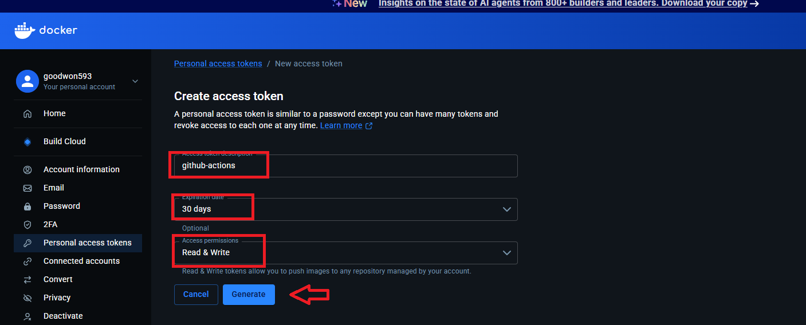

---
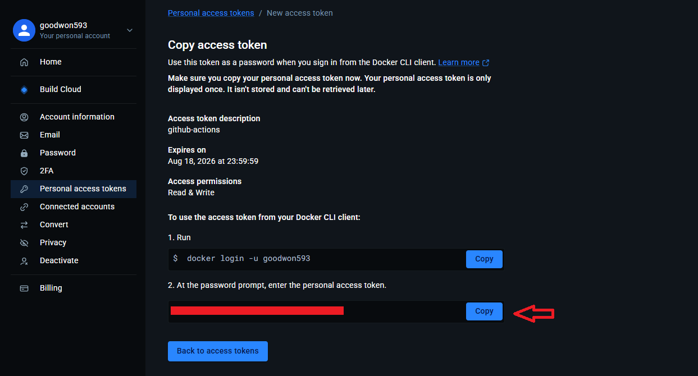

---
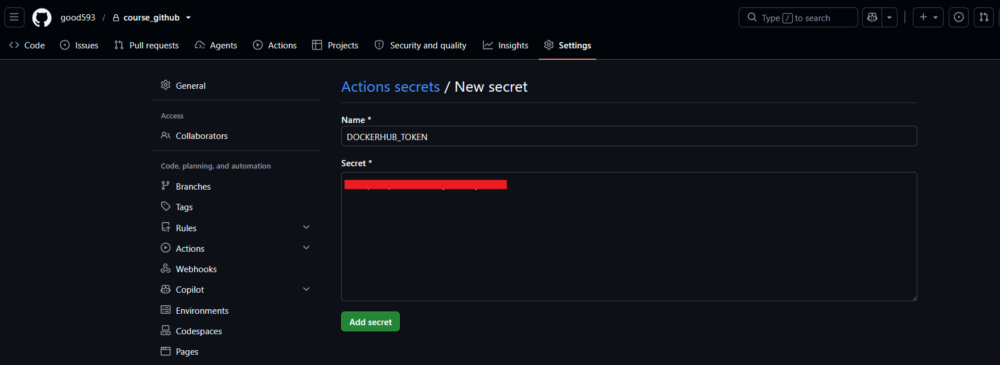

---
> EC2_HOST

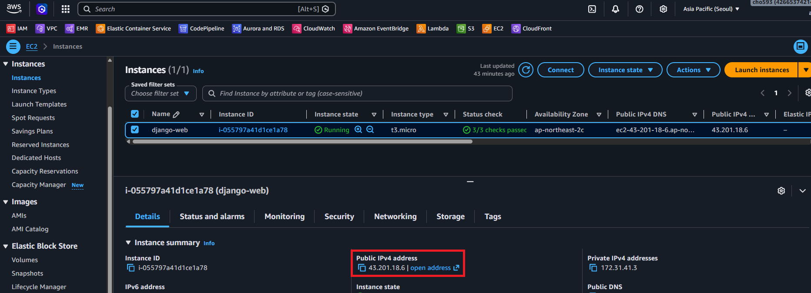

---
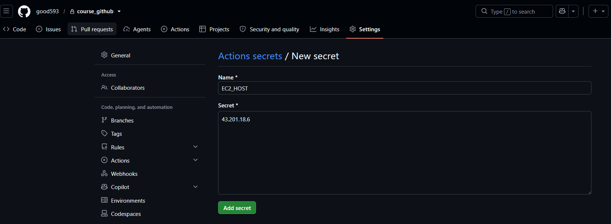

---
> EC2_USERNAME

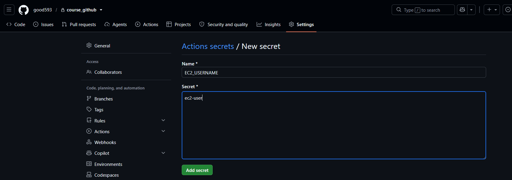

---
> EC2_SSH_KEY

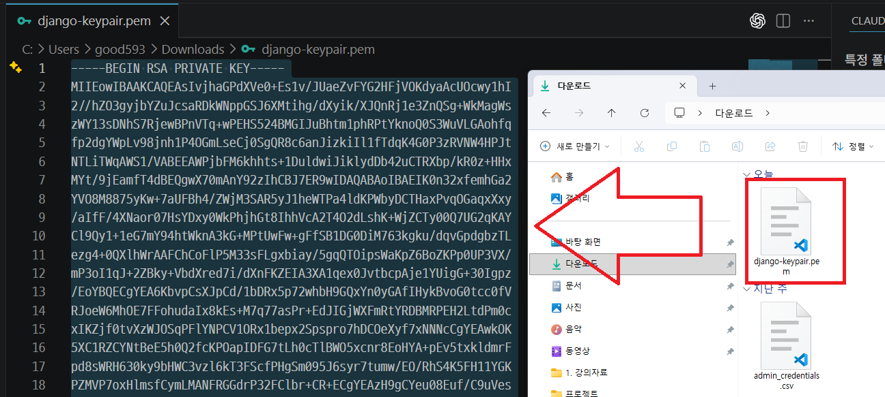

---
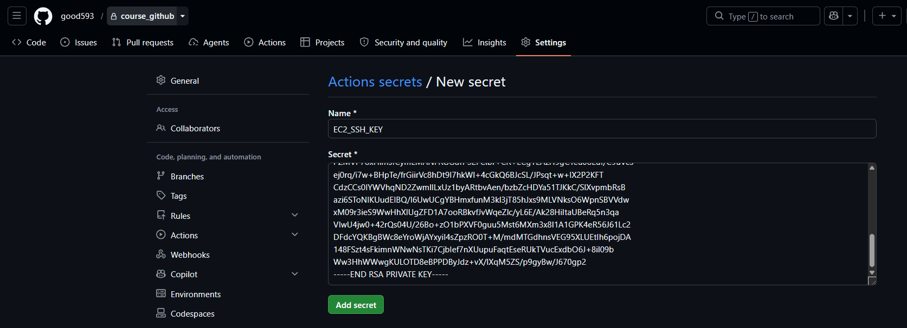

---
### GitHub Secrets 확인 

| Secret | 용도 |
|---|---|
| `DOCKERHUB_USERNAME` | Docker Hub 계정명 |
| `DOCKERHUB_TOKEN` | Docker Hub 액세스 토큰 (비밀번호 대신 사용) |
| `EC2_HOST` | EC2 인스턴스의 퍼블릭 IP / 도메인 |
| `EC2_USERNAME` | EC2 접속 계정 (예: `ubuntu`) |
| `EC2_SSH_KEY` | EC2 접속용 SSH 개인키(.pem 내용) |

---
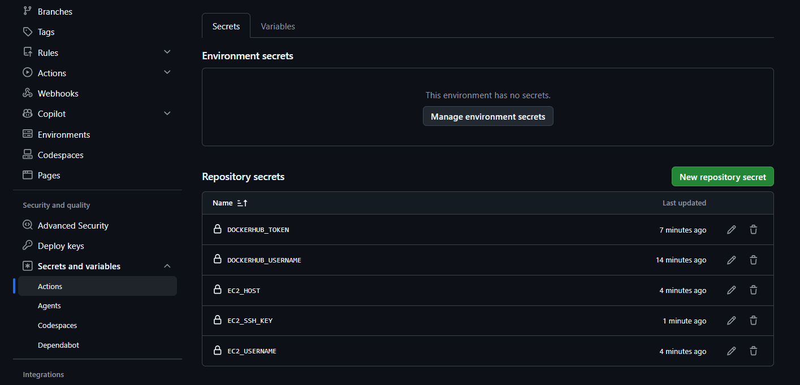

---
## CD 실행 
> main 브랜치 커밋하면 자동 실행 

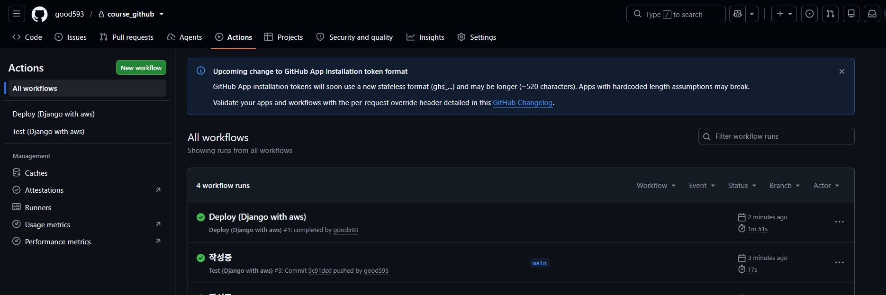

---
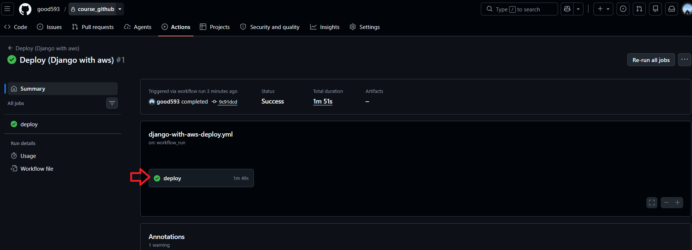

---
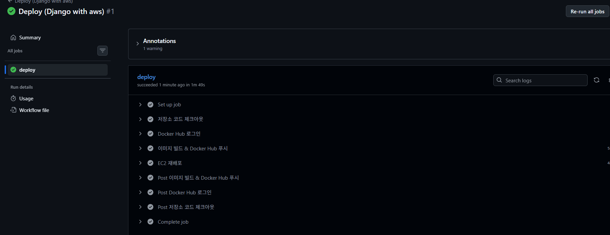

