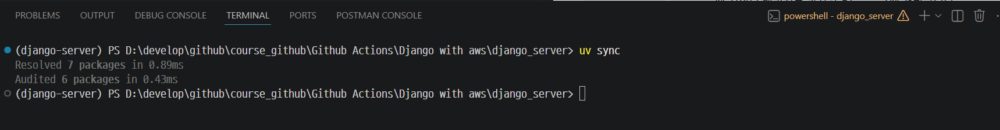
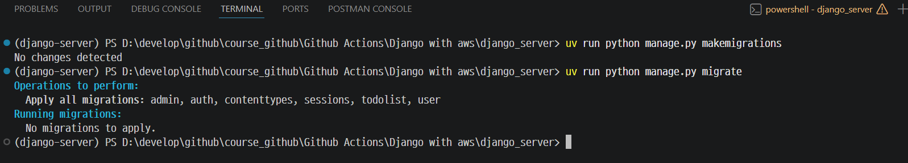
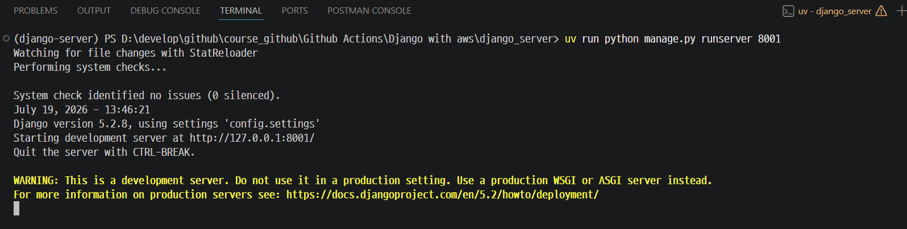
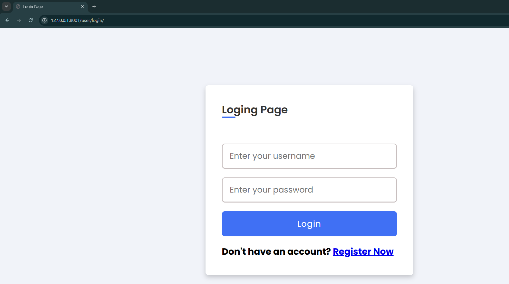
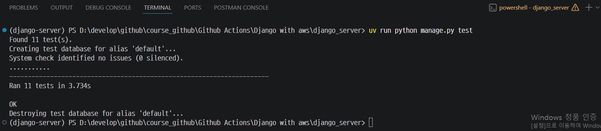
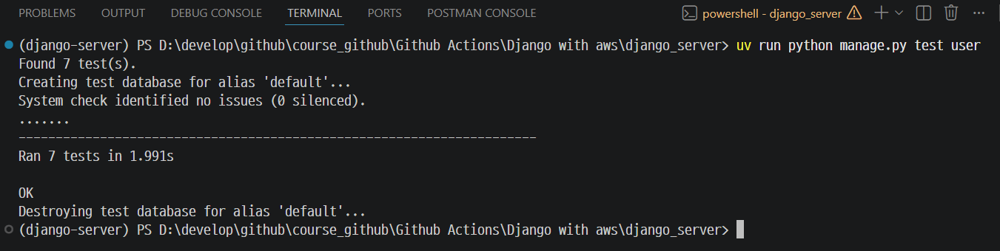
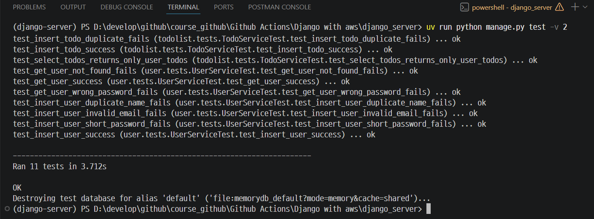

# Django 서버 실행하기

---
## 의존성 설치

`pyproject.toml`, `uv.lock`에 정의된 패키지를 가상환경(`.venv`)에 설치합니다.

```bash
uv sync
```


---
## 데이터베이스 마이그레이션

```bash
# models.py 변경 사항을 감지해 마이그레이션 파일 생성
uv run python manage.py makemigrations
# 마이그레이션 파일을 실제 데이터베이스에 반영
uv run python manage.py migrate
```


---
## 개발 서버 실행

```bash
# 8000번 포트가 이미 사용 중이라면 8001 등 다른 포트로 실행
uv run python manage.py runserver 8001
```


---
> 브라우저에서 http://127.0.0.1:8001 접속



---
# Django 서버 테스트하기

---
## 전체 앱 테스트 

```shell
uv run python manage.py test
```


---
## 특정 앱만 실행 

```shell
uv run python manage.py test user
```


---
## 실행 로그를 자세히 보고 싶을 때 (verbosity) 

```shell
uv run python manage.py test -v 2
```

