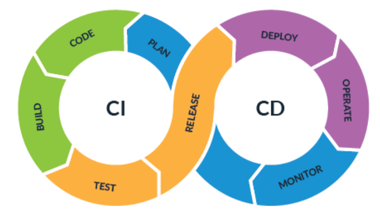
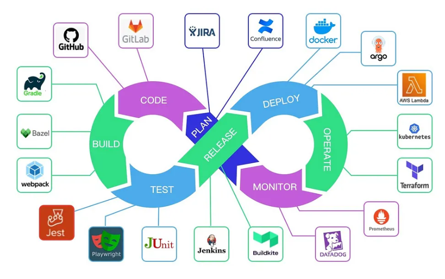

# [CI/CD란?](https://tech.osci.kr/cicd-architecture/)
- CI/CD (Continuous Integration/Continuous Delivery or Deployment)는 애플리케이션 개발 단계를 자동화하여 애플리케이션을 더욱 짧은 주기로 고객에게 제공하는 방법론입니다. 
- 기본 개념은 지속적인 통합, 지속적인 서비스 제공, 지속적인 배포입니다.

---


---
## CI: Continuous Integration
- 여러 사람이 작성한 코드를 자주 합치고
- 합칠 때마다 자동으로 검사하는 방식입니다.

---
## CD: Continuous Delivery / Deployment
- 검사를 통과한 코드를 자동으로 배포 가능한 상태로 만들거나
- 실제 서비스 환경까지 자동 배포하는 방식입니다.

---
> CI/CD Pipeline



---
## 먼저 생각해보기
프로젝트를 제출받을 때 이런 일이 자주 생깁니다.

- 내 컴퓨터에서는 됐는데 다른 사람 컴퓨터에서는 안 됨
- 테스트를 실행하지 않고 Pull Request를 올림
- 배포 전에 빌드 오류를 뒤늦게 발견함
- 같은 명령어를 매번 사람이 반복해서 실행함

---
## 자동화가 필요한 순간
반복되는 확인 작업은 사람이 아니라 시스템이 하게 만들 수 있습니다.

- 코드를 push하면 자동으로 테스트 실행
- Pull Request가 열리면 자동으로 빌드 확인
- main 브랜치에 merge되면 자동으로 배포
- 일정 시간마다 자동으로 데이터 수집 또는 리포트 생성

---
# [GitHub Actions](https://docs.github.com/ko/actions)
GitHub 저장소 안에서 자동화 작업을 실행하는 기능입니다.

- 테스트 자동화
- 코드 스타일 검사
- 빌드
- 패키지 배포
- 웹사이트 배포
- 이슈, PR, 라벨 관리 자동화

---

# 핵심 흐름
```text
Event 발생
  ↓
Workflow 실행
  ↓
Job 실행
  ↓
Runner에서 Step 순서대로 실행
```

예: `push` 이벤트가 발생하면 `CI` 워크플로가 실행되고, Ubuntu runner에서 테스트 명령어가 실행됩니다.

---

# 핵심 용어
- `workflow`: 자동화 작업 전체
- `event`: workflow를 실행시키는 사건
- `job`: 같은 runner에서 실행되는 작업 묶음
- `step`: job 안에서 순서대로 실행되는 한 단계
- `action`: 재사용 가능한 자동화 블록
- `runner`: 실제 명령어가 실행되는 컴퓨터

---

# Workflow 파일 위치
GitHub Actions workflow는 저장소의 아래 경로에 둡니다.

```text
.github/workflows/파일이름.yml
```

예시:

```text
.github/workflows/ci.yml
.github/workflows/deploy.yml
.github/workflows/lint.yml
```

---

# 가장 작은 Workflow
```yaml
name: Hello Actions

on:
  workflow_dispatch:

jobs:
  hello:
    runs-on: ubuntu-latest
    steps:
      - name: 인사하기
        run: echo "Hello, GitHub Actions!"
```

`workflow_dispatch`는 GitHub 화면에서 직접 실행할 수 있는 이벤트입니다.

---

# YAML 읽기
GitHub Actions는 YAML 문법을 사용합니다.

```yaml
name: CI

on:
  push:
    branches: [main]

jobs:
  test:
    runs-on: ubuntu-latest
```

- 들여쓰기가 구조를 만듭니다.
- `:` 뒤에는 값이나 하위 항목이 옵니다.
- 배열은 `[main]` 또는 여러 줄 목록으로 작성할 수 있습니다.

---

# 자주 쓰는 Event
```yaml
on:
  push:
    branches: [main]
  pull_request:
    branches: [main]
  workflow_dispatch:
```

- `push`: 코드를 원격 저장소에 올릴 때
- `pull_request`: PR을 열거나 수정할 때
- `workflow_dispatch`: 사람이 직접 실행할 때

---

# Schedule Event
정해진 시간에 workflow를 실행할 수도 있습니다.

```yaml
on:
  schedule:
    - cron: "0 0 * * 1"
```

이 예시는 매주 월요일 00:00 UTC에 실행됩니다.

주의: GitHub Actions의 cron 시간은 UTC 기준입니다.

---

# Job과 Step
```yaml
jobs:
  test:
    runs-on: ubuntu-latest

    steps:
      - name: 현재 위치 확인
        run: pwd

      - name: 파일 목록 확인
        run: ls
```

하나의 job 안에 있는 step은 위에서 아래로 순서대로 실행됩니다.

---

# Runner
Runner는 workflow 명령어를 실행하는 컴퓨터입니다.

```yaml
runs-on: ubuntu-latest
```

자주 쓰는 GitHub-hosted runner:

- `ubuntu-latest`
- `windows-latest`
- `macos-latest`

수업과 일반 프로젝트에서는 보통 `ubuntu-latest`부터 시작합니다.

---

# Action 사용하기
`run`은 직접 명령어를 실행합니다.

```yaml
- name: 테스트 실행
  run: pytest
```

`uses`는 이미 만들어진 action을 가져와 실행합니다.

```yaml
- name: 저장소 코드 내려받기
  uses: actions/checkout@v6
```

---

# 왜 checkout이 필요할까?
Runner는 매번 깨끗한 새 환경에서 시작합니다.

그래서 저장소의 코드를 runner로 내려받아야 합니다.

```yaml
steps:
  - uses: actions/checkout@v6
```

대부분의 workflow에서 첫 step으로 사용합니다.

---

# Python 프로젝트 CI
```yaml
name: Python CI

on:
  push:
    branches: [main]
  pull_request:
    branches: [main]
  workflow_dispatch:

permissions:
  contents: read

jobs:
  test:
    runs-on: ubuntu-latest
```

---

# Python 프로젝트 CI
```yaml
    steps:
      - name: 저장소 코드 내려받기
        uses: actions/checkout@v6

      - name: Python 설치
        uses: actions/setup-python@v6
        with:
          python-version: "3.13"

      - name: 의존성 설치
        run: |
          python -m pip install --upgrade pip
          pip install -r requirements.txt

      - name: 테스트 실행
        run: pytest
```

---

# Node.js 프로젝트 CI
```yaml
name: Node CI

on:
  push:
    branches: [main]
  pull_request:
    branches: [main]
  workflow_dispatch:

permissions:
  contents: read

jobs:
  test:
    runs-on: ubuntu-latest
```

---

# Node.js 프로젝트 CI
```yaml
    steps:
      - name: 저장소 코드 내려받기
        uses: actions/checkout@v6

      - name: Node.js 설치
        uses: actions/setup-node@v6
        with:
          node-version: "24"

      - name: 의존성 설치
        run: npm ci

      - name: 테스트 실행
        run: npm test
```

`npm ci`는 `package-lock.json`을 기준으로 의존성을 설치합니다.

---

# 실패하면 어떻게 될까?
step 중 하나라도 실패하면 기본적으로 job이 실패합니다.

```yaml
- name: 테스트 실행
  run: pytest
```

테스트가 실패하면:

- 해당 step이 빨간색으로 표시됨
- job이 실패함
- workflow가 실패함
- PR에서 통과 여부를 확인할 수 있음

---

# Actions 탭에서 확인
GitHub 저장소의 `Actions` 탭에서 실행 결과를 확인합니다.

- 어떤 workflow가 실행됐는지
- 어떤 commit에서 실행됐는지
- 어느 step에서 실패했는지
- 로그에 어떤 오류가 찍혔는지

오류가 나면 먼저 실패한 step의 로그를 읽습니다.

---
# 예시 1: Hello Actions
## 목표
수동으로 실행하는 가장 작은 workflow를 만듭니다.

## 작업
1. `.github/workflows/hello.yml` 파일 생성
2. `workflow_dispatch` 이벤트 추가
3. `echo` 명령어 실행
4. GitHub의 Actions 탭에서 직접 실행

---
# 예시 1 코드
```yaml
name: Hello Actions

on:
  workflow_dispatch:

jobs:
  hello:
    runs-on: ubuntu-latest
    steps:
      - name: Hello 출력
        run: echo "자동화 첫 실행 성공"
```

---
# 예시 2: Pull Request 검사
## 목표
Pull Request가 열릴 때 테스트가 자동 실행되게 만듭니다.

## 작업
1. `.github/workflows/ci.yml` 파일 생성
2. `pull_request` 이벤트 추가
3. 프로젝트 언어에 맞는 설치 step 추가
4. 테스트 명령어 추가
5. PR에서 결과 확인

---
# 예시 2 코드 구조
```yaml
name: CI

on:
  pull_request:
    branches: [main]

permissions:
  contents: read

jobs:
  test:
    runs-on: ubuntu-latest
    steps:
      - uses: actions/checkout@v6
      - name: 테스트 실행
        run: 여기에_테스트_명령어_작성
```

---

# 여러 Job 실행하기
```yaml
jobs:
  lint:
    runs-on: ubuntu-latest
    steps:
      - uses: actions/checkout@v6
      - run: npm run lint

  test:
    runs-on: ubuntu-latest
    steps:
      - uses: actions/checkout@v6
      - run: npm test
```

기본적으로 서로 의존하지 않는 job은 병렬로 실행됩니다.

---

# Job 순서 정하기
`needs`를 사용하면 job 실행 순서를 정할 수 있습니다.

```yaml
jobs:
  test:
    runs-on: ubuntu-latest
    steps:
      - run: echo "test"

  deploy:
    needs: test
    runs-on: ubuntu-latest
    steps:
      - run: echo "deploy"
```

`deploy`는 `test`가 성공한 뒤에 실행됩니다.

---

# Matrix 전략
여러 버전에서 같은 테스트를 반복할 수 있습니다.

```yaml
jobs:
  test:
    runs-on: ubuntu-latest
    strategy:
      matrix:
        python-version: ["3.11", "3.12", "3.13"]

    steps:
      - uses: actions/checkout@v6
      - uses: actions/setup-python@v6
        with:
          python-version: ${{ matrix.python-version }}
      - run: pytest
```

---

# 환경 변수
workflow 안에서 반복해서 쓰는 값은 `env`로 관리할 수 있습니다.

```yaml
env:
  PYTHON_VERSION: "3.13"

jobs:
  test:
    runs-on: ubuntu-latest
    steps:
      - uses: actions/setup-python@v6
        with:
          python-version: ${{ env.PYTHON_VERSION }}
```

---

# Variables와 Secrets
## Variables
- 공개되어도 되는 설정값
- 예: 서버 주소, 리전, 실행 모드

## Secrets
- 노출되면 안 되는 민감한 값
- 예: API 키, 토큰, 비밀번호

민감한 값은 workflow 파일에 직접 쓰지 않습니다.

---

# Secrets 사용 예시
```yaml
jobs:
  deploy:
    runs-on: ubuntu-latest
    steps:
      - name: API 호출
        env:
          API_TOKEN: ${{ secrets.API_TOKEN }}
        run: |
          curl -H "Authorization: Bearer $API_TOKEN" https://example.com/deploy
```

로그에 secret이 출력되지 않도록 명령어를 신중하게 작성해야 합니다.

---

# Permissions
`GITHUB_TOKEN`의 권한은 필요한 만큼만 줍니다.

```yaml
permissions:
  contents: read
```

배포나 PR 댓글 작성처럼 쓰기 권한이 필요할 때만 job별로 권한을 늘립니다.

```yaml
permissions:
  contents: read
  pull-requests: write
```

---

# Cache
의존성 설치 시간을 줄이고 싶을 때 cache를 사용합니다.

```yaml
- uses: actions/setup-node@v6
  with:
    node-version: "24"
    cache: npm

- run: npm ci
```

cache에는 토큰, 비밀번호, 인증 파일 같은 민감한 값을 저장하지 않습니다.

---

# Artifact
workflow가 만든 결과물을 저장하고 내려받을 수 있습니다.

```yaml
- name: 빌드
  run: npm run build

- name: 빌드 결과 업로드
  uses: actions/upload-artifact@v4
  with:
    name: dist
    path: dist
```

예: 테스트 리포트, 빌드 결과물, 로그 파일

---

# GitHub Pages 배포 흐름
정적 웹사이트라면 GitHub Actions로 Pages 배포를 자동화할 수 있습니다.

```text
push to main
  ↓
install dependencies
  ↓
build
  ↓
upload pages artifact
  ↓
deploy to GitHub Pages
```

배포 workflow는 프로젝트 종류에 따라 달라집니다.

---

# 좋은 Workflow의 조건
- 이름을 보고 목적을 알 수 있음
- 실패했을 때 어느 단계가 문제인지 로그가 명확함
- 필요한 권한만 사용함
- secret을 코드에 직접 쓰지 않음
- dependency lock file을 함께 커밋함
- PR에서 자동 검사가 실행됨


---

# 디버깅 순서
1. `Actions` 탭에서 실패한 workflow 선택
2. 실패한 job 선택
3. 빨간색으로 표시된 step의 로그 확인
4. 로컬에서 같은 명령어 실행
5. workflow 파일 수정 후 다시 push

로그는 "어디가 틀렸는지"를 알려주는 첫 번째 자료입니다.

---

# 보안 체크리스트
- secret은 GitHub의 Secrets에 저장합니다.
- workflow 파일에 API key를 직접 쓰지 않습니다.
- `permissions`는 최소 권한으로 시작합니다.
- 모르는 third-party action은 README와 저장소를 확인합니다.
- 중요한 workflow에서는 action 버전을 고정합니다.
- 외부 PR에서 secret이 필요한 작업을 실행하지 않도록 주의합니다.
