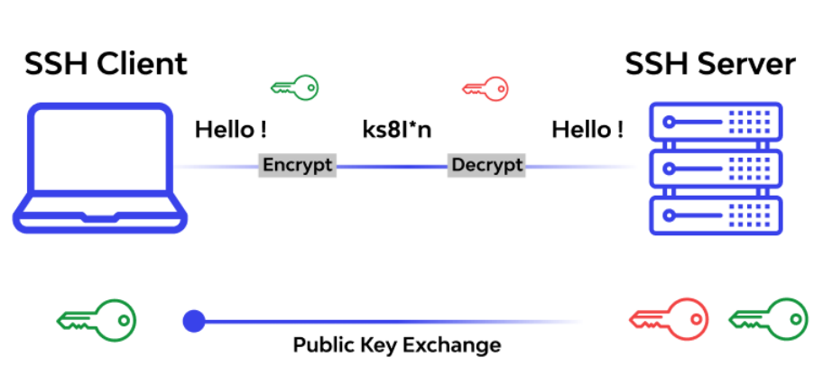
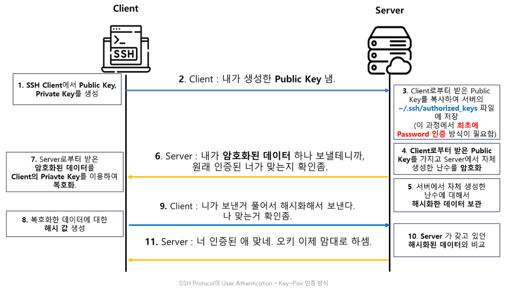

# [SSH (Secure Shell)란?](https://medium.com/@aqeelabbas3972/introduction-to-ssh-secure-shell-0d07e18d3149)
- 보통 서버를 관리하거나 원격 위치의 컴퓨터에 접속할 때 사용되며, 텍스트 기반의 명령어를 통해 작업을 수행할 수 있습니다. 
- SSH는 데이터 전송 중 보안 문제를 방지하기 위해 암호화 기술을 사용합니다.

---
## SSH의 작동 원리
SSH는 클라이언트-서버 모델을 사용합니다. 
- `사용자(클라이언트)`는 원격 위치의 컴퓨터(서버)에 접속하려고 할 때, SSH 클라이언트를 사용하여 서버에 연결 요청을 보냅니다. 
- `서버`는 이 요청을 받아들이고 암호화된 채널을 통해 데이터를 주고받을 수 있는 연결을 생성합니다.

---
SSH가 암호화 통신을 시작하기 전에 키를 주고받는 과정입니다.
- 초록색 키 = SSH 클라이언트가 가진 키
- 빨간색 키 = SSH 서버가 가진 키

---
1. 클라이언트와 서버가 각자 자기 키(초록/빨강)를 만듦
2. 맨 아래 "Public Key Exchange"에서 서로의 공개키를 교환 → 그래서 마지막에 양쪽 다 초록+빨강 키를 둘 다 가지고 있는 걸로 표시됨
3. 이렇게 교환된 키 정보로 **암호화(Encrypt)/복호화(Decrypt)**에 쓸 임시 대칭키를 만들어냄
4. 그 결과 "Hello!"라는 평문이 `ks8l*n` 같은 암호문으로 바뀌어 전송됨

즉, 색깔 자체가 "누구 소유의 키인지"를 나타내고, 두 키를 교환/조합해서 실제 통신에 쓸 암호키를 만든다.

---
## [SSH 통신 과정](https://co-no.tistory.com/entry/%ED%86%B5%EC%8B%A0-SSH%EC%9D%98-%EA%B0%9C%EB%85%90-%ED%86%B5%EC%8B%A0-%EA%B3%BC%EC%A0%95feat-OpenSSH)
- SSH Client와 Server 간 세션이 맺어지려면, Client와 Server 가 서로가 올바른 노드인지 인증하는 절차가 필요하다. 
- SSH 프로토콜에서는 이를 `Public Key(공개키)`와 `Private Key(개인키)`로 이루어지는 비대칭키 암호화 방식을 이용한다.

---

