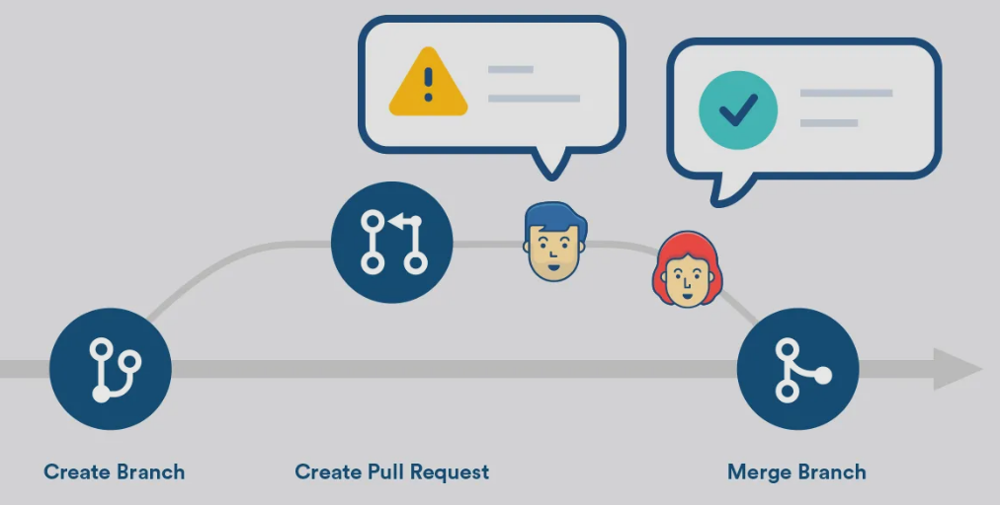
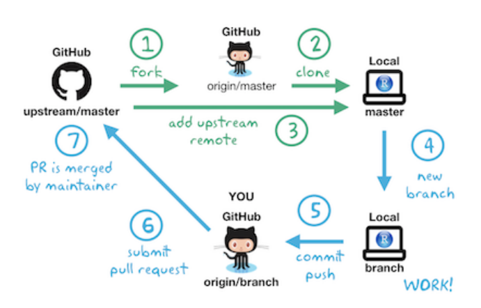
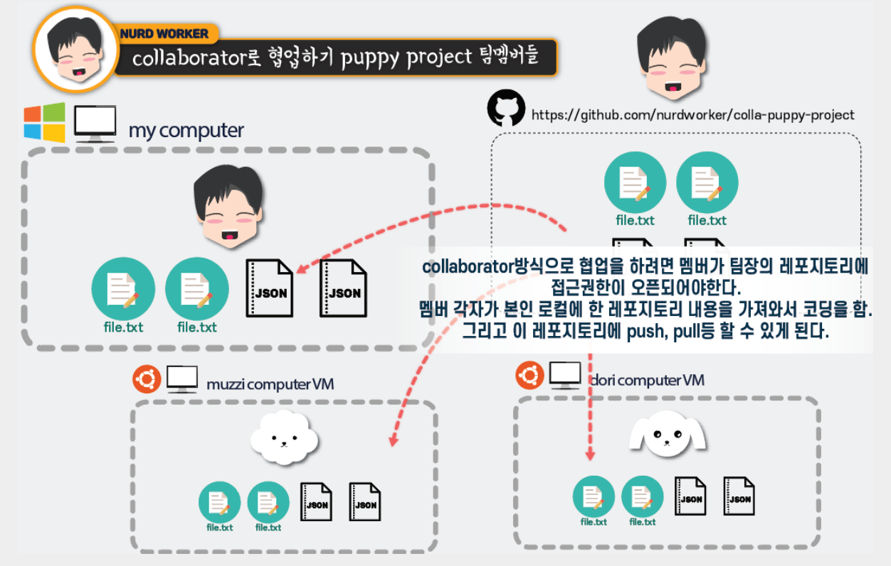

# [Pull Request(PR)란?](https://blog.timo-reymann.de/best-practices-for-github-pull-requests/)
내가 수정한 코드가 있으니, 내 branch를 가져가 검토한 뒤 병합해달라고 요청하는 것.

---

---
### PR 승인(Merge) 권한  
| 역할 / 권한                                  | PR 승인            | Merge | 비고                          |
| ---------------------------------------- | ---------------- | ----- | --------------------------- |
| **Owner / Admin**                        | 가능             | 가능  | Ruleset에 따라 Admin도 제한될 수 있음 |
| **Maintainer / Collaborator (Write 이상)** | 가능             | 가능  | 저장소 및 브랜치 규칙에 따라 제한 가능      |
| **Read-only 권한**                         | 승인으로 인정 안 됨    | 불가  | 리뷰/댓글은 가능할 수 있음             |
| **외부 기여자 (Fork)**                        | 일반적으로 승인 권한 없음 | 불가  | PR 생성은 가능                   |

---
### 왜 PR을 사용하는가

- `코드 충돌 최소화:` 각자 branch에서 작업한 뒤 병합 시점에 한 번에 검토하므로, 여러 명이 동시에 같은 코드를 건드려도 충돌을 줄일 수 있다.
- `코드 리뷰:` 병합되기 전에 동료가 변경 사항을 확인하고 피드백을 줄 수 있다.
- `히스토리 관리:` 어떤 변경이 왜 이루어졌는지 PR 단위로 기록이 남는다.
- `자동화 연계:` PR 생성/병합 시점에 CI/CD, 테스트 등을 자동으로 트리거할 수 있다.

---
### 좋은 PR 설명(개요) 작성법

리뷰어가 빠르게 파악할 수 있도록 PR 본문에 아래 내용을 포함하자.

- `개요:` 무엇을, 왜 변경했는지 한두 줄로 요약
- `변경 사항:` 주요 변경 내용을 목록으로 정리
- `테스트 방법:` 어떻게 확인했는지 (실행 방법, 결과)
- `스크린샷/로그:` UI 변경이나 실행 결과가 있다면 첨부
- `관련 이슈:` 연관된 Issue 번호 링크

---
### 리뷰어의 액션

| 액션 | 의미 |
| --- | --- |
| **Comment** | 승인/거절과 상관없이 의견만 남김 |
| **Approve** | 변경 사항을 승인, Merge 가능 상태가 됨 |
| **Request changes** | 수정이 필요함을 표시, Branch protection 설정에 따라 재검토 전까지 Merge가 막힐 수 있음 |

---

---
### Merge 방식 3가지

| 방식 | 설명 |
| --- | --- |
| **Merge commit** | 두 branch의 히스토리를 그대로 유지한 채 병합 커밋을 생성 |
| **Squash and merge** | PR의 모든 커밋을 하나로 합쳐서 main에 반영 (히스토리가 깔끔해짐) |
| **Rebase and merge** | PR의 커밋들을 main 위로 재배치, 별도 병합 커밋 없이 이어붙임 |

커밋 히스토리를 단순하게 유지하고 싶다면 `Squash and merge`를, 각 커밋 이력을 그대로 남기고 싶다면 `Merge commit`을 주로 사용한다.

---
# PR을 사용하는 두 가지 방식

---
### [1. Fork 기반 PR](https://jtr13.github.io/EDAV/github.html)
저장소에 쓰기 권한이 없을 때 사용. Fork로 저장소를 내 계정에 복사 → Clone → 수정 → Push → 원본 저장소로 PR 요청. (오픈소스 프로젝트 기여 시 주로 사용)

---

---
### [2. Collaborator 기반 PR — *이 강의에서 사용하는 방식*](https://jacobowl.tistory.com/350)
저장소에 Collaborator로 초대받아 쓰기 권한을 가진 경우. 같은 저장소 안에서 branch(ex. dev)를 만들어 작업 → Push → main branch로 PR 요청.

---

