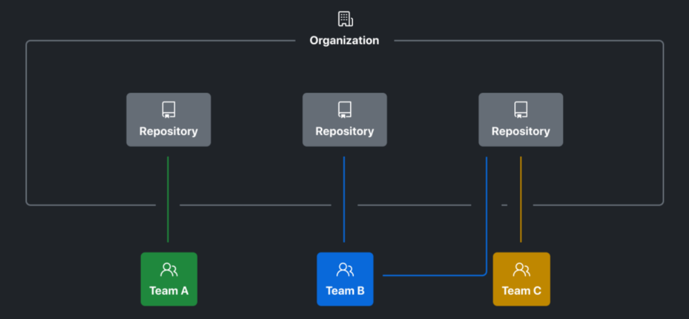

# GitHub Organization으로 협업하기

개인 저장소를 넘어, 팀의 코드와 권한을 함께 관리하는 방법


---

## 개인 계정만으로도 협업할 수 있는데?

개인 계정의 저장소에 Collaborator를 초대해도 협업은 가능하다.

하지만 저장소가 늘어나면 다음 관리가 어려워진다.

- 저장소마다 팀원을 한 명씩 초대해야 한다.
- 프로젝트 소유권이 특정 개인에게 집중된다.
- 팀별로 같은 권한을 반복해서 설정해야 한다.
- 멤버가 합류하거나 떠날 때 권한을 일괄 변경하기 어렵다.

---

## [Organization이란?](https://github.blog/enterprise-software/devops/best-practices-for-organizations-and-teams-using-github-enterprise-cloud/)

여러 개인 계정이 공동 작업하는 **공유 작업 공간**이다.

```text
개인 계정 ──(가입)──> Organization
                          ├─ Repository (조직 소유)
                          ├─ Team (Repository 접근 권한 부여)
                          └─ Project
```

> 로그인은 각자의 개인 계정으로 하고, 조직의 리소스를 함께 사용한다.

---


---

## 개인 계정 vs Organization

| 구분 | 개인 계정 | Organization |
| --- | --- | --- |
| 소유 주체 | 한 사람 | 팀 또는 회사 |
| 멤버 관리 | 저장소별 Collaborator | 조직 멤버와 Team |
| 권한 관리 | 저장소마다 개별 설정 | Team 단위로 여러 저장소에 부여 |
| 프로젝트 이동 | 개인에게 귀속되기 쉬움 | 팀 자산으로 유지 |
| 적합한 상황 | 개인 학습, 작은 실험 | 팀 프로젝트, 회사, 오픈소스 |

---

## 세 종류의 권한을 구분하자

| 범위 | 예시 | 질문 |
| --- | --- | --- |
| Organization 역할 | Owner, Member | 조직 설정을 관리할 수 있는가? |
| Team 역할 | Maintainer, Member | 팀 멤버와 설정을 관리할 수 있는가? |
| Repository 역할 | Read ~ Admin | 특정 저장소에서 무엇을 할 수 있는가? |

> Owner라고 해서 Team의 Maintainer와 같은 뜻이 아니며, Member의 저장소 권한도 저장소마다 다를 수 있다.

---

## Organization 역할

### Owner

- 조직 설정과 멤버, 저장소를 관리한다.
- 조직 소유 저장소에 관리자 권한을 가진다.
- 실제 조직에서는 소유권 공백을 막기 위해 2명 이상을 권장한다.

### Member

- 조직의 일반 구성원이다.
- 실제 작업 범위는 조직 정책, Team, 저장소 권한에 따라 달라진다.

> Owner는 꼭 필요한 사람에게만 부여한다.

---

## 저장소 권한 레벨

| 권한 | 주로 하는 일 |
| --- | --- |
| **Read** | 코드 열람, 이슈 작성, PR 리뷰 의견 작성 |
| **Triage** | 코드를 푸시하지 않고 이슈·PR 분류 및 관리 |
| **Write** | 코드 푸시, 브랜치 작업, PR 승인 |
| **Maintain** | 저장소 운영과 관리, 민감한 설정은 제외 |
| **Admin** | 권한·보안·설정 등 저장소 전체 관리 |

> 실습 개발자에게는 보통 `Write`, 저장소 책임자에게는 `Maintain` 또는 `Admin`을 부여한다.

---

## 최소 권한 원칙

업무에 필요한 가장 낮은 권한부터 부여한다.

```text
문서 열람자   → Read
이슈 관리자   → Triage
개발자        → Write
프로젝트 리드 → Maintain
저장소 관리자 → Admin
```

- 편의를 이유로 모두를 Owner/Admin으로 만들지 않는다.
- 사람보다 Team에 권한을 부여하면 변경 관리가 쉬워진다.
- 멤버가 나가면 Organization과 Team에서 접근 권한을 회수한다.

---

## Team을 사용하는 이유

Team은 Organization 멤버를 묶는 그룹이다.

- 역할이나 기능 단위로 멤버를 묶는다: `frontend`, `backend`, `docs`
- Team에 저장소 권한을 한 번 부여한다.
- `@organization/team-name`으로 팀 전체를 멘션할 수 있다.
- PR의 리뷰어로 Team을 지정할 수 있다.
- 상위/하위 Team으로 조직 구조를 표현할 수 있다.

> 외부 Collaborator는 Organization 멤버가 아니므로 Team에 포함할 수 없다.
