## 실습 구조

| 구분 | 예시 |
| --- | --- |
| Organization | `goodjob-tutorial` |
| Team | `web-team` |
| Repository | `team-project` |
| Organization Owner | 팀장 1명 |
| Team members | 팀원 전원 |
| Repository 권한 | 팀원 `Write` |

> Organization 이름은 GitHub 전체에서 고유해야 하므로 팀 번호 등을 조합한다.

---
## 1단계: Organization 생성

---
1. GitHub 우측 상단 프로필 메뉴에서 **Your organizations**를 연다.

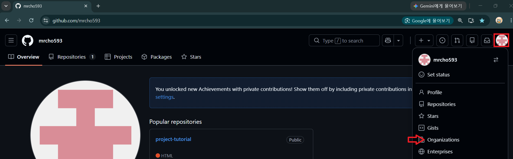

---
2. **New organization** 을 선택한다.

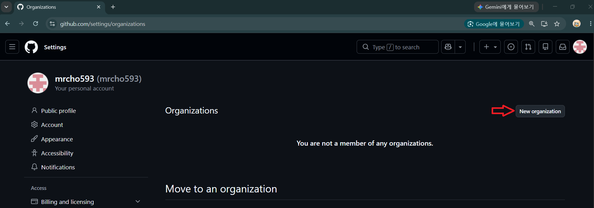

---
3. 실습에 맞는 플랜을 선택한다.

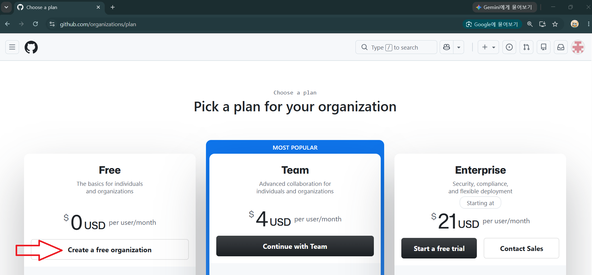

---
4. Organization 이름과 연락처 이메일을 입력한다.

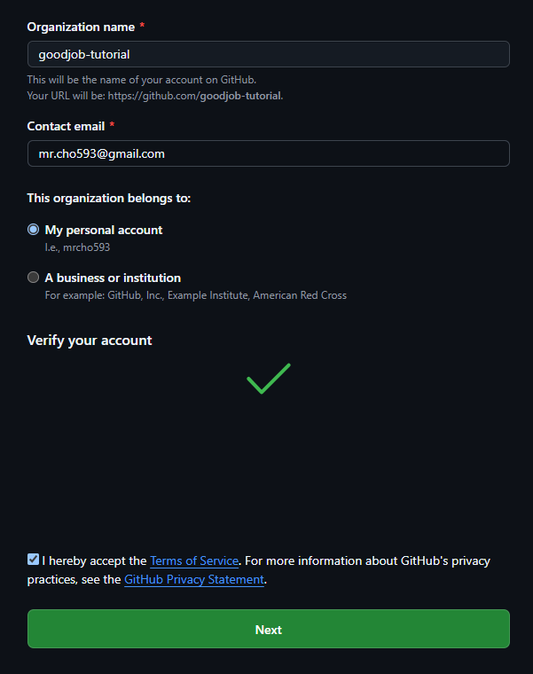

---
5. 생성 후 Organization 홈으로 이동한다.

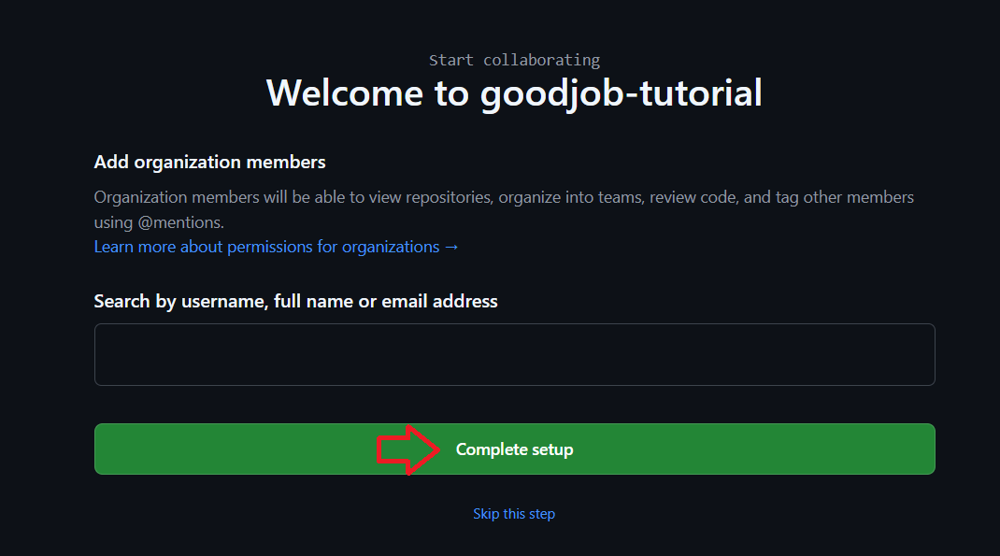

---
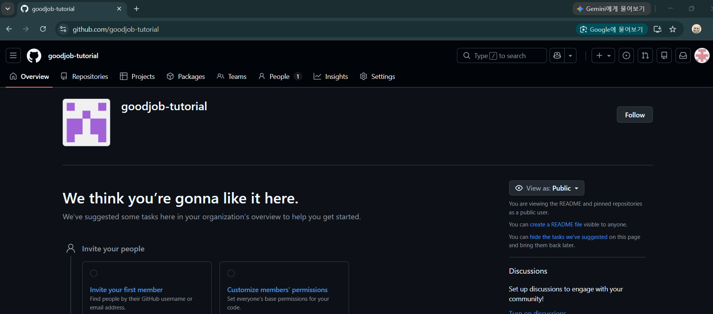

---
## 2단계: 멤버 초대

---
1. Organization에서 **People**로 이동한다.

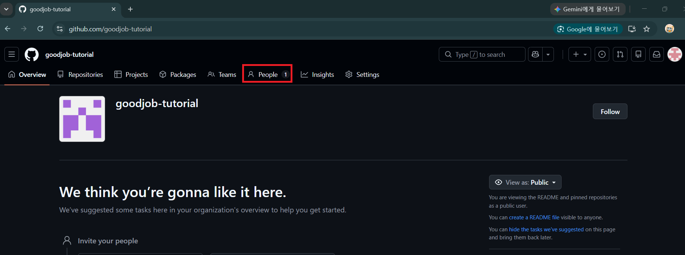

---
2. **Invite member**를 선택한다.

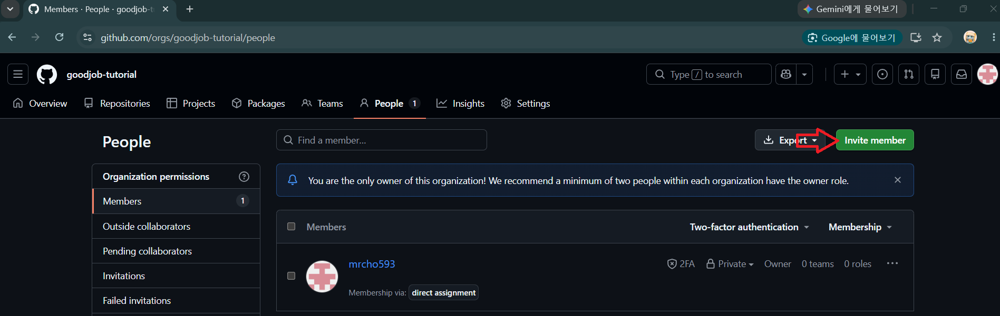

---
3. 팀원의 GitHub 사용자명 또는 이메일을 입력한다.

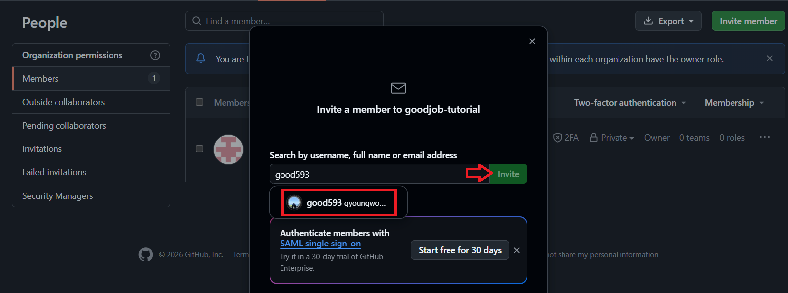

---
4. 역할은 기본적으로 **Member**를 선택한다.

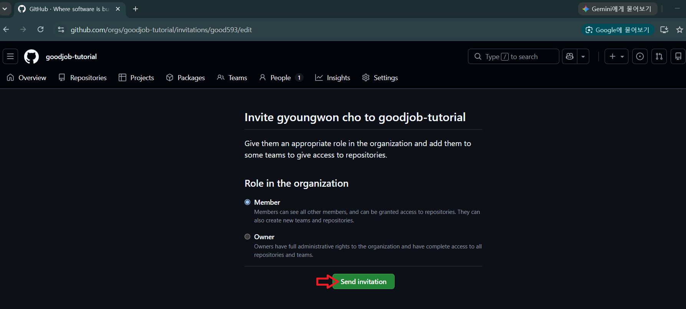

---
5. 팀원에 초대 메일을 전달 확인

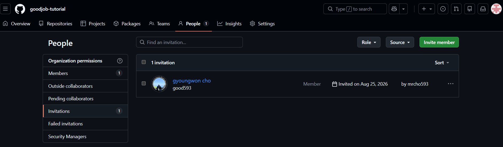

---
6. 팀원이 초대 메일 확인 


---
> 초대 수락

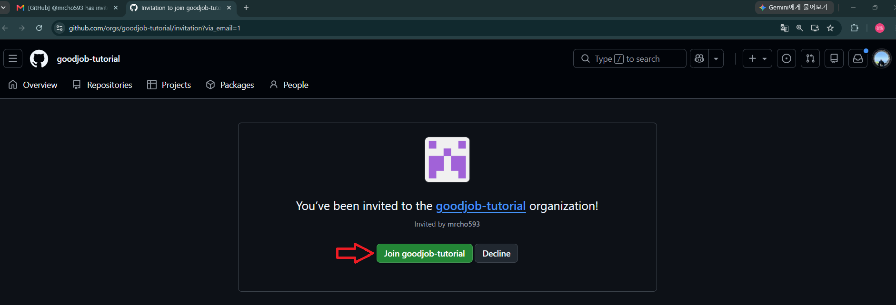

---
7. 생성된 조직에서 초대한 맴버 확인 

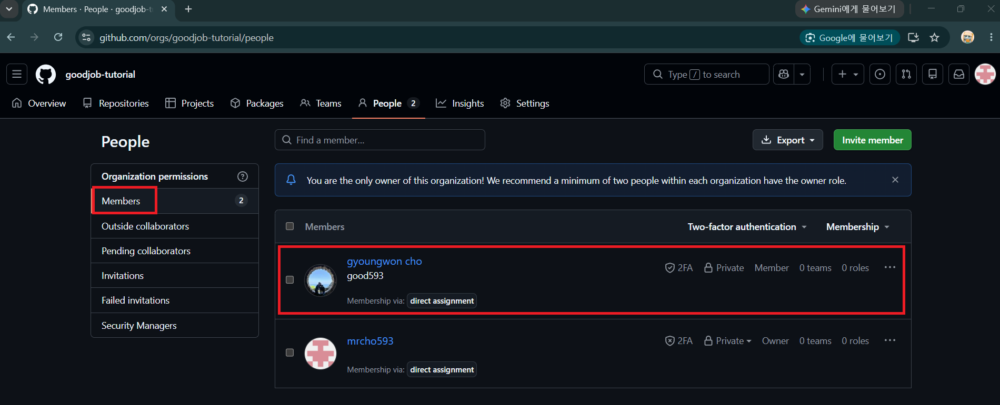

---
## 3단계: Team 생성

---
1. Organization의 **Teams**에서 **New team**을 선택한다.

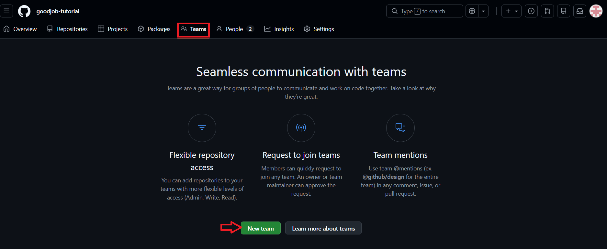

---
2. Team 이름 작성 후 공개 범위를 선택하고 Team을 생성한다.

> 좋은 Team 이름:

- 짧고 역할이 분명하다: `frontend`, `api`, `qa`
- 임시 사람 이름보다 지속되는 업무 기준으로 짓는다.

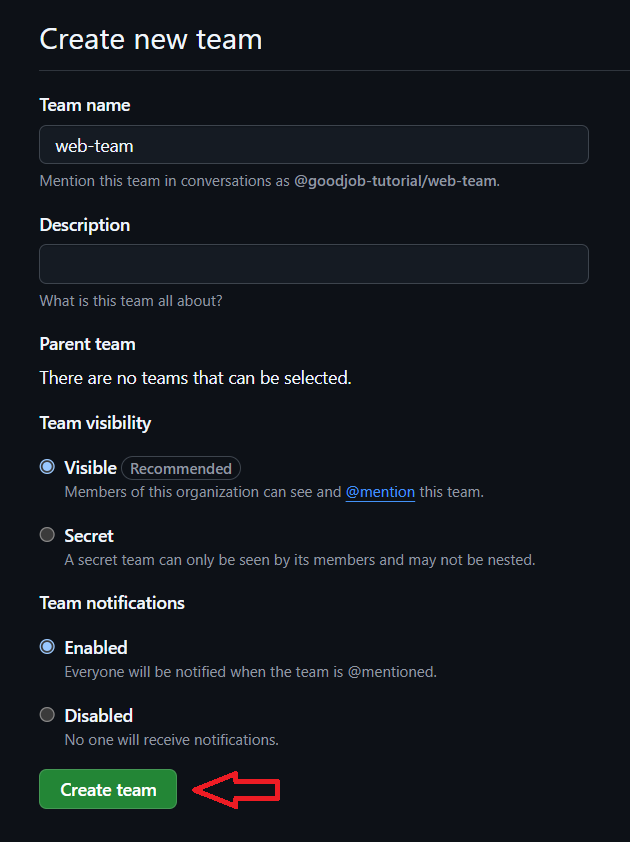

---
3. **Members → Add a member**에서 팀원을 추가한다.

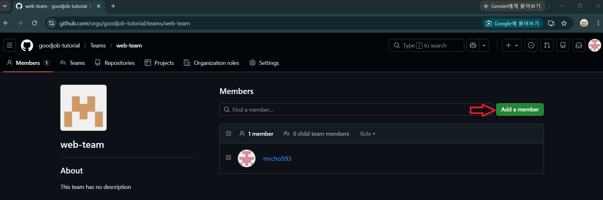

---
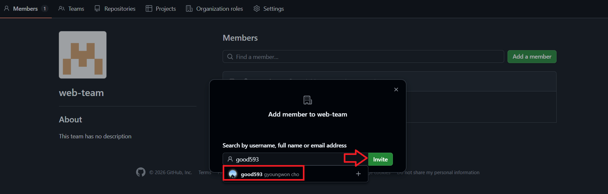

---
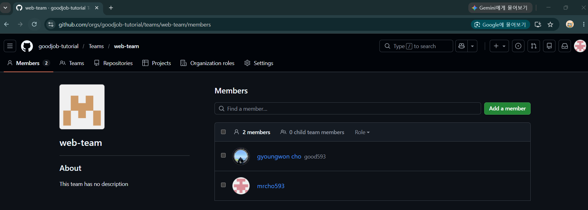

---

## 4단계: 조직 저장소 생성

저장소 생성 화면에서 **Owner가 Organization인지** 확인한다.

```text
Owner: goodjob-tutorial
Repository name: team-project
Visibility: Private 또는 Public
Initialize: README 선택
```

---
1. New repository

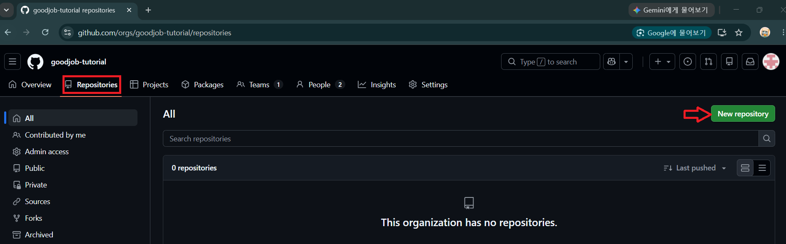

---
2. Create a new repository

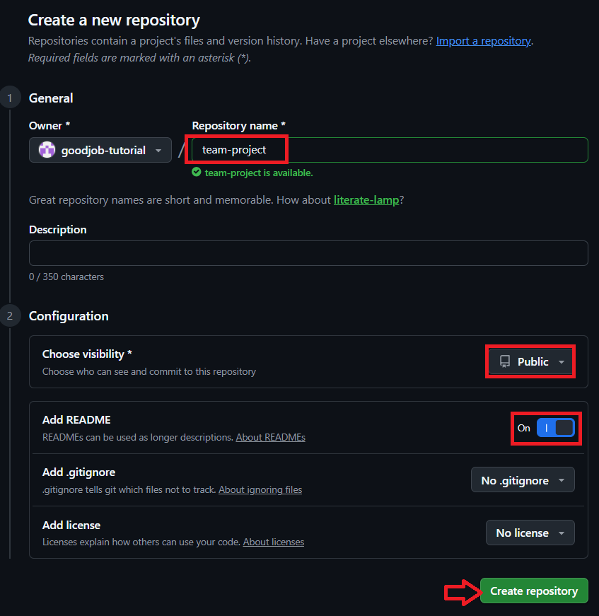

---
3. 결과 확인

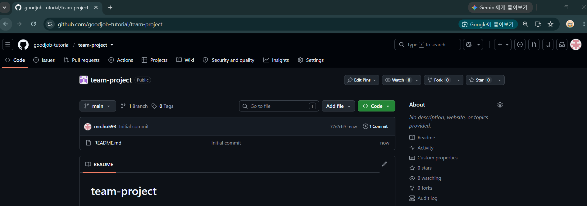

---
## 5단계: Team에 저장소 권한 부여

---
1. 저장소의 **Settings → Collaborators and teams**로 이동한다.

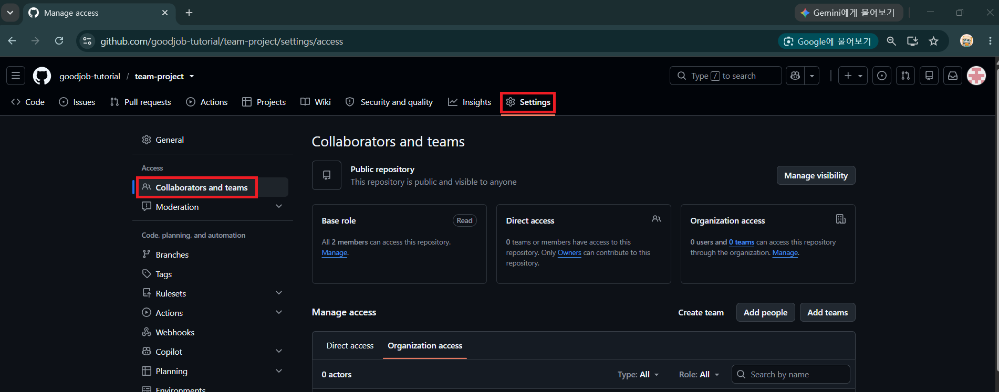

---
2. 생성한 Team을 검색해 추가한다.

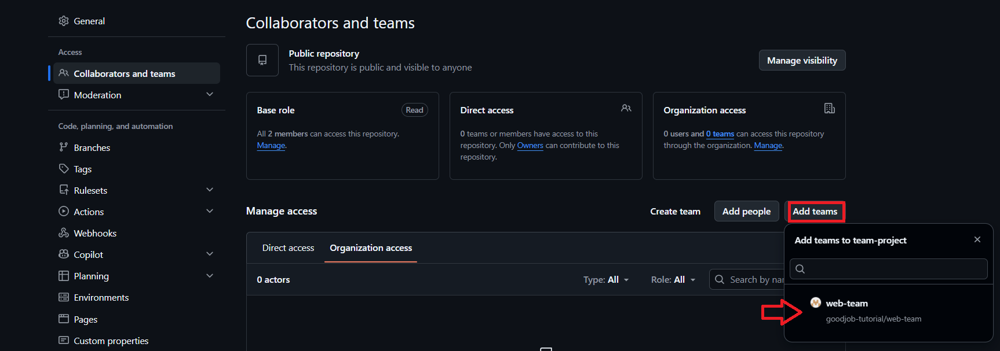

---
3. 실습용 권한으로 **Write**를 선택한다.

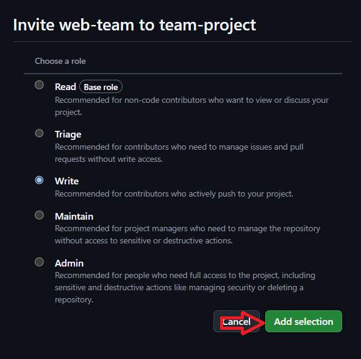

---
4. 팀원이 저장소를 Clone하고 브랜치를 Push할 수 있는지 확인한다.

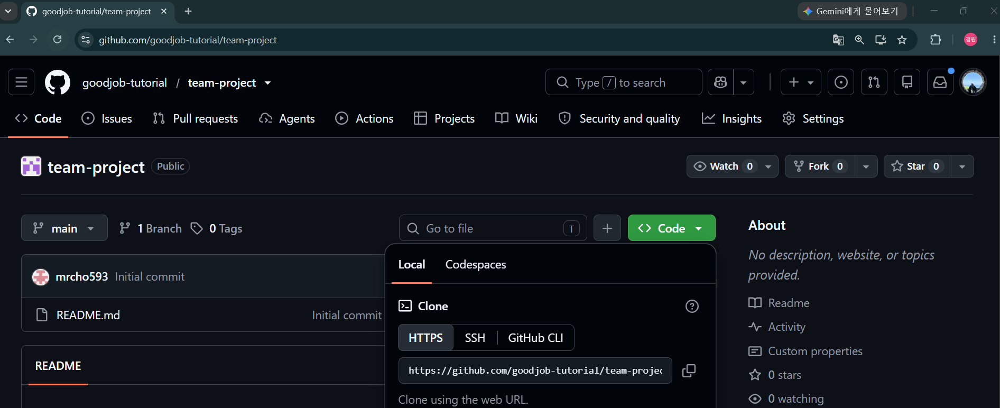

---

## 자주 발생하는 문제

| 증상 | 확인할 것 |
| --- | --- |
| 초대받은 팀원이 보이지 않음 | 초대를 수락했는가? |
| 저장소는 보이지만 Push할 수 없음 | Team의 저장소 권한이 `Write` 이상인가? |
| Team에 사용자를 추가할 수 없음 | 먼저 Organization 멤버가 되었는가? |
| 설정 메뉴가 보이지 않음 | 현재 계정에 `Admin` 권한이 있는가? |
| 개인 저장소로 잘못 생성됨 | 저장소 Owner가 개인 계정으로 선택되었는가? |
