## 1단계: Labels 정의 

---
> Repository → Issues → Labels

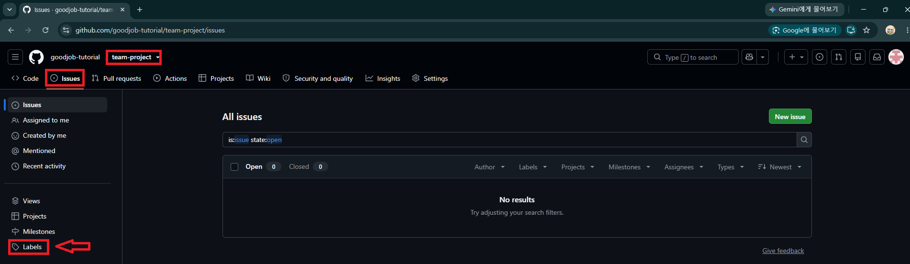

---
> 필요없는 Labels 삭제 

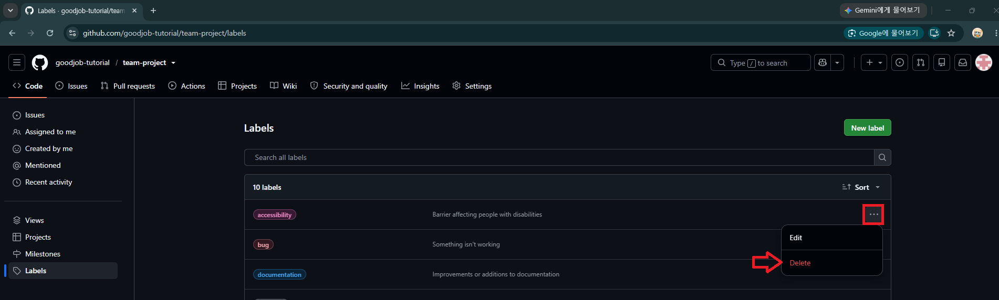

---
> Labels 생성

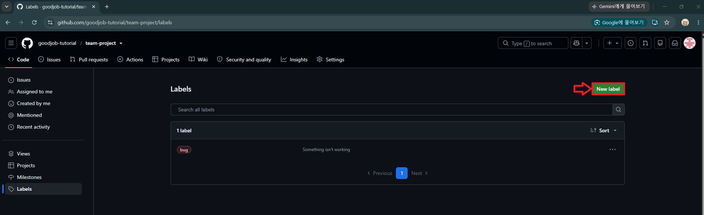

---
> 추천 Labels

| 구분    | Label      | 의미     |
| ----- | ---------- | ------ |
| 작업 종류 | `feature`  | 새로운 기능 |
| 작업 종류 | `bug`      | 버그 수정  |
| 작업 종류 | `docs`     | 문서 작업  |
| 영역    | `frontend` | 프론트엔드  |
| 영역    | `backend`  | 백엔드    |
| 영역    | `database` | DB     |
| 영역    | `ai` | AI/LLM     |

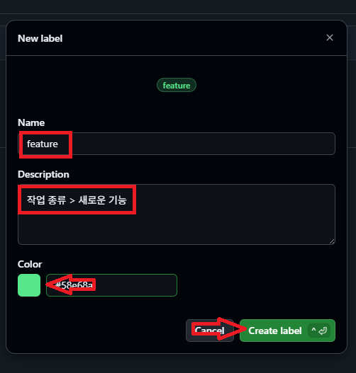

---
> 결과 확인 

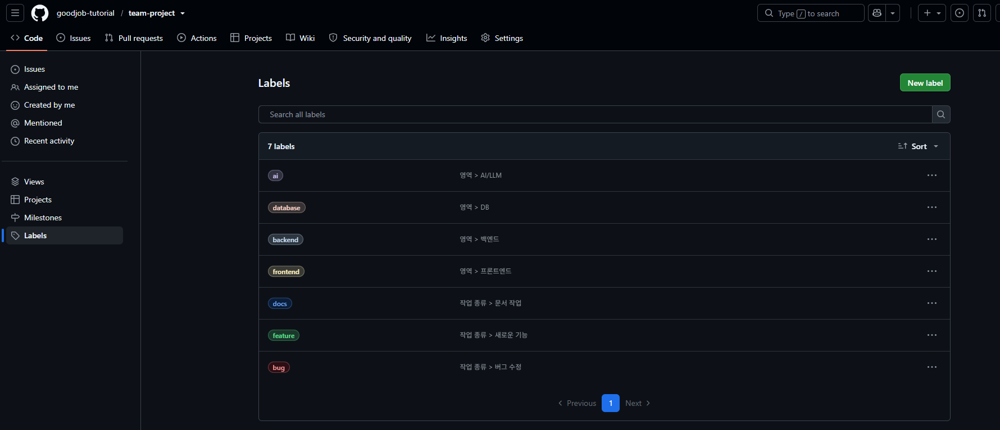

---
## 2단계: Issue Template 설정

---
> Repository → Settings → General → Features → Issues

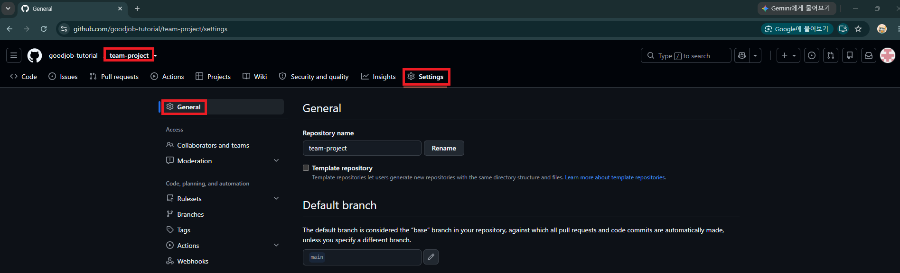

---
> Repository → Settings → General → Features → Issues

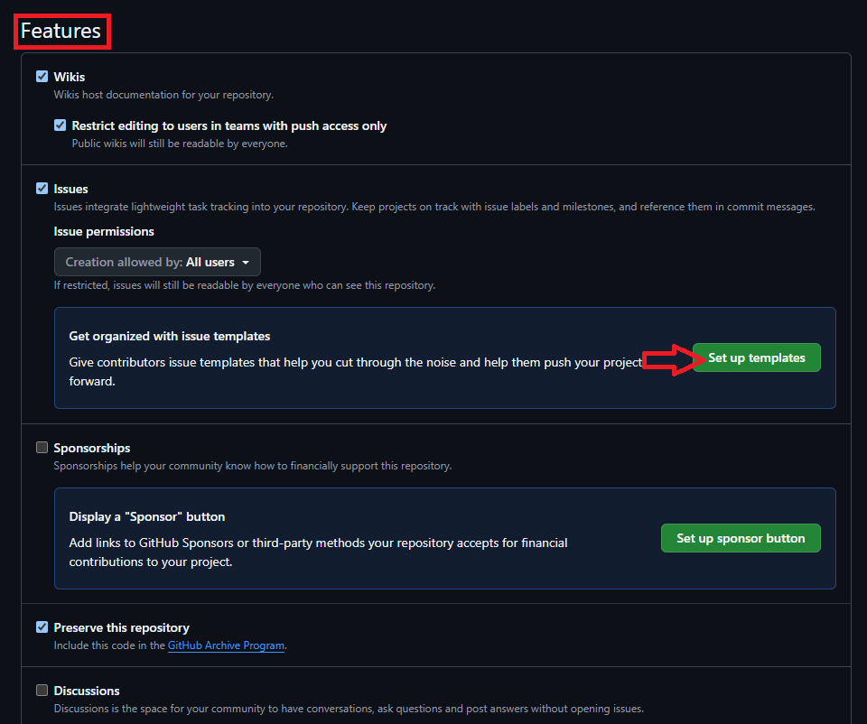

---
| Template            | 용도        | 추천   |
| ------------------- | --------- | ---- |
| **Bug report**      | 버그 신고     | ✅    |
| **Feature request** | 새로운 기능 개발 | ✅    |
| **Custom template** | 직접 정의     | 필요하면 |

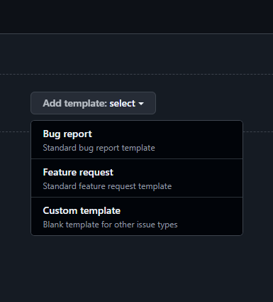

---
### Bug report 생성
> 만약 생성이 안되면, 
> 브라우저 리프레쉬! 

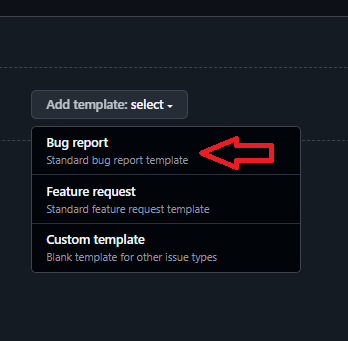

---
> Preview and edit

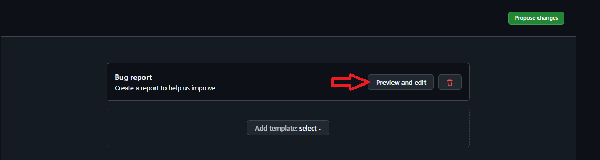

---
> 수정

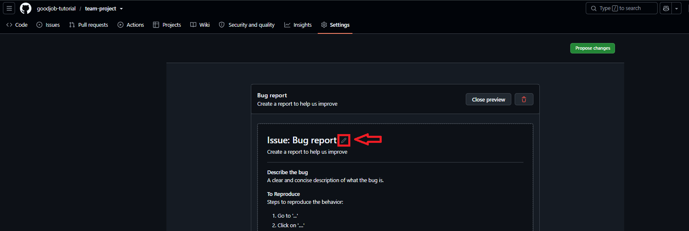

---
```markdown
---
name: Bug Report
about: 버그 및 오류를 등록합니다.
title: "[Bug] "
labels: "bug"
assignees: ""
---

## 🐛 버그 설명
어떤 문제가 발생했는지 작성해주세요.

## 🔄 재현 방법
1.
2.
3.

## ✅ 예상 동작
정상적으로 어떻게 동작해야 하는지 작성해주세요.

## 📷 스크린샷
필요한 경우 오류 화면이나 로그를 첨부해주세요.

## 📌 추가 정보
- OS:
- Browser:
- 기타:
```

---
> 작성 완료 후 Close preview

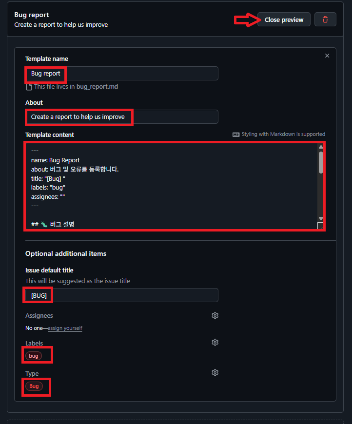

---
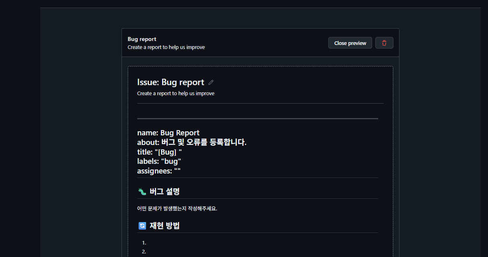

---
### Feature Request 생성

---
```markdown
---
name: Feature Request
about: 새로운 기능 개발을 등록합니다.
title: "[Feature] "
labels: "feature"
assignees: ""
---

## 📌 기능 설명
개발할 기능을 간단하게 작성해주세요.

## 🛠 작업 내용
- [ ] 작업 1
- [ ] 작업 2
- [ ] 작업 3

## ✅ 완료 조건
- [ ] 기능 구현 완료
- [ ] 정상 동작 확인

## 📎 참고사항
관련 화면, API, 문서 등이 있다면 작성해주세요.
```

---
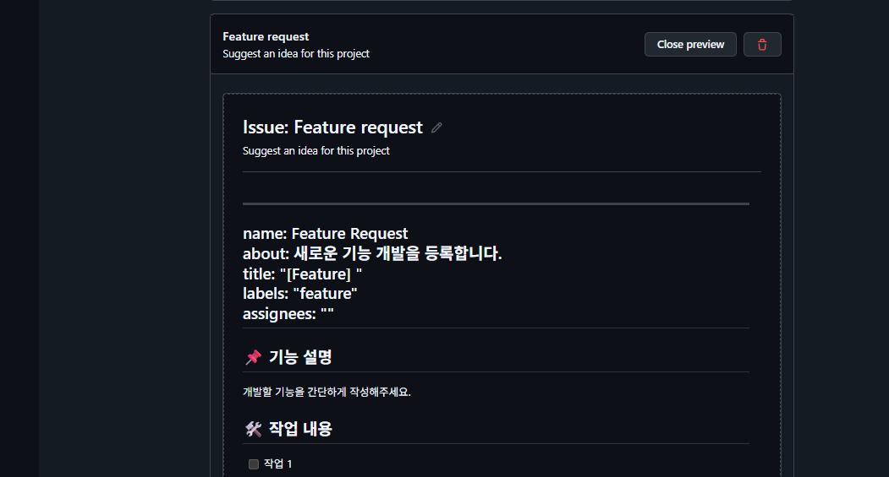

---
### 추가/수정된 내용 반영

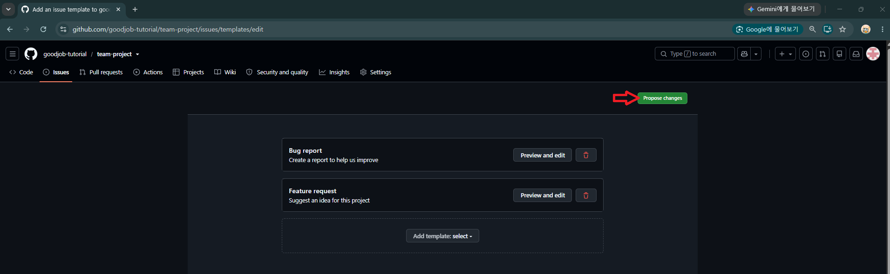

---
> 반영 이유 작성 및 Commit

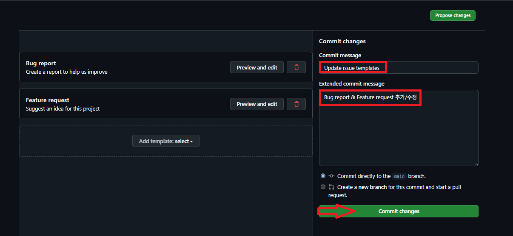

---
> 결과 확인 

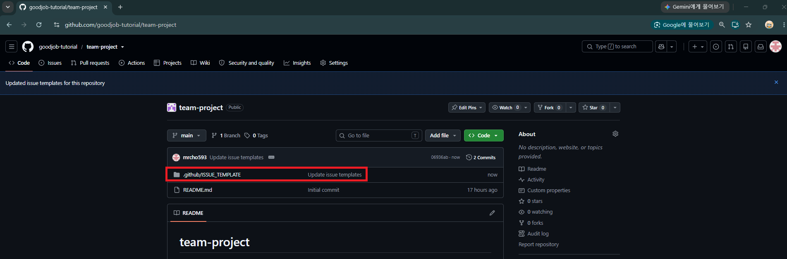

---
## 3단계: Branch protection rules 정의

---
> Repository → Settings → Branches

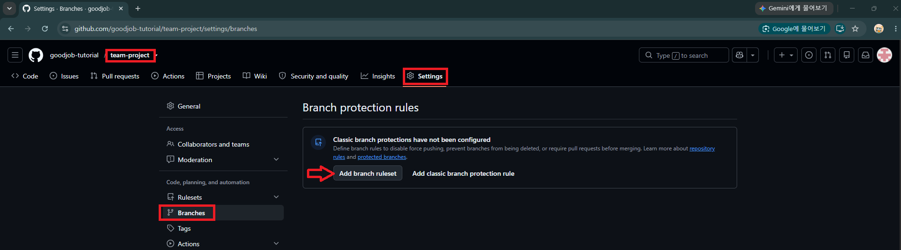

---
### Bypass list
> Bypass 권한을 가진 특정 사용자/팀이 설정되어 있다면, 그 사람은 규칙을 우회할 수 있음

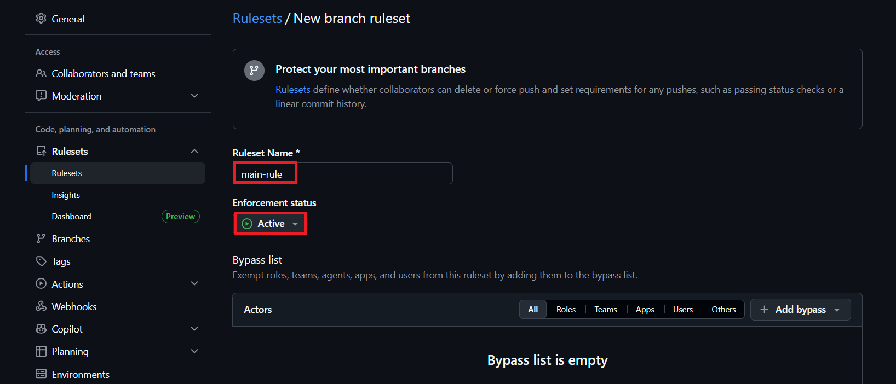

---
### Target branches
> 규칙이 적용될 branch 정의

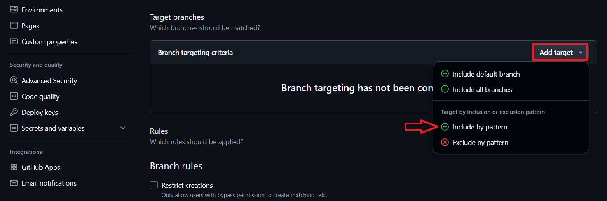

---
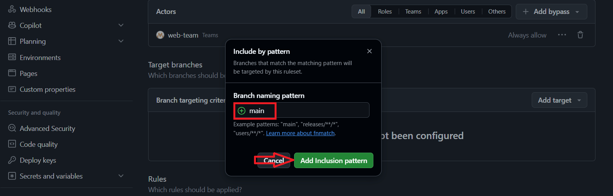

---
### Branch rules
> 규칙 정의

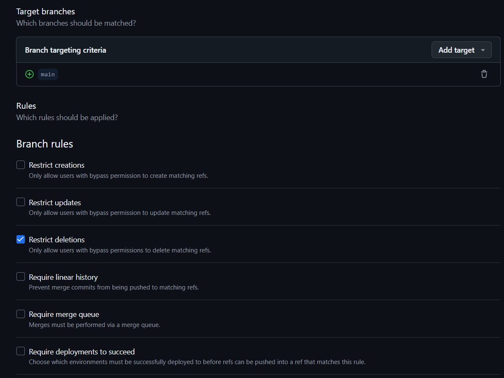

---
> 규칙: Merge 전 PR 필수 

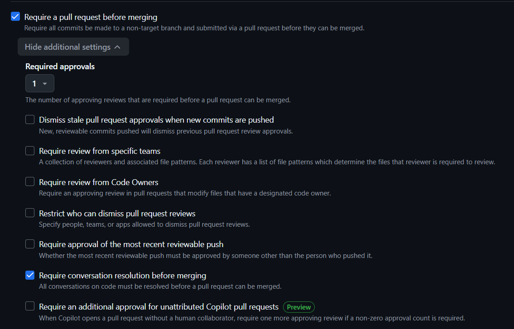

---
| 방식           | 작업 Commit  | Merge Commit       | History   | 난이도 |
| ------------ | ---------- | ------------------ | --------- | --- |
| **Merge**    | 유지         | 생성                 | 복잡해질 수 있음 | 쉬움  |
| **Squash** | **하나로 합침** | 별도 Merge Commit 없음 | **가장 깔끔** | 쉬움  |
| **Rebase**   | 유지         | 없음                 | 일렬로 깔끔    | 어려움 |

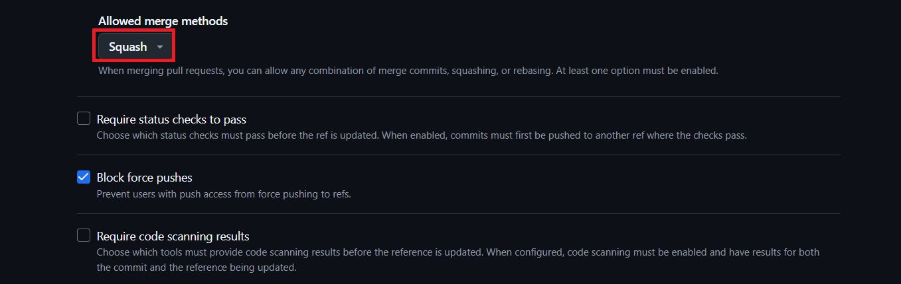

---
> Create

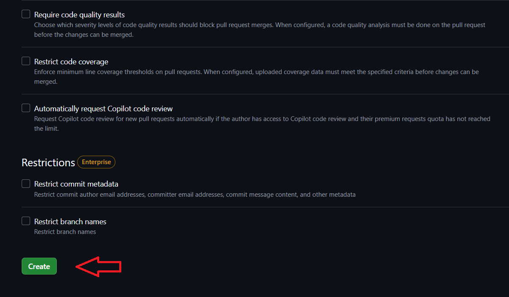

---
> 결과 확인 

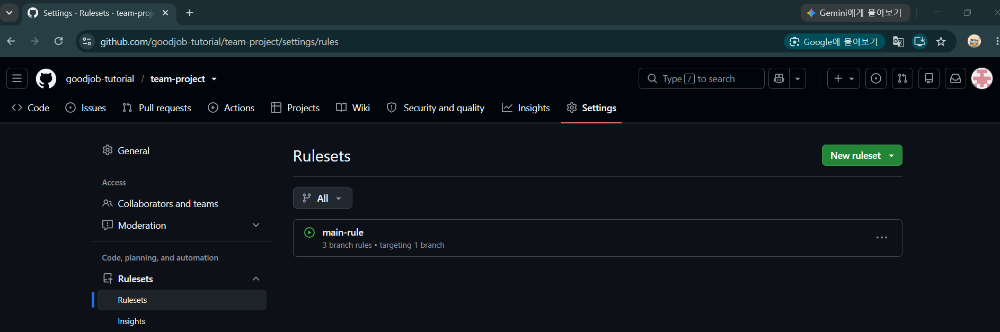
