## Milestone vs 하위 Issue

| 구분          | Milestone                 | 하위 Issue            |
| ----------- | ------------------------- | ------------------- |
| 의미          | **목표/일정 단위**              | **작업 분해 단위**        |
| 질문          | 언제까지 무엇을 완성?              | 이 기능을 어떻게 나눠서 개발?   |
| 여러 Issue 묶기 | ✅                         | 부모 Issue 기준으로 묶음    |
| 마감일         | 중요                      | 보통 상대적으로 덜 중요       |
| 예시          | `MVP 개발`, `1차 배포`, `v1.0` | `로그인 UI`, `로그인 API` |

---
## 명명 규칙 

| 항목        | 추천            | 예시                 |
| --------- | ------------- | ------------------ |
| Milestone | 한글       | `1차 개발`, `MVP 개발`  |
| Issue 제목  | 한글       | `로그인 기능 구현`        |
| Branch    | 영어       | `feature/12-login` |
| Commit    | 한글 또는 영어 | `feat: 로그인 기능 구현`  |
| PR 제목     | 한글       | `로그인 기능 구현`        |

---
## 1단계: 팀장 > Milestone 생성
> Repository → Issues → Milestones

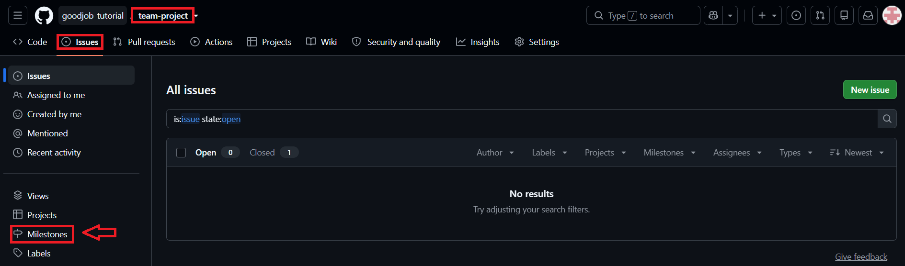

---
> New milestone

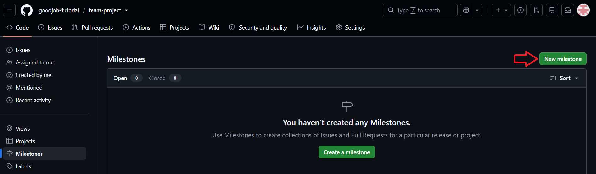

---
> 제목 / 설명 / 마감일(Due date) 입력 후 생성

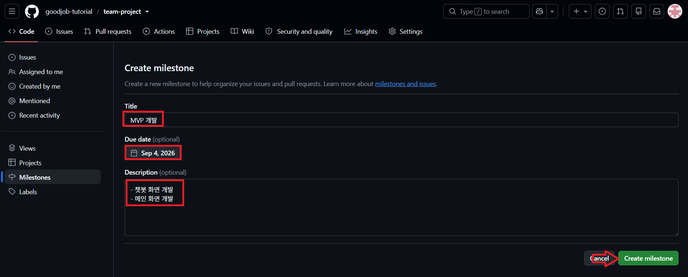

---
> 생성된 Milestone 확인

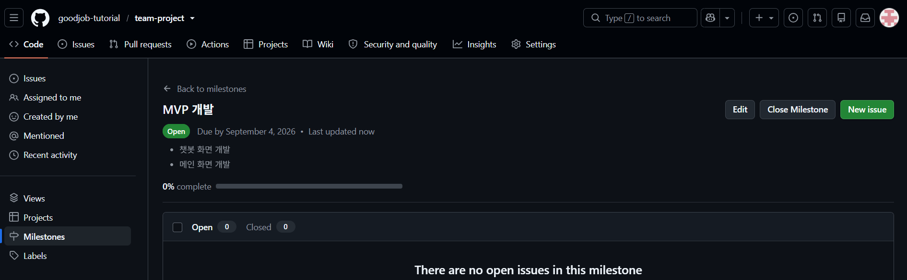

---
## 2단계: 팀장 > Milestone에 포함될 Issue 생성
> Issue 생성 화면에서 Milestone 항목 지정

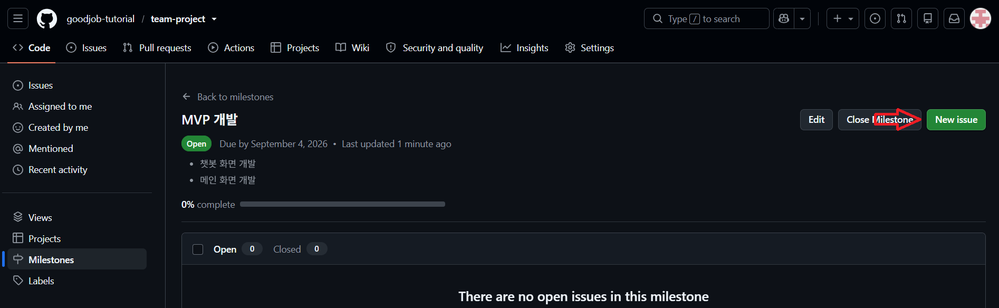

---
> Issue Template 선택 

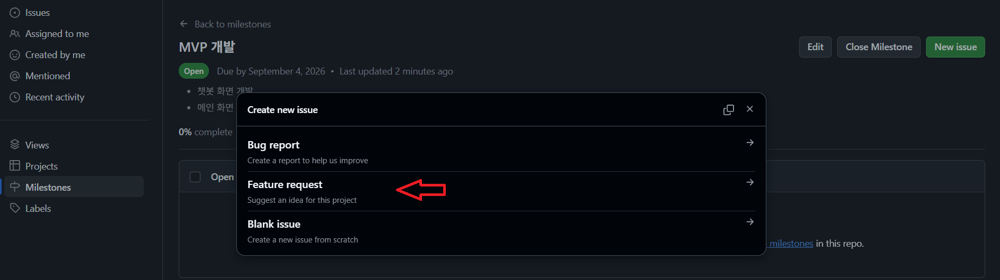

---
> 제목/내용 작성 및 담당자 지정 후 생성

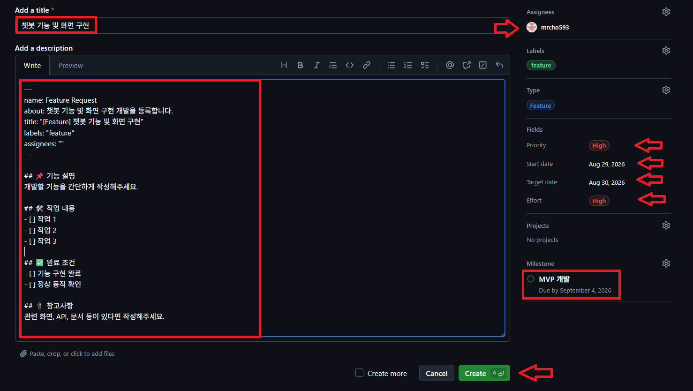

---
> 생성된 Issue에 Milestone이 연결된 것을 확인

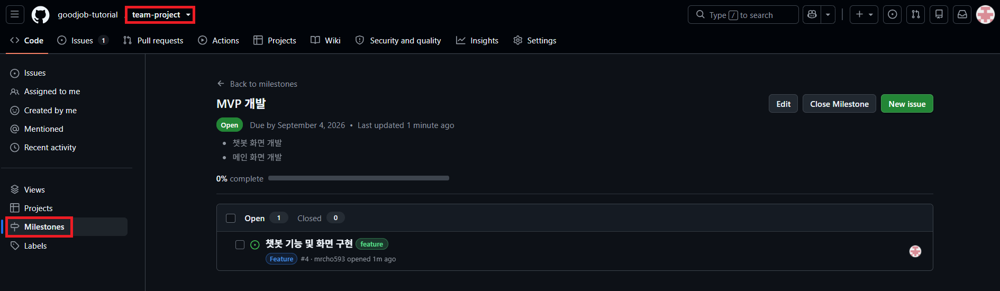

---
> (반복) 같은 Milestone에 속할 나머지 Issue들도 동일하게 생성

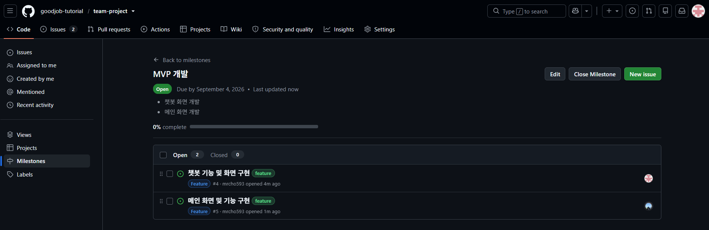

---
## 3단계: 팀원 > Milestone 진행 상황 확인
> Milestones 목록에서 진행률(Progress bar) 확인
> (옵션) 미리 기존 Issue 중 일부를 close 처리함 

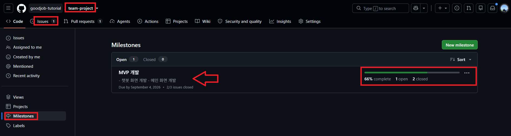

---
> Milestone 클릭 → 본인 Open/Closed Issue 목록 확인

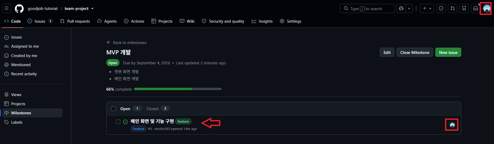

---
## 4단계: 팀원 > 담당 Issue 진행 및 Close

---
> Issue 실습과 동일하게 Branch 생성

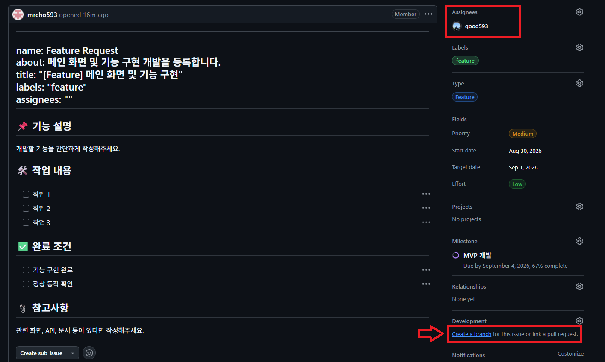

---
> Issue 실습과 동일하게 Branch 생성 → 개발

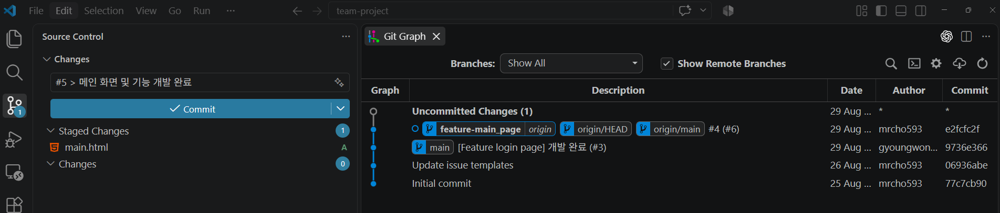

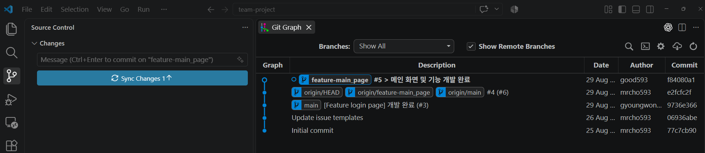

---
> Issue 실습과 동일하게 Branch 생성 → 개발 → PR

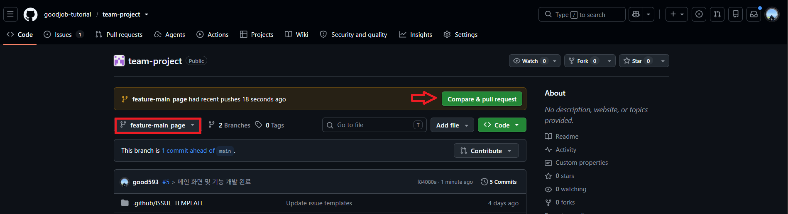

---
> `[팀장]`: 검토 및 승인

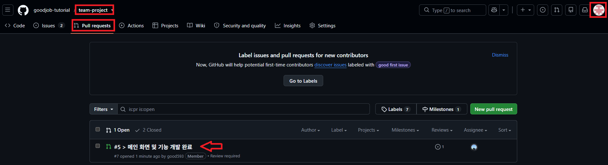

---
> Merge 완료 후 Issue Close

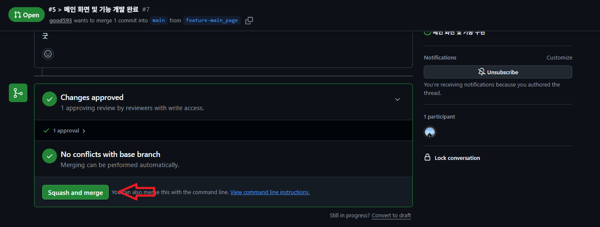

---
> Milestone 진행률이 갱신된 것을 확인

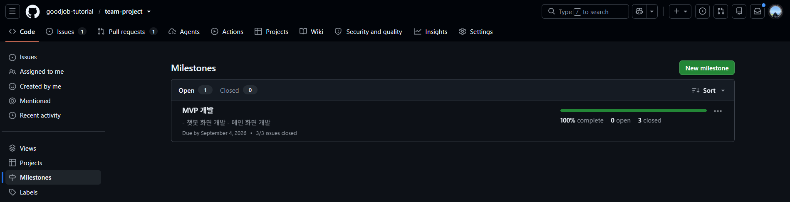

---
## 5단계: 팀장 > 전체 Issue 완료 확인
> Milestone에 연결된 모든 Issue가 Closed 상태인지 확인

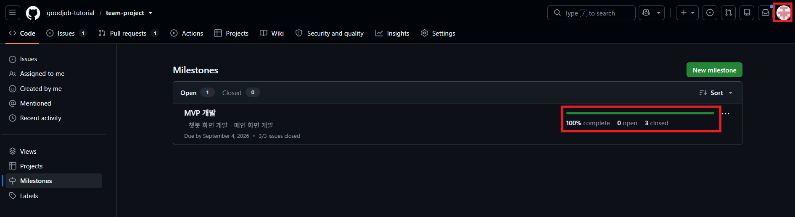

---
> Milestones 목록 → 해당 Milestone Close

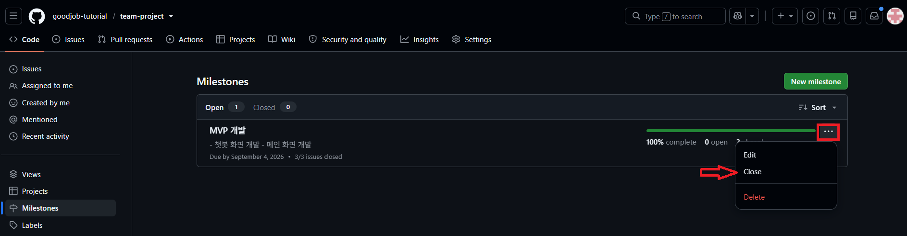

---
> Close 결과 확인

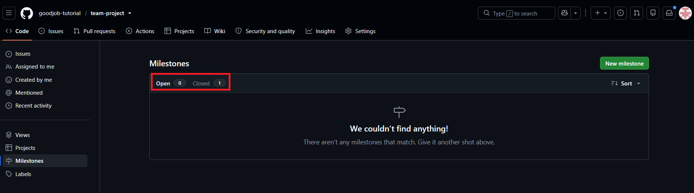

