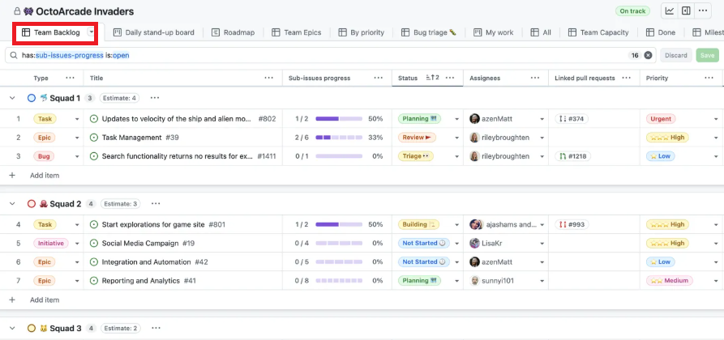
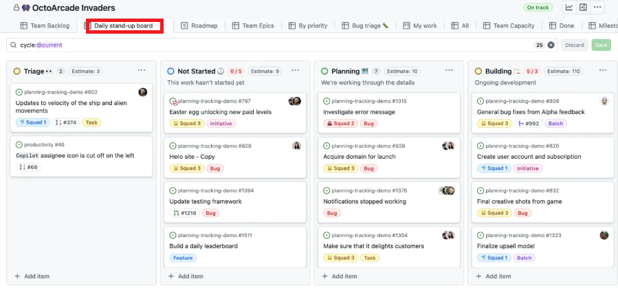
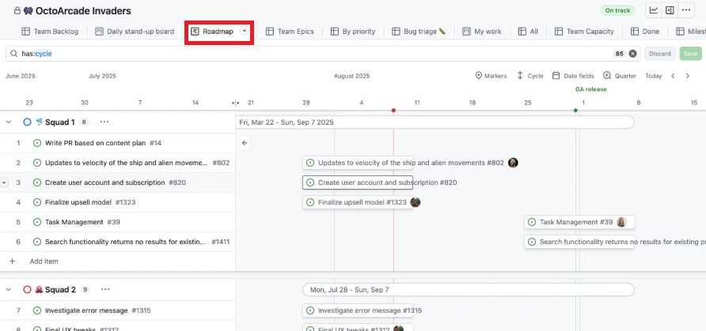
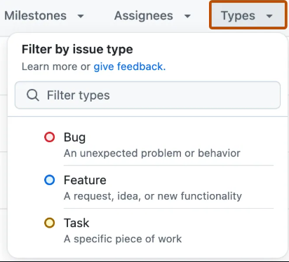

# GitHub Projects로 진행 상황 관리하기

Issue와 Pull Request를 보드, 테이블, 로드맵으로 시각화하기

---
## [GitHub Projects란?](https://docs.github.com/ko/issues/planning-and-tracking-with-projects/learning-about-projects/about-projects)

Issue, Pull Request, 아이디어를 한곳에 모아 계획하고 추적하는 도구다.

```text
Repository A의 Issues ─┐
Repository B의 Issues ─┼─> Project ─> Table / Board / Roadmap
Pull Requests ─────────┘
```

하나의 Project에서 여러 저장소의 작업을 함께 관리할 수 있다.

> 과거에 `Projects v2`로 불리던 기능이며, 현재 문서에서는 `Projects`라고 부른다.

---

## Issue, Milestone, Project 비교

| 도구 | 답하는 질문 | 예시 |
| --- | --- | --- |
| Issue | 해야 할 한 가지 일은 무엇인가? | 로그인 오류 수정 |
| Milestone | 어떤 목표/기한까지 묶는가? | v1.0 출시 |
| Project | 전체 일이 지금 어떤 상태인가? | Todo → In Progress → Done |

세 도구는 경쟁 관계가 아니다.
Issue를 Milestone으로 묶고, Project에서 흐름을 관리한다.

---

## Project의 구성 요소

| 구성 요소 | 역할 |
| --- | --- |
| Item | Issue, Pull Request, Draft issue |
| Field | Status, 담당자, 날짜, 우선순위 등 데이터 |
| View | 같은 Item을 보여 주는 방법 |
| Filter | 현재 View에 보일 Item 조건 |
| Workflow | Item 추가·종료 등에 반응하는 자동화 |

Project는 Item과 Field를 저장하고, View가 이를 목적에 맞게 보여 준다.

---

## 먼저 업무 흐름을 정하자

가장 단순한 상태부터 시작한다.

```text
Todo → In Progress → Done
```

팀에 필요할 때만 상태를 추가한다.

```text
Backlog → Ready → In Progress → In Review → Done
```

> 상태가 많아질수록 정확한 분류보다 상태 변경 자체가 일이 될 수 있다.

---

## Project 생성하기

1. Organization 페이지에서 **Projects**를 연다.
2. **New project**를 선택한다.
3. 빈 프로젝트 또는 적절한 Template을 선택한다.
4. 이름을 입력한다: `team-project-sprint`
5. 설명과 공개 범위를 확인한다.

권장 설명:

```text
팀 프로젝트의 이슈와 PR을 스프린트 단위로 관리합니다.
```

---
## Item 추가하기

Project에는 다음 Item을 추가할 수 있다.

- 기존 Issue
- 기존 Pull Request
- Project 안에서 빠르게 적는 Draft issue

초기 실습:

1. 화면 아래의 **Add item**을 선택한다.
2. 저장소 또는 이슈 제목을 검색한다.
3. 팀원이 작성한 이슈를 추가한다.
4. Item을 열어 원본 Issue와 연결되어 있는지 확인한다.

> Draft issue는 구체화한 뒤 실제 저장소 Issue로 변환할 수 있다.

---

## Field로 관리 기준 만들기

기본 GitHub 정보와 사용자 정의 Field를 함께 사용한다.

| Field | 형식 | 기본 제공 여부 | 예시 |
| --- | --- | --- | --- |
| Status | Single select | 기본 제공 | Todo, In Progress, Done |
| Priority | Single select | 사용자 정의 | P0, P1, P2 |
| Iteration | Iteration | 사용자 정의 | Sprint 1, Sprint 2 |
| Start date | Date | 사용자 정의 | 2026-09-01 |
| Target date | Date | 사용자 정의 | 2026-09-12 |
| Estimate | Number | 사용자 정의 | 1, 2, 3, 5, 8 |

`Status`를 제외한 나머지는 팀이 필요에 따라 직접 추가하는 Field다.

---

## View 1: Table

많은 Item의 값을 한 번에 확인하고 수정할 때 적합하다.

```text
Title | Status | Assignee | Priority | Iteration | Estimate
```

활용 예시:

- 스프린트 계획 회의
- 담당자와 우선순위 일괄 확인
- 누락된 Field 찾기
- Filter, Sort, Group으로 목록 정리

> 데이터 입력과 전체 목록 검토에는 Table이 가장 편리하다.

---


---

## View 2: Board

Item을 열 사이에서 이동하며 업무 흐름을 볼 때 적합하다.

```text
┌──────────┬─────────────┬───────────┐
│   Todo   │ In Progress │   Done    │
├──────────┼─────────────┼───────────┤
│ Issue #1 │ Issue #2    │ Issue #3  │
│ Issue #4 │             │ PR #5     │
└──────────┴─────────────┴───────────┘
```

Board를 `Status`로 Group하면 카드를 옮길 때 상태도 함께 변경된다.

---


---

## View 3: Roadmap

시작일과 종료일을 기준으로 일정을 시간 축에서 볼 때 적합하다.

```text
로그인 기능      ███████
주문 API             █████████
배포 설정                   █████
```

활용 예시:

- 여러 기능의 일정 겹침 확인
- 릴리스 계획 공유
- 장기간 진행되는 작업의 의존 관계 파악

> Roadmap을 사용하려면 날짜 Field를 연결해야 한다.

---


---

## 같은 데이터, 다른 View

View를 새로 만들어도 Item이 복제되는 것은 아니다.

| View 이름 | Layout | Filter/Group 예시 |
| --- | --- | --- |
| Sprint board | Board | `iteration:@current`, Status로 Group |
| Planning | Table | Priority로 Sort |
| My work | Table | `assignee:@me` |
| Release plan | Roadmap | Start/Target date 사용 |

한 View에서 Status를 바꾸면 다른 View에도 같은 값이 반영된다.

---
## [Filter로 필요한 작업만 보기](https://docs.github.com/en/issues/tracking-your-work-with-issues/using-issues/filtering-and-searching-issues-and-pull-requests?tool=cli&utm_source=chatgpt.com)

예시:

```text
assignee:@me
status:"In Progress"
label:bug
iteration:@current
repo:organization/team-project
```

조건을 조합할 수도 있다.

```text
assignee:@me status:"In Progress"
```

각 View에 Filter를 저장하면 회의 목적에 맞는 화면을 바로 열 수 있다.

---
```text
# 예시 
type:"Bug" AND assignee:octocat
```

| 논리  | GitHub Issues      |
| --- | ------------------ |
| AND | `A AND B` 또는 `A B` |
| OR  | `A OR B`           |
| NOT | `-A`               |
| 그룹  | `(A AND B) OR C`   |



---
## [Workflow: 반복 작업 자동화](https://docs.github.com/en/issues/planning-and-tracking-with-projects/automating-your-project?utm_source=chatgpt.com)

Projects의 기본 Workflow 예시:

- Item이 추가되면 Status를 `Todo`로 설정
- Issue 또는 PR이 닫히면 Status를 `Done`으로 설정
- PR이 Merge되면 Status를 `Done`으로 설정
- 조건에 맞는 새 Issue/PR을 Project에 자동 추가
- 완료된 Item을 일정 기간 뒤 자동 Archive

> 자동화는 사람이 놓치기 쉬운 상태 동기화를 맡긴다.

---
> Issue 생성 → Project 자동 추가 → Todo → 개발 → PR → Merge → Done → Archive

| Workflow                  | 동작                                |
| ------------------------- | --------------------------------- |
| **Item added to project** | 추가되면 Status → `Todo`              |
| **Item closed**           | Issue/PR이 Close되면 Status → `Done` |
| **Pull request merged**   | PR이 Merge되면 Status → `Done`       |
| **Auto-add to project**   | 조건에 맞는 Issue/PR을 자동으로 Project에 추가 |
| **Auto-archive items**    | 완료된 Item을 일정 기간 후 자동 Archive      |


---

## 자동으로 Done으로 이동하기

1. Project 우측 상단 메뉴에서 **Workflows**를 연다.
2. 기본 Workflow 목록에서 Item 종료 관련 항목을 선택한다.
3. 트리거와 대상 Status를 확인한다.
4. **Save and turn on workflow**를 선택한다.
5. 테스트 Issue를 닫거나 PR을 Merge해 결과를 확인한다.

새 Project에는 일반적으로 다음 Workflow가 기본 활성화된다.

- 닫힌 Issue/PR → `Done`
- Merge된 PR → `Done`

---

## Issue를 Project에 자동 추가하기

**Workflows → Auto-add to project**에서 저장소와 Filter를 정한다.

```text
Repository: organization/team-project
Filter: is:issue is:open
```

Label로 범위를 좁힐 수도 있다.

```text
is:issue is:open label:feature
```

> Auto-add를 켜기 전에 있던 Item은 자동으로 소급 추가되지 않는다. 이후 생성되거나 수정되어 조건을 만족하는 Item부터 추가된다.

---

## 스프린트 운영 예시

### 계획 회의

1. 이번 스프린트의 Iteration을 선택한다.
2. 우선순위가 높은 이슈를 가져온다.
3. 담당자와 Estimate를 정한다.
4. 시작할 이슈를 `Todo`에 둔다.

### 진행 중

- 작업 시작 시 `In Progress`
- PR 생성 후 필요하면 `In Review`
- Merge 후 Workflow가 `Done`으로 변경

---

## 매일 10분 보드 점검

각 팀원이 세 가지만 공유한다.

1. 어제 완료한 일
2. 오늘 진행할 일
3. 진행을 막는 문제

보드를 보며 확인한다.

- 담당자 없는 Item이 있는가?
- 오래 `In Progress`에 머문 Item이 있는가?
- `blocked` Item에 도움이 필요한가?
- 닫힌 이슈가 `Done`으로 이동했는가?

---

## 운영 원칙

- Project의 Item은 원본 Issue/PR과 연결한다.
- 실제 상태가 바뀌면 보드도 같은 날 갱신한다.
- 모든 Field를 채우려 하지 말고 의사결정에 필요한 값만 관리한다.
- `Done` Item은 바로 삭제하지 말고 기록으로 남기거나 Archive한다.
- View는 회의 목적별로 만들고 이름을 명확히 정한다.

> 관리 도구를 꾸미는 시간보다 팀의 다음 행동을 분명하게 만드는 것이 중요하다.
