## 1단계: 팀장 > Project 생성
> Organization → Projects → New project

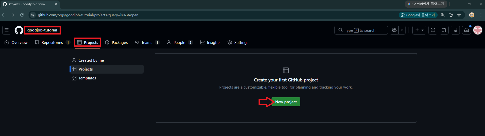

---
> 빈 프로젝트 또는 Template 선택

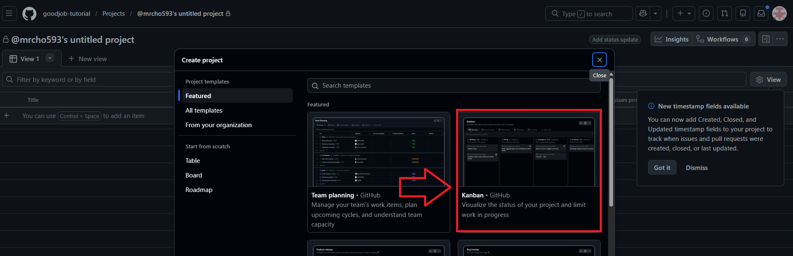

---
> 이름/설명 입력 후 생성: 
> `team-project-sprint`

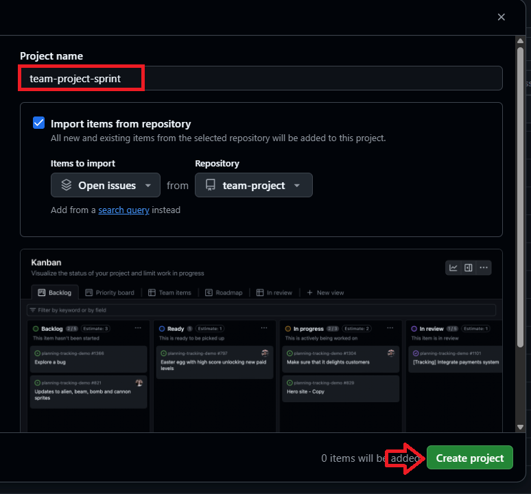

---
> 생성된 Project 확인 및 설정으로 이동 

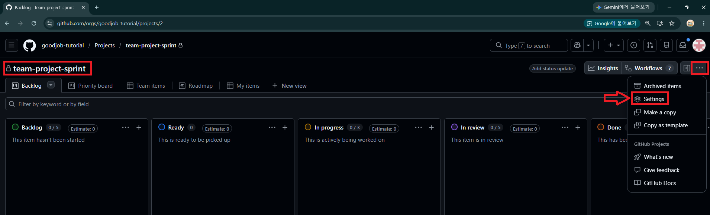

---
## 2단계: 팀장 > Field 설정
- `Sub-issues progress`: 해당 이슈에 딸린 하위 이슈(sub-issue)들의 완료 비율을 자동으로 보여주는 필드
- `Priority`: 작업의 우선순위
- `Size`: 작업 규모(옷 사이즈처럼 S/M/L/XL 등)를 나타내는 Single select 필드
- `Estimate`: 작업량을 숫자로 추정하는 필드
  - `Size`와 `Estimate`는 둘 다 "작업량 추정"이라 보통 팀에서 하나만 골라 씀
- `Start date`, `Target date`: 각각 작업 시작일과 목표 완료일

---
- `Status`: 작업 진행 상태를 나타내는 기본 필드.
> Status 수정 : Todo / In Progress / Done

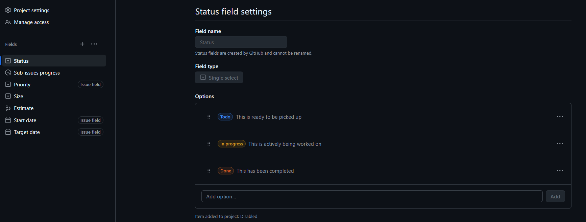

---
> 결과 확인 

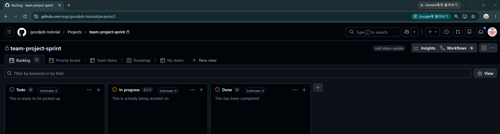

---
- `Iteration`: 애자일/스프린트 방식

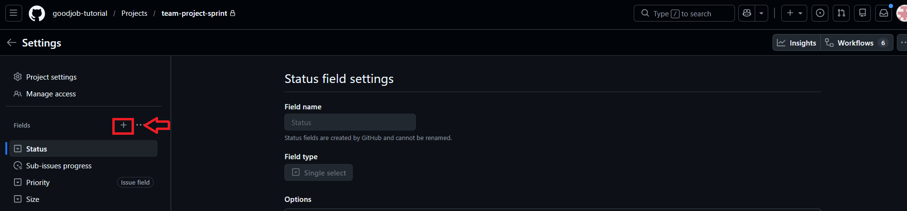

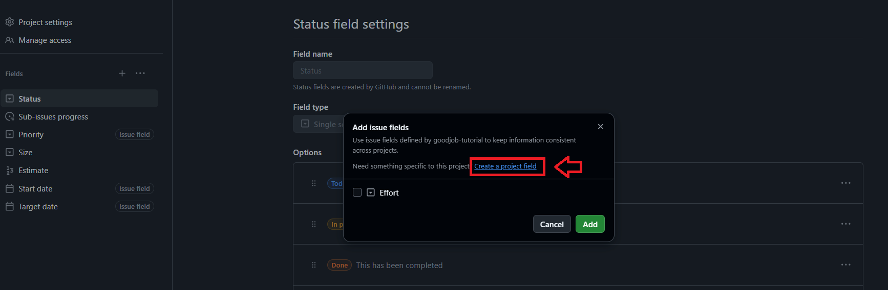

---
> `Iteration` Field 추가 (Sprint 1, Sprint 2)

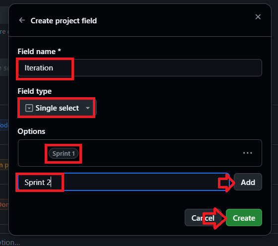

---
> 결과 확인 > Edit option을 이용해 색상 변경

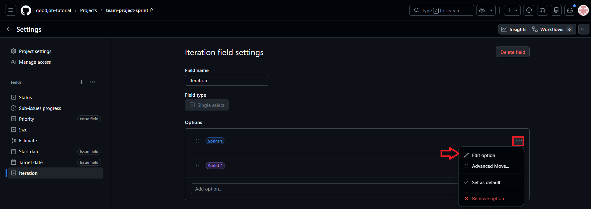

---
## 3단계: 팀장 > Workflow 자동화 설정
> 우측 상단 메뉴 → Workflows

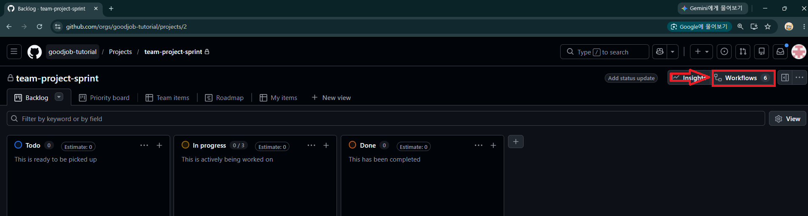

---
### Default workflows

| Workflow | 트리거 조건 | 동작 | 기본 상태 |
|---|---|---|---|
| Auto-add sub-issues to project | 하위 이슈(sub-issue)가 생성됨 | 상위 이슈와 같은 프로젝트에 자동 추가 | ON |
| Auto-add to project | 저장소에 새 이슈/PR 생성 (Filter 조건 만족 시) | 프로젝트에 자동 추가 | ON |
| Auto-close issue | 연결된 PR이 머지됨 | 연결된 이슈를 자동으로 Close | ON |
| Item closed | 이슈 또는 PR이 Close됨 | Status → `Done` | ON |

---
| Workflow | 트리거 조건 | 동작 | 기본 상태 |
|---|---|---|---|
| Pull request linked to issue | PR이 이슈와 연결됨(closes #123 등) | 연결된 이슈의 Status 변경(설정값에 따름) | ON |
| Pull request merged | PR이 머지됨 | Status → `Done` | ON |
| Auto-archive items | 항목이 일정 기간 Done 상태로 방치됨 | 프로젝트 보드에서 자동 보관(archive) | OFF |
| Code changes requested | PR 리뷰에서 "Changes requested" | Status 변경(예: In Progress로) | OFF |

---
| Workflow | 트리거 조건 | 동작 | 기본 상태 |
|---|---|---|---|
| Code review approved | PR 리뷰가 Approve됨 | Status 변경(예: In Review → Done 등) | OFF |
| Item added to project | 항목이 프로젝트에 추가됨 | Status 값 지정 등 | 조건 미설정 |
| Item reopened | Close된 이슈/PR이 다시 Open됨 | Status 변경(예: Todo/In Progress로 복귀) | OFF |


---
> 기본 Workflow 확인: 닫힌 Issue/PR → `Done`

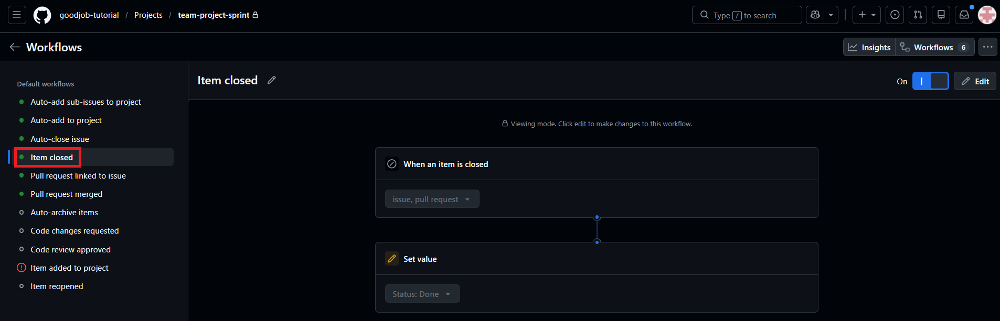

---
> 기본 Workflow 확인: Merge된 PR → `Done`

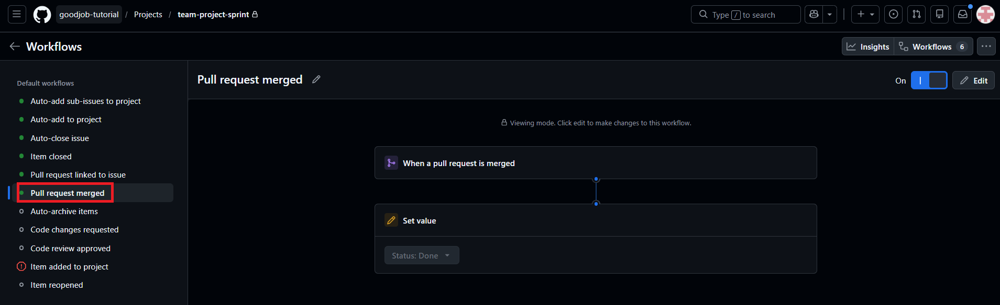

---
> 기본 Workflow 확인: Auto-add to project: 저장소 및 Filter 설정
```text
Repository: organization/team-project
Filter: is:issue is:open
```
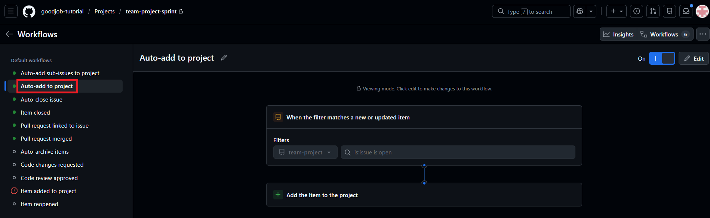
