## 1단계: 팀장 > Item 추가 (신규 Issue 생성)
> 마우스 화면 아래 `+ Add item`

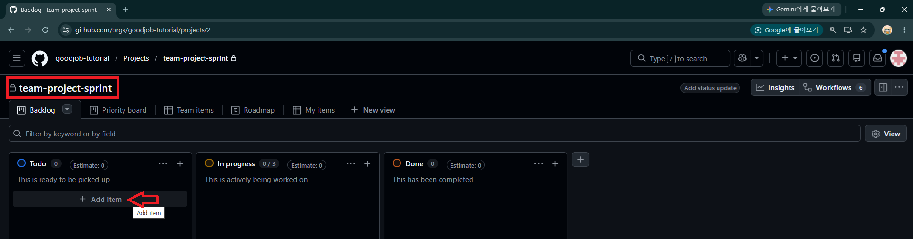

---
> > 마우스 화면 아래 `+ Add item` → `Create new issue`

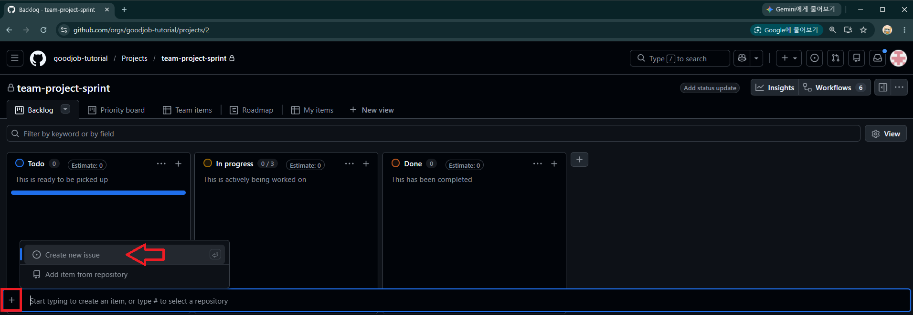

---
> 대상 저장소 선택 후 제목 입력하여 생성

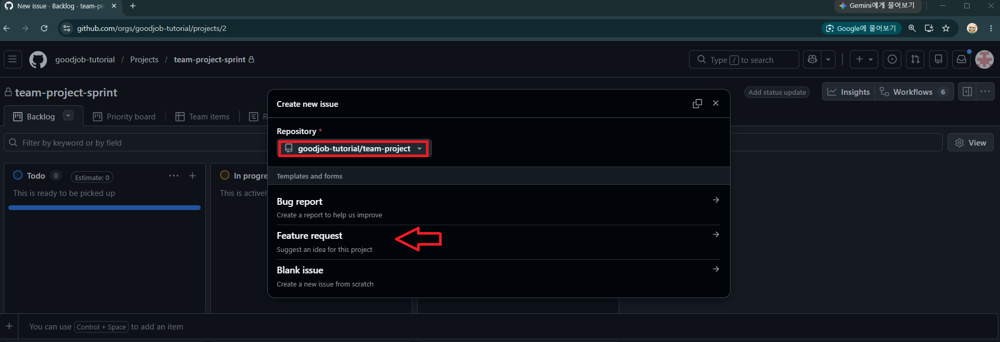

---
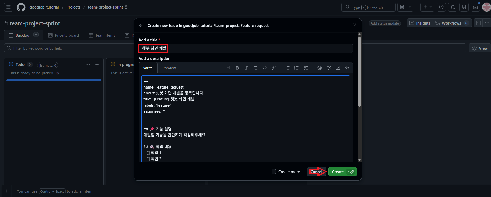

---
> 생성된 Issue를 열어 담당자(팀원) 지정

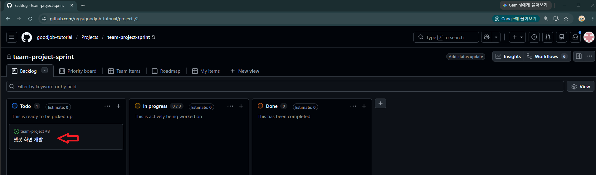

---
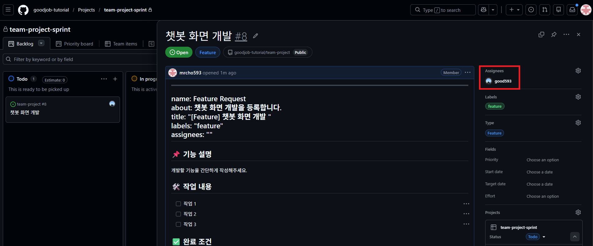

---
## 2단계: 팀원 > Board에서 진행 상황 관리
> Board View 확인 (Todo / In Progress / Done)

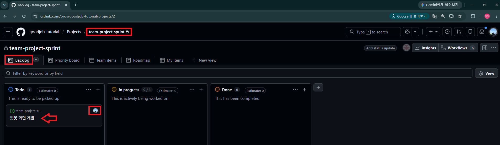

---
> Priority, Start date/Target date, Iteration, Size 값 입력

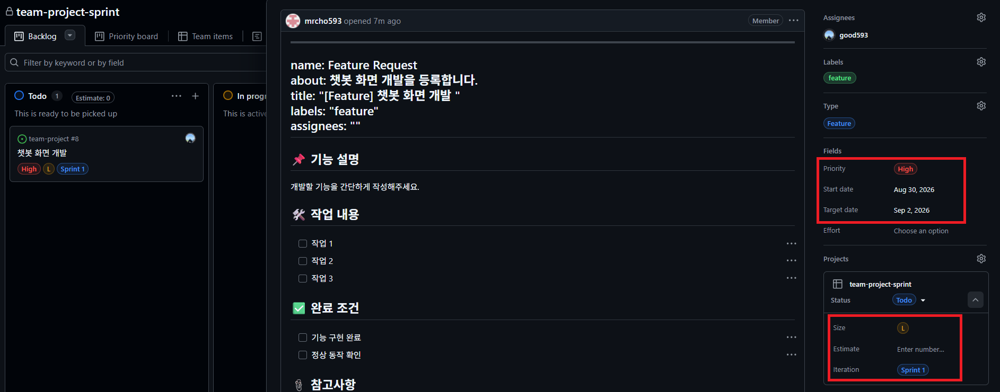

---
> 작업 시작 → 마우스로 Item을 `In Progress`로 이동

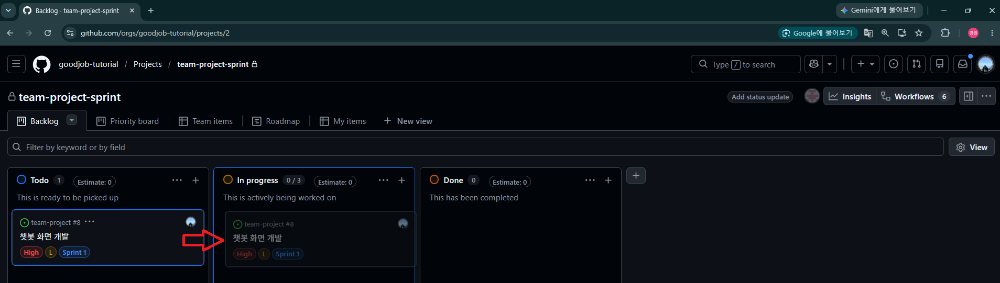

---
> 결과 확인 

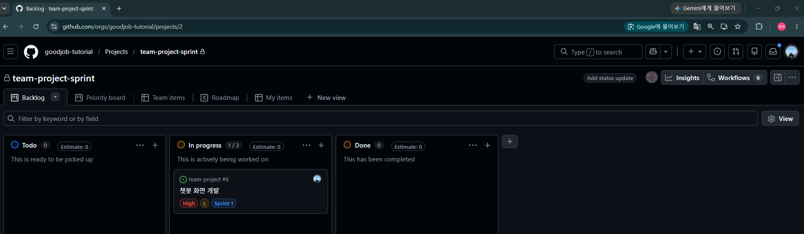

---
## 3단계: 팀원 > 담당 Issue 진행
> Issue 이동

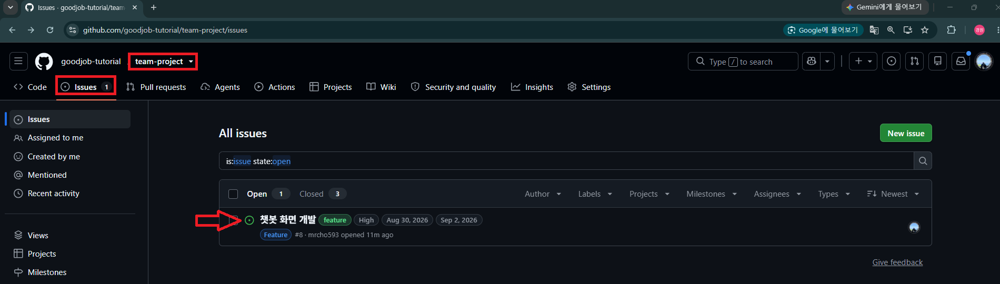

---
> Issue 실습과 동일하게 Branch 생성

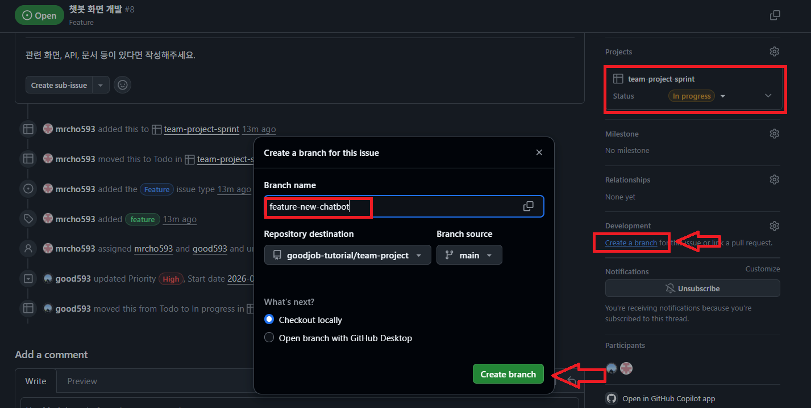

---
> Issue 실습과 동일하게 Branch 생성 → 개발

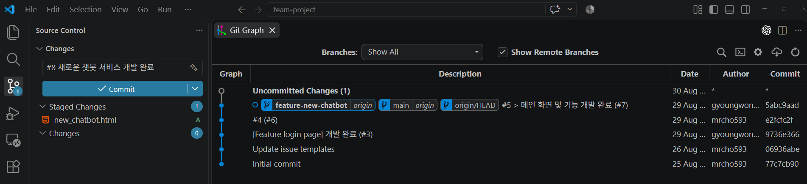

---
> Issue 실습과 동일하게 Branch 생성 → 개발 → PR → Merge 진행

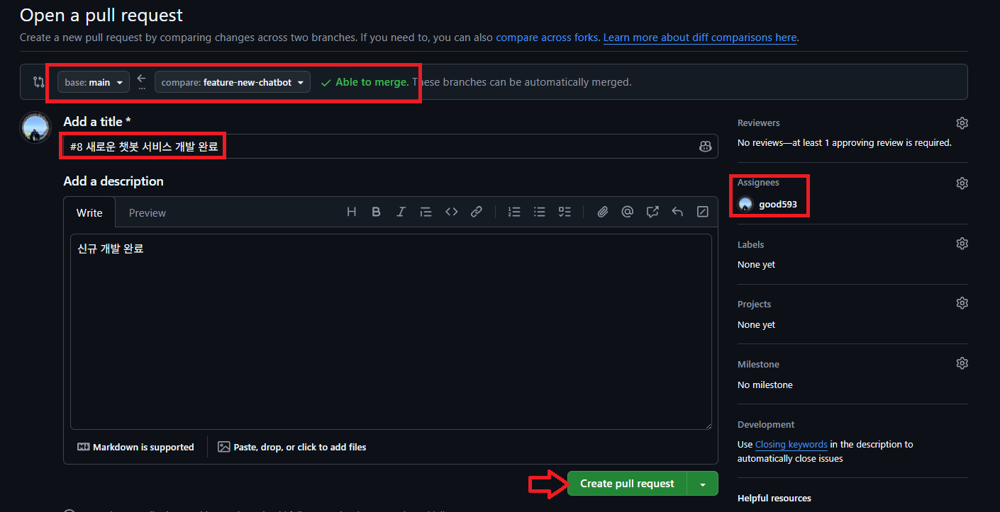

---
## 4단계: 팀장 > PR 검토 및 승인 
> PR 확인

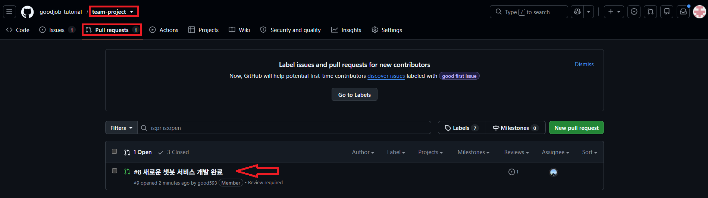

---
> PR 확인 → 승인

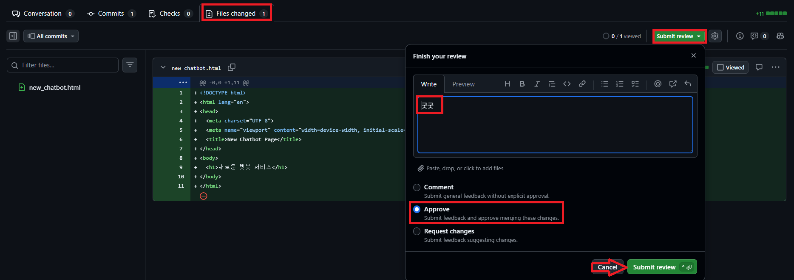

---
## 5단계: 팀원 > Merge 진행 및 branch 삭제 
> Merge 진행

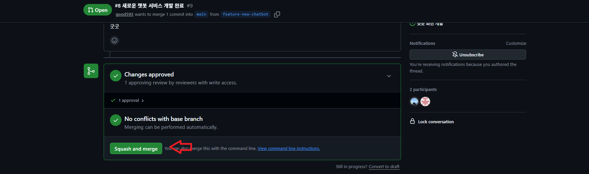

---
> Merge 진행 → branch 삭제

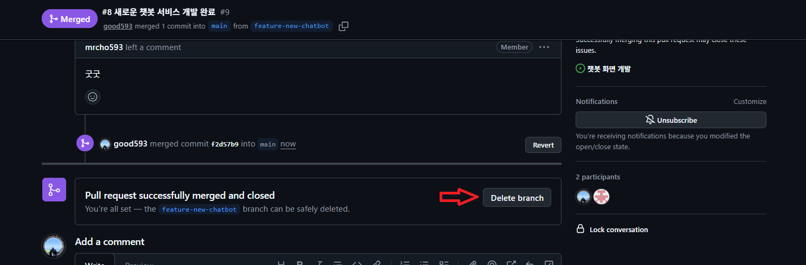

---
> 결과 확인 

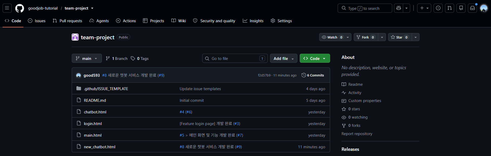

---
## 6단계: 팀원 > Local PC branch 정리 

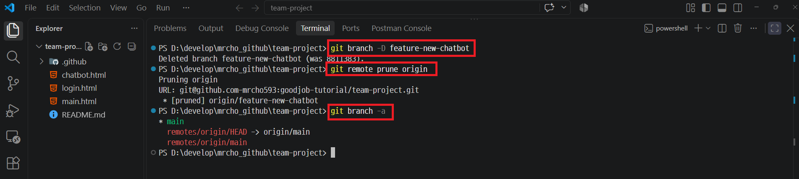

---
## 7단계: 팀장 > Issue Close 및 자동화 확인

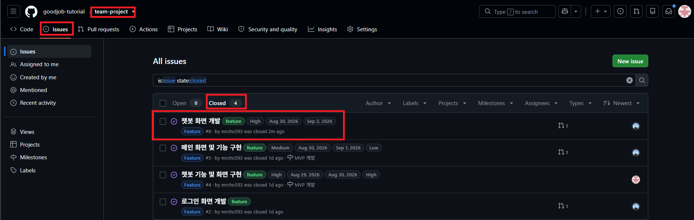

---
> Board에서 Item이 자동으로 `Done`으로 이동한 것을 확인

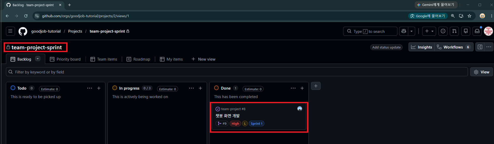
