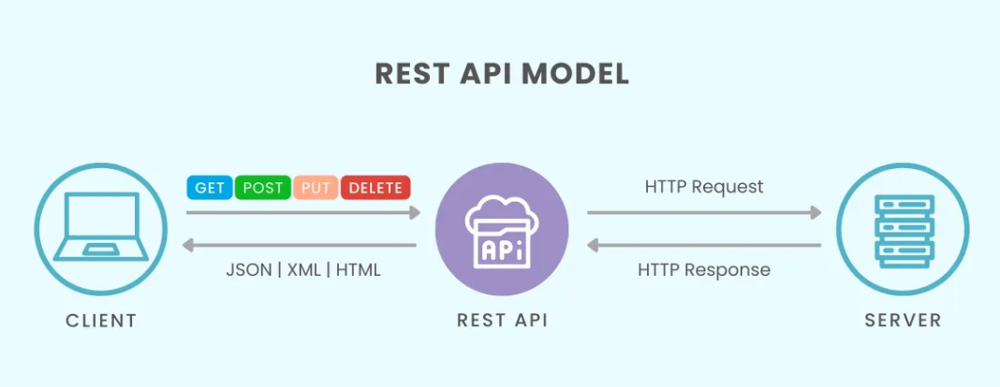
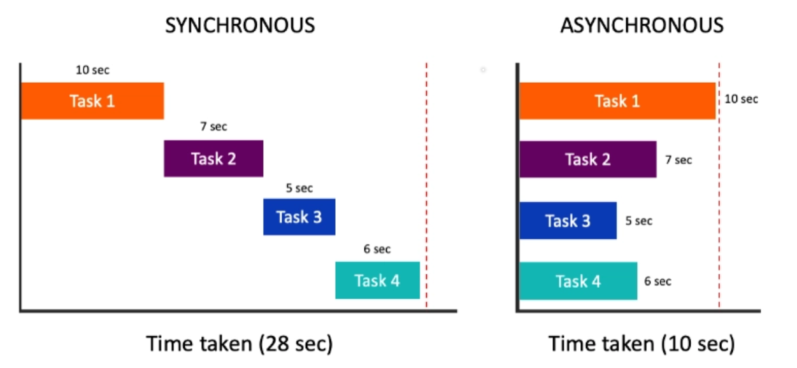
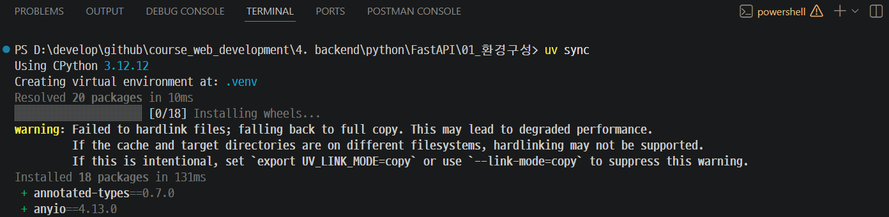
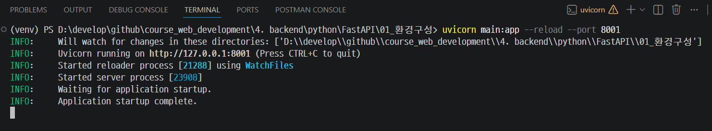
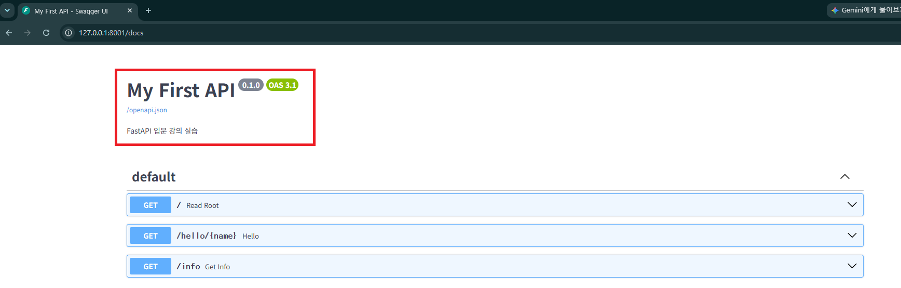
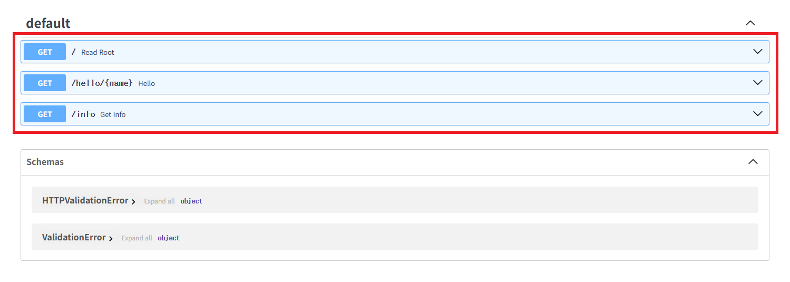
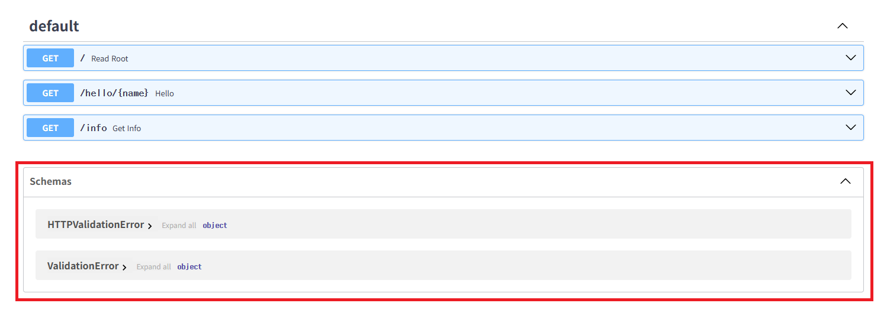

# 환경 구성 & FastAPI 첫 실행

---

## [1. REST API란 무엇인가](https://cloud.google.com/discover/what-is-rest-api?hl=ko)
> REST API는 REST 아키텍처 스타일의 설계 원칙을 준수하는 API입니다. 
> REST는 기본적으로 리소스라는 개념을 중심으로 이루어지며, 리소스는 사용자, 제품, 문서, 항목 모음과 같은 모든 정보 조각이 될 수 있습니다. 

---
### 클라이언트 / 서버 구조

```
[클라이언트]  ──── HTTP 요청 ────>  [서버]
  브라우저                           FastAPI
  모바일앱     <─── HTTP 응답 ────   애플리케이션
  다른 서버
```

- **클라이언트** : 데이터를 요청하는 쪽 (브라우저, 앱, curl 등)
- **서버** : 요청을 받아 처리하고 응답을 돌려주는 쪽
- **API (Application Programming Interface)** : 클라이언트와 서버가 대화하는 약속된 방식

---


---
## [2. FastAPI란?](https://fastapi.tiangolo.com/ko/)
> FastAPI는 Python 기반으로 빠르고 쉽게 REST API를 개발할 수 있는 고성능 웹 프레임워크

---
### 프레임워크 비교

| 항목 | Flask | Django REST | FastAPI |
|------|-------|-------------|---------|
| 학습 난이도 | 쉬움 | 어려움 | 쉬움 |
| 성능 (req/s) | 보통 | 보통 | 매우 빠름 |
| 타입 힌트 | 선택 | 선택 | 핵심 기능 |
| 자동 문서화 | 직접 설정 | 직접 설정 | **자동 (Swagger)** |
| 데이터 검증 | 직접 구현 | Serializer | **Pydantic 내장** |
| 비동기 지원 | 제한적 | 제한적 | **완전 지원** |

---
### FastAPI의 핵심 장점

```python
# 타입 힌트만 써도 자동으로:
# 1. 입력 데이터 검증
# 2. Swagger UI 문서 생성
# 3. IDE 자동완성 지원

from fastapi import FastAPI
from pydantic import BaseModel

app = FastAPI()

class Item(BaseModel):
    name: str        # 문자열 필수
    price: float     # 실수 필수
    in_stock: bool = True  # 기본값 있음

@app.post("/items")
def create_item(item: Item):   # ← 이것만으로 검증 + 문서화 완료
    return item
```

---
## 3. ASGI / Uvicorn이란?

---
- `ASGI`: FastAPI가 `비동기 요청`을 처리할 수 있도록 정의된 웹 서버 표준 인터페이스
- `Uvicorn`: FastAPI 애플리케이션을 실제로 실행하고 `HTTP 요청`을 처리하는 ASGI 서버
```
[HTTP 요청]
    ↓
[Uvicorn]  ← ASGI 서버 (비동기 요청 처리)
    ↓
[FastAPI]  ← ASGI 애플리케이션 (라우팅, 비즈니스 로직)
    ↓
[HTTP 응답]
```

---
### 동기 vs 비동기 
| 구분 | 동기 (Synchronous) | 비동기 (Asynchronous) |
|------|-------------------|----------------------|
| 개념 | 작업이 끝날 때까지 다음 작업이 기다림 | 작업을 요청한 후 결과를 기다리지 않고 다른 작업 수행 |
| 처리 방식 | 순차 처리 | 병렬적으로 처리 가능 |
| 대기 시간 | 대기하는 동안 아무것도 못 함 | 대기하는 동안 다른 작업 가능 |
| FastAPI 코드 | `def` 사용 | `async def` 사용 |
| 장점 | 구현이 단순함 | 높은 처리량과 성능 |
| 단점 | 대기 시간이 길어질 수 있음 | 구현이 다소 복잡함 |

---


---
## [4. Swagger란?](https://swagger.io/)
> Swagger는 REST API를 설계하고, 문서화하고, 테스트할 수 있도록 도와주는 도구 및 명세(OpenAPI Specification 기반)입니다.

---
| 항목 | 설명 |
|---|---|
| Swagger | REST API를 문서화하고 테스트할 수 있는 도구 모음 |
| OpenAPI | API를 기술하는 표준 명세(Specification) |
| 주요 기능 | API 문서 자동 생성, 요청/응답 명세 제공, 브라우저 기반 테스트 |
| 장점 | 협업 효율 향상, 문서 최신화 자동화, 개발 및 테스트 편의성 증가 |
| 단점 | 운영 환경 노출 주의 필요, 문서 품질은 개발자의 작성 수준에 의존 |
| FastAPI | `/docs`(Swagger UI), `/redoc` 문서를 자동 제공 |

---
### FastAPI의 자동 문서화 원리

FastAPI는 코드를 분석해 **OpenAPI 3.x 스펙(JSON)**을 자동으로 생성합니다.  
이 JSON을 두 가지 UI로 렌더링합니다.

| URL | UI | 특징 |
|-----|-----|------|
| `/docs` | Swagger UI | 브라우저에서 직접 API 호출 가능 |
| `/redoc` | ReDoc | 가독성 높은 읽기 전용 문서 |
| `/openapi.json` | 원본 스펙 | Postman 등 외부 도구에서 가져오기 가능 |

---
## 5. 실습 — 환경 구성

---
### 가상환경 생성

| 파일 | 설명 |
|------|------|
| `.python-version` | 실습에 사용할 Python 버전 |
| `pyproject.toml` | 프로젝트 메타데이터와 의존성 정의 |
| `uv.lock` | 재현 가능한 설치를 위한 잠금 파일 |

---
```bash
# pyproject.toml과 uv.lock 기준으로 의존성 설치
uv sync
```


---
### 서버 실행

| 옵션 | 설명 |
|------|------|
| `main` | `main.py` 파일 |
| `app` | 파일 안의 FastAPI 인스턴스 변수명 |
| `--reload` | 파일 저장 시 자동 재시작 (개발용) |
| `--port` | 접속 Port |

---
```bash
python -m uvicorn main:app --reload --port 8001
```


---
### [Swagger UI 접속](http://127.0.0.1:8001/docs) 
> http://127.0.0.1:8001/docs

---
- FastAPI 애플리케이션을 생성하면서 API 메타데이터
```python
from fastapi import FastAPI

app = FastAPI(
    title="My First API",   # Swagger UI 제목
    description="FastAPI 입문 강의 실습",   # API 소개 문구
    version="0.1.0",    # API 버전
)

```

---


---
- API Endpoint 목록
```python
@app.get("/")
def read_root():
    return {"message": "Hello, FastAPI!"}


@app.get("/hello/{name}")
def hello(name: str):
    return {"message": f"안녕하세요, {name}님!"}


@app.get("/info")
def get_info():
    return {
        "framework": "FastAPI",
        "language": "Python",
        "docs_url": "/docs",
    }

```

---


---
- FastAPI가 자동으로 422 Validation Error 응답을 OpenAPI 문서에 추가하고, 그 응답 형식을 설명하기 위해 기본 스키마인 `HTTPValidationError`, `ValidationError`를 Schemas에 넣습니다.


