# GET 엔드포인트 구현
- 데이터를 **URL에 포함** (Query String)
- **조회 전용** — 서버 상태를 바꾸지 않는다
- 브라우저 히스토리/북마크 가능
- URL 길이 제한 있음 (~2000자)
- **민감한 정보 전송 금지** (URL이 로그에 남음)

---
## 1. Path Parameter vs Query Parameter
> Path Parameter와 Query Parameter를 FastAPI 코드로 어떻게 받는지 구현합니다.

---
### Path Parameter — 특정 리소스 식별

```python
@app.get("/items/{item_id}")
#              ↑↑↑↑↑↑↑
#         Path Parameter
def get_item(item_id: int):
    return {"item_id": item_id}
```

```
GET /items/42      → item_id = 42
GET /items/100     → item_id = 100
GET /items/abc     → 422 Error (int 타입 불일치)
```

---
### Query Parameter — 필터 / 옵션

```python
@app.get("/items")
def get_items(skip: int = 0, limit: int = 10):
    #          ↑↑↑↑             ↑↑↑↑↑
    #      Query Parameter   (기본값 있음)
    return {"skip": skip, "limit": limit}
```

```
GET /items              → skip=0, limit=10 (기본값)
GET /items?skip=20      → skip=20, limit=10
GET /items?skip=0&limit=5 → skip=0, limit=5
```

---
### 언제 무엇을 쓰나?

| 상황 | 사용 |
|------|------|
| 특정 유저 조회 `/users/42` | Path Parameter |
| 유저 목록 페이지 `/users?page=2` | Query Parameter |
| 특정 게시글 `/posts/10` | Path Parameter |
| 카테고리 필터 `/posts?category=tech` | Query Parameter |

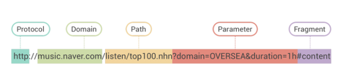


---
## 2. 타입 힌트 기초
> FastAPI는 **Python 타입 힌트**를 읽어 자동으로 검증/문서화한다.

```python
from typing import Optional

@app.get("/items/{item_id}")
def get_item(
    item_id: int,                    # int만 허용
    q: Optional[str] = None,        # 선택적 문자열
    active: bool = True,            # 불리언 기본값
):
    return {
        "item_id": item_id,
        "q": q,
        "active": active,
    }
```

---
| 타입 | 허용값 예시 |
|------|------------|
| `int` | `1`, `42`, `100` |
| `float` | `3.14`, `1.0` |
| `str` | `"hello"`, `"world"` |
| `bool` | `true`, `false`, `1`, `0`, `on`, `off` |
| `Optional[str]` | `"hello"` 또는 `None` |

---
## 3. 응답 모델 (Response Model) - [Pydantic](https://pydantic.dev/docs/validation/latest/get-started/)
- Pydantic(파이댄틱)은 파이썬(Python) 타입 힌트를 활용하여 데이터 유효성 검사(Validation) 와 설정 관리(Settings Management) 를 수행하는 핵심 라이브러리입니다.
- 개발자가 정의한 데이터 구조와 타입에 맞춰 외부의 불완전한 데이터를 검증하고, 파이썬 객체로 안전하게 변환(파싱)해 주는 역할을 합니다.

---
### 왜 필요한가?

```python
from pydantic import BaseModel

# 응답 모델 없이 반환하면 모든 필드가 노출됨
class User(BaseModel):
    id: int
    name: str
    email: str
    password: str   # ← 절대 노출되면 안 됨!

@app.get("/users/{user_id}")
def get_user(user_id: int):
    return {"id": 1, "name": "홍길동", "email": "hong@ex.com", "password": "secret"}
    # password가 그대로 응답에 포함됨!!
```

---
### response_model로 응답 필드 제한

```python
from pydantic import BaseModel

class UserCreate(BaseModel):
    name: str
    email: str
    password: str   # 입력 시 필요

class UserResponse(BaseModel):
    id: int
    name: str
    email: str
    # password 없음! ← 응답에서 제외

@app.get("/users/{user_id}", response_model=UserResponse)
def get_user(user_id: int):
    # password가 있어도 응답 모델이 걸러줌
    return {"id": 1, "name": "홍길동", "email": "hong@ex.com", "password": "secret"}
```

---
## [4. HTTP 상태 코드](https://developer.mozilla.org/ko/docs/Web/HTTP/Reference/Status)
> 서버가 클라이언트에게 **"결과가 어떻게 됐는지"** 알려주는 숫자 코드

---
### 2xx — 성공

| 코드 | 이름 | 언제 사용 |
|------|------|----------|
| **200** | OK | 일반적인 성공 (GET, PUT, PATCH) |
| **201** | Created | 리소스 생성 성공 (POST) |
| **204** | No Content | 성공했지만 응답 본문 없음 (DELETE) |

---
### 4xx — 클라이언트 오류

| 코드 | 이름 | 언제 사용 |
|------|------|----------|
| **400** | Bad Request | 잘못된 요청 (형식 오류, 비즈니스 로직 위반) |
| **401** | Unauthorized | 인증 필요 |
| **403** | Forbidden | 권한 없음 |
| **404** | Not Found | 리소스 없음 |
| **422** | Unprocessable Entity | 데이터 검증 실패 (FastAPI 기본) |

---
### 5xx — 서버 오류

| 코드 | 이름 | 언제 사용 |
|------|------|----------|
| **500** | Internal Server Error | 서버 내부 오류 |
| **503** | Service Unavailable | 서버 일시 중단 |

---
## 5. 서버 실행 및 Swagger 실습

---
### 가상환경 생성
```bash
# pyproject.toml과 uv.lock 기준으로 의존성 설치
uv sync
```

### 서버 실행

```bash
python -m uvicorn main:app --reload --port 8001
```

---
### Swagger UI 실습 (http://localhost:8001/docs)

> 각 API에서 **Try it out**을 누른 뒤 아래 순서대로 입력합니다.

---
#### 실습 1. 전체 아이템 목록 조회
> `GET /items`

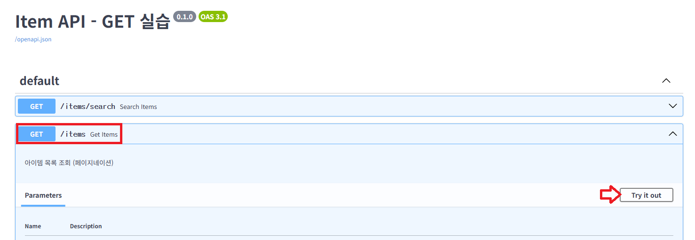

---
```python
@app.get("/items", response_model=List[ItemResponse])
def get_items(skip: int = 0, limit: int = 10):
    """아이템 목록 조회 (페이지네이션)"""
    ...
```
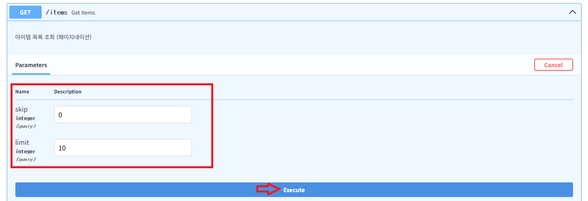

---
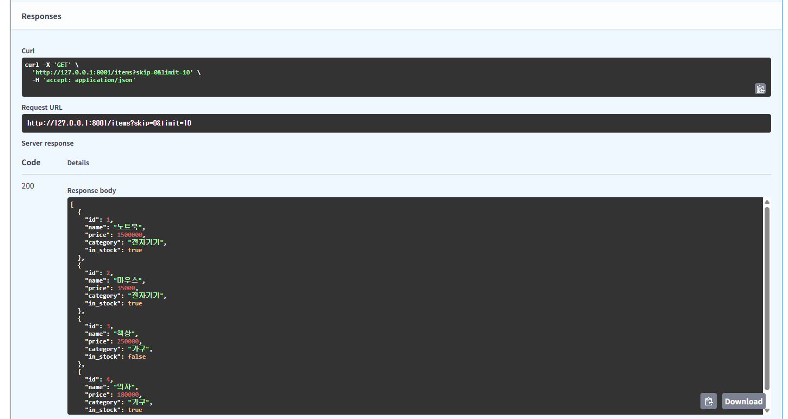

---
#### 실습 2. 페이지네이션으로 일부만 조회
> `GET /items`

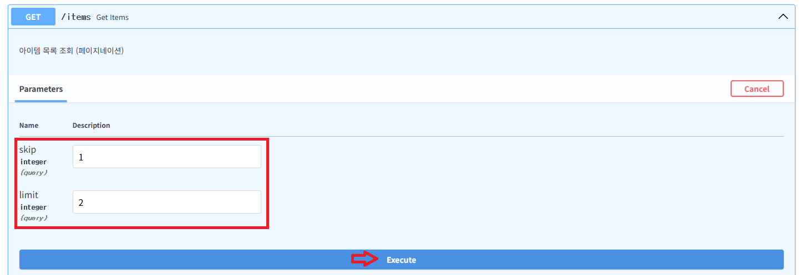

---
> 확인할 것
> - 첫 번째 아이템을 건너뛰고 2개만 조회합니다.
> - 응답에는 `마우스`, `책상`만 포함됩니다.

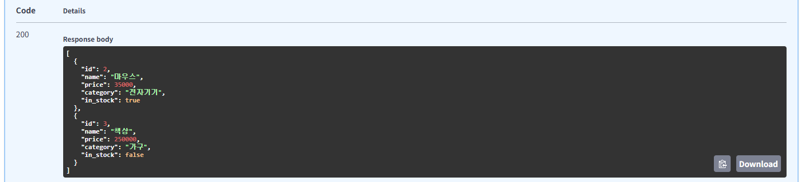

---
#### 실습 3. Path Parameter로 단건 조회
> `GET /items/{item_id}`

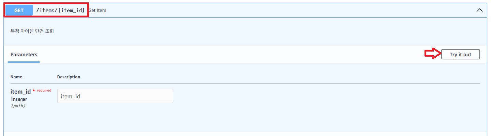

---
```python
@app.get("/items/{item_id}", response_model=ItemResponse)
def get_item(item_id: int):
    """특정 아이템 단건 조회"""
    ...
```
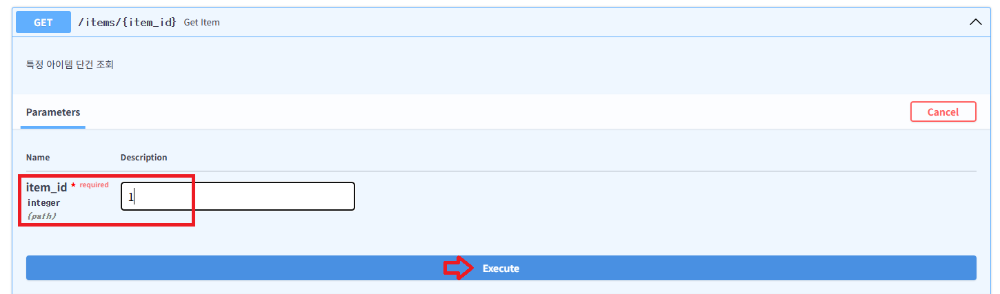

---
> `response_model=ItemResponse`에 정의된 필드만 응답됩니다.
```python
class ItemResponse(BaseModel):
    id: int
    name: str
    price: float
    category: str
    in_stock: bool
```
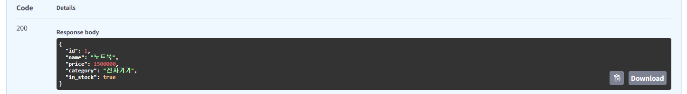

---
#### 실습 4. 존재하지 않는 아이템 조회
> `GET /items/{item_id}`

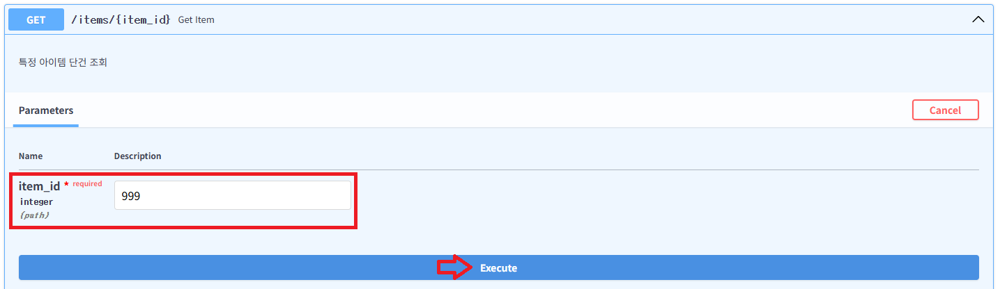

---
```python
@app.get("/items/{item_id}", response_model=ItemResponse)
def get_item(item_id: int):
    """특정 아이템 단건 조회"""
    if item_id not in fake_db:
        raise HTTPException(status_code=404, detail=f"Item {item_id} not found")
    return fake_db[item_id]
```
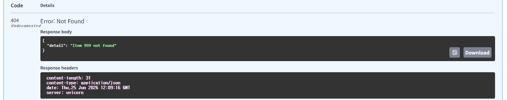

---
#### 실습 5. Path Parameter 타입 검증 확인
> `GET /items/{item_id}`

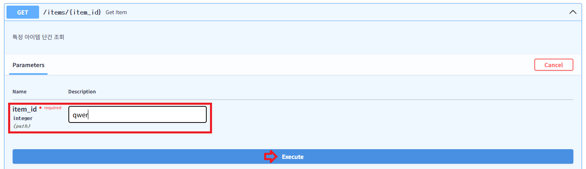

---
```python
@app.get("/items/{item_id}", response_model=ItemResponse)
def get_item(item_id: int):
    """특정 아이템 단건 조회"""
    ...
```
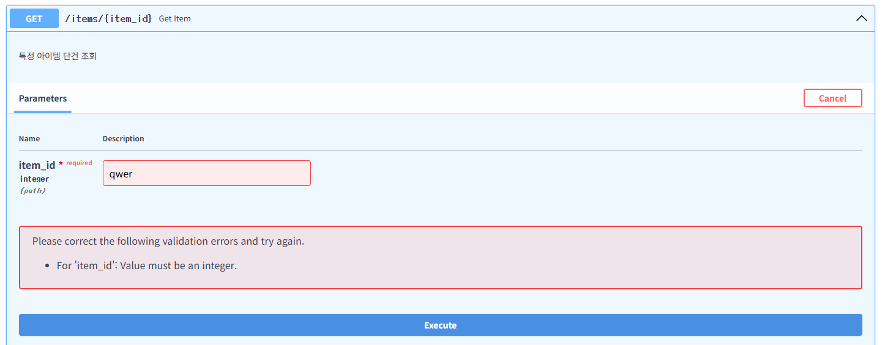

---
#### 실습 6. 키워드로 아이템 검색
> `GET /items/search`

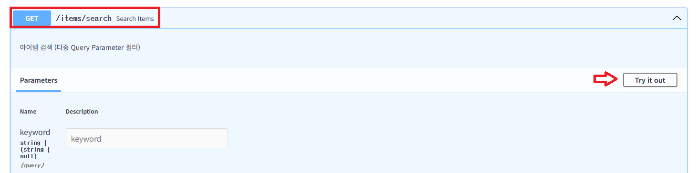

---
```python
@app.get("/items/search", response_model=List[ItemResponse])
def search_items(
    keyword: Optional[str] = None,
    category: Optional[str] = None,
    in_stock: Optional[bool] = None,
    min_price: Optional[float] = None,
    max_price: Optional[float] = None,
):
    """아이템 검색 (다중 Query Parameter 필터)"""
    results = list(fake_db.values())

    ...
```

---
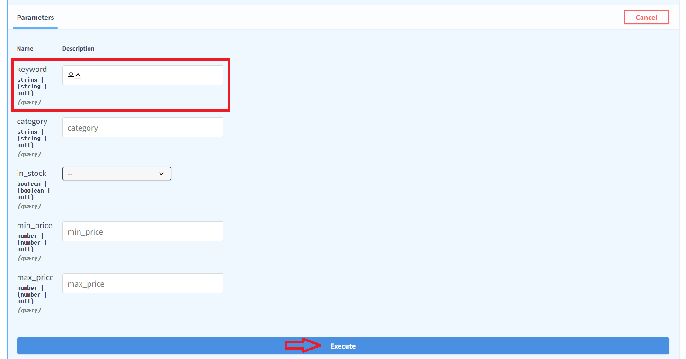

---
- `keyword` 값이 이름에 포함된 아이템만 조회됩니다.
- 응답에는 `마우스`가 포함됩니다.

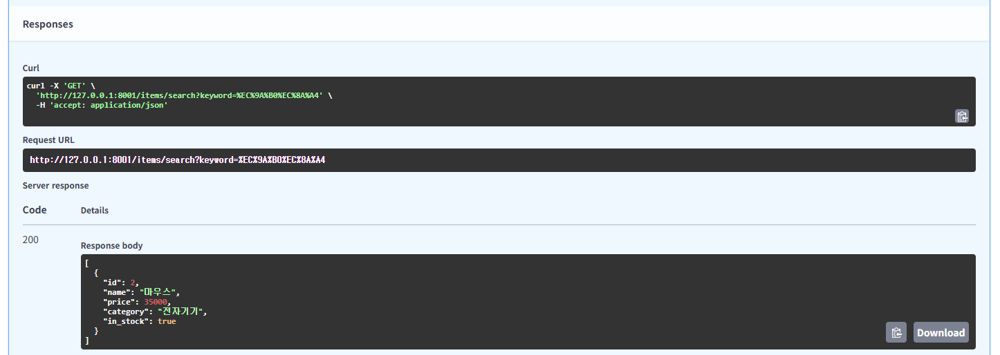

---
#### 실습 7. 카테고리와 재고 상태로 필터링
> `GET /items/search`

---
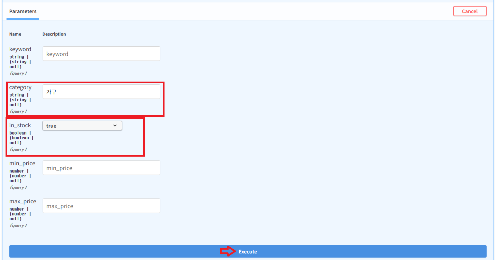

---
- `category`가 `가구`인 아이템 중 재고가 있는 것만 조회합니다.
- `책상`은 `in_stock=false`이므로 제외되고, `의자`만 응답됩니다.

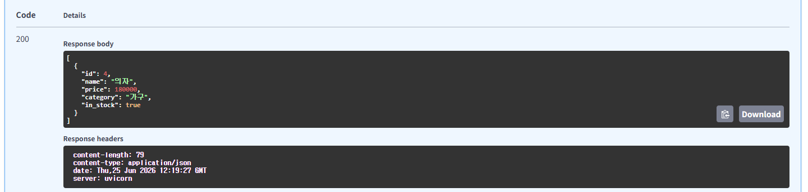

---
#### 실습 8. 가격 범위로 검색
> `GET /items/search`

---
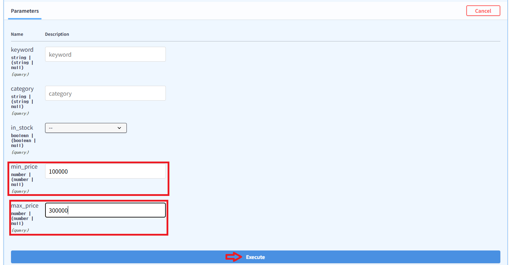

---
- 가격이 100,000원 이상 300,000원 이하인 아이템만 조회합니다.
- 응답에는 `책상`, `의자`가 포함됩니다.

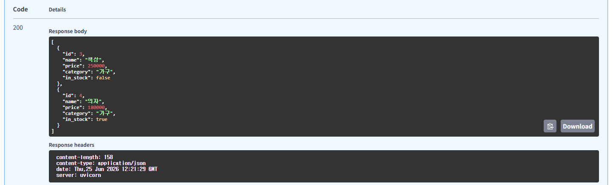

---
#### 실습 9. 검색 결과가 없는 경우
> `GET /items/search`

---
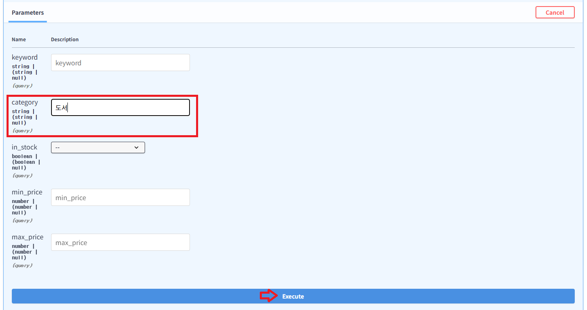

---
- 검색 API는 조건에 맞는 데이터가 없으면 빈 배열을 반환합니다.

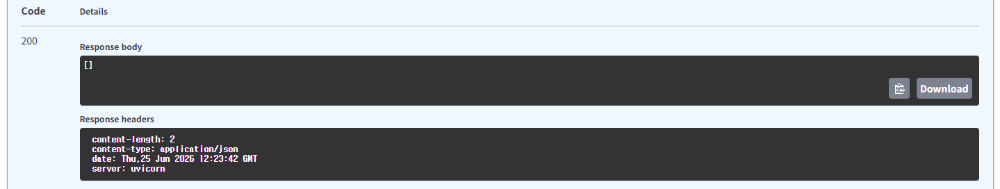

