# POST 엔드포인트 구현
- 데이터를 **Request Body에 포함**
- **생성 / 처리** 목적
- URL에 데이터가 노출되지 않음
- 데이터 크기 제한 없음
- 민감한 정보 전송 가능

---
## GET vs POST

| 항목 | GET | POST |
|------|-----|------|
| 데이터 위치 | URL Query String | Request Body |
| 데이터 크기 | 제한 있음 | 제한 없음 |
| 보안 | URL에 노출 | Body에 숨김 |
| 캐싱 | 가능 | 불가 |
| 목적 | 조회 | 생성/처리 |

---
## 1. Request Body와 Pydantic BaseModel

> POST는 데이터를 URL이 아닌 Body에 담습니다.
> FastAPI에서는 Pydantic BaseModel이 이 Body를 자동으로 받아 검증합니다.

```shell
POST /items HTTP/1.1
Content-Type: application/json

{
    "name": "키보드",
    "price": 89000,
    "category": "전자기기"
}
```

---
### BaseModel로 Body 스키마 정의

```python
from pydantic import BaseModel

class ItemCreate(BaseModel):
    name: str
    price: float
    category: str
    in_stock: bool = True   # 기본값 있는 선택 필드
```

---
```python
@app.post("/items")
def create_item(item: ItemCreate):
    #            ↑↑↑↑
    #   Body 데이터 자동 파싱 + 검증
    return item
```

FastAPI가 자동으로 처리하는 것:
- JSON → Python 객체 변환
- 타입 검증 (price에 문자열이 오면 422 반환)
- 필수 필드 누락 시 422 반환
- Swagger UI에 Body 스키마 자동 문서화

---
## 2. Field로 유효성 규칙 추가

---
### 기본 Field 사용법

```python
from pydantic import BaseModel, Field

class ItemCreate(BaseModel):
    name: str = Field(
        min_length=1,
        max_length=100,
        description="아이템 이름",
        examples=["노트북"],
    )
    price: float = Field(
        gt=0,                     # greater than 0 (0 초과)
        description="가격 (0보다 커야 함)",
        examples=[15000],
    )
    in_stock: bool = Field(
        default=True,
        description="재고 여부",
    )
```

---
### 주요 Field 검증 옵션

| 옵션 | 적용 타입 | 의미 |
|------|----------|------|
| `min_length` | str | 최소 길이 |
| `max_length` | str | 최대 길이 |
| `pattern` | str | 정규표현식 패턴 |
| `gt` | int/float | 초과 (greater than) |
| `ge` | int/float | 이상 (greater or equal) |
| `lt` | int/float | 미만 (less than) |
| `le` | int/float | 이하 (less or equal) |
| `default` | 모든 타입 | 기본값 |

---
### 이메일 검증
```python
from pydantic import BaseModel, EmailStr

# pip install pydantic[email] 필요
class UserCreate(BaseModel):
    name: str
    email: EmailStr   # 이메일 형식 자동 검증
    password: str = Field(min_length=8)
```

---
## 3. 입력/출력 스키마 분리

입력(요청)과 출력(응답)에 필요한 필드가 다른 경우 스키마를 분리한다.

```python
# 입력 스키마 (클라이언트 → 서버)
class ItemCreate(BaseModel):
    name: str = Field(min_length=1, max_length=100)
    price: float = Field(gt=0)
    category: str
    in_stock: bool = True

# 출력 스키마 (서버 → 클라이언트)
class ItemResponse(BaseModel):
    id: int              # 서버가 생성
    name: str
    price: float
    category: str
    in_stock: bool
    created_at: datetime  # 서버가 생성
```

---
## 4. 422 에러 응답 분석

```json
{
    "detail": [
        {
            "type": "missing",
            "loc": ["body", "name"],
            "msg": "Field required",
            "input": {"price": 100}
        },
        ...
    ]
}
```
- `loc` : 오류 위치 (`body` → `필드명`)
- `type` : 오류 종류
- `msg` : 오류 메시지

---
## 5. 서버 실행 및 Swagger 실습

---
### 가상환경 생성
```bash
# pyproject.toml과 uv.lock 기준으로 의존성 설치
uv sync
```

### 서버 실행

```bash
python -m uvicorn main:app --reload --port 8001
```

---
### Swagger UI 실습 (http://localhost:8001/docs)
> 각 API에서 **Try it out**을 누른 뒤 아래 순서대로 입력합니다.
---
#### 실습 1. 아이템 생성
> `POST /items`

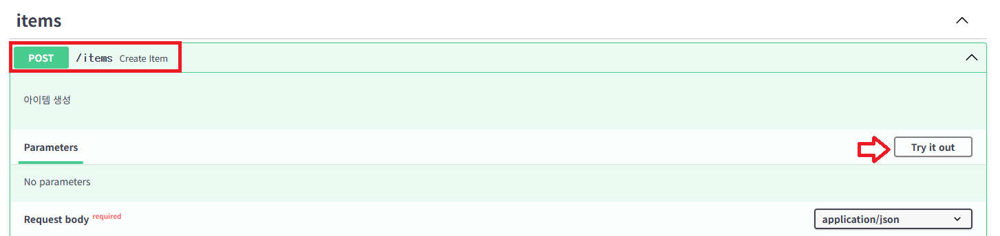

---
```json
{
    "name": "키보드",
    "price": 89000,
    "category": "전자기기",
    "in_stock": true
}
```
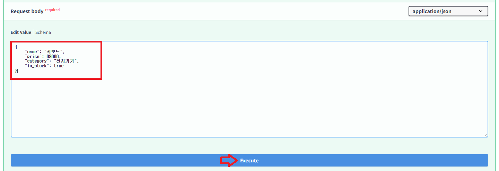

---
확인할 것
- 응답 상태 코드가 `201 Created`입니다.
- 응답은 `response_model=ItemResponse`에 정의된 필드만 포함합니다.
```python
@app.post("/items", response_model=ItemResponse, status_code=201, tags=["items"])
def create_item(item: ItemCreate):
    """아이템 생성"""
    ...
```
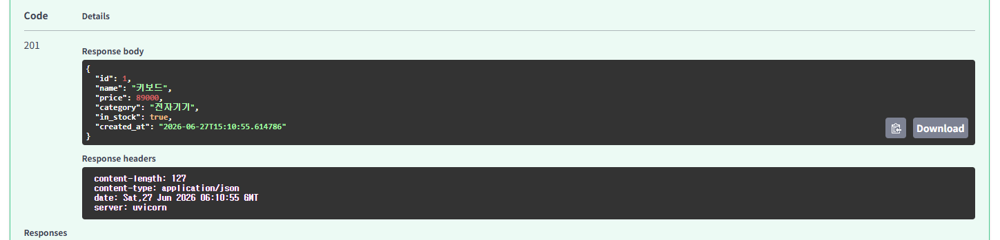

---
#### 실습 2. 기본값이 적용되는 아이템 생성
> `POST /items`

```json
{
    "name": "마우스",
    "price": 35000,
    "category": "전자기기"
}
```

---
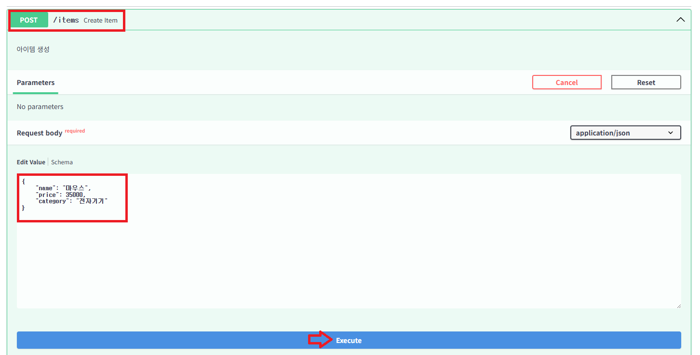

---
확인할 것
- 요청 Body에서 `in_stock`을 생략해도 응답에는 `true`로 들어갑니다.
- `Field(default=True)`가 Body 기본값을 만들어 줍니다.
```python
class ItemCreate(BaseModel):
    name: str = Field(min_length=1, max_length=100, description="아이템 이름")
    price: float = Field(gt=0, description="가격 (0 초과)")
    category: str = Field(min_length=1, description="카테고리")
    in_stock: bool = Field(default=True, description="재고 여부")
```

---
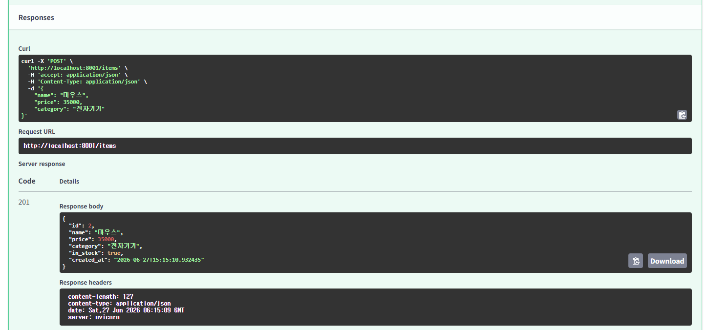

---
#### 실습 3. 아이템 Body 검증 실패 확인
> `POST /items`

```json
{
    "name": "",
    "price": 0,
    "category": ""
}
```

---
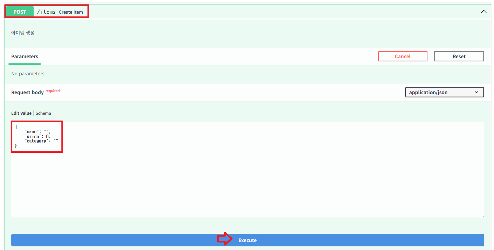

---
확인할 것
- 응답 상태 코드가 `422 Unprocessable Entity`입니다.
- `detail` 배열의 `loc`에서 어떤 Body 필드가 실패했는지 확인합니다.
- `name`, `category`는 최소 길이 규칙을, `price`는 `gt=0` 규칙을 통과하지 못합니다.

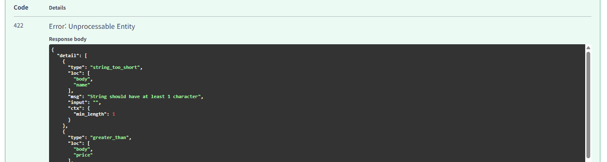

---
#### 실습 4. 중복 아이템 생성 오류 확인
> `POST /items`

실습 1에서 만든 `키보드`를 다시 생성합니다.

```json
{
    "name": "키보드",
    "price": 89000,
    "category": "전자기기",
    "in_stock": true
}
```

---
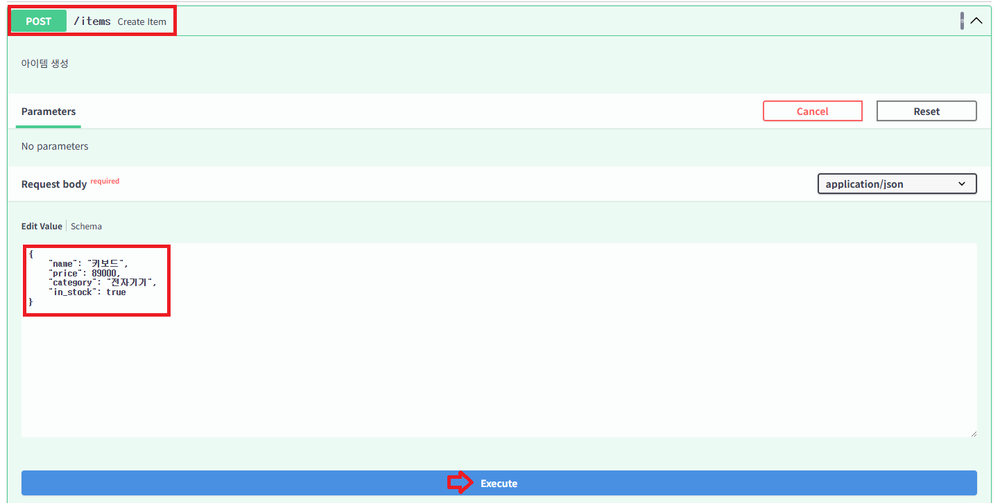

---
확인할 것
- 응답 상태 코드가 `400 Bad Request`입니다.
- 타입 검증은 통과했지만, 서버의 비즈니스 규칙에서 중복 이름을 거절합니다.
```python
for existing in items_db.values():
    if existing["name"] == item.name:
        raise HTTPException(
            status_code=400,
            detail=f"'{item.name}' 이름의 아이템이 이미 존재합니다",
        )
```
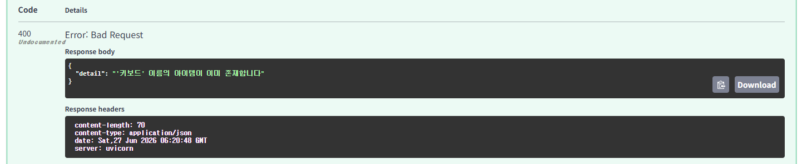

---
#### 실습 5. 유저 등록
> `POST /users`

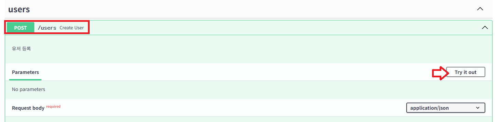

---
```json
{
    "name": "홍길동",
    "email": "hong@example.com",
    "password": "password123",
    "age": 30
}
```
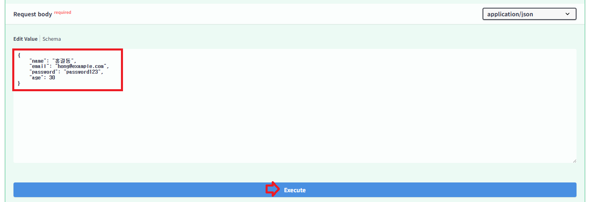

---
확인할 것
- 응답 상태 코드가 `201 Created`입니다.
- 요청에는 `password`가 있었지만 응답에는 `password`, `password_hash`가 없습니다.
- 입력 스키마 `UserCreate`와 출력 스키마 `UserResponse`를 분리했기 때문입니다.
```python
@app.post("/users", response_model=UserResponse, status_code=201, tags=["users"])
def create_user(user: UserCreate):
    """유저 등록"""
    ...
```
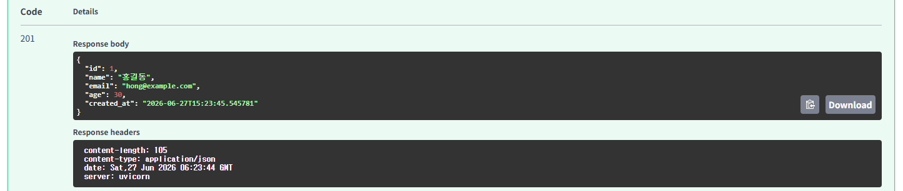

---
#### 실습 6. 유저 Body 검증 실패 확인
> `POST /users`

```json
{
    "name": "김",
    "email": "not-email",
    "password": "1234",
    "age": 200
}
```

---
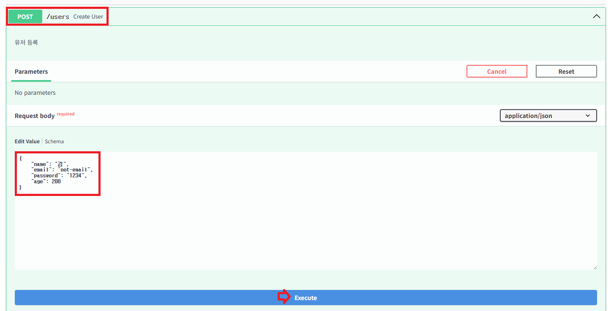

---
확인할 것
- 응답 상태 코드가 `422 Unprocessable Entity`입니다.
- `name`, `email`, `password`, `age`가 각각 어떤 규칙을 위반했는지 `detail`에서 확인합니다.
```python
class UserCreate(BaseModel):
    name: str = Field(min_length=2, max_length=50, description="이름 (2~50자)")
    email: EmailStr = Field(description="이메일 주소")
    password: str = Field(min_length=8, description="비밀번호 (8자 이상)")
    age: Optional[int] = Field(default=None, ge=0, le=150, description="나이")
```

---
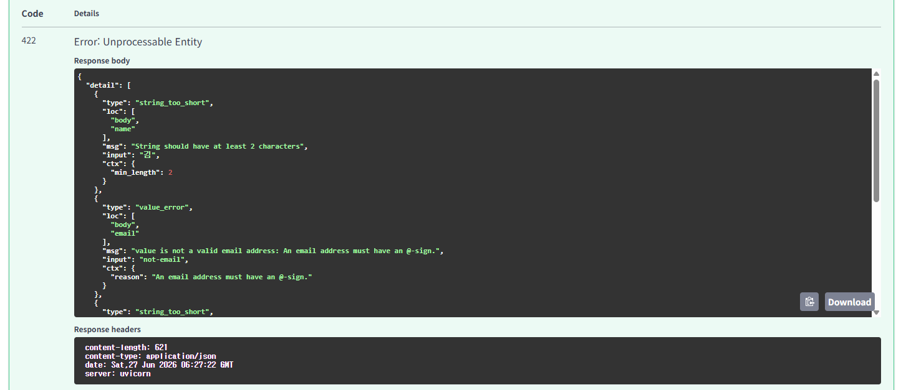

---
#### 실습 7. 중복 이메일 등록 오류 확인
> `POST /users`

실습 5에서 사용한 이메일을 다시 사용합니다.

```json
{
    "name": "김철수",
    "email": "hong@example.com",
    "password": "password456",
    "age": 25
}
```

---
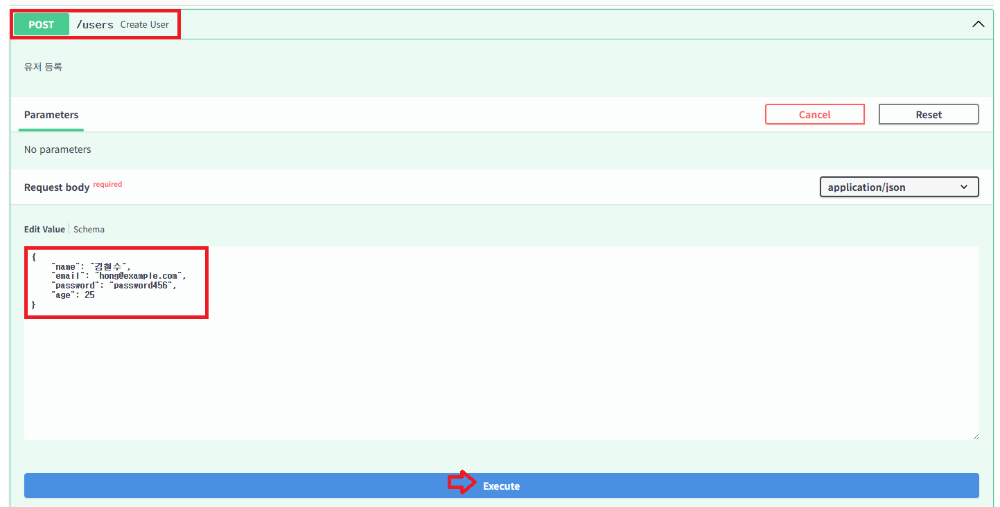

---
확인할 것
- 응답 상태 코드가 `400 Bad Request`입니다.
- 이메일 형식과 비밀번호 길이는 통과했지만, 이미 등록된 이메일이라서 거절됩니다.
```python
for existing in users_db.values():
    if existing["email"] == user.email:
        raise HTTPException(status_code=400, detail="이미 등록된 이메일입니다")
```
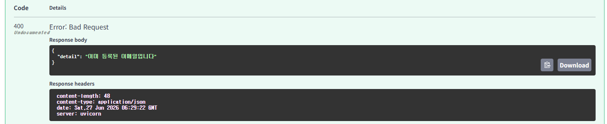

---
#### 실습 8. 로그인 성공
> `POST /login`

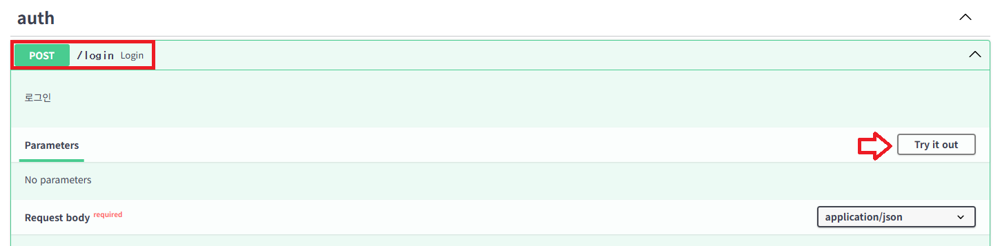

---
실습 5에서 등록한 이메일과 비밀번호를 사용합니다.

```json
{
    "email": "hong@example.com",
    "password": "password123"
}
```
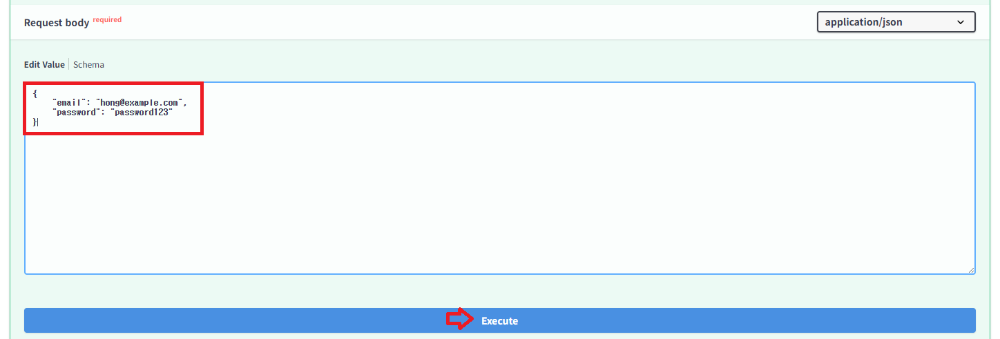

---
확인할 것
- 응답 상태 코드가 `200 OK`입니다.
- 서버는 저장된 `password_hash`와 요청으로 들어온 `password`를 비교합니다.
```python
@app.post("/login", response_model=LoginResponse, tags=["auth"])
def login(credentials: LoginRequest):
    """로그인"""
    ...
```
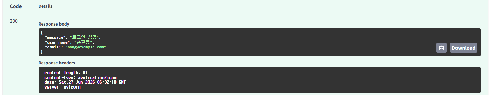

---
#### 실습 9. 로그인 실패
> `POST /login`

비밀번호를 일부러 틀리게 입력합니다.

```json
{
    "email": "hong@example.com",
    "password": "wrong-password"
}
```

---
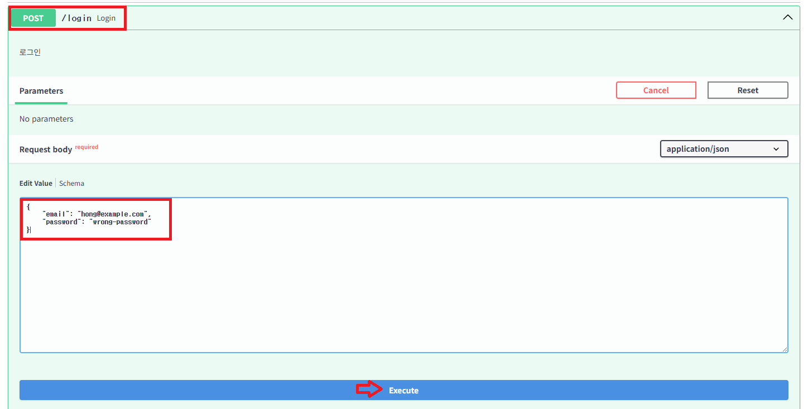

---
확인할 것
- 응답 상태 코드가 `401 Unauthorized`입니다.
- 존재하지 않는 이메일과 틀린 비밀번호 모두 같은 메시지를 반환합니다.
```python
if not found_user:
    raise HTTPException(status_code=401, detail="이메일 또는 비밀번호가 올바르지 않습니다")
if not verify_password(credentials.password, found_user["password_hash"]):
    raise HTTPException(status_code=401, detail="이메일 또는 비밀번호가 올바르지 않습니다")
```

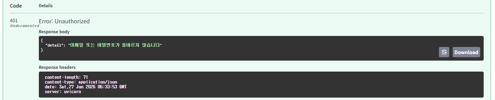

