# 프로젝트 구조화 & 종합 실습

---
## 핵심 요약

| 개념 | 설명 |
|------|------|
| `APIRouter` | 엔드포인트를 모듈별로 분리 |
| `prefix` | 라우터 내 모든 경로에 공통 접두사 추가 |
| `tags` | Swagger UI 그룹화 |
| `include_router` | 메인 앱에 라우터 등록 |
| `Depends` | 공통 로직 재사용 (의존성 주입) |

---
## 1. APIRouter — 엔드포인트 분리

---
### 왜 분리하는가?

```python
# main.py가 커질수록 관리가 힘들어짐
app = FastAPI()

@app.get("/users")
@app.get("/users/{id}")
@app.post("/users")
@app.get("/items")
@app.get("/items/{id}")
@app.post("/items")
@app.get("/orders")

# ... 수십 개의 엔드포인트가 한 파일에
```

---
### APIRouter로 분리

```python
# routers/item.py
from fastapi import APIRouter

router = APIRouter(
    prefix="/items",       # 모든 경로에 /items 자동 추가
    tags=["items"],        # Swagger UI 그룹 이름
)

@router.get("")            # → /items
def get_items(): ...

@router.get("/{item_id}") # → /items/{item_id}
def get_item(item_id: int): ...

@router.post("")           # → /items
def create_item(): ...
```

---
> routers 코드 import

```python
# main.py
from fastapi import FastAPI
from routers import item, user

app = FastAPI()

app.include_router(item.router)
app.include_router(user.router)
```

---
## 2. 의존성 주입 (Dependency Injection) 맛보기

---
### 공통 Query Parameter 재사용

```python
from fastapi import Depends

# 공통 페이지네이션 파라미터
def pagination(skip: int = 0, limit: int = 10):
    return {"skip": skip, "limit": limit}


@app.get("/items")
def get_items(page: dict = Depends(pagination)):
    # page = {"skip": 0, "limit": 10}
    ...

@app.get("/users")
def get_users(page: dict = Depends(pagination)):
    # 같은 파라미터를 중복 정의하지 않아도 됨
    ...
```

---
### 간단한 인증 헤더 검사

```python
from fastapi import Depends, HTTPException, Header
from typing import Optional

def verify_token(x_token: Optional[str] = Header(default=None)):
    if x_token != "secret-token":
        raise HTTPException(status_code=401, detail="Invalid token")
    return x_token


# 특정 엔드포인트에만 인증 적용
@app.post("/admin/items", dependencies=[Depends(verify_token)])
def admin_create_item(item: ItemCreate):
    ...
```

---
## 3. 종합 실습 — Todo API 완성

---
### 프로젝트 구조

```
todo_api/
├── main.py
├── routers/
│   └── todo.py
├── models/
│   └── todo.py
└── schemas/
    └── todo.py
```

---
> 각 레이어의 역할:

| 레이어 | 파일 | 역할 |
|--------|------|------|
| 진입점 | `main.py` | 앱 생성, 라우터 등록 |
| 라우터 | `routers/todo.py` | HTTP 엔드포인트 정의 |
| 스키마 | `schemas/todo.py` | 입출력 데이터 구조 |
| 모델 | `models/todo.py` | 데이터 저장/조회 로직 |

---
### 3-1. 스키마 정의

```python
# schemas/todo.py

from pydantic import BaseModel, Field
from typing import Optional
from datetime import datetime


class TodoCreate(BaseModel):
    title: str = Field(min_length=1, max_length=200, description="할 일 제목")
    description: Optional[str] = Field(default=None, max_length=1000, description="상세 설명")
    priority: int = Field(default=2, ge=1, le=3, description="우선순위 (1=높음, 2=보통, 3=낮음)")

...
```

---
### 3-2. 데이터 모델 (인메모리)

```python
# models/todo.py

from datetime import datetime


class TodoDB:
    def __init__(self):
        self._data: dict[int, dict] = {}
        self._next_id = 1

    def create(self, title: str, description: str | None, priority: int) -> dict:
        todo = {
            "id": self._next_id,
            "title": title,
            "description": description,
            "priority": priority,
            "completed": False,
            "created_at": datetime.now(),
        }
        self._data[self._next_id] = todo
        self._next_id += 1
        return todo

...
```

---
### 3-3. 라우터 구현

```python
# routers/todo.py

from fastapi import APIRouter, HTTPException
from schemas.todo import TodoCreate, TodoResponse, TodoListResponse
from models.todo import todo_db

router = APIRouter(
    prefix="/todos",
    tags=["todos"],
)


@router.get("", response_model=TodoListResponse)
def get_todos(skip: int = 0, limit: int = 10):
    """할 일 목록 조회 (페이지네이션)"""
    return TodoListResponse(
        total=todo_db.count(),
        items=todo_db.get_all(skip=skip, limit=limit),
    )

...
```

---
### 3-4. 메인 앱

```python
# main.py

from fastapi import FastAPI
from routers.todo import router as todo_router

app = FastAPI(
    title="Todo API",
    description="FastAPI 입문 강의 종합 실습 프로젝트",
    version="1.0.0",
)

app.include_router(todo_router)


@app.get("/", tags=["root"])
def read_root():
    return {
        "message": "Todo API에 오신 것을 환영합니다!",
        "docs": "/docs",
        "endpoints": {
            "목록 조회": "GET /todos",
            "단건 조회": "GET /todos/{id}",
            "생성": "POST /todos",
        },
    }
```

---
### 3-5. 서버 실행 및 Swagger 실습

#### 가상환경 생성
```bash
# pyproject.toml과 uv.lock 기준으로 의존성 설치
uv sync
```

#### 서버 실행

```bash
python -m uvicorn main:app --reload --port 8001
```

---
#### Swagger UI 실습 (http://localhost:8001/docs)
> 각 API에서 **Try it out**을 누른 뒤 아래 순서대로 입력합니다.

---
##### 실습 1. 루트 엔드포인트에서 API 안내 확인
> `GET /`

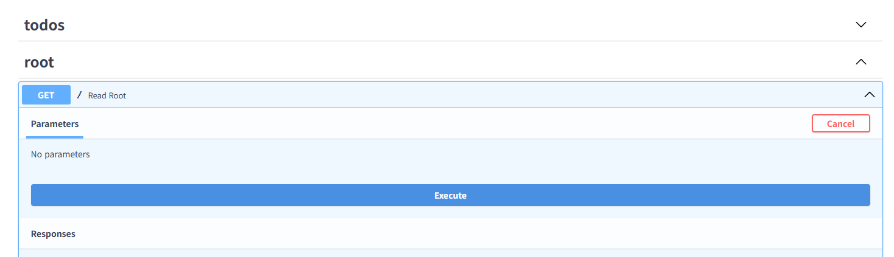

---
확인할 것
- Swagger UI에서 `root` 그룹과 `todos` 그룹이 분리되어 보입니다.
- 루트 응답에는 Todo API에서 사용할 주요 엔드포인트가 안내됩니다.
- `todos` 그룹은 `main.py`가 아니라 `routers/todo.py`에 정의되어 있습니다.

```python
@app.get("/", tags=["root"])
def read_root():
    return {
        "message": "Todo API에 오신 것을 환영합니다!",
        "docs": "/docs",
        "endpoints": {
            "목록 조회": "GET /todos",
            "단건 조회": "GET /todos/{id}",
            "생성": "POST /todos",
        },
    }
```

---
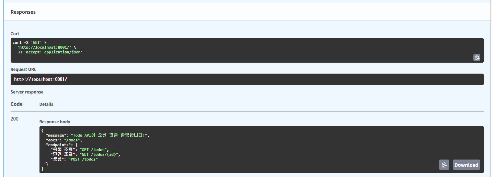

---
##### 실습 2. 비어 있는 Todo 목록 조회
> `GET /todos`

`skip`과 `limit`은 기본값 그대로 실행합니다.

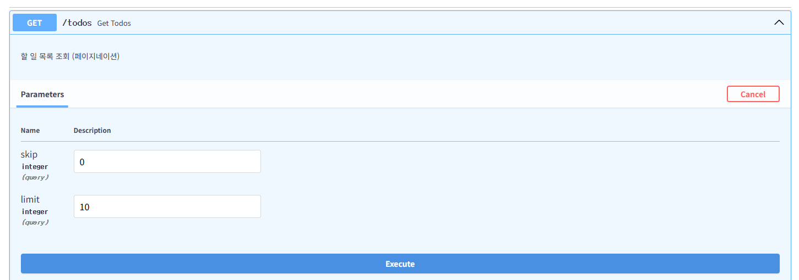

---
확인할 것
- 응답 상태 코드가 `200 OK`입니다.
- 아직 생성한 Todo가 없으므로 `total`은 `0`, `items`는 빈 배열입니다.
- `response_model=TodoListResponse` 때문에 목록 응답은 `total`과 `items` 구조로 고정됩니다.
```python
@router.get("", response_model=TodoListResponse)
def get_todos(skip: int = 0, limit: int = 10):
    """할 일 목록 조회 (페이지네이션)"""
    return TodoListResponse(
        total=todo_db.count(),
        items=todo_db.get_all(skip=skip, limit=limit),
    )
```

---
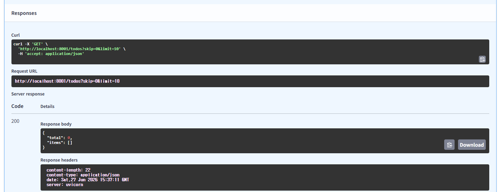

---
##### 실습 3. 첫 번째 Todo 생성
> `POST /todos`

```json
{
    "title": "FastAPI 프로젝트 구조화 복습",
    "description": "main.py, routers, schemas, models 역할 정리하기",
    "priority": 1
}
```

---
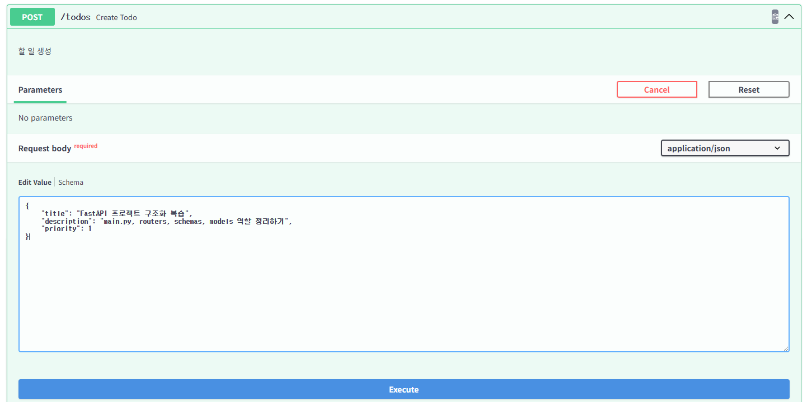

---
확인할 것
- 응답 상태 코드가 `201 Created`입니다.
- 요청 Body에는 없던 `id`, `completed`, `created_at`이 응답에 추가됩니다.
- `completed`는 새 Todo를 만들 때 항상 `false`로 시작합니다.
```python
@router.post("", response_model=TodoResponse, status_code=201)
def create_todo(todo: TodoCreate):
    """할 일 생성"""
    return todo_db.create(
        title=todo.title,
        description=todo.description,
        priority=todo.priority,
    )
```

---
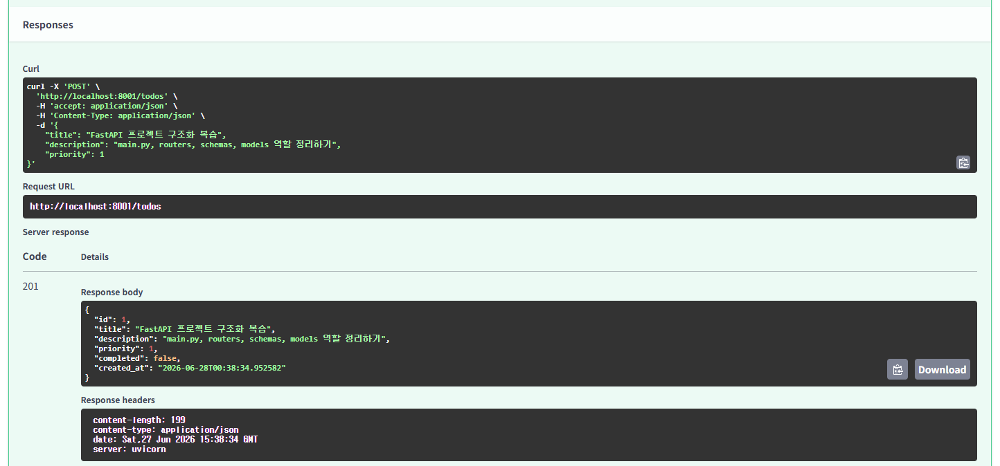

---
##### 실습 4. 기본 우선순위가 적용되는 Todo 생성
> `POST /todos`

`priority`를 생략하고 실행합니다.

```json
{
    "title": "Swagger UI로 API 테스트하기",
    "description": "Try it out으로 요청 Body와 응답 확인하기"
}
```

---
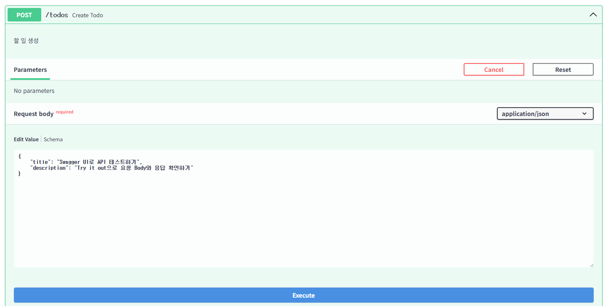

---
확인할 것
- 요청 Body에서 `priority`를 생략해도 응답에는 `2`가 들어갑니다.
- 이 기본값은 `schemas/todo.py`의 `Field(default=2)`에서 만들어집니다.
```python
class TodoCreate(BaseModel):
    title: str = Field(min_length=1, max_length=200, description="할 일 제목")
    description: Optional[str] = Field(default=None, max_length=1000, description="상세 설명")
    priority: int = Field(default=2, ge=1, le=3, description="우선순위 (1=높음, 2=보통, 3=낮음)")
```

---
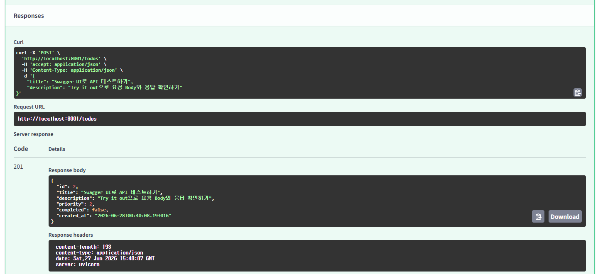

---
##### 실습 5. 설명 없이 Todo 생성
> `POST /todos`

`description`도 생략할 수 있습니다.

```json
{
    "title": "라우터 prefix 확인하기",
    "priority": 3
}
```

---
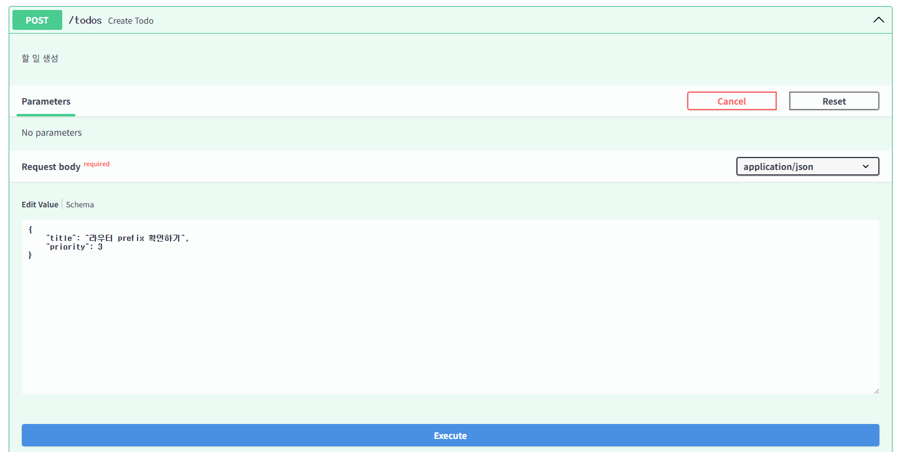

---
확인할 것
- 응답 상태 코드가 `201 Created`입니다.
- `description`은 선택 필드이므로 응답에서 `null`로 표시됩니다.

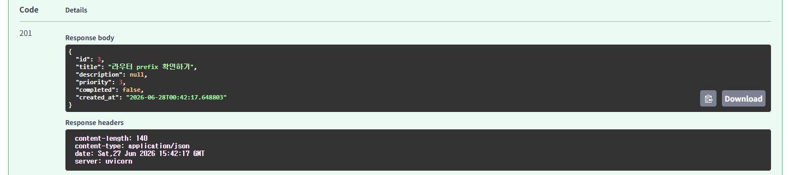

---
##### 실습 6. 생성된 Todo 목록 다시 조회
> `GET /todos`

`skip`과 `limit`은 기본값 그대로 실행합니다.

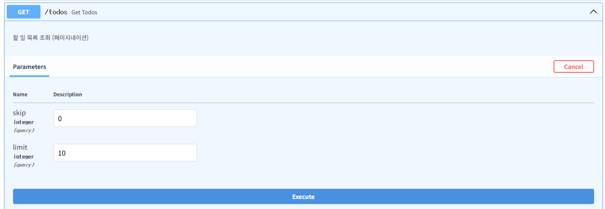

---
> 확인할 것
- `total`은 전체 Todo 개수입니다.
- `items`는 `TodoResponse` 목록이므로 각 Todo에 `id`, `title`, `description`, `priority`, `completed`, `created_at`이 포함됩니다.

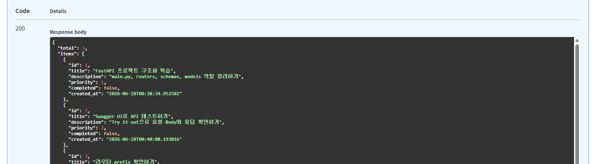

---
##### 실습 7. 페이지네이션으로 일부 Todo만 조회
> `GET /todos`

| Query Parameter | 입력값 |
|-----------------|--------|
| `skip` | `1` |
| `limit` | `1` |

---
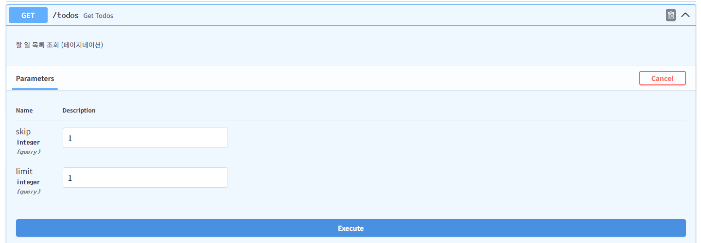

---
확인할 것
- `total`은 전체 개수이므로 그대로 유지됩니다.
- `items`에는 첫 번째 Todo를 건너뛴 뒤 1개만 들어옵니다.
- 페이지네이션 계산은 `models/todo.py`의 `get_all()`에서 처리합니다.
```python
def get_all(self, skip: int = 0, limit: int = 10) -> list[dict]:
    items = list(self._data.values())
    return items[skip : skip + limit]
```

---
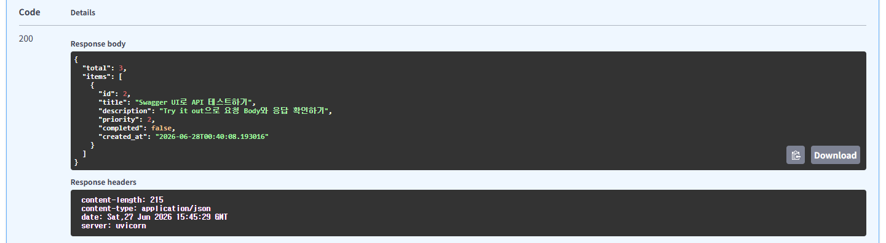

---
##### 실습 8. Path Parameter로 단건 조회
> `GET /todos/{todo_id}`

| Path Parameter | 입력값 |
|----------------|--------|
| `todo_id` | `1` |

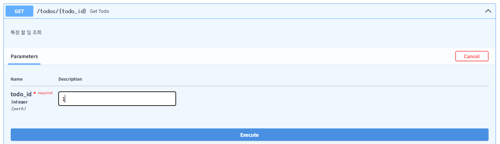

---
확인할 것
- 응답 상태 코드가 `200 OK`입니다.
- `todo_id`는 URL 경로에서 받는 Path Parameter입니다.
- 응답은 `TodoResponse` 스키마에 정의된 필드만 포함합니다.
```python
@router.get("/{todo_id}", response_model=TodoResponse)
def get_todo(todo_id: int):
    """특정 할 일 조회"""
    todo = todo_db.get_by_id(todo_id)
    if not todo:
        raise HTTPException(status_code=404, detail=f"Todo {todo_id} not found")
    return todo
```

---
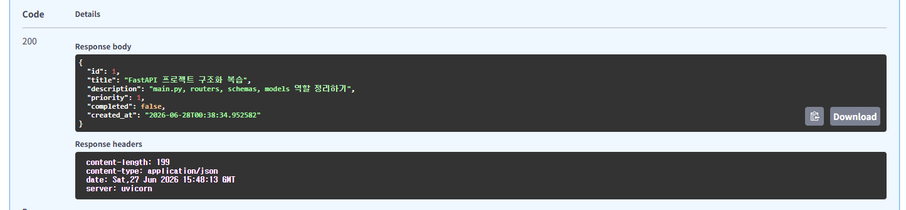

---
##### 실습 9. 존재하지 않는 Todo 조회
> `GET /todos/{todo_id}`

| Path Parameter | 입력값 |
|----------------|--------|
| `todo_id` | `999` |

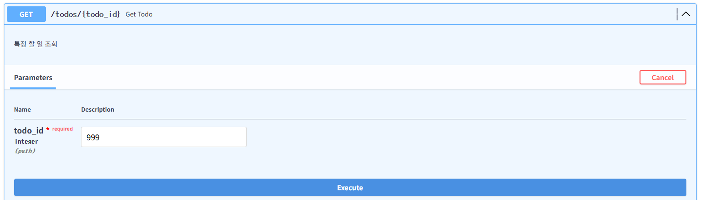

---
확인할 것
- 응답 상태 코드가 `404 Not Found`입니다.
- Path Parameter 타입은 맞지만, 메모리 DB에 해당 ID가 없어서 라우터에서 직접 예외를 발생시킵니다.

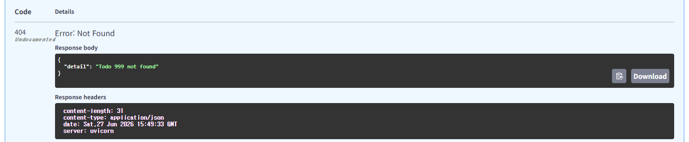

---
##### 실습 10. Todo Body 검증 실패 확인
> `POST /todos`

```json
{
    "title": "",
    "description": "priority는 1, 2, 3 중 하나여야 합니다.",
    "priority": 5
}
```

---
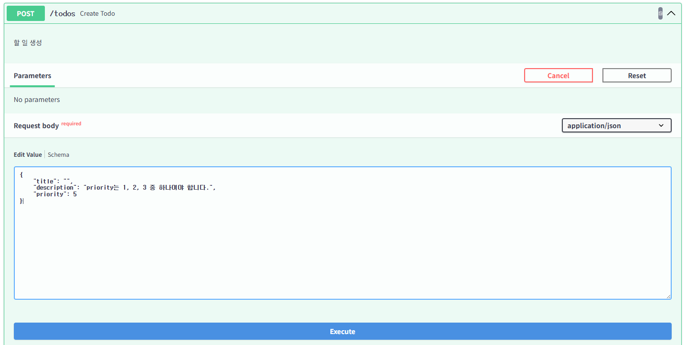

---
확인할 것
- 응답 상태 코드가 `422 Unprocessable Entity`입니다.
- `title`은 `min_length=1` 규칙을 통과하지 못합니다.
- `priority`는 `ge=1`, `le=3` 범위를 벗어납니다.
- 오류 응답의 `loc`에서 실패한 Body 필드를 확인합니다.

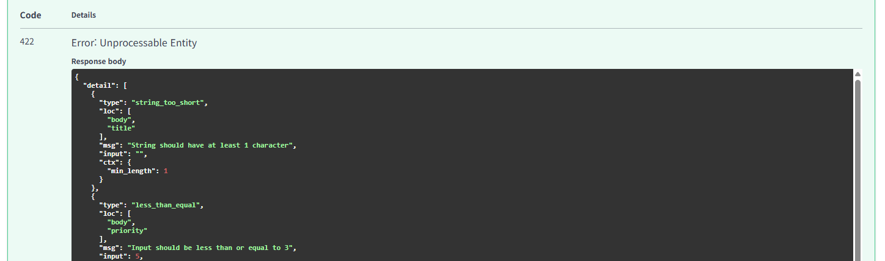

---
##### 실습 11. Path Parameter 타입 검증 실패 확인
> `GET /todos/{todo_id}`

| Path Parameter | 입력값 |
|----------------|--------|
| `todo_id` | `abc` |

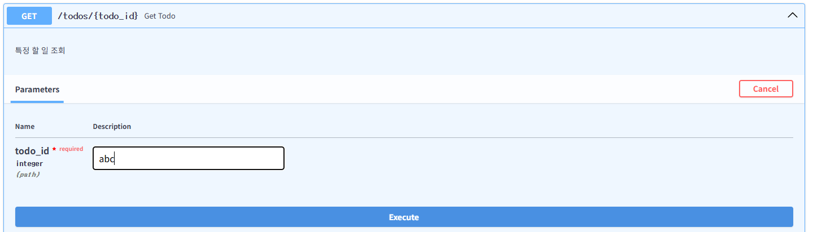

---
확인할 것
- 응답 상태 코드가 `422 Unprocessable Entity`입니다.
- `todo_id`는 `int`로 선언되어 있으므로 문자열 `abc`는 라우터 함수가 실행되기 전에 검증에서 실패합니다.
```python
def get_todo(todo_id: int):
    ...
```
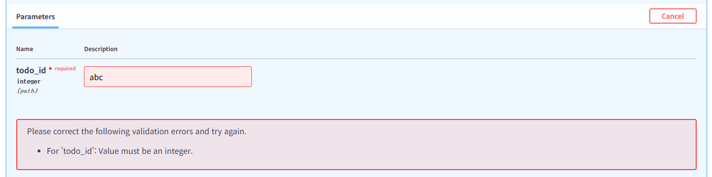
