# SQLite 게시글 CRUD 서비스 구현

---
## 핵심 요약

| 개념 | 설명 |
|------|------|
| `sqlite3` | Python 표준 라이브러리 SQLite 드라이버 |
| `blog.db` | 실행 시 자동 생성되는 SQLite 데이터베이스 파일 |
| `posts` | 게시글을 저장하는 단일 테이블 |
| `sqlite3.Row` | 조회 결과를 dict처럼 다룰 수 있게 해주는 row factory |
| `?` placeholder | SQL에 값을 안전하게 전달하는 방식 |
| `exclude_unset=True` | PATCH 요청에서 보낸 필드만 수정 |

---
## 1. 이전 장과 연결

- `04_프로젝트구조화`에서는 Todo API를 파일별로 나누었습니다.
- 이번 장에서는 같은 구조를 유지하되 저장소만 바꿉니다.

| 이전 장 | 이번 장 |
|--------|---------|
| 인메모리 dict | SQLite 파일 DB |
| Todo 데이터 | 게시글 데이터 |
| 서버 재시작 시 데이터 사라짐 | `blog.db`에 데이터 유지 |
| Python dict 조작 | SQL로 행 생성/조회/수정/삭제 |

---
## 2. 파일 역할

| 파일 | 역할 |
|------|------|
| `main.py` | FastAPI 앱 생성, DB 초기화, 라우터 등록 |
| `schemas/blog.py` | 게시글 요청 및 응답 형식 |
| `models/blog.py` | SQLite 연결, 테이블 생성, CRUD 쿼리 |
| `routers/posts.py` | 게시글 API |

---
## 3. RDB(Relational Database)를 최소한으로 이해하기
> 데이터를 테이블 형태로 저장하고, 테이블 간의 관계(Relation)를 관리하는 데이터베이스

---
### RDB 특징 

| 특징           | 설명                                              |
| ------------ | ----------------------------------------------- |
| 테이블 기반       | 데이터를 행(Row)과 열(Column) 형태로 저장                   |
| 관계(Relation) | 여러 테이블을 연결하여 관리                                 |
| SQL 사용       | `SELECT`, `INSERT`, `UPDATE`, `DELETE` 등 SQL 사용 |
| 데이터 무결성      | 기본키(PK), 외래키(FK), 제약조건으로 데이터의 일관성 유지            |
| 트랜잭션 지원      | 여러 작업을 하나의 작업처럼 안전하게 처리(ACID)                   |

---
### RDBMS 종류 
> RDB는 데이터베이스의 개념이고, `RDBMS(Relational Database Management System)`는 RDB를 생성·관리하는 소프트웨어

| 제품                   | 특징                      |
| -------------------- | ----------------------- |
| SQLite               | 파일 기반, 학습 및 소규모 프로젝트    |
| MySQL                | 가장 널리 사용되는 오픈소스 RDBMS   |
| PostgreSQL           | 기능이 풍부하고 표준 SQL 지원이 뛰어남 |
| Oracle Database      | 대규모 기업용 RDBMS           |
| Microsoft SQL Server | Microsoft의 기업용 RDBMS    |

---
## 4. SQLite를 사용하는 이유
> SQLite는 서버 설치 없이 파일 하나에 데이터를 저장하는 `가벼운 관계형 데이터베이스(RDB)` 입니다.

---
### 인메모리(In-Memory) 저장소의 한계

```python
class TodoDB:
    def __init__(self):
        self._data: dict[int, dict] = {}
```

- 구현이 쉽습니다.
- 하지만 서버를 재시작하면 데이터가 모두 사라집니다.
- 실제 서비스에서 쓰는 DB 흐름을 연습하기 어렵습니다.

---
### SQLite로 바꾸면

```python
DB_PATH = Path(__file__).resolve().parents[1] / "blog.db"

def _connect() -> sqlite3.Connection:
    conn = sqlite3.connect(DB_PATH)
    conn.row_factory = sqlite3.Row
    return conn
```

- 별도 DB 서버 없이 파일 하나로 동작합니다.
- Python 표준 라이브러리라 추가 DB 패키지가 필요 없습니다.
- SQL의 기본 흐름을 가볍게 연습할 수 있습니다.

---
### 인메모리(In-Memory) vs SQLite

| 항목     | 인메모리(In-Memory) | SQLite            |
| ------ | --------------- | ----------------- |
| 저장 위치  | RAM(메모리)        | 디스크(DB 파일)        |
| 데이터 유지 | 프로그램 종료 시 사라짐 | 프로그램 종료 후에도 유지  |
| 속도     | 매우 빠름           | 빠르지만 메모리보다 느림     |
| 서버 설치  | 필요 없음           | 필요 없음             |
| SQL 지원 | 보통 지원하지 않음      | 지원              |
| 용도     | 임시 데이터, 테스트     | 로컬 데이터 저장, 학습용 DB |

---
## 5. 테이블 설계
> 테이블(Table) 이란 같은 종류의 데이터를 행(Row)과 열(Column) 형태로 저장하는 객체입니다.

| 용어 | 의미 | 이번 예제 |
|------|------|-----------|
| 테이블(Table) | 데이터를 담는 표 | `posts` |
| 행(Row) | 실제 데이터 한 건 | 게시글 1개 |
| 열(Column) | 데이터의 속성 | `title`, `content` |
| 기본 키 | 행(Row)을 구분하는 번호 | `id` |

---
### posts

| 컬럼 | 타입 | 설명 |
|------|------|------|
| `id` | INTEGER | 게시글 번호, 기본 키 |
| `title` | TEXT | 게시글 제목 |
| `content` | TEXT | 게시글 본문 |
| `summary` | TEXT | 게시글 요약 |
| `published` | INTEGER | 공개 여부, `0` 또는 `1` |
| `created_at` | TEXT | 생성 시각 |
| `updated_at` | TEXT | 수정 시각 |

---
### CREATE TABLE

```sql
CREATE TABLE IF NOT EXISTS posts (
    id INTEGER PRIMARY KEY AUTOINCREMENT,
    title TEXT NOT NULL,
    content TEXT NOT NULL,
    summary TEXT,
    published INTEGER NOT NULL DEFAULT 0,
    created_at TEXT NOT NULL,
    updated_at TEXT NOT NULL
);
```

`IF NOT EXISTS`를 사용하면 서버를 여러 번 실행해도 기존 테이블을 덮어쓰지 않습니다.

---
## 6. DB 초기화

`main.py`에서 앱이 만들어질 때 `init_db()`를 먼저 실행합니다.

```python
from fastapi import FastAPI

from models.blog import init_db
from routers.posts import router as post_router

init_db()

app = FastAPI(title="SQLite Blog API")

app.include_router(post_router)
```

---
### init_db()

```python
def init_db() -> None:
    with closing(_connect()) as conn:
        conn.executescript(
            """
            CREATE TABLE IF NOT EXISTS posts (...);
            """
        )
        conn.commit()
```

서버를 실행하면 같은 폴더에 `blog.db` 파일이 자동으로 생성됩니다.

---
## 7. Pydantic 스키마

---
### 생성 스키마

```python
class PostCreate(BaseModel):
    title: str = Field(..., min_length=1, max_length=200)
    content: str = Field(..., min_length=1)
    summary: str | None = Field(default=None, max_length=500)
    published: bool = Field(default=False)
```

클라이언트가 게시글을 만들 때 보내는 값만 정의합니다.

---
### 수정 스키마

```python
class PostUpdate(BaseModel):
    title: str | None = Field(default=None, min_length=1, max_length=200)
    content: str | None = Field(default=None, min_length=1)
    summary: str | None = Field(default=None, max_length=500)
    published: bool | None = None
```

PATCH 요청에서는 모든 필드를 선택 사항으로 둡니다.

---
### 응답 스키마

```python
class PostResponse(BaseModel):
    id: int
    title: str
    content: str
    summary: str | None
    published: bool
    created_at: datetime
    updated_at: datetime
```

서버가 만들어 주는 `id`, `created_at`, `updated_at`은 응답 스키마에 포함합니다.

---
## 8. SQLite CRUD 패턴

---
### CREATE

```python
cursor = conn.execute(
    """
    INSERT INTO posts (
        title, content, summary, published, created_at, updated_at
    )
    VALUES (?, ?, ?, ?, ?, ?)
    """,
    (...),
)
conn.commit()
```

`?` 자리에 값을 따로 전달하면 `SQL Injection 위험`을 줄일 수 있습니다.

---
### SQL Injection이란?
`SQL Injection`은 사용자의 입력값을 검증하지 않고 SQL 문에 그대로 포함했을 때, 악의적인 SQL이 함께 실행되는 보안 취약점입니다.

> 즉, 공격자가 입력값에 SQL 코드를 삽입(Injection)하여 데이터 조회, 수정, 삭제 또는 관리자 권한 획득 등을 시도하는 공격입니다.

---
### READ

```python
row = conn.execute(
    "SELECT * FROM posts WHERE id = ?",
    (post_id,),
).fetchone()
```

`fetchone()`은 한 건을 가져오고, 결과가 없으면 `None`을 반환합니다.

---
### UPDATE

```python
payload = data.model_dump(exclude_unset=True)

for field in ("title", "content", "summary", "published"):
    if field in payload:
        fields.append(f"{field} = ?")
        values.append(payload[field])
```

`exclude_unset=True`를 쓰면 요청 Body에 들어온 필드만 수정합니다.

---
### DELETE

```python
cursor = conn.execute("DELETE FROM posts WHERE id = ?", (post_id,))
conn.commit()
return cursor.rowcount > 0
```

`rowcount`가 `0`이면 삭제할 대상이 없었다는 뜻입니다.

---
## 9. 게시글 목록 조회

```python
def list_posts(
    skip: int = 0,
    limit: int = 10,
    published_only: bool = False,
    search: str | None = None,
):
    ...
```

---
### Query Parameter

| 파라미터 | 의미 |
|----------|------|
| `skip` | 앞에서 건너뛸 게시글 수 |
| `limit` | 가져올 게시글 수 |
| `published_only` | 공개 게시글만 조회 |
| `search` | 제목 또는 본문 키워드 검색 |

---
### 목록 응답

```json
{
  "total": 1,
  "skip": 0,
  "limit": 10,
  "items": [
    {
      "id": 1,
      "title": "FastAPI와 SQLite로 CRUD 만들기",
      "content": "sqlite3 표준 라이브러리로 게시글을 저장합니다.",
      "summary": "SQLite 기반 CRUD 실습",
      "published": false,
      "created_at": "2026-06-28T09:00:00+00:00",
      "updated_at": "2026-06-28T09:00:00+00:00"
    }
  ]
}
```

목록 API는 실제 게시글 배열뿐 아니라 전체 개수와 페이지 정보도 함께 반환합니다.

---
## 10. 라우터 구현

---
### 게시글 생성

```python
@router.post("", response_model=schemas.PostResponse, status_code=201)
def create_post(post: schemas.PostCreate):
    return blog_db.create_post(post)
```

라우터는 HTTP 요청을 받고, 실제 DB 작업은 `models/blog.py`에 맡깁니다.

---
### 게시글 상세 조회

```python
@router.get("/{post_id}", response_model=schemas.PostResponse)
def get_post(post_id: int):
    post = blog_db.get_post(post_id)
    if not post:
        raise HTTPException(status_code=404, detail="게시글을 찾을 수 없습니다")
    return post
```

없는 게시글을 요청하면 `404 Not Found`로 응답합니다.

---
### 게시글 부분 수정

```python
@router.patch("/{post_id}", response_model=schemas.PostResponse)
def update_post(post_id: int, post: schemas.PostUpdate):
    if not blog_db.get_post(post_id):
        raise HTTPException(status_code=404, detail="게시글을 찾을 수 없습니다")

    return blog_db.update_post(post_id, post)
```

수정할 게시글이 있는지 먼저 확인한 뒤 DB 업데이트를 실행합니다.

---
## 11. 실행

---
### SQLite3 Editor 설치
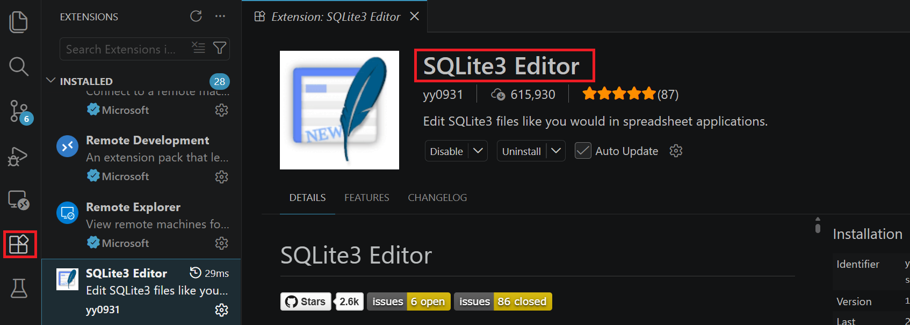

---
### 가상환경 생성
```bash
# pyproject.toml과 uv.lock 기준으로 의존성 설치
uv sync
```

### 기존 DB 파일 주의
- 만약 `blog.db` 파일이 존재한다면, 서버 실행 전 파일 삭제

---
### 서버 실행

```bash
python -m uvicorn main:app --reload --port 8001
```

> SQLite RDB 생성됨

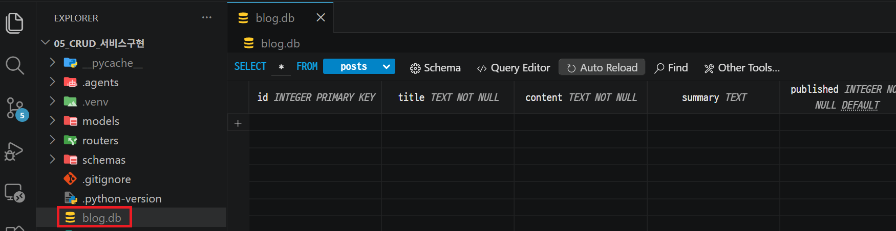

---
## 12. Swagger UI 실습 (http://localhost:8001/docs)
> 각 API에서 **Try it out**을 누른 뒤 아래 순서대로 입력합니다.

---
### 실습 1. 루트 엔드포인트 확인
> `GET /`

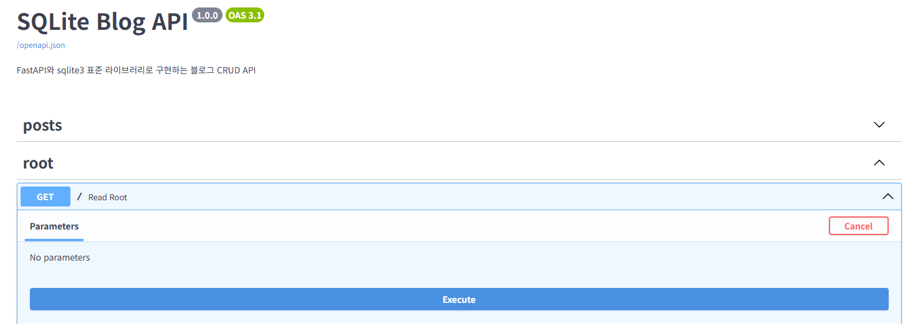

---
확인할 것
- `docs` 값이 `/docs`로 안내됩니다.
- `database` 값이 `blog.db`입니다.
- `posts` 라우터만 `main.py`에 연결되어 있습니다.

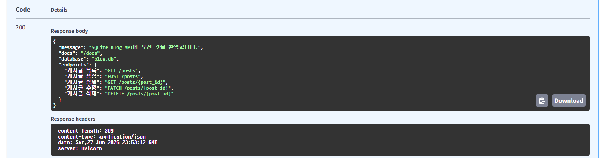

---
### 실습 2. 비어 있는 게시글 목록 조회
> `GET /posts`

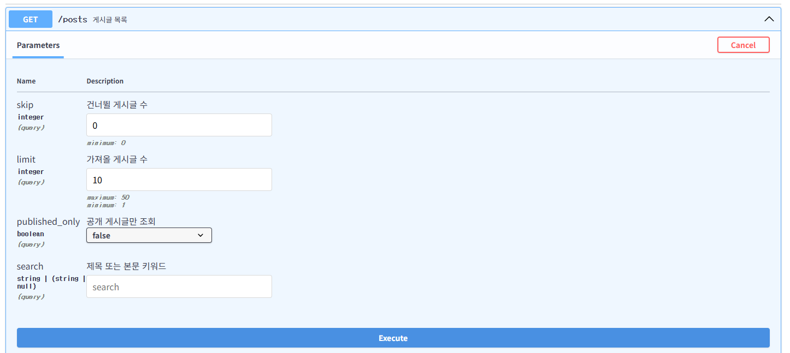

---
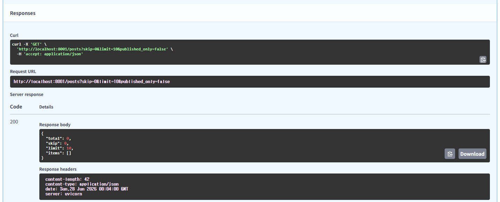

---
### 실습 3. 게시글 생성

> `POST /posts`
```json
{
  "title": "FastAPI와 SQLite로 CRUD 만들기",
  "content": "sqlite3 표준 라이브러리로 게시글을 저장합니다.",
  "summary": "SQLite 기반 CRUD 실습"
}
```

---
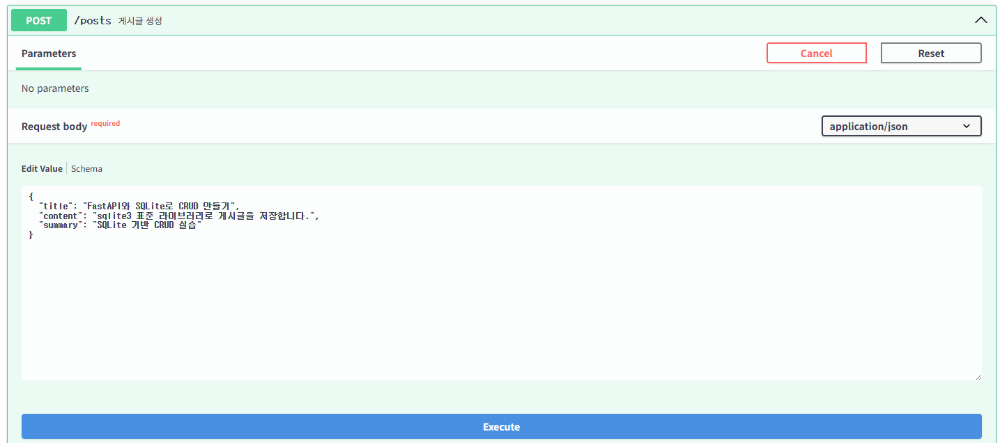

---
확인할 것
- 응답 상태 코드가 `201 Created`입니다.
- 요청에는 없던 `id`, `created_at`, `updated_at`이 응답에 포함됩니다.
- `published`는 요청에서 생략했으므로 `false`입니다.

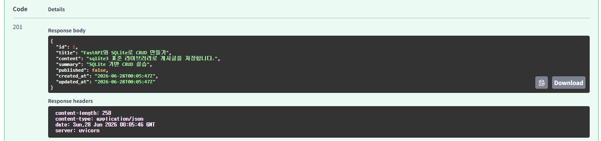

---
### 실습 4. 게시글 목록
> `GET /posts`

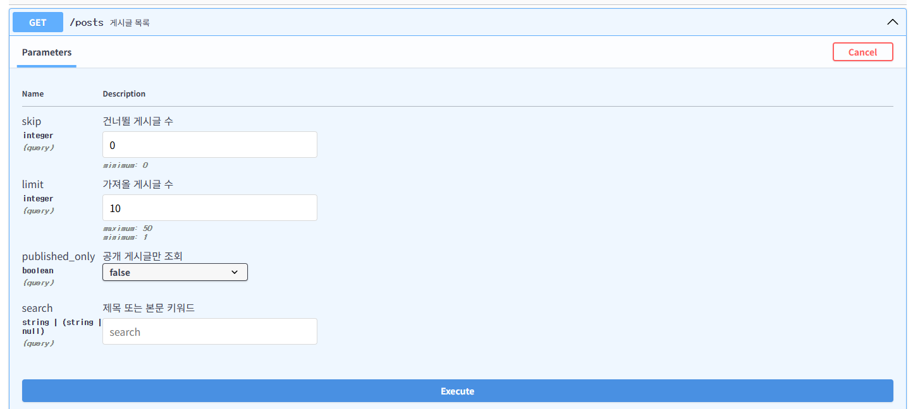

---
확인할 것
- `total`이 `1`입니다.
- `items` 배열에 방금 만든 게시글이 들어 있습니다.

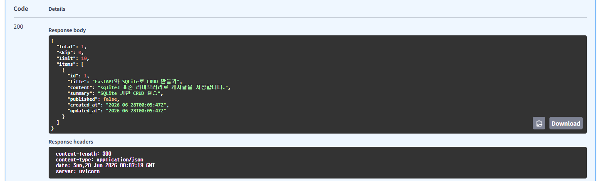

---
### 실습 5. 게시글 상세 조회 
> `GET /posts/{post_id}`

| Path Parameter | 입력값 |
|----------------|--------|
| `post_id` | `1` |

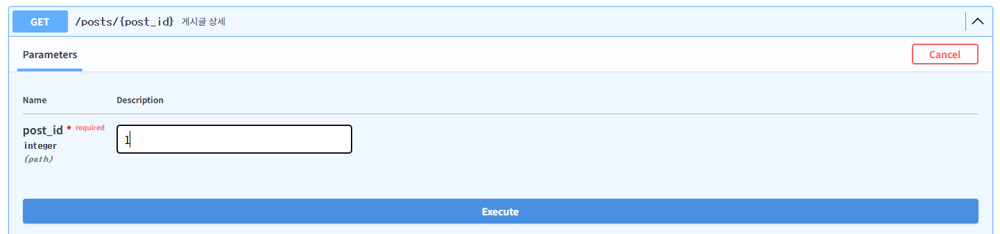

---
확인할 것
- 응답 상태 코드가 `200 OK`입니다.
- 응답 구조는 `PostResponse`와 같습니다.

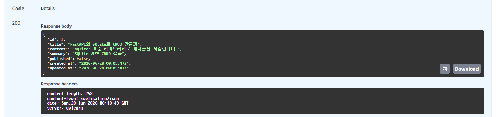

---
### 실습 6. 게시글 공개

> `POST /posts/{post_id}/publish`

| Path Parameter | 입력값 |
|----------------|--------|
| `post_id` | `1` |

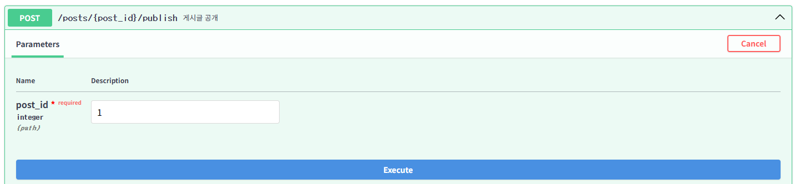

---
확인할 것
- `published`가 `true`로 바뀝니다.
- `updated_at` 값이 갱신됩니다.

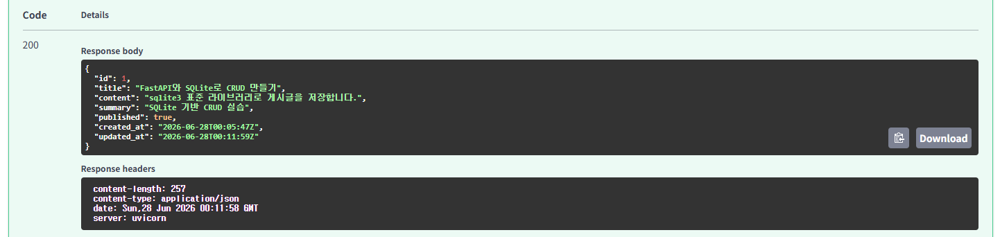

---
### 실습 7. 공개 게시글만 조회

> `GET /posts`

| Query Parameter | 입력값 |
|-----------------|--------|
| `published_only` | `true` |

---


---
확인할 것
- 공개된 게시글만 `items`에 들어옵니다.


---
### 실습 8. 키워드 검색

> `GET /posts`

| Query Parameter | 입력값 |
|-----------------|--------|
| `search` | `SQLite` |

---
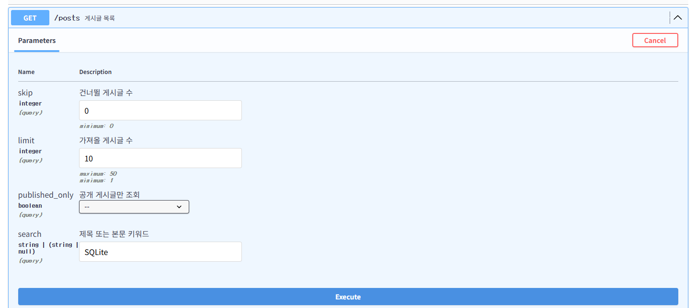

---
확인할 것
- 제목 또는 본문에 `SQLite`가 들어간 게시글만 조회됩니다.

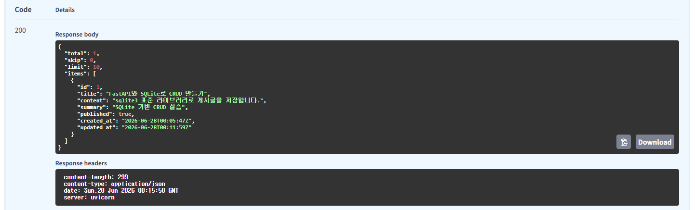

---
### 실습 9. 게시글 부분 수정

> `PATCH /posts/{post_id}`

| Path Parameter | 입력값 |
|----------------|--------|
| `post_id` | `1` |

```json
{
  "summary": "PATCH로 요약만 수정했습니다."
}
```
---
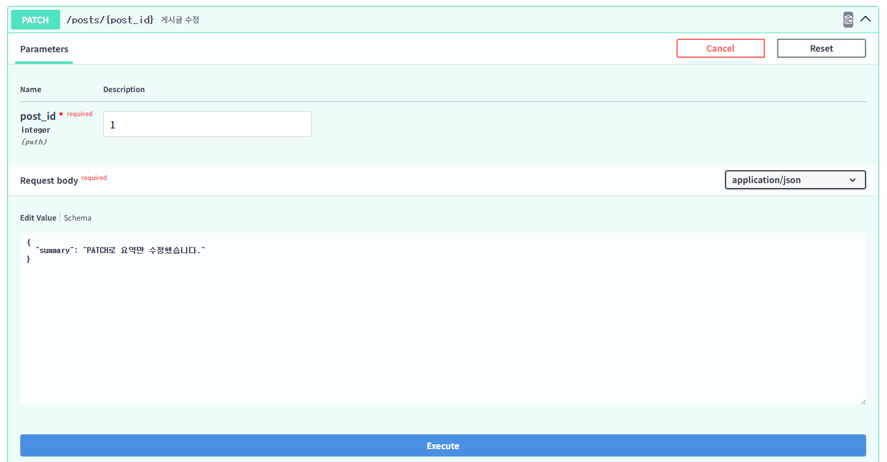

---
확인할 것
- `summary`만 바뀝니다.
- `title`, `content`, `published`는 유지됩니다.
- 이 동작은 `exclude_unset=True` 때문에 가능합니다.

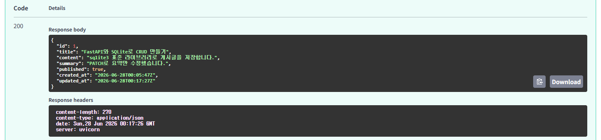

---
### 실습 10. 존재하지 않는 게시글 조회

> `GET /posts/{post_id}`

| Path Parameter | 입력값 |
|----------------|--------|
| `post_id` | `999` |

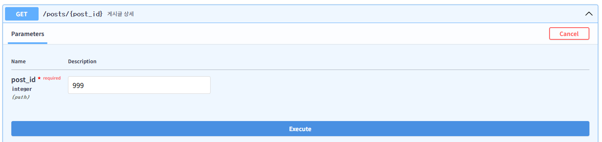

---
확인할 것
- 응답 상태 코드가 `404 Not Found`입니다.
- `detail` 값이 `"게시글을 찾을 수 없습니다"`입니다.

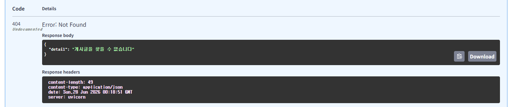

---
### 실습 11. Body 검증 실패 확인

> `POST /posts`

```json
{
  "title": "",
  "content": ""
}
```
---
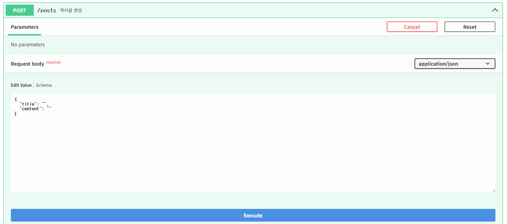

---
확인할 것
- 응답 상태 코드가 `422 Unprocessable Entity`입니다.
- `title`, `content`가 `min_length=1` 검증을 통과하지 못합니다.

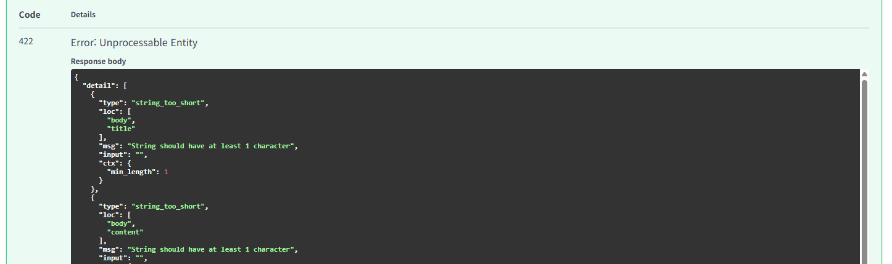

---
### 실습 12. 게시글 삭제

> `DELETE /posts/{post_id}`

| Path Parameter | 입력값 |
|----------------|--------|
| `post_id` | `1` |

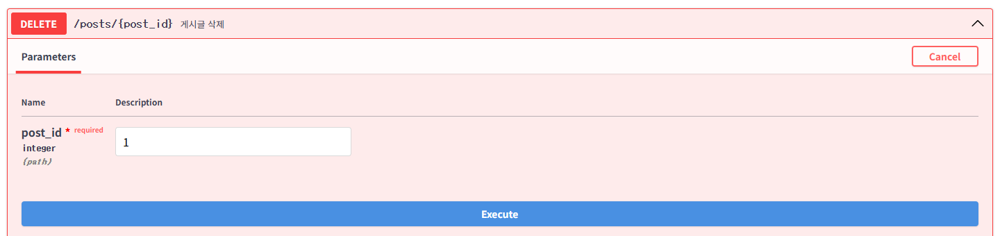

---
확인할 것
- 응답 상태 코드가 `204 No Content`입니다.

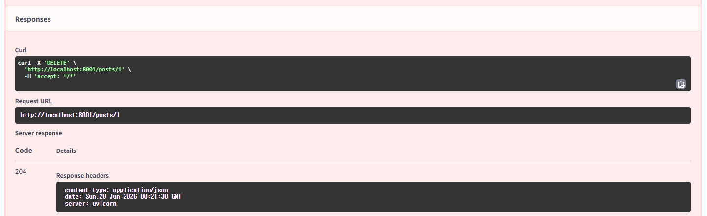

---
- 다시 `GET /posts/1`을 실행하면 `404 Not Found`입니다.

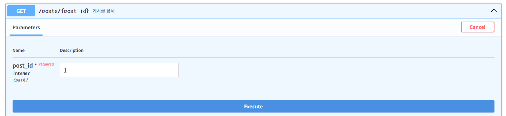

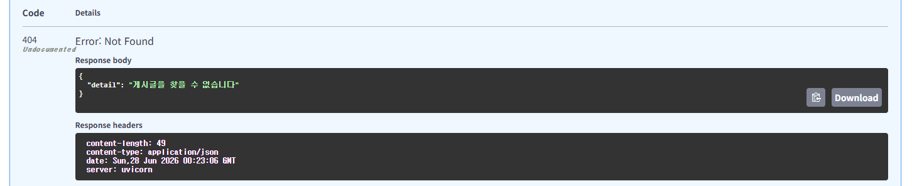

---
## 핵심 패턴 정리

| 상황 | 코드 패턴 |
|------|-----------|
| DB 연결 | `sqlite3.connect(DB_PATH)` |
| dict 형태 조회 | `conn.row_factory = sqlite3.Row` |
| 테이블 생성 | `CREATE TABLE IF NOT EXISTS posts` |
| 값 전달 | `VALUES (?, ?, ?, ?, ?, ?)` |
| 단건 없음 | `if not post: raise HTTPException(404, ...)` |
| 부분 수정 | `model_dump(exclude_unset=True)` |
| 공개 필터 | `published_only=true` |
| 페이지네이션 | `LIMIT ? OFFSET ?` |
