# 생성형 AI를 활용한 API 코드 자동 생성

---
## [Ollama란?](https://ollama.com/)
- Ollama는 대형 언어 모델(LLM)을 내 PC에서 쉽게 실행할 수 있게 해주는 오픈소스 도구입니다.
- 쉽게 말하면, ChatGPT 같은 AI 모델을 클라우드 대신 로컬 컴퓨터(Mac/Windows/Linux) 에서 돌릴 수 있게 해줍니다.

---
| 항목               | Ollama                        | ChatGPT                        |
| ---------------- | ----------------------------- | ------------------------------ |
| **실행 방식**        | 로컬 PC에서 직접 실행                 | OpenAI 클라우드 서버에서 실행            |
| **인터넷 연결**       | 모델 다운로드 후 오프라인 사용 가능          | 인터넷 연결 필수                      |
| **개인정보 보호**      | 데이터가 외부 서버로 전송되지 않음           | 대화 내용이 서버를 통해 처리됨              |
| **초기 구축 난이도**    | 설치 및 모델 선택 필요                 | 회원가입 후 바로 사용 가능                |
| **사용 편의성**       | 개발자 친화적, 터미널 기반               | 일반 사용자 친화적, UI 제공              |
| **보안 요구가 높은 환경** | 사내망·폐쇄망 환경에 적합                | 외부 네트워크 사용 정책 검토 필요            |

---
## 파일 구조

| 파일 | 역할 |
|---|---|
| `main.py` | FastAPI 앱 생성, 앱 메타데이터 설정, 코드 생성 라우터 등록 |
| `settings.py` | Ollama 모델명, thinking 토큰, 생성 옵션, 시스템 프롬프트 설정 |
| `routers/__init__.py` | `routers` 폴더를 파이썬 패키지로 인식시키는 초기화 파일 |
| `routers/generate.py` | `GET /` 상태 확인 API와 `POST /generate` 코드 생성 API 정의 |

---
| 파일 | 역할 |
|---|---|
| `schemas/__init__.py` | `schemas` 폴더를 파이썬 패키지로 인식시키는 초기화 파일 |
| `schemas/generate.py` | 코드 생성 요청/응답 Pydantic 스키마와 Swagger 예시, 검증 규칙 정의 |
| `services/__init__.py` | `services` 폴더를 파이썬 패키지로 인식시키는 초기화 파일 |
| `services/code_generator.py` | Ollama chat API 호출, 메시지 구성, 스트리밍 응답 처리, 코드 생성 서비스 로직 제공 |

---
> 흐름으로 보면 이렇게 이해하면 됩니다.

```
사용자 요청
  ↓
routers: 어떤 API 주소로 들어왔는지 처리
  ↓
schemas: 요청 데이터가 올바른지 검사
  ↓
services: 실제 기능 수행
  ↓
schemas: 응답 모양 정리
  ↓
사용자에게 응답
```

---
## 1. 생성형 AI 코드 생성이란?
> Ollama에서 실행하는 로컬 대형 언어 모델(LLM)은 자연어 설명을 받아 **완성된 코드 초안**을 생성할 수 있습니다.

```
개발자: "사용자 등록/조회/삭제 REST API를 FastAPI와 Pydantic으로 만들어줘"
    |
    v
Ollama + gemma4
    |
    v
완성된 FastAPI 코드 (main.py, models.py, schemas.py ...)
```

---
### 활용 시나리오

- 반복적인 CRUD 엔드포인트 초안 생성
- Pydantic 모델 자동 설계
- 테스트 코드 골격 생성
- 기존 코드 리팩터링 제안

---
## 2. 환경 준비

---
### Ollama 설치

1. [ollama.com](https://ollama.com/download)에서 Ollama를 설치합니다.

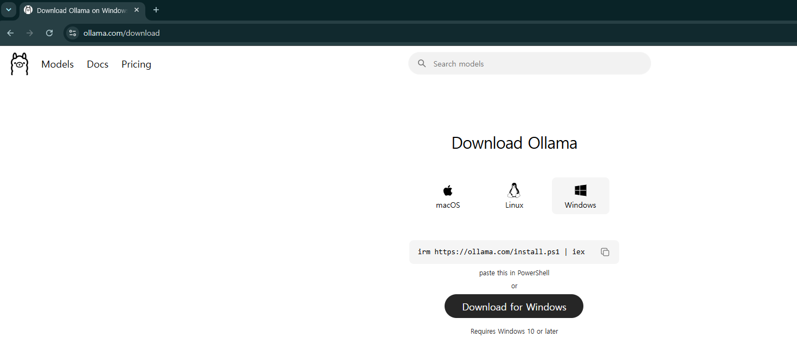

---
2. 터미널에서 Ollama가 동작하는지 확인합니다.
```bash
ollama --version
```
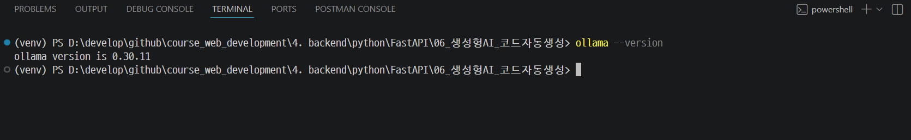

---
### [gemma4 모델 내려받기](https://ollama.com/library/gemma4)
> `gemma4:e4b`는 텍스트와 이미지 입력을 지원하는 Ollama 모델입니다. 기본 모델 외에도 `gemma4:e2b`, `gemma4:12b`, `gemma4:26b`, `gemma4:31b` 같은 변형을 선택할 수 있습니다.

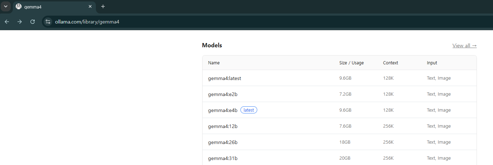

---
| 모델 | 용도 | 특징 |
|------|------|------|
| `gemma4` | 기본 실습 | 기본 태그, 텍스트/이미지 입력 지원 |
| `gemma4:e2b` | 가벼운 로컬 실습 | 작은 edge 모델, 128K 컨텍스트 |
| `gemma4:e4b` | 균형형 로컬 실습 | 기본 `latest`와 같은 계열, 128K 컨텍스트 |
| `gemma4:12b` | 코드 생성 품질 강화 | 256K 컨텍스트 |
| `gemma4:26b` | 복잡한 설계/추론 | MoE 모델, 256K 컨텍스트 |
| `gemma4:31b` | 고성능 워크스테이션 | dense 모델, 256K 컨텍스트 |

---
> 모델 다운로드
```bash
ollama pull gemma4:e4b
```
> 모델 다운로드 확인
```bash
ollama list
```
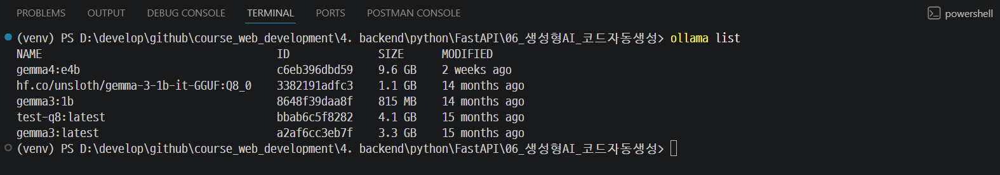

---
> 다운로드된 모델 실행
```bash
ollama run gemma4:e4b
```
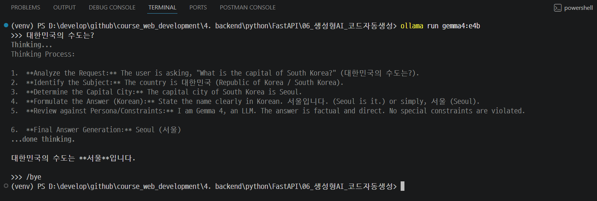

---
## 3. 기본 API 호출

```python
from ollama import chat

response = chat(
    model="gemma4",
    messages=[
        {"role": "user", "content": "FastAPI로 Hello World 엔드포인트를 만드는 코드를 작성해줘."}
    ],
    options={
        "temperature": 1.0,
        "top_p": 0.95,
        "top_k": 64,
        "num_predict": 1024,
    },
)

print(response.message.content)
```

---
### 응답 구조

> Ollama Python 패키지는 응답을 객체처럼 읽을 수 있습니다.

```python
response.model                 # 사용된 모델
response.message.role          # "assistant"
response.message.content       # 실제 텍스트
response.done                  # 생성 완료 여부
response.prompt_eval_count     # 입력 토큰 수 추정
response.eval_count            # 출력 토큰 수 추정
response.total_duration        # 전체 처리 시간(ns)
```

---
## 4. 스트리밍 - 실시간 출력

코드 생성처럼 긴 응답은 스트리밍으로 수신하면 사용자가 결과를 기다리는 동안 진행 상황을 바로 확인할 수 있습니다.

```python
from ollama import chat

stream = chat(
    model="gemma4",
    messages=[{"role": "user", "content": prompt}],
    stream=True,
    ...
)

for chunk in stream:
    text = chunk.message.content or ""
    print(text, end="", flush=True)
```

---
## 5. gemma4 thinking 모드 활용

복잡한 아키텍처 설계나 까다로운 검증 로직처럼 깊은 추론이 필요한 작업에는 gemma4의 thinking 모드를 사용할 수 있습니다.

thinking 모드는 `system` 프롬프트 맨 앞에 `<|think|>` 토큰을 넣어 켭니다. 끄고 싶으면 이 토큰을 제거합니다.

---
```python
from ollama import chat

SYSTEM_PROMPT = """<|think|>
당신은 FastAPI 전문가입니다.
복잡한 요구사항을 단계적으로 검토한 뒤 실행 가능한 코드를 작성하세요.
"""

stream = chat(
    model="gemma4",
    messages=[
        {"role": "system", "content": SYSTEM_PROMPT},
        {"role": "user", "content": prompt},
    ],
)

```

> 다중 턴 대화에서는 이전 assistant 응답을 다시 messages에 넣을 때 thinking 내용을 제외하고 최종 답변만 저장하는 것이 좋습니다.

---
## 6. 프롬프트 엔지니어링 - 좋은 코드를 얻는 법

---
### 나쁜 프롬프트 vs 좋은 프롬프트

**나쁜 예:**

```
FastAPI 코드 만들어줘
```

---
**좋은 예:**

```
FastAPI와 Pydantic v2를 사용해서 상품 관리 API를 만들어줘.

[요구사항]
- POST /products: 상품 생성
- GET /products: 상품 목록 조회 (페이지네이션: page, size 쿼리 파라미터)
- GET /products/{product_id}: 특정 상품 조회
- PATCH /products/{product_id}: 상품 부분 수정
- DELETE /products/{product_id}: 상품 삭제

[데이터 모델]
- Product: id(int), name(str, 2~100자), price(int, 1원 이상), stock(int, 0 이상), category(str)
- 입력 스키마(ProductCreate)와 응답 스키마(ProductResponse) 분리

[검증]
- 상품명 중복 불허 (409)
- 재고보다 많은 수량 주문 불허 (400)
- 존재하지 않는 상품 404 반환

[기타]
- 인메모리 dict 사용
- 모든 엔드포인트에 적절한 HTTP 상태 코드
- 한국어 주석 포함
```

---
## 7. FastAPI 코드 자동 생성기 만들기

```python
def generate_api_code(requirements: str) -> str:
    """자연어 요구사항을 받아 FastAPI 코드를 생성합니다."""
    
    stream = chat(
        ...
        messages=[
            {"role": "system", "content": SYSTEM_PROMPT},
            {"role": "user", "content": f"다음 API를 구현해줘:\n\n{requirements}"},
        ],
    )

    result = []
    for chunk in stream:
        text = chunk.message.content or ""
        print(text, end="", flush=True)
        result.append(text)

    return "".join(result)
```

---
## 8. 다중 턴 대화로 반복 개선

```python
SYSTEM_PROMPT = "당신은 FastAPI 코드 생성 도우미입니다. 사용자의 피드백을 반영해 코드를 개선합니다."
conversation = []


def chat_with_model(user_message: str) -> str:
    conversation.append({"role": "user", "content": user_message})
    ...


# 1턴: 초안 생성
chat_with_model("사용자 CRUD API를 FastAPI로 만들어줘.")

# 2턴: 개선 요청
chat_with_model("비밀번호 해싱 기능을 추가하고, 응답에서 비밀번호 필드를 제거해줘.")
```

---
## 9. 로컬 실행 통계 확인

비스트리밍 응답에서는 토큰 수와 처리 시간 같은 통계를 확인할 수 있습니다.

```python
from ollama import chat

response = chat(
    model="gemma4",
    messages=[{"role": "user", "content": "FastAPI 코드 생성 프롬프트 예시를 하나 만들어줘."}],
    options={
        "temperature": 1.0,
        "top_p": 0.95,
        "top_k": 64,
        "num_predict": 512,
    },
)

print(response.message.content)
print(f"입력 토큰 추정: {response.prompt_eval_count}")
print(f"출력 토큰 추정: {response.eval_count}")
print(f"총 소요 시간: {response.total_duration / 1_000_000_000:.2f}초")
```

---
## 핵심 정리

| 기능 | 코드 |
|------|------|
| 모델 내려받기 | `ollama pull gemma4` |
| 응답 텍스트 | `response.message.content` |
| 스트리밍 | `stream=True`, `chunk.message.content` |
| 샘플링 옵션 | `options={"temperature": 1.0, "top_p": 0.95, "top_k": 64}` |
| 시스템 프롬프트 | `{"role": "system", "content": SYSTEM_PROMPT}` |
| 다중 턴 대화 | `messages` 리스트에 이전 대화 포함 |
| 실행 통계 | `response.eval_count`, `response.total_duration` |

---
## 10. 서버 실행 및 Swagger 실습

---
### 가상환경 생성
```bash
# pyproject.toml과 uv.lock 기준으로 의존성 설치
uv sync
```

### 서버 실행

```bash
python -m uvicorn main:app --reload --port 8001
```

---
### Swagger UI 실습 (http://localhost:8001/docs)
> 각 API에서 **Try it out**을 누른 뒤 아래 순서대로 입력합니다.

---
#### 실습 1. 루트 엔드포인트 확인
> `GET /`

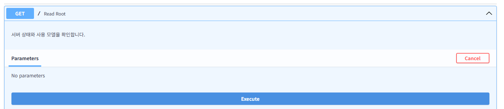

---
확인할 것
- 응답 상태 코드가 `200 OK`입니다.
- 서버가 사용하는 모델 이름과 Swagger 문서 경로를 확인합니다.
```python
@router.get("/")
def read_root() -> dict[str, str]:
    """서버 상태와 사용 모델을 확인합니다."""
    return {
        "status": "ok",
        "model": CODE_MODEL,
        "docs": "/docs",
    }
```

---
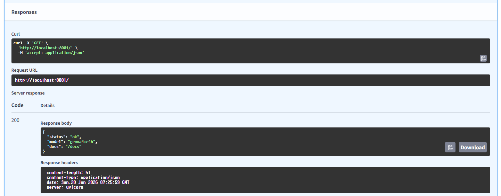

---
#### 실습 2. 간단한 FastAPI 코드 생성
> `POST /generate`

```json
{
    "requirements": "FastAPI와 Pydantic v2를 사용해서 메모 앱 API를 만들어줘.\nPOST /memos, GET /memos, GET /memos/{memo_id}, DELETE /memos/{memo_id}를 구현하고 인메모리 dict를 사용해줘.",
    "thinking": false,
    "num_predict": 1024
}
```

---
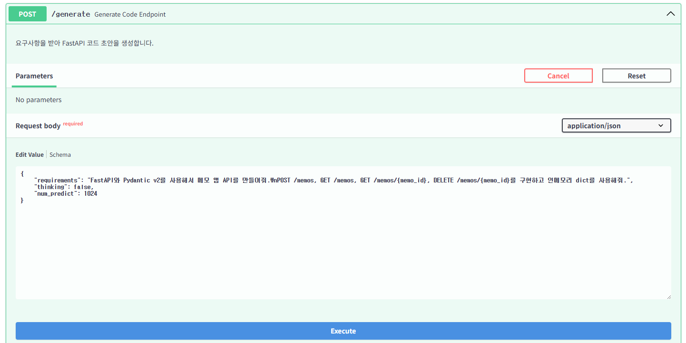

---
확인할 것
- 응답 상태 코드가 `200 OK`입니다.
- 응답에는 `model`과 `content`만 들어옵니다.
- `content` 안에 FastAPI 코드 초안이 문자열로 들어옵니다.
```python
class GenerateCodeResponse(BaseModel):
    """API 코드 생성 결과 응답 스키마입니다."""

    model: str
    content: str
```

---
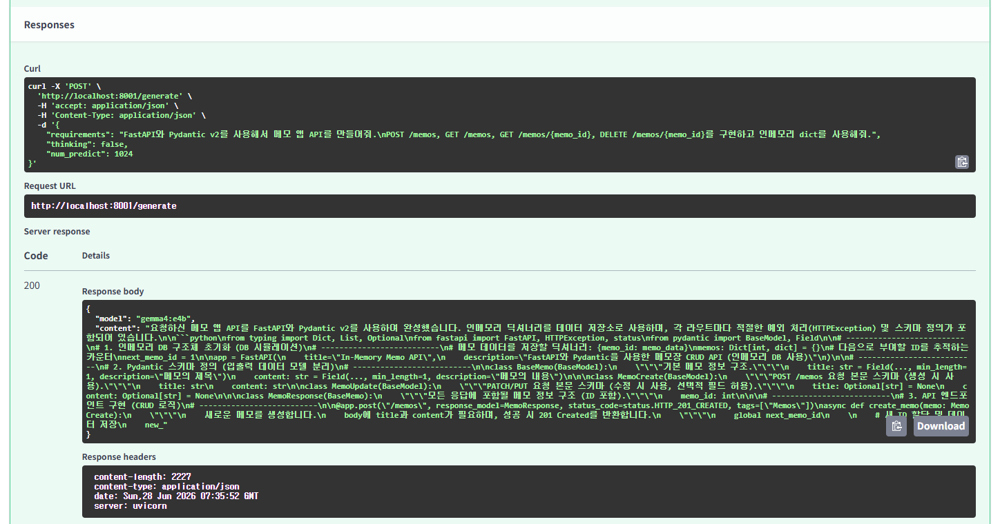

---
#### 실습 3. thinking 모드로 코드 생성
> `POST /generate`

```json
{
    "requirements": "사용자 등록과 로그인을 제공하는 FastAPI 예제를 만들어줘.\n비밀번호는 응답에서 제외하고, 로그인 실패는 401로 처리해줘.",
    "thinking": true,
    "num_predict": 2048
}
```

---
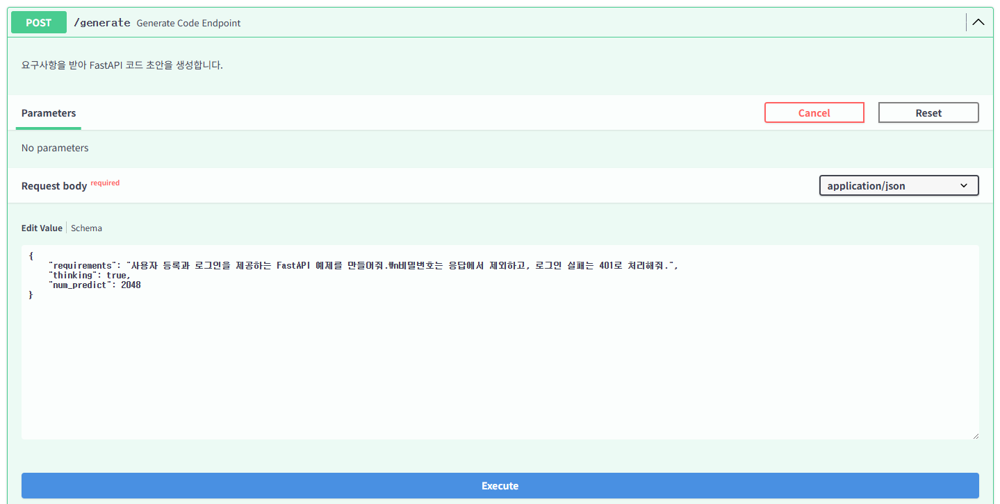

---
확인할 것
- `thinking`을 `true`로 보내면 서버가 system prompt 앞에 gemma4 thinking 토큰을 붙입니다.
- 복잡한 설계 요청에서는 응답 시간이 더 길어질 수 있습니다.
```python
def build_system_message(*, thinking: bool = False) -> dict[str, str]:
    """gemma4 thinking 모드를 켜려면 system prompt 앞에 전용 토큰을 붙입니다."""
    content = f"{THINKING_TOKEN}\n{SYSTEM_PROMPT}" if thinking else SYSTEM_PROMPT
    return {"role": "system", "content": content}
```

---
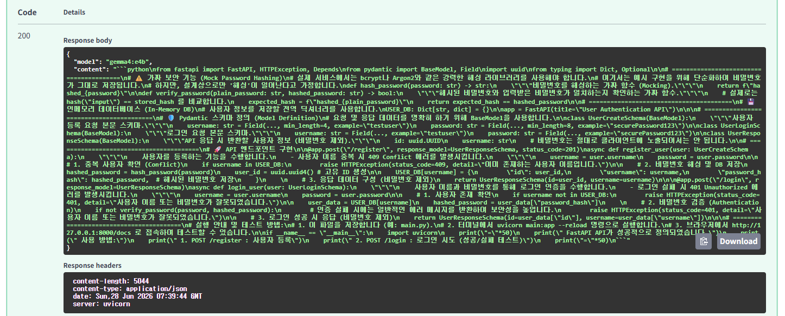
