# FastAPI로 만드는 생성형 AI API 문서 자동화

---
## [Groq이란?](https://groq.com/) 
- Groq는 생성형 AI의 추론(Inference) 에 특화된 AI 반도체와 클라우드 서비스를 개발하는 미국 기업입니다. 
- 기존 GPU를 사용하는 방식과 달리, 자체 개발한 LPU(Language Processing Unit) 라는 AI 전용 칩을 사용하여 매우 빠른 응답 속도와 낮은 비용을 제공하는 것이 가장 큰 특징입니다.

쉽게 말하면,
> OpenAI, Google, Meta는 AI 모델을 만드는 회사라면, Groq는 그 AI 모델을 빠르고 저렴하게 실행해주는 회사입니다.

---
### Groq vs Ollama
- `Groq`: 클라우드에서 매우 빠르게 LLM을 실행하는 서비스
- `Ollama`: 내 PC에서 로컬 LLM을 쉽게 실행하는 프로그램

| 항목            | Groq        | Ollama          |
| ------------- | ----------- | --------------- |
| 인터넷           | 필요          | 불필요(모델 다운로드 후)  |
| 속도            | 매우 빠름       | PC 성능에 따라 다름    |
| 비용            | 무료 사용량 + 유료 | 무료(Open Source) |
| 개인정보          | 서버로 전송      | PC 내부에서만 처리     |
| GPU 필요        | ❌           | 권장(없어도 CPU 가능)  |
| 설치            | 불필요(API 사용) | 설치 필요           |
| 모델 다운로드       | ❌           | ✅               |

---
## 파일 구조

| 파일 | 역할 |
|---|---|
| `main.py` | FastAPI 앱 생성 및 라우터 등록 |
| `settings.py` | 모델, 출력 폴더, 기본 OpenAPI URL 설정 |
| `core/metadata.py` | Swagger 제목, 설명, 태그 메타데이터 |
| `core/security.py` | Swagger Authorize 버튼과 실습용 Bearer 토큰 |
| `core/openapi.py` | OpenAPI 보안 스키마 커스터마이징 |

---
- schemas: 요청/응답 데이터의 모양을 정합니다.

| 파일 | 역할 |
|---|---|
| `schemas/documents.py` | AI 문서 생성 요청/응답 스키마 |
| `schemas/products.py` | 상품 등록/수정/응답 스키마 |
| `schemas/orders.py` | 주문 생성/응답 스키마 |
| `schemas/users.py` | 회원 가입/응답 스키마 |
| `schemas/common.py` | 공통 오류 응답 스키마 |

---
- services: 실제 일을 처리하는 로직을 담습니다.

| 파일 | 역할 |
|---|---|
| `services/document_workflow.py` | 문서 생성 흐름 조합 |
| `services/document_generator.py` | Groq에 전달할 프롬프트 작성 |
| `services/groq_client.py` | Groq 스트리밍 호출 |
| `services/openapi_spec.py` | OpenAPI 스펙 수집 및 compact 처리 |
| `services/storage.py` | 생성 결과와 스냅샷 파일 저장 |
| `services/shop_store.py` | 예제 쇼핑몰 API의 임시 메모리 저장소 |

---
- routers: 실제 API 주소를 정의합니다.

| 파일 | 역할 |
|---|---|
| `routers/documents.py` | 생성형 AI 문서 자동화 API |
| `routers/health.py` | 서버 상태 확인 API |
| `routers/products.py` | 문서화 대상 예제 API |
| `routers/orders.py` | 문서화 대상 예제 API |
| `routers/users.py` | 문서화 대상 예제 API |

---
> 흐름으로 보면 이렇게 이해하면 됩니다.

```
사용자 요청
  ↓
routers: 어떤 API 주소로 들어왔는지 처리
  ↓
schemas: 요청 데이터가 올바른지 검사
  ↓
services: 실제 기능 수행
  ↓
schemas: 응답 모양 정리
  ↓
사용자에게 응답
```

---
## FastAPI 앱 진입점

`main.py`가 강의의 기본 실행 파일입니다.

```python
def create_app() -> FastAPI:
    docs_enabled = not is_production()

    app = FastAPI(
        title="생성형 AI API 문서 자동화",
        ...
    )

    app.include_router(health_router)
    app.include_router(products_router)
    app.include_router(orders_router)
    app.include_router(users_router)
    app.include_router(documents_router)
    app.openapi = lambda: custom_openapi(app)
    return app
```

---
## 예제 API와 AI 문서화 API

하나의 FastAPI 서버 안에 두 종류의 엔드포인트가 있습니다.

| 구분 | 경로 | 역할 |
|---|---|---|
| 예제 API | `/products`, `/orders`, `/users` | 문서화 대상이 되는 쇼핑몰 API |
| AI 문서화 API | `/ai-docs/*` | OpenAPI 스펙을 Groq로 보내 문서 생성 |
| 상태 확인 | `/health` | 서버 상태 확인 |
| 자동 문서 | `/docs` | Swagger UI |
| 스펙 원본 | `/openapi.json` | OpenAPI JSON |

---
## 문서화 대상 엔드포인트

| 메서드 | 경로 | 기능 |
|---|---|---|
| `POST` | `/users` | 회원 가입 |
| `POST` | `/orders` | 주문 생성, 재고 차감 |
| `PATCH` | `/products/{product_id}` | 상품 부분 수정, 관리자 토큰 필요 |
| `DELETE` | `/products/{product_id}` | 상품 삭제, 관리자 토큰 필요 |

---
| 메서드 | 경로 | 기능 |
|---|---|---|
| `GET` | `/health` | 서버 상태 확인 |
| `GET` | `/products` | 상품 목록 조회 |
| `GET` | `/products/{product_id}` | 상품 단건 조회 |
| `GET` | `/orders/{order_id}` | 주문 조회 |
| `GET` | `/users/me` | 내 정보 조회, 관리자 토큰 필요 |
| `POST` | `/products` | 상품 등록, 관리자 토큰 필요 |

---
## 생성형 AI 문서화 엔드포인트

| 메서드 | 경로 | 생성 결과 |
|---|---|---|
| `POST` | `/ai-docs/api-docs` | 개발자용 마크다운 API 문서 |
| `POST` | `/ai-docs/postman-collection` | Postman Collection JSON |
| `POST` | `/ai-docs/readme` | GitHub README 초안 |
| `POST` | `/ai-docs/generate-all` | 위 3개 문서 한 번에 생성 |
| `POST` | `/ai-docs/changes` | 변경된 엔드포인트만 문서화 |

---
## Swagger 문서에 들어가는 설명

FastAPI 라우터의 `summary`, `description`, `response_model`은 OpenAPI 스펙에 들어갑니다.

```python
@router.get(
    "",
    response_model=List[ProductResponse],
    summary="상품 목록 조회",
    description="등록된 상품을 카테고리 필터와 페이지네이션으로 조회합니다.",
    response_description="상품 목록",
)
def list_products(
    category: Optional[str] = Query(default=None, description="카테고리 필터"),
    page: int = Query(default=1, ge=1, description="페이지 번호"),
    size: int = Query(default=10, ge=1, le=100, description="페이지당 항목 수"),
) -> list[dict]:
```

---
## 요청 예시는 Pydantic 모델에 작성

`json_schema_extra`에 작성한 예시는 Swagger UI와 OpenAPI 스펙에 반영됩니다.

```python
class ProductCreate(BaseModel):
    model_config = ConfigDict(
        json_schema_extra={
            "examples": [
                {"name": "무선 마우스", "price": 35000, "stock": 50, "category": "전자제품"},
                {"name": "면 티셔츠", "price": 19900, "stock": 200, "category": "의류"},
            ]
        }
    )

    name: str = Field(min_length=2, max_length=100, description="상품명 (2~100자)")
    price: int = Field(gt=0, description="판매가 (원, 0 초과)")
    stock: int = Field(ge=0, default=0, description="재고 수량")
    category: str = Field(description="카테고리명")
```

---
## 인증 정보도 OpenAPI에 포함

보호된 엔드포인트는 `Authorization: Bearer demo-admin-token`을 사용합니다.

```python
bearer_scheme = HTTPBearer(auto_error=False, scheme_name="BearerAuth")


def require_admin_token(
    credentials: HTTPAuthorizationCredentials = Security(bearer_scheme),
) -> str:
    if not credentials:
        raise HTTPException(status_code=401, detail="인증이 필요합니다.")
    if credentials.credentials != DEMO_ADMIN_TOKEN:
        raise HTTPException(status_code=403, detail="관리자 권한이 필요합니다.")
    return credentials.credentials
```

---
## OpenAPI 보안 스키마 커스터마이징

`core/openapi.py`는 Swagger UI의 Authorize 버튼에 사용할 보안 스키마를 추가합니다.

```python
components = schema.setdefault("components", {})
security_schemes = components.setdefault("securitySchemes", {})
security_schemes["BearerAuth"] = {
    "type": "http",
    "scheme": "bearer",
    "bearerFormat": "JWT",
}
```

---
## 전체 흐름

```text
FastAPI 요청
  POST /ai-docs/api-docs
        |
        v
GET /openapi.json
        |
        v
compact OpenAPI JSON
        |
        v
Groq API
        |
        v
output/API_DOCS.md 저장 + HTTP 응답 반환
```

---
## OpenAPI 스펙 수집

`server_url`에는 서버 기본 URL이나 `openapi.json` 전체 URL을 넣을 수 있습니다.

```python
def build_openapi_url(base_or_spec_url: str) -> str:
    url = base_or_spec_url.rstrip("/")
    if url.endswith("/openapi.json"):
        return url
    return f"{url}/openapi.json"


def fetch_openapi_spec(url: str = DEFAULT_OPENAPI_URL) -> dict:
    spec_url = build_openapi_url(url)
    try:
        response = httpx.get(spec_url, timeout=5)
        response.raise_for_status()
        return response.json()
    except httpx.ConnectError as error:
        raise OpenAPISpecError(f"서버에 연결할 수 없습니다: {spec_url}") from error
    ...
```

---
## 프롬프트용 스펙 줄이기

OpenAPI JSON 전체를 그대로 보내면 토큰 한도를 넘기 쉽습니다.

```python
def format_spec_for_prompt(spec: dict) -> str:
    compact = compact_openapi_spec(spec)
    return json.dumps(compact, ensure_ascii=False, separators=(",", ":"))
```
compact 단계에서는 다음 정보를 중심으로 남깁니다.
- API 제목, 설명, 버전
- 태그, 요약, 설명
- 경로와 실제 HTTP 메서드
- 파라미터, 요청 본문, JSON 예시
- 응답 코드와 응답 스키마 참조
- Pydantic 스키마 정의는 중복되지 않도록 한 번만 모음
- 보안 스키마

---
## Groq 호출

`services/groq_client.py`는 `.env`의 `GROQ_API_KEY`를 사용합니다.

```python
client = Groq()
stream = client.chat.completions.create(
    model=MODEL,
    messages=[{"role": "user", "content": prompt}],
    max_completion_tokens=max_tokens,
    reasoning_effort=reasoning_effort,
    reasoning_format="hidden",
    temperature=0.2,
    stream=True,
)
```

---
## 문서 생성 프롬프트

`services/document_generator.py`는 생성 목적별로 다른 프롬프트를 만듭니다.

| 함수 | 생성 결과 |
|---|---|
| `generate_api_docs()` | 개발자용 API 문서 |
| `generate_postman_collection()` | Postman Collection |
| `generate_readme()` | GitHub README |
| `generate_diff_docs()` | 변경 엔드포인트 문서 |

---
## FastAPI 라우터에서 호출

`routers/documents.py`는 HTTP 요청을 받아 서비스 함수를 호출합니다.

```python
@router.post(
    "/api-docs",
    response_model=GeneratedDocumentResponse,
    summary="API 문서 생성",
)
def generate_api_document(request: DocumentGenerationRequest) -> dict:
    try:
        return create_api_docs(request.server_url)
    except RuntimeError as error:
        raise_generation_error(error)
```

---
## 요청 본문

기본값은 현재 FastAPI 서버입니다.

```json
{
  "server_url": "http://localhost:8001"
}
```

다른 FastAPI 서버를 문서화할 수도 있습니다.

```json
{
  "server_url": "http://localhost:9000/openapi.json"
}
```

---
## 서버 실행 및 Swagger 실습

---
### Groq API Key
- Groq API Key를 생성하는 이유는 내 프로그램이 Groq의 AI 모델을 안전하게 사용할 수 있도록 인증하기 위해서입니다.

```
내 프로그램
      │
      │ API 요청 + API Key
      ▼
Groq API 서버
      │
      │ 사용자 인증
      ▼
Llama, Gemma, Qwen 등의 모델 실행
      │
      ▼
응답 반환
```

---
> [Groq API Key 생성](https://console.groq.com/keys) 

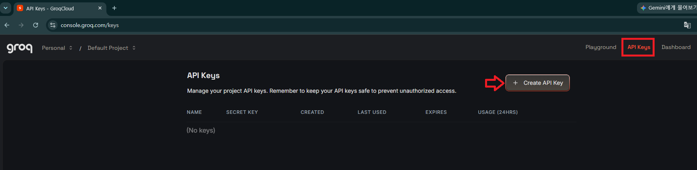

---
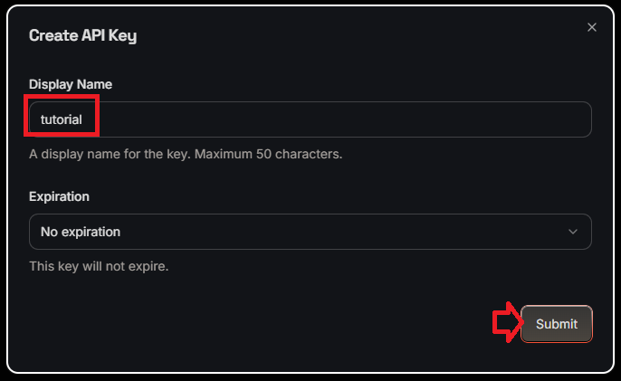

---
> 복사 

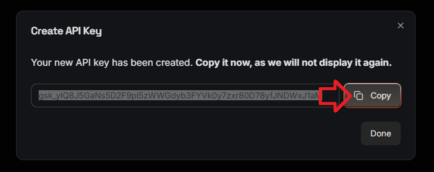

---
> .env 파일 생성 후 붙여놓기 

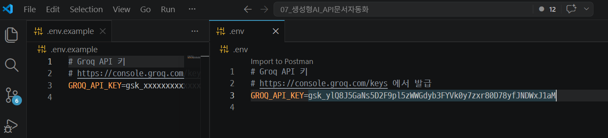

---
### 가상환경 생성

```bash
# pyproject.toml과 uv.lock 기준으로 의존성 설치
uv sync
```

### 서버 실행

```bash
python -m uvicorn main:app --reload --port 8001
```
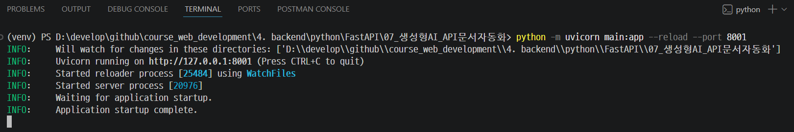

---
### Swagger UI 실습 (http://localhost:8001/docs)
> 각 API에서 **Try it out**을 누른 뒤 아래 순서대로 입력합니다.

---
#### 실습 1. 서버 상태와 OpenAPI 원본 확인
> `GET /health`

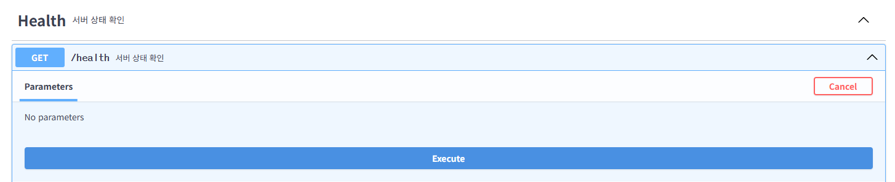

---
확인할 것
- 응답 상태 코드가 `200 OK`입니다.
- 응답에 `status`, `version`, `timestamp`가 들어옵니다.

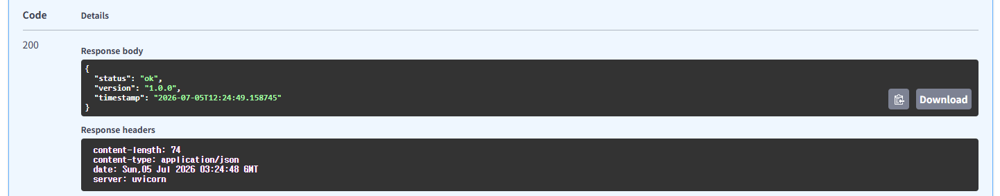

---
#### 실습 2. 상품 목록 조회와 Query Parameter 확인
> `GET /products`

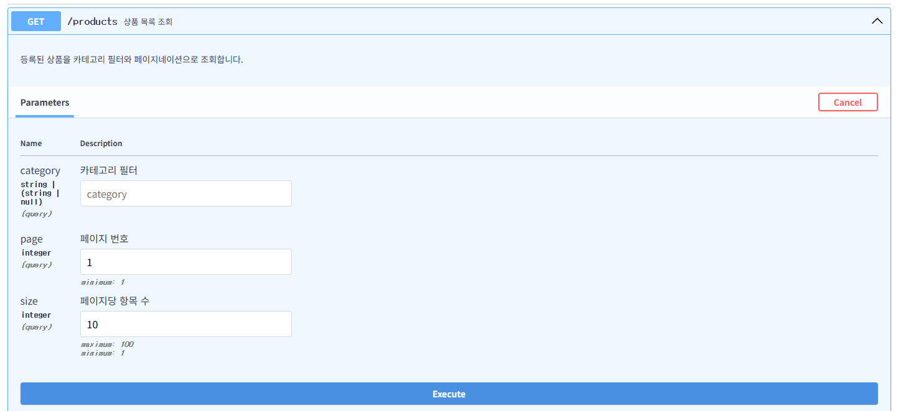

---
확인할 것
- 응답 상태 코드가 `200 OK`입니다.
- 예제 상품인 `무선 마우스`, `기계식 키보드`가 조회됩니다.

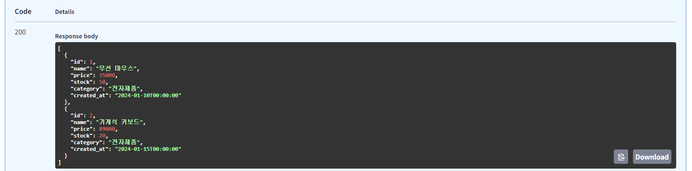

---
#### 실습 3. 인증 실패 응답 확인
> `POST /products`

아직 Authorize를 누르지 않은 상태에서 실행합니다.

```json
{
    "name": "USB-C 허브",
    "price": 42000,
    "stock": 30,
    "category": "전자제품"
}
```

---
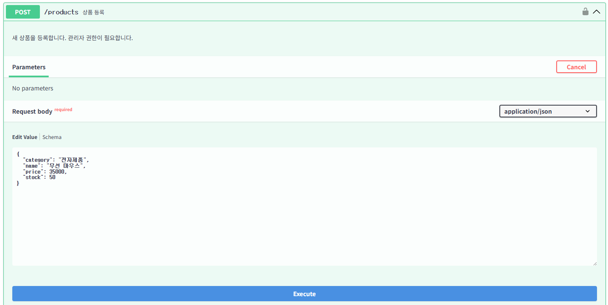

---
확인할 것
- 응답 상태 코드가 `401 Unauthorized`입니다.
- 응답 본문은 `{"detail": "인증이 필요합니다."}` 형태입니다.

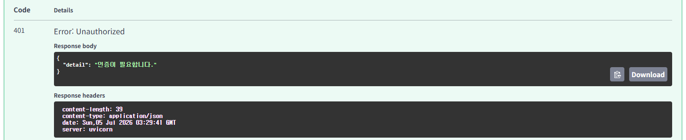

---
#### 실습 4. 관리자 토큰으로 상품 등록
> `POST /products`

1. Swagger UI 오른쪽 위 `Authorize` 버튼을 누릅니다.

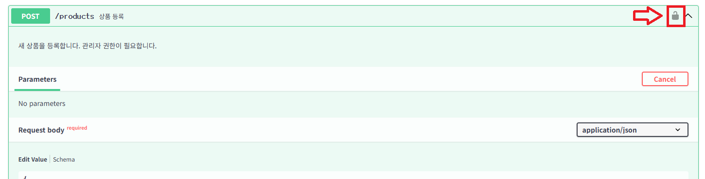

---
2. 값에 `demo-admin-token`만 입력합니다.

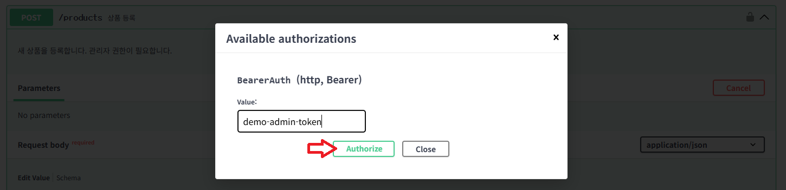

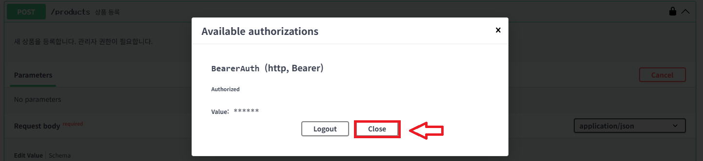

---
3. 다시 `POST /products`를 실행합니다.

```json
{
    "name": "USB-C 허브",
    "price": 42000,
    "stock": 30,
    "category": "전자제품"
}
```

---
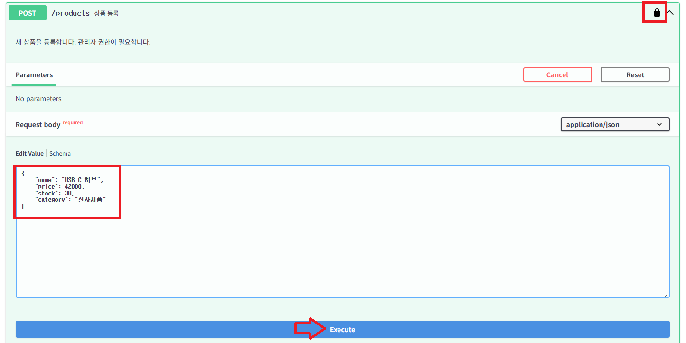

---
확인할 것
- 응답 상태 코드가 `201 Created`입니다.
- 응답에 새 상품 `id`가 들어옵니다.

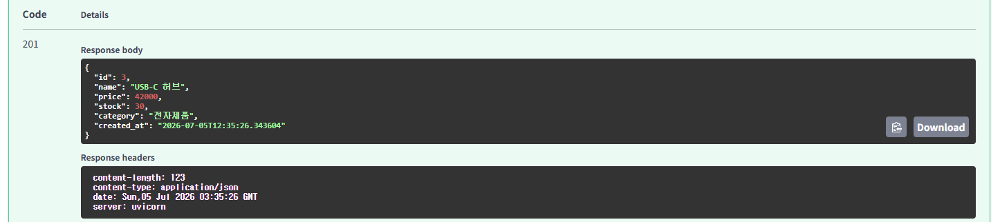

---
#### 실습 5. 요청 검증 오류 확인
> `POST /products`

```json
{
    "name": "A",
    "price": 0,
    "stock": -1,
    "category": "전자제품"
}
```
---
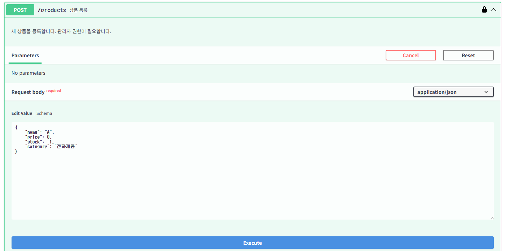

---
확인할 것
- 응답 상태 코드가 `422 Unprocessable Entity`입니다.
- `name`, `price`, `stock` 필드 검증 오류가 `detail` 목록으로 표시됩니다.

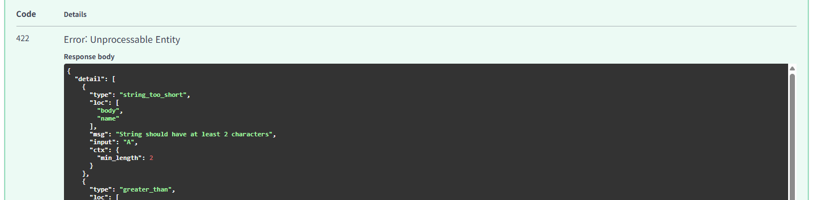

---
#### 실습 6. 상품 수정과 삭제
> `PATCH /products/{product_id}`

`product_id`에는 실습 4에서 생성된 상품 ID를 넣습니다.

```json
{
    "price": 39900,
    "stock": 25
}
```
---
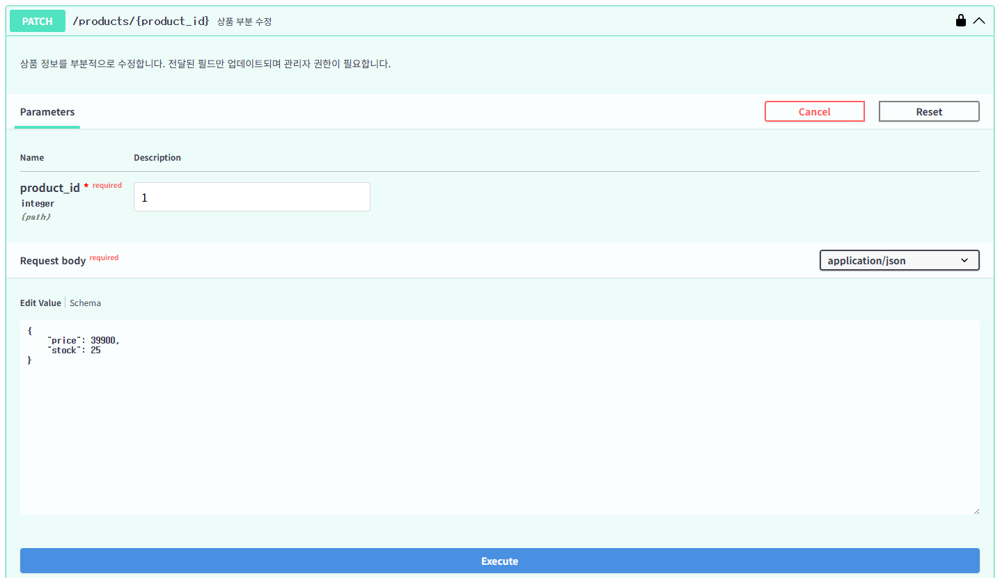

---
확인할 것
- 응답 상태 코드가 `200 OK`입니다.
- 전달한 필드만 변경됩니다.

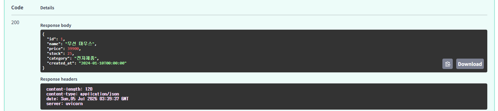

---
삭제도 같은 상품 ID로 확인합니다.

> `DELETE /products/{product_id}`

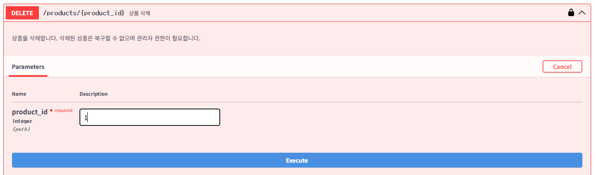

---
확인할 것
- 응답 상태 코드가 `204 No Content`입니다.

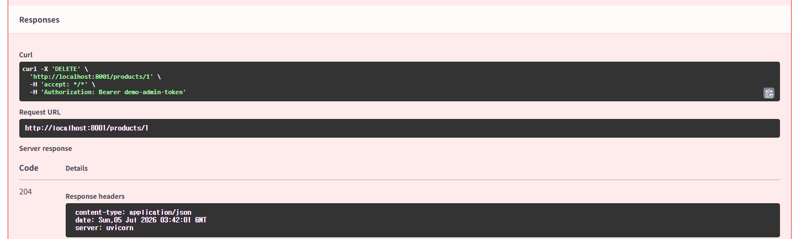

---
#### 실습 7. 주문 생성
> `POST /orders`

```json
{
    "items": [
        {
            "product_id": 2,
            "quantity": 2
        }
    ]
}
```
---
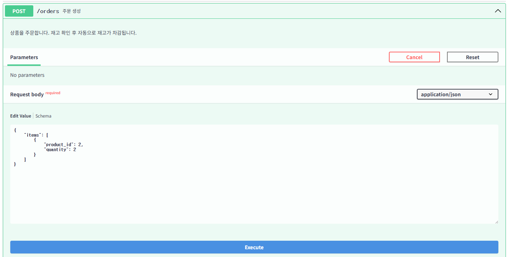

---
확인할 것
- 응답 상태 코드가 `201 Created`입니다.
- 응답에 `id`, `items`, `total_price`, `status`, `created_at`이 들어옵니다.

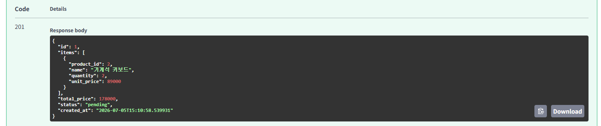

---
#### 실습 8. 회원 가입과 내 정보 조회
> `POST /users`

```json
{
    "username": "hong123",
    "email": "hong@example.com",
    "password": "pass1234"
}
```
---
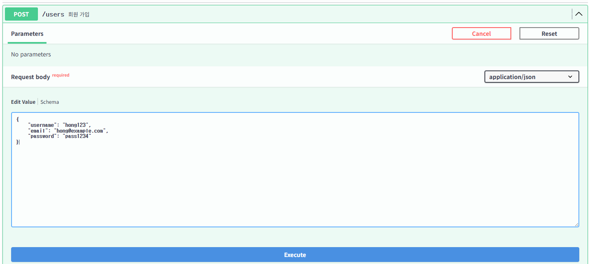

---
확인할 것
- 응답 상태 코드가 `201 Created`입니다.
- 응답에는 `password`가 포함되지 않습니다.

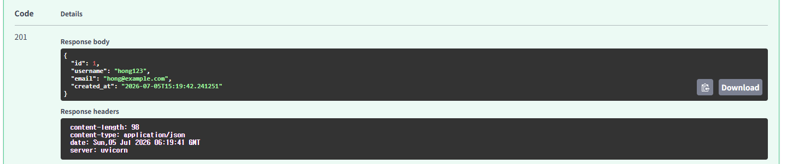

---
이어서 관리자 토큰이 들어간 상태로 실행합니다.

> `GET /users/me`

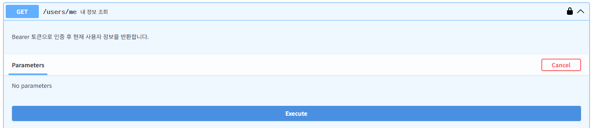

---
확인할 것
- 응답 상태 코드가 `200 OK`입니다.
- 실습용 사용자 `demo_user`가 반환됩니다.

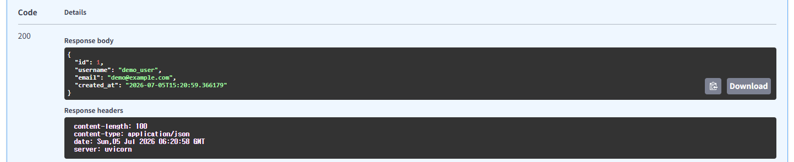

---
#### 실습 9. API 문서 생성
> `POST /ai-docs/api-docs`

```json
{
    "server_url": "http://localhost:8001"
}
```
---
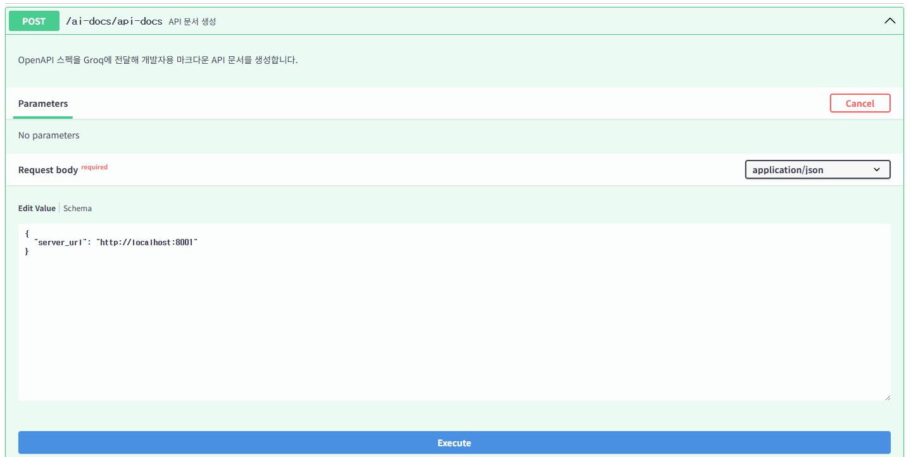

---
확인할 것
- `.env`의 `GROQ_API_KEY`가 정상이라면 응답 상태 코드가 `200 OK`입니다.
- 응답에는 `endpoint_count`, `filename`, `path`, `content`가 들어옵니다.

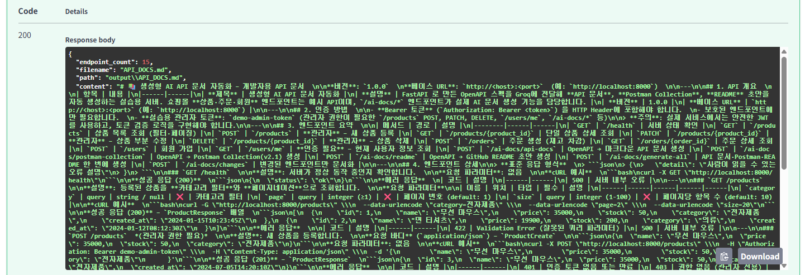

---
- `output/API_DOCS.md` 파일이 생성됩니다.

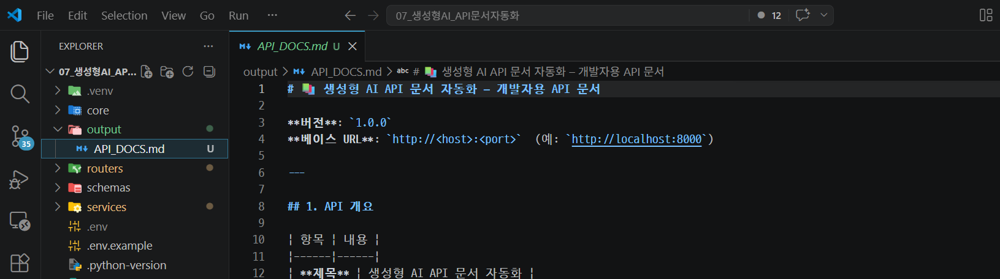

---
#### 실습 10. 전체 문서 생성
> `POST /ai-docs/generate-all`

```json
{
    "server_url": "http://localhost:8001/openapi.json"
}
```
---
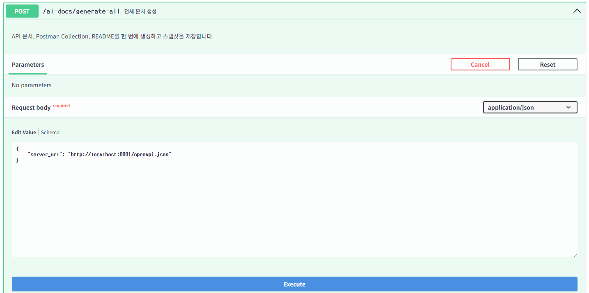

---
확인할 것
- 응답의 `files` 배열에 위 파일 경로가 들어옵니다.
- `server_url`은 서버 기본 URL과 `/openapi.json` 전체 URL을 모두 받을 수 있습니다.

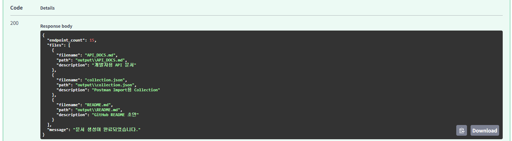

---
생성되는 파일:

| 파일 | 설명 |
|---|---|
| `output/API_DOCS.md` | 개발자용 API 문서 |
| `output/collection.json` | Postman Import용 Collection |
| `output/README.md` | GitHub README 초안 |
| `output/_spec_snapshot.json` | 변경 비교용 OpenAPI 스냅샷 |

---
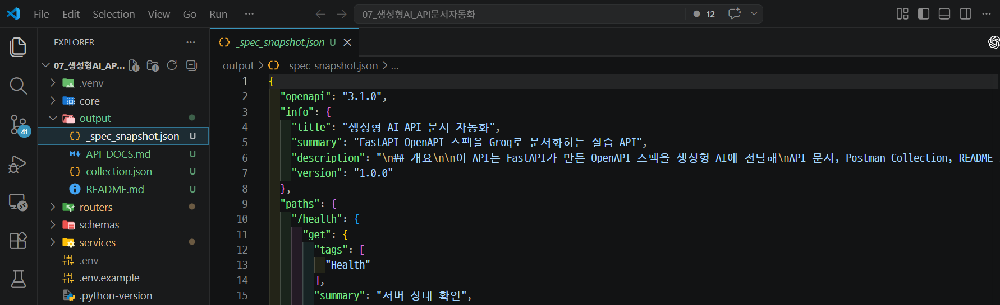

---
#### 실습 11. 변경 문서 생성

1. `routers/products.py`의 `summary`나 `description` 문구를 잠깐 수정합니다.

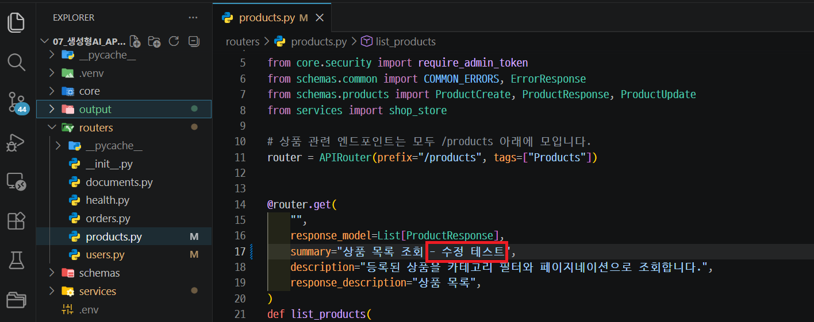

---
2. 서버가 reload된 뒤 `POST /ai-docs/changes`를 다시 실행합니다.
> `POST /ai-docs/changes`

스냅샷 없이 먼저 실행해 봅니다.

```json
{
    "server_url": "http://localhost:8001"
}
```
---
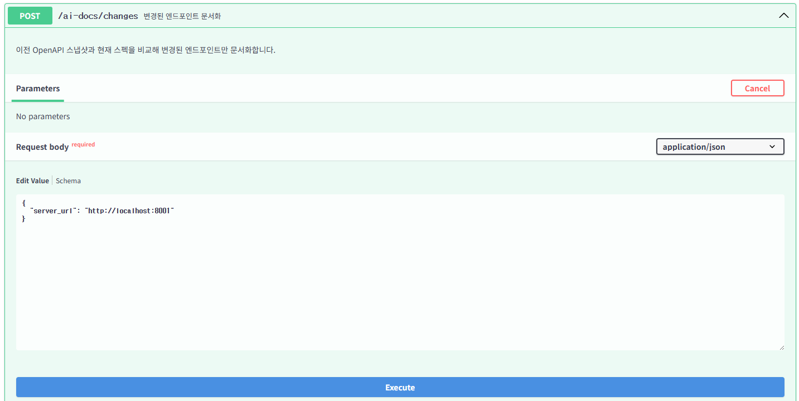

---
3. 변경이 있으면 `output/API_CHANGES.md`가 생성됩니다.

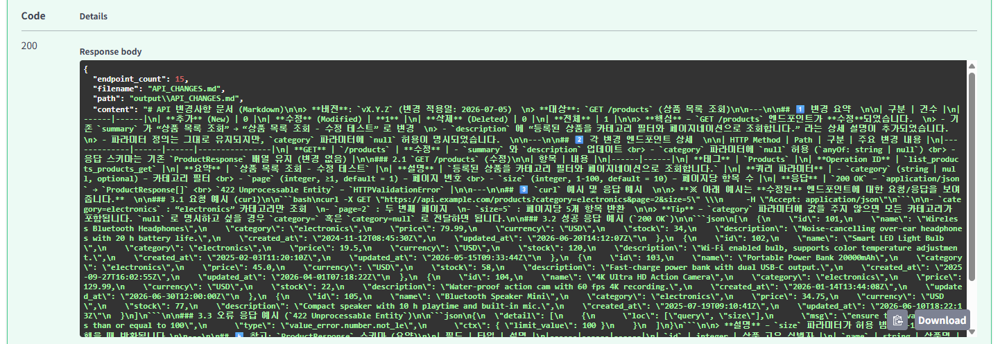

---
## 오류 상황 읽기

| 상태 코드 | 상황 | 확인할 것 |
|---|---|---|
| `400` | 주문 재고 부족 또는 변경 비교용 스냅샷 없음 | 재고 수량 또는 `POST /ai-docs/generate-all` 실행 여부 확인 |
| `401` | Bearer 토큰 누락 | Swagger Authorize에 `demo-admin-token` 입력 |
| `403` | Bearer 토큰 값 오류 | `Bearer` 접두어 없이 토큰 문자열만 입력 |

---
| 상태 코드 | 상황 | 확인할 것 |
|---|---|---|
| `404` | 존재하지 않는 상품/주문 ID | 경로 파라미터 ID 확인 |
| `409` | 상품명 또는 이메일 중복 | 다른 `name` 또는 `email` 사용 |
| `422` | 요청 본문/파라미터 검증 실패 | `Field`의 `min_length`, `gt`, `ge` 조건 확인 |
| `500` | 서버 내부 오류 | Swagger의 공통 오류 응답 문서 확인 |
| `502` | OpenAPI 스펙 수집 또는 Groq 호출 실패 | 서버 주소, `.env`, Groq 사용량 제한 확인 |
