# FastAPI로 만드는 생성형 AI 챗봇 서비스

---
## [Google Gemini](https://gemini.google.com/app?hl=ko)
> Gemini는 Google이 개발한 생성형 AI 모델(LLM) 및 AI 플랫폼입니다. 
> 텍스트뿐만 아니라 이미지, 음성, 영상, 코드까지 이해하고 생성할 수 있는 멀티모달(Multimodal) AI를 목표로 만들어졌습니다.

---
> Google Gemini vs 다른 LLMs

| 항목         | Google Gemini |                  Groq |             Ollama |
| ---------- | -----------: | --------------------: | -----------------: |
| 운영 위치      | Google Cloud |            Groq Cloud |              내 컴퓨터 |
| 인터넷 필요     |            필요 |                     필요 |                  불필요 |
| 속도         |           빠름 |             **매우 빠름** |           PC 성능 의존 |
| 비용         |       사용량 기반 |                사용량 기반 |        무료 (전기세 제외) |
| 개인정보 보호    |    Google 서버 |               Groq 서버 |             **최고** |
| 멀티모달       |        ★★★★★ |                 ★★☆☆☆ |              ★★☆☆☆ |
| 장문 처리      |        ★★★★★ |                 ★★★☆☆ |              ★★★☆☆ |
| Agent 개발   |        ★★★★☆ |                 ★★★★★ |              ★★★☆☆ |

---
## 프로젝트 구조

```text
생성형AI_챗봇서비스/
├── main.py                  <- FastAPI 앱 생성 + 라우터 등록
├── core/
│   ├── config.py            <- 환경변수, 모델명, 세션 만료 시간
│   ├── gemini.py            <- Gemini 클라이언트 생성
│   └── error_handlers.py    <- Gemini API 오류 응답 변환
├── schemas/
│   └── chat.py              <- 요청/응답 Pydantic 모델
├── models/
│   └── session.py           <- 메모리 세션 데이터 구조
├── services/
│   ├── gemini_service.py    <- Gemini 호출, 스트리밍, 통계 기록
│   ├── session_store.py     <- 세션 생성/조회/삭제/만료 처리
│   └── stats.py             <- 토큰 사용량 누적
└── routers/
    ├── ask.py               <- /ask, /ask/stream
    ├── chat.py              <- /chat, /sessions
    └── stats.py             <- /stats
```

---
## 파일 역할

| 파일 | 역할 |
|---|---|
| `main.py` | FastAPI 앱을 만들고 라우터를 등록 |
| `core/config.py` | `.env`를 읽고 필수 환경변수 검사 |
| `core/gemini.py` | `genai.Client` 생성 |
| `core/error_handlers.py` | Gemini API 예외를 JSON 응답으로 변환 |
| `schemas/chat.py` | 요청/응답 데이터 모양과 Swagger 예시 정의 |

---
## 서비스와 라우터 역할

| 파일 | 역할 |
|---|---|
| `services/gemini_service.py` | 단일 질문, 세션 대화, 스트리밍, 통계 조회 |
| `services/session_store.py` | 메모리 기반 세션 저장소 |
| `services/stats.py` | 요청 수와 토큰 사용량 누적 |
| `routers/ask.py` | 단일 질문 API |
| `routers/chat.py` | 세션 생성, 대화, 기록 조회, 삭제 API |
| `routers/stats.py` | 사용량 통계 API |

---
## 전체 요청 흐름

```text
사용자 요청
  |
  v
routers: 어떤 URL로 들어왔는지 결정
  |
  v
schemas: 요청 데이터 검증
  |
  v
services: Gemini 호출, 세션 관리, 통계 기록
  |
  v
schemas: 응답 모양 정리
  |
  v
사용자에게 JSON 또는 SSE 응답
```

---
### Server-Sent Events(SSE)란?
> 웹 서버가 클라이언트(브라우저)에게 실시간으로 데이터를 계속 푸시(push) 할 수 있게 해주는 기술입니다.

즉,
- `일반 HTTP`: 클라이언트 → 서버 요청 → 서버 응답 → 연결 종료
- `SSE`: 클라이언트가 한 번 연결 → 서버가 필요할 때마다 계속 데이터 전송

---
## FastAPI 앱 진입점

`main.py`는 요청 처리 로직을 직접 들고 있지 않습니다.
앱을 만들고 필요한 라우터를 연결하는 조립 파일입니다.

```python
def create_app() -> FastAPI:
    app = FastAPI(
        title="Gemini 한국어 챗봇 API",
        description="FastAPI + Gemini 연동 실습",
        version="1.0.0",
    )

    register_error_handlers(app)
    app.include_router(ask_router)
    app.include_router(chat_router)
    app.include_router(stats_router)

    return app
```

---
## 환경변수 설정

`core/config.py`는 서버가 시작될 때 `.env`를 읽습니다.

```python
GEMINI_API_KEY = get_required_env("GEMINI_API_KEY")
GEMINI_MODEL = os.getenv("GEMINI_MODEL", "gemini-3.5-flash")
SESSION_TTL_SECONDS = int(os.getenv("SESSION_TTL_SECONDS", "3600"))
DEFAULT_SYSTEM_INSTRUCTION = os.getenv(
    "GEMINI_SYSTEM_INSTRUCTION",
    "친절하고 유능한 AI 어시스턴트입니다.",
)
```

---
`.env` 파일 예시:

```env
GEMINI_API_KEY=AIzaxxxxxxxxxxxxxxxxxxxxxxxxxxxxxxx
GEMINI_MODEL=gemini-3.5-flash
SESSION_TTL_SECONDS=3600
GEMINI_SYSTEM_INSTRUCTION=친절하고 유능한 AI 어시스턴트입니다.
```

`GEMINI_API_KEY`가 없으면 FastAPI 앱이 시작되기 전에 오류가 발생합니다.

---
## Gemini 클라이언트 생성

`core/gemini.py`에서 Gemini 클라이언트를 한 번 생성하고 여러 서비스에서 함께 사용합니다.

```python
from google import genai

from core.config import GEMINI_API_KEY

client = genai.Client(api_key=GEMINI_API_KEY)
```

---
## 단일 질문 API

`POST /ask`는 대화 기록을 저장하지 않고 한 번만 질문합니다.

```python
@router.post(
    "/ask",
    response_model=AskResponse,
    summary="단순 질문/답변 (싱글턴)",
)
async def ask(req: AskRequest):
    return await generate_answer(req)
```

---
요청 본문:

```json
{
  "question": "FastAPI에서 비동기 처리가 필요한 이유를 쉽게 설명해줘.",
  "temperature": 0.7,
  "max_tokens": 500,
  "system_instruction": "너는 한국어로 친절하게 설명하는 백엔드 강사야."
}
```

응답 본문:

```json
{
  "answer": "FastAPI에서 비동기 처리를 사용하면 오래 걸리는 API 호출 중에도 서버가 다른 요청을 계속 처리할 수 있습니다.",
  "input_tokens": 24,
  "output_tokens": 42,
  "total_tokens": 66
}
```

---
## 요청 검증 조건

`schemas/chat.py`의 `Field` 조건은 Swagger UI와 `422` 검증 오류에 반영됩니다.

| 필드 | 조건 | 기본값 |
|---|---|---|
| `question` | 1자 이상, 2000자 이하 | 필수 |
| `message` | 1자 이상, 2000자 이하 | 필수 |
| `temperature` | `0.0` 이상, `2.0` 이하 | `0.7` |
| `max_tokens` | `1` 이상, `4096` 이하 | `/ask`: `500`, `/chat`: `800` |

---
## Gemini 비동기 호출

FastAPI의 `async` 엔드포인트에서는 Gemini 비동기 API를 사용합니다.

```python
response = await client.aio.models.generate_content(
    model=GEMINI_MODEL,
    contents=req.question,
    config=config,
)
```

응답을 받은 뒤 토큰 사용량을 기록합니다.

```python
usage = response.usage_metadata
stats.record(usage.prompt_token_count, usage.candidates_token_count)
```

---
## 세션 생성 API

`POST /chat/sessions`는 새 대화 세션을 만들고 `session_id`를 반환합니다.

```python
@router.post(
    "/chat/sessions",
    response_model=SessionCreateResponse,
    status_code=201,
    summary="새 대화 세션 생성",
)
async def create_chat_session(
    system_instruction: str = DEFAULT_SYSTEM_INSTRUCTION,
):
    return create_session(system_instruction)
```

---
응답 본문:

```json
{
  "session_id": "b9d4f3b0-2b7f-4b8c-9f48-0c7d3e13d123",
  "message": "세션이 생성되었습니다."
}
```

이후 세션 대화 API에서 이 `session_id`를 경로 파라미터로 사용합니다.

---
## 세션 저장 방식

현재 예제는 데이터베이스를 사용하지 않고 메모리에 세션을 저장합니다.

```python
sessions: dict[str, SessionData] = {}
```

세션에는 다음 정보가 들어갑니다.

| 값 | 의미 |
|---|---|
| `chat` | Gemini Chat 객체 |
| `created_at` | 세션 생성 시각 |
| `last_used` | 마지막 사용 시각 |
| `system_instruction` | 세션 생성 시 적용한 시스템 지시문 |

---
## 세션 대화 API

`POST /chat/{session_id}`는 기존 세션에 메시지를 보내고 대화 기록을 유지합니다.

```python
@router.post(
    "/chat/{session_id}",
    response_model=ChatResponse,
    summary="세션 내 메시지 전송",
)
async def chat_message(session_id: str, req: ChatRequest):
    return await send_chat_message(session_id, req)
```

---
요청 본문:

```json
{
  "message": "방금 설명한 내용을 쇼핑몰 서비스 예시로 다시 설명해줘.",
  "temperature": 0.7,
  "max_tokens": 800
}
```

응답 본문:

```json
{
  "session_id": "b9d4f3b0-2b7f-4b8c-9f48-0c7d3e13d123",
  "reply": "쇼핑몰에서 상품 추천 API를 호출하는 동안에도 장바구니 조회 요청을 처리할 수 있는 것이 비동기 처리의 장점입니다.",
  "input_tokens": 31,
  "output_tokens": 53,
  "history_length": 2
}
```

---
## 동기 Chat API를 비동기로 감싸기

현재 Gemini Chat 세션 호출은 동기 방식이므로 `asyncio.to_thread()`로 감쌉니다.
이렇게 하면 FastAPI 이벤트 루프가 오래 막히지 않습니다.

```python
response = await asyncio.to_thread(
    session.chat.send_message,
    req.message,
    config=config,
)
```

---
## 세션 기록 조회와 삭제

| 메서드 | 경로 | 역할 |
|---|---|---|
| `GET` | `/chat/{session_id}/history` | 세션 대화 기록 조회 |
| `DELETE` | `/chat/{session_id}` | 세션 삭제 |
| `GET` | `/sessions` | 활성 세션 목록 조회 |

존재하지 않는 `session_id`를 사용하면 `404 Not Found`가 반환됩니다.

```json
{
  "detail": "세션을 찾을 수 없습니다: 잘못된-session-id"
}
```

---
## 세션 만료 처리

메모리 세션이 무한히 쌓이지 않도록 오래 사용하지 않은 세션을 정리합니다.

```python
def cleanup_sessions() -> int:
    now = time.time()
    expired = [
        session_id
        for session_id, session in sessions.items()
        if now - session.last_used > SESSION_TTL_SECONDS
    ]

    for session_id in expired:
        del sessions[session_id]

    return len(expired)
```

---
## SSE 스트리밍 응답

`POST /ask/stream`과 `POST /chat/{session_id}/stream`은 답변을 한 번에 기다리지 않고 조각 단위로 전송합니다.

```python
return StreamingResponse(
    stream_answer(req),
    media_type="text/event-stream",
    headers={"Cache-Control": "no-cache", "X-Accel-Buffering": "no"},
)
```

---
SSE 데이터는 다음 형식으로 흘러갑니다.

```text
data: 첫 번째 응답 조각

data: 두 번째 응답 조각

data: [DONE]
```

Swagger UI에서는 스트리밍이 완료된 뒤 응답이 모아서 보일 수 있습니다.
브라우저나 프론트엔드에서는 조각을 받을 때마다 화면에 바로 출력할 수 있습니다.

---
## 토큰 사용량 통계

`GET /stats`는 일반 JSON 응답 API에서 기록한 Gemini 토큰 통계를 반환합니다.
현재 예제에서 스트리밍 API는 토큰 사용량 기록을 생략합니다.

```python
class StatsResponse(BaseModel):
    total_requests: int
    total_input_tokens: int
    total_output_tokens: int
    total_tokens: int
    estimated_cost_usd: float
    active_sessions: int
```

---
응답 예시:

```json
{
  "total_requests": 5,
  "total_input_tokens": 1320,
  "total_output_tokens": 2480,
  "total_tokens": 3800,
  "estimated_cost_usd": 0.000843,
  "active_sessions": 1
}
```

---
## API 목록

| 메서드 | 경로 | 기능 |
|---|---|---|
| `POST` | `/ask` | 대화 기록 없는 단일 질문 |
| `POST` | `/ask/stream` | 단일 질문 스트리밍 응답 |
| `POST` | `/chat/sessions` | 새 대화 세션 생성 |
| `POST` | `/chat/{session_id}` | 세션에 메시지 전송 |
| `POST` | `/chat/{session_id}/stream` | 세션 메시지 스트리밍 응답 |

---
| 메서드 | 경로 | 기능 |
|---|---|---|
| `GET` | `/chat/{session_id}/history` | 세션 대화 기록 조회 |
| `DELETE` | `/chat/{session_id}` | 세션 삭제 |
| `GET` | `/sessions` | 활성 세션 목록 조회 |
| `GET` | `/stats` | 토큰 사용량 통계 |
| `GET` | `/docs` | Swagger UI |
| `GET` | `/openapi.json` | OpenAPI JSON |

---
## 서버 실행

---
### Gemini API Key
- Gemini API Key는 내 FastAPI 서버가 Gemini 모델을 호출할 수 있도록 인증하는 값입니다.

```text
사용자
  |
  | HTTP 요청
  v
FastAPI 서버
  |
  | GEMINI_API_KEY로 Gemini API 호출
  v
Gemini 모델
  |
  | 생성된 답변
  v
FastAPI 응답
```

---
> [Google AI Studio 접속](https://aistudio.google.com/prompts/new_chat)

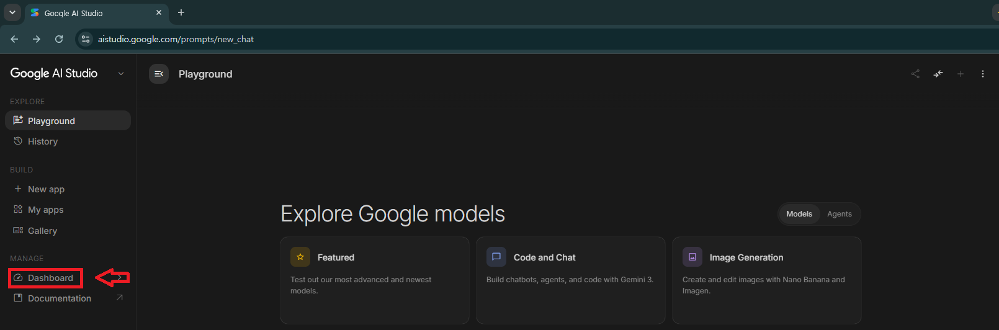

---
> Gemini API Key 생성

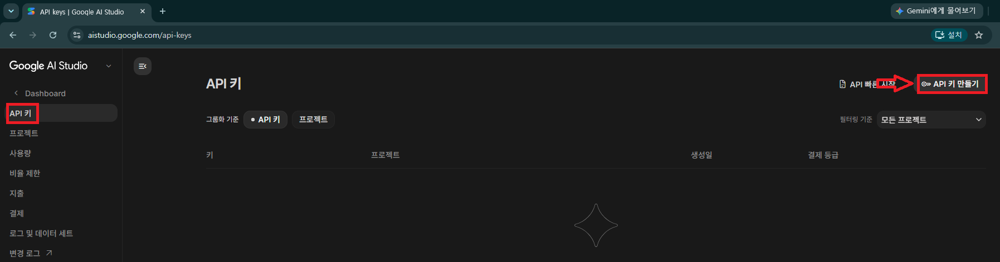

---
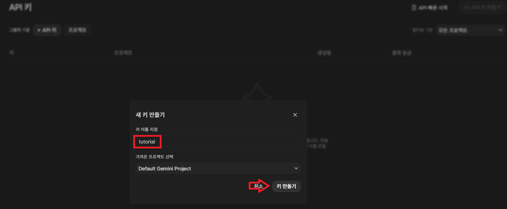

---
> 생성된 키 복사 

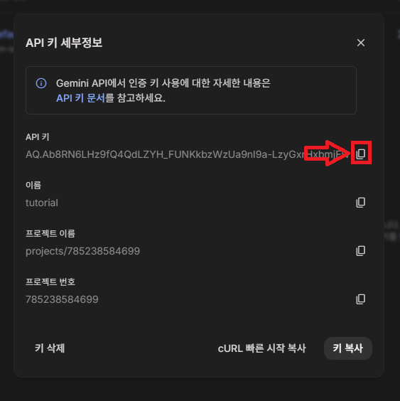

---
### 환경변수 파일 만들기
> `.env.example`을 참고해서 `.env` 파일을 만듭니다.
> 생성된 키를 `.env` 파일에 넣기 

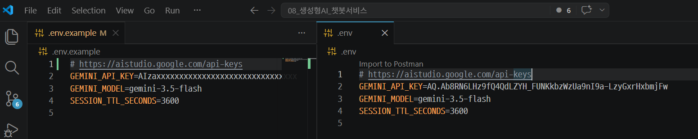

---
### 의존성 설치

```bash
uv sync
```

### 서버 실행

```bash
python -m uvicorn main:app --reload --port 8001
```
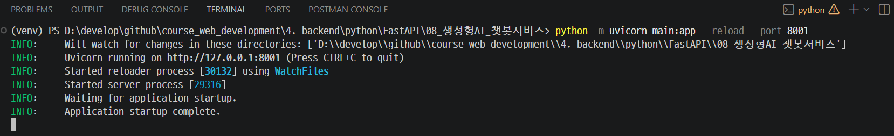

---
## Swagger UI 실습 (http://localhost:8001/docs)

> 각 API에서 **Try it out**을 누른 뒤 아래 순서대로 입력합니다.

---
### 실습 1. 단일 질문 보내기

`POST /ask`

```json
{
  "question": "FastAPI에서 비동기 처리가 필요한 이유를 중학생도 이해할 수 있게 설명해줘.",
  "temperature": 0.7,
  "max_tokens": 500,
  "system_instruction": "너는 한국어로 쉽게 설명하는 백엔드 강사야."
}
```
---
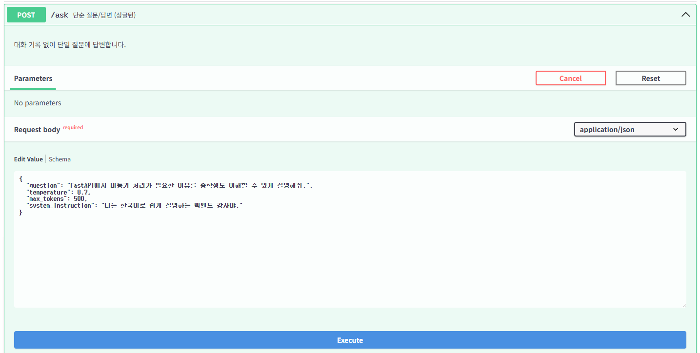

---
확인할 것:
- 응답 상태 코드가 `200 OK`입니다.
- 응답에 `answer`, `input_tokens`, `output_tokens`, `total_tokens`가 들어옵니다.

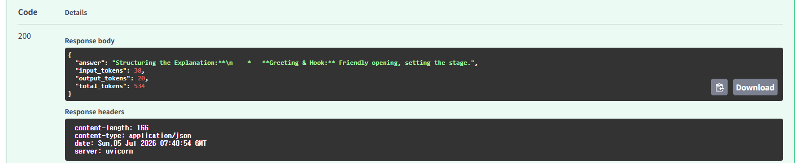

---
### 실습 2. 검증 오류 확인하기

`POST /ask`

```json
{
  "question": "",
  "temperature": 3,
  "max_tokens": 0,
  "system_instruction": "검증 오류 실습"
}
```
---
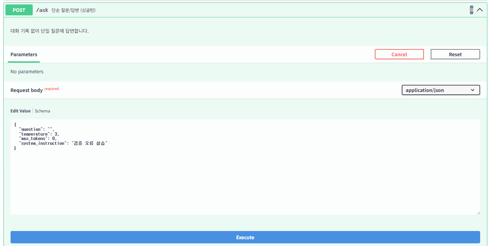

---
확인할 것:
- 응답 상태 코드가 `422 Unprocessable Entity`입니다.
- `question`, `temperature`, `max_tokens` 검증 오류가 `detail` 목록에 표시됩니다.

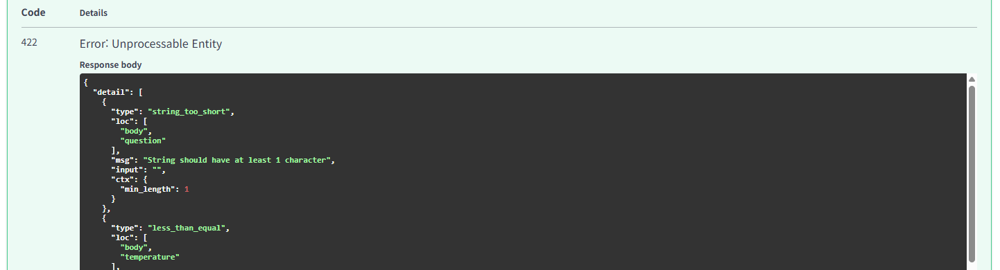

---
### 실습 3. 새 대화 세션 만들기

`POST /chat/sessions`

Swagger UI의 `system_instruction` Query Parameter에 다음 값을 입력합니다.

```text
너는 한국어로 답변하는 FastAPI 튜터야.
```
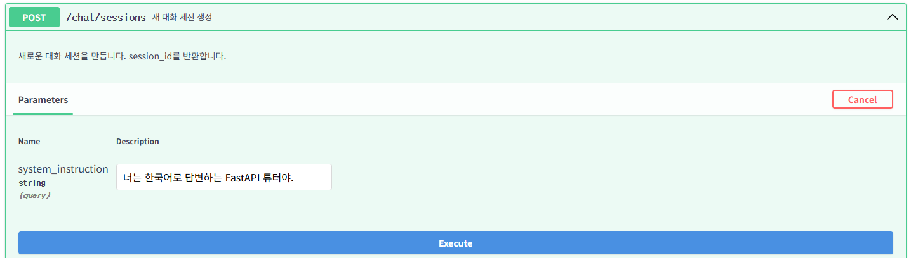

---
확인할 것:
- 응답 상태 코드가 `201 Created`입니다.
- 응답의 `session_id`를 복사해 둡니다.

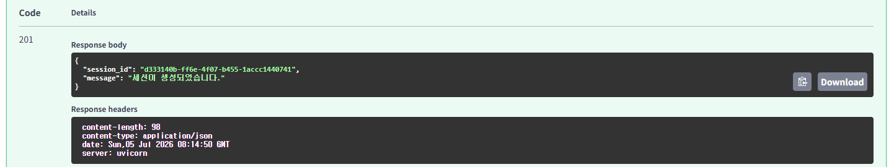

---
### 실습 4. 세션에 첫 메시지 보내기

`POST /chat/{session_id}`

실습 3에서 복사한 값을 `session_id`에 넣습니다.

```json
{
  "message": "FastAPI 라우터를 왜 분리해서 쓰는지 설명해줘.",
  "temperature": 0.7,
  "max_tokens": 800
}
```
---
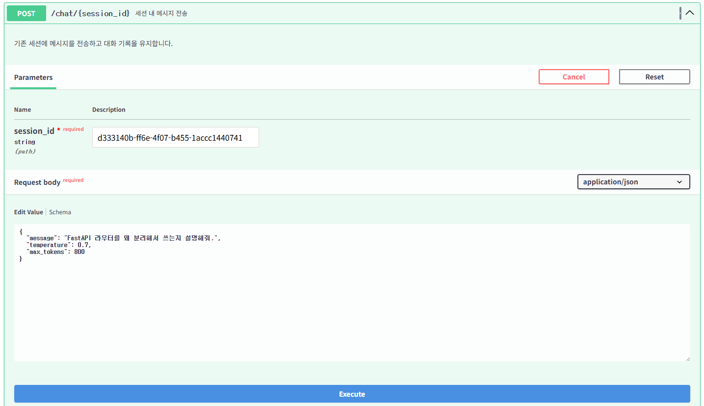

---
확인할 것:
- 응답 상태 코드가 `200 OK`입니다.
- `history_length`가 증가합니다.

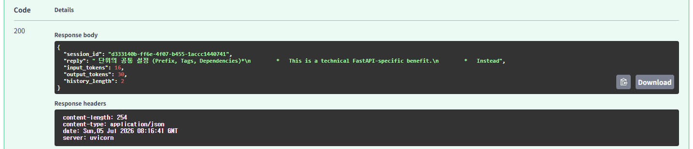

---
### 실습 5. 같은 세션에 이어서 질문하기

`POST /chat/{session_id}`

```json
{
  "message": "방금 설명을 이 프로젝트의 routers, services, schemas 구조에 맞춰 다시 설명해줘.",
  "temperature": 0.7,
  "max_tokens": 800
}
```
---
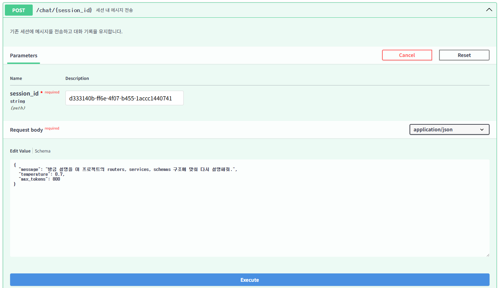

---
확인할 것:
- 이전 대화 맥락을 반영한 답변이 반환됩니다.
- 같은 `session_id`로 대화가 이어집니다.

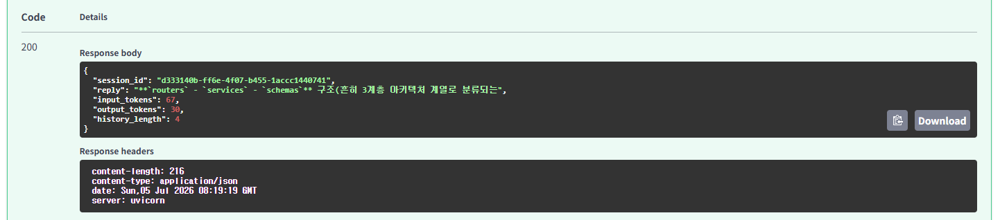

---
### 실습 6. 대화 기록 조회하기

`GET /chat/{session_id}/history`

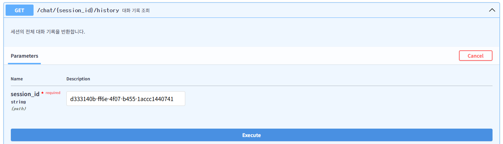

---
확인할 것:
- 응답 상태 코드가 `200 OK`입니다.
- `role`과 `text`가 들어간 대화 기록 목록이 반환됩니다.
- 사용자의 메시지와 모델의 답변이 함께 저장되어 있습니다.

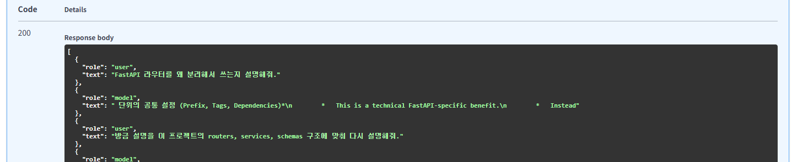

---
### 실습 7. 활성 세션 목록 확인하기

`GET /sessions`

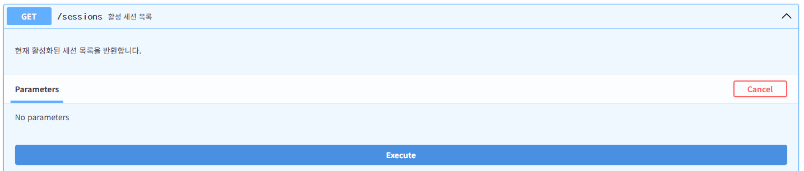

---
확인할 것:
- 방금 만든 `session_id`가 목록에 들어 있습니다.
- `created_ago_sec`, `last_used_ago_sec`, `history_turns`를 확인할 수 있습니다.

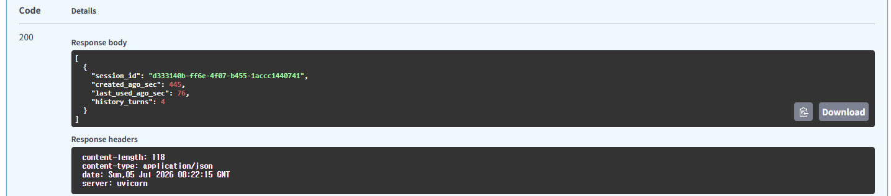

---
### 실습 8. 토큰 사용량 확인하기

`GET /stats`

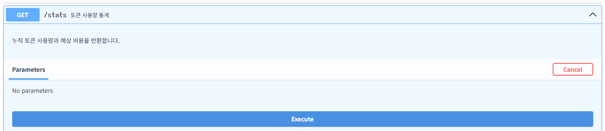

---
확인할 것:
- `total_requests`가 통계 기록이 들어간 `/ask`, `/chat/{session_id}` 호출 횟수와 연결됩니다.
- `total_input_tokens`, `total_output_tokens`, `total_tokens`가 누적됩니다.
- `active_sessions`는 현재 메모리에 남아 있는 세션 수입니다.

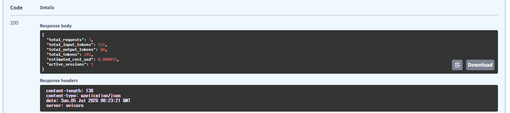

---
### 실습 9. 스트리밍 질문 보내기

`POST /ask/stream`

```json
{
  "question": "SSE 스트리밍 응답을 FastAPI에서 사용하는 이유를 설명해줘.",
  "temperature": 0.7,
  "max_tokens": 500,
  "system_instruction": "짧은 문장으로 설명해줘."
}
```
---
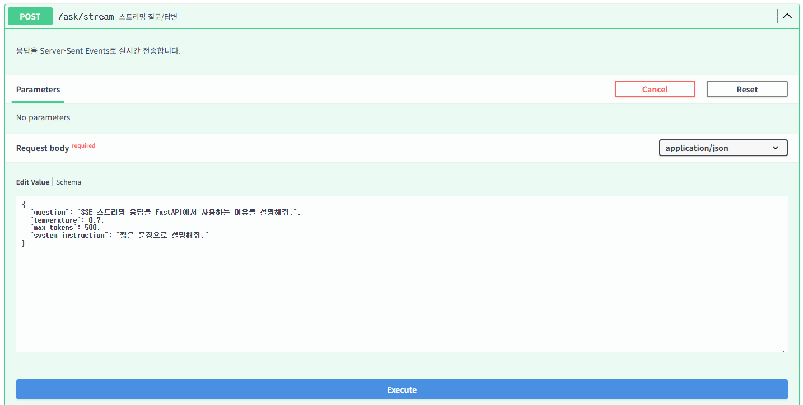

---
확인할 것:
- 응답 Content-Type이 `text/event-stream`입니다.
- 응답 본문에 `data:` 줄과 마지막 `data: [DONE]`이 포함됩니다.

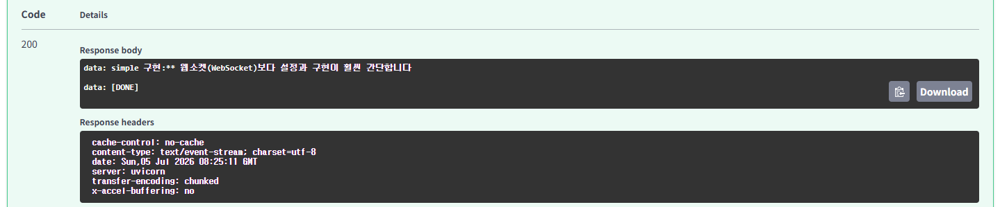

---
### 실습 10. 세션 삭제 후 404 확인하기

`DELETE /chat/{session_id}`

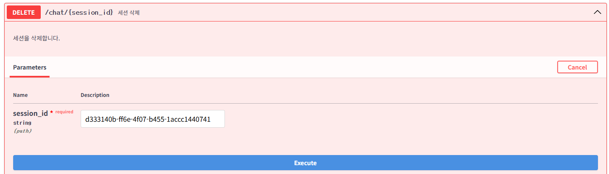

---
확인할 것:
- 응답 상태 코드가 `200 OK`입니다.
- 삭제 메시지가 반환됩니다.

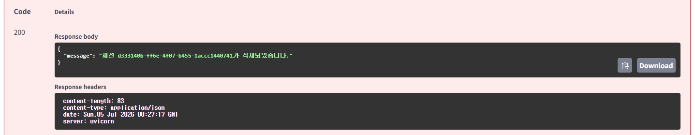

---
이어서 같은 `session_id`로 다시 실행합니다.

`GET /chat/{session_id}/history`

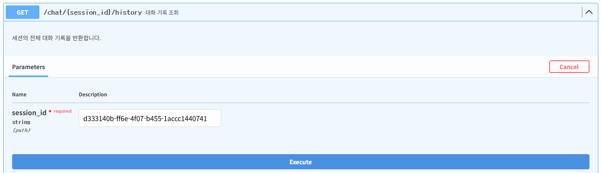

---
확인할 것:
- 응답 상태 코드가 `404 Not Found`입니다.
- 세션을 찾을 수 없다는 `detail`이 반환됩니다.

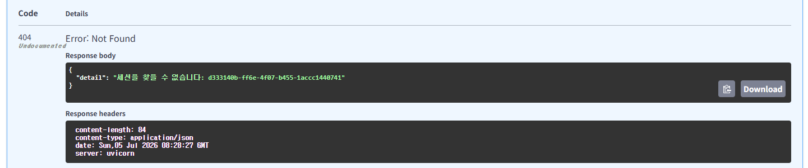

---
## 오류 상황 읽기

| 상태 코드 | 상황 | 확인할 것 |
|---|---|---|
| `400` | Gemini 요청이 잘못됨 | 모델명, 요청 내용, Gemini API 메시지 확인 |
| `401` | Gemini API 인증/권한 오류 | `.env`의 `GEMINI_API_KEY` 확인 |
| `404` | 존재하지 않는 세션 ID | `session_id`를 다시 복사했는지 확인 |
| `422` | 요청 본문/파라미터 검증 실패 | `Field` 조건 확인 |
| `429` | Gemini 사용량 제한 | 잠시 뒤 다시 실행하거나 사용량 한도 확인 |
| `502` | 그 밖의 Gemini API 오류 | 네트워크, 모델명, API 상태 확인 |

---
## 핵심 패턴 요약

| 기능 | 코드 패턴 |
|---|---|
| 단일 비동기 호출 | `await client.aio.models.generate_content(...)` |
| 단일 스트리밍 호출 | `client.aio.models.generate_content_stream(...)` |
| Chat 세션 생성 | `client.chats.create(...)` |

---
| 기능 | 코드 패턴 |
|---|---|
| 동기 Chat 비동기화 | `await asyncio.to_thread(chat.send_message, ...)` |
| SSE 응답 | `StreamingResponse(generator(), media_type="text/event-stream")` |
| 세션 저장 | `sessions: dict[str, SessionData] = {}` |
| 사용량 기록 | `stats.record(input_tokens, output_tokens)` |
| 오류 변환 | `app.add_exception_handler(errors.APIError, gemini_error_handler)` |
