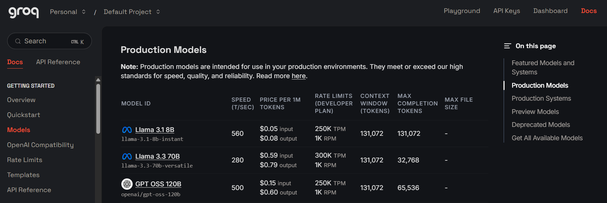
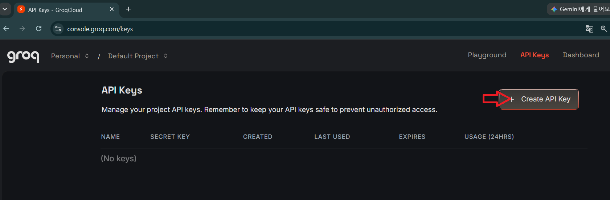
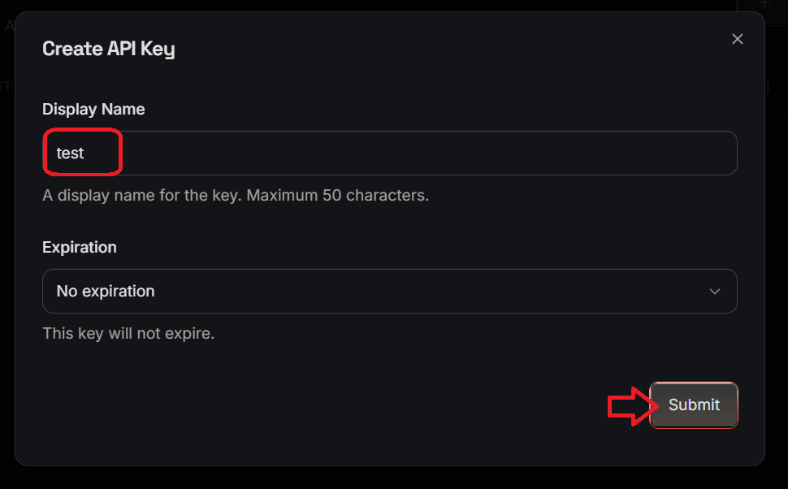
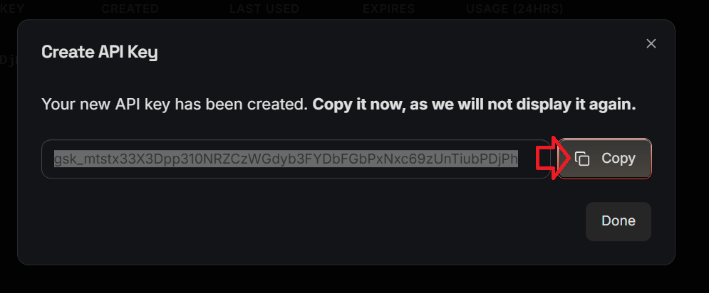
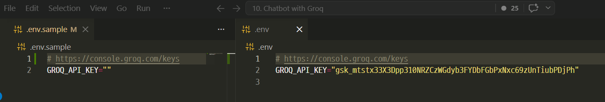
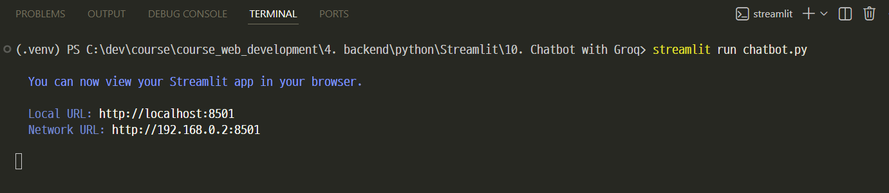
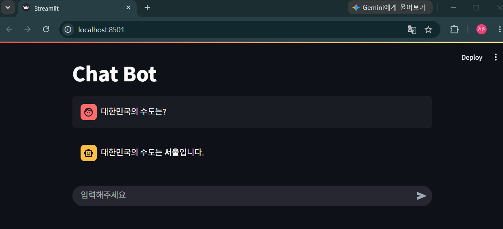

# Groq를 이용한 Chatbot 예제 

---
## [Groq](https://groq.com/) 
- Groq는 AI 모델을 빠르고 저렴하게 실행(Inference)하기 위해 만들어진 AI 인프라 회사입니다. 
- 특히 GPU 대신 자체 개발한 LPU(Language Processing Unit) 칩을 사용하여 LLM 추론 속도를 크게 높인 것이 특징입니다.

---
### Groq 특징 

| 항목     | 설명                                    |
| ------ | ------------------------------------- |
| 주요 사업  | AI Inference(추론) 플랫폼                  |
| 자체 칩   | LPU (Language Processing Unit)        |
| 특징     | 매우 낮은 지연시간(Low Latency), 높은 Token/sec |
| API 제공 | OpenAI와 유사한 API 제공                    |
| 지원 모델  | Llama, Qwen, Gemma 등 다양한 오픈소스 모델      |
| 사용 목적  | 챗봇, AI Agent, 음성 AI, 실시간 서비스          |

---
### [Groq 모델](https://console.groq.com/docs/models)
> Groq 정책에 따라 사용가능한 Models은 변경될 수 있음 



---
# 테스트 

---
## [Groq API Key 발급](https://console.groq.com/keys)


---


---
> 생성된 API Key 복사 



> .env 파일 생성 복사한 API Key 적용 



---
## 가상환경
1. 챗봇 프로젝트 폴더로 이동
2. 가상환경 만들기
```shell 
uv venv .venv --python 3.12
```
3. 가상환경 접속
```shell 
.\.venv\Scripts\activate
```
4. 라이브러리 설치 
```shell
uv pip install -r .\requirements.txt
```

---
## 챗봇 실행 
```shell
streamlit run chatbot.py
```


---
> 실행 결과 


