# Streamlit + FastAPI Chatbot

---
## 10번 강의와 달라지는 점

10번:

```text
Streamlit -> Groq
```

11번:

```text
Streamlit -> FastAPI -> Groq
```

Streamlit은 더 이상 Groq SDK를 직접 알 필요가 없습니다.
화면은 HTTP API만 호출합니다.

---
## 왜 FastAPI를 사이에 둘까?

Streamlit만으로도 챗봇은 만들 수 있습니다.

하지만 서비스 구조로 보면 FastAPI 백엔드를 두는 편이 더 좋습니다.

- API Key를 화면 코드에서 분리할 수 있습니다.
- 모바일 앱, 웹 프론트엔드, 관리자 페이지가 같은 API를 사용할 수 있습니다.
- Swagger UI로 요청/응답을 먼저 테스트할 수 있습니다.
- 검증, 오류 처리, 스트리밍 응답을 백엔드에서 통제할 수 있습니다.

---
## 전체 구조

```text
사용자
  |
  v
Streamlit frontend/app.py
  |
  | HTTP POST /chat/stream
  v
FastAPI backend/main.py
  |
  | GROQ_API_KEY
  v
Groq LLM
```

---
## 프로젝트 구조

```text
Chatbot with FastAPI/
├── backend/
│   ├── main.py              <- FastAPI 앱 생성 + 라우터 등록
│   ├── core/
│   │   ├── config.py        <- 환경변수, 앱 메타데이터
│   │   └── groq_client.py   <- Groq 클라이언트 생성
│   ├── schemas/
│   │   └── chat.py          <- 요청/응답 Pydantic 모델
│   ├── services/
│   │   └── chat_service.py  <- Groq 호출, SSE 데이터 생성
│   └── routers/
│       ├── health.py        <- /, /health
│       └── chat.py          <- /chat, /chat/stream
├── frontend/
│   ├── app.py               <- Streamlit 화면 조립
│   └── common/
│       ├── config.py        <- 프론트 환경변수와 기본값
│       ├── message.py       <- 대화 메시지 생성
│       └── api_client.py    <- FastAPI 호출, SSE 파싱
└── .env.example             <- 환경변수 예시
```

---
### backend 모듈화 기준

| 계층 | 담당 |
|---|---|
| `backend/main.py` | 앱 생성과 라우터 연결 |
| `backend/routers/` | URL과 HTTP 응답 방식 |
| `backend/schemas/` | 요청/응답 데이터 모양 |
| `services/` | 실제 Groq 호출과 스트리밍 처리 |
| `backend/core/` | 환경변수와 외부 클라이언트 |

---
### frontend 모듈화 기준

| 파일 | 담당 |
|---|---|
| `frontend/app.py` | Streamlit UI와 화면 흐름 |
| `frontend/common/config.py` | FastAPI URL, 기본 옵션 |
| `frontend/common/message.py` | `role`, `content` 메시지 생성 |
| `frontend/common/api_client.py` | `/health`, `/chat/stream` 호출 |

---
## FastAPI(backend) 엔드포인트

| 메서드 | 경로 | 기능 |
|---|---|---|
| `GET` | `/` | 서버 안내 |
| `GET` | `/health` | 서버와 API Key 설정 상태 확인 |
| `POST` | `/chat` | 일반 JSON 챗봇 응답 |
| `POST` | `/chat/stream` | SSE 스트리밍 챗봇 응답 |
| `GET` | `/docs` | Swagger UI |

---
### 요청 데이터

`POST /chat`, `POST /chat/stream`은 같은 요청 모양을 사용합니다.

```json
{
  "message": "Streamlit과 FastAPI를 분리하면 어떤 장점이 있어?",
  "history": [],
  "temperature": 0.7,
  "max_tokens": 800
}
```

---
### 요청 검증

FastAPI는 Pydantic 모델로 요청을 검증합니다.

| 필드 | 조건 |
|---|---|
| `message` | 1자 이상, 2000자 이하 |
| `history` | 최대 20개 메시지 |
| `temperature` | `0.0` 이상, `2.0` 이하 |
| `max_tokens` | `1` 이상, `4096` 이하 |

조건을 어기면 FastAPI가 자동으로 `422` 응답을 반환합니다.

---
### FastAPI 서버 코드 핵심

```python
def create_app() -> FastAPI:
    app = FastAPI(
        title=APP_TITLE,
        description=APP_DESCRIPTION,
        version=APP_VERSION,
    )

    app.include_router(health_router)
    app.include_router(chat_router)

    return app
```

FastAPI 서버는 화면을 만들지 않습니다.
`main.py`는 앱을 만들고 라우터만 연결합니다.

---
### Groq 클라이언트 생성

`backend/core/groq_client.py`

```python
def get_client() -> Groq:
    global _client

    if _client is None:
        _client = Groq(api_key=require_groq_api_key())

    return _client
```

API Key는 `.env`에만 둡니다.
Streamlit 화면 코드에는 Groq API Key를 넣지 않습니다.

---
### 일반 JSON 응답

`backend/services/chat_service.py`

```python
response = get_client_for_request().chat.completions.create(
    model=GROQ_MODEL,
    messages=build_messages(req),
    temperature=req.temperature,
    max_completion_tokens=req.max_tokens,
)
```

`POST /chat`은 답변이 완성될 때까지 기다렸다가 JSON으로 반환합니다.

---
### 스트리밍 응답

`backend/services/chat_service.py`

```python
stream = client.chat.completions.create(
    model=GROQ_MODEL,
    messages=build_messages(req),
    temperature=req.temperature,
    max_completion_tokens=req.max_tokens,
    stream=True,
)
```

`POST /chat/stream`은 답변 조각을 받는 즉시 Streamlit으로 전달합니다.

---
### Server-Sent Events(SSE) 형식
- `SSE`는 웹 서버가 클라이언트(브라우저)에게 실시간으로 데이터를 계속 푸시(push) 할 수 있게 해주는 기술입니다.
- `FastAPI`는 스트리밍 데이터를 Server-Sent Events 형식으로 보냅니다.

```text
data: {"token": "안녕"}

data: {"token": "하세요"}

data: [DONE]
```

Streamlit은 이 줄을 읽고 `token`만 꺼내 화면에 이어 붙입니다.

---
## Streamlit(frontend) 화면 코드 핵심

```python
if "messages" not in st.session_state:
    st.session_state.messages = []
```

Streamlit은 새로고침처럼 스크립트가 다시 실행되는 구조입니다.
대화 기록은 `st.session_state`에 저장해야 화면에 계속 남습니다.

---
### Streamlit(frontend)에서 FastAPI(backend) 호출

`frontend/common/api_client.py`

```python
with requests.post(
    f"{api_base_url}/chat/stream",
    json=payload,
    stream=True,
    timeout=(5, 120),
) as response:
    response.raise_for_status()
```

Streamlit은 Groq를 직접 호출하지 않습니다.
FastAPI의 `/chat/stream` API만 호출합니다.

---
### 화면에 스트리밍 출력

`frontend/app.py`

```python
answer = st.write_stream(
    stream_answer(
        api_base_url=api_url,
        prompt=prompt,
        history=history,
        temperature=temperature,
        max_tokens=max_tokens,
    )
)
```

`st.write_stream()`은 generator가 주는 문자열을 실시간으로 화면에 출력합니다.

---
# 서버 실행

---
## 가상환경 만들기

가상환경을 만들고 활성화합니다.
```shell
uv sync
.\.venv\Scripts\activate
```
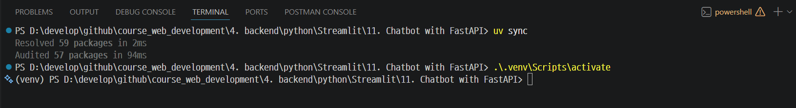

---
## 환경변수
> `.env.example`을 참고해서 `.env` 파일을 만듭니다.
> `GROQ_API_KEY`에는 Groq Console에서 발급한 실제 API Key를 넣습니다.

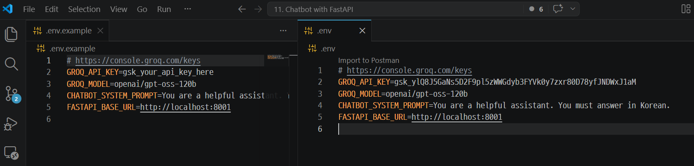

---
## FastAPI 실행

```shell
python -m uvicorn backend.main:app --reload --port 8001
```
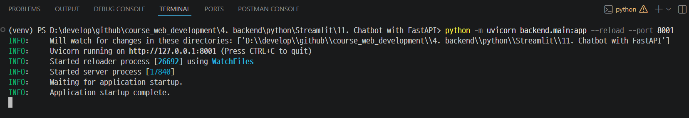

---
### Swagger 실습 (http://localhost:8001/docs)
> 각 API에서 **Try it out**을 누른 뒤 아래 순서대로 입력합니다.

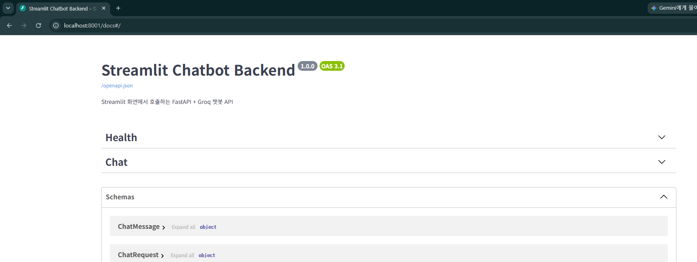

---
#### 상태 확인

`GET /health`

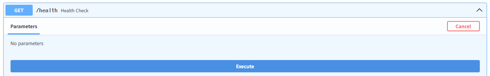

---
확인할 것:

- 응답 상태 코드가 `200 OK`입니다.
- `groq_api_key`가 `configured`이면 `.env`에 API Key 형식의 값이 있는 상태입니다.
- `placeholder`이면 예제값이므로 실제 Groq API Key로 교체합니다.
- `missing`이면 `.env`의 `GROQ_API_KEY`를 확인합니다.
- `/chat`에서 `Groq API Key가 유효하지 않거나 폐기되었습니다.`가 나오면 새 API Key를 발급해 `.env`에 다시 넣습니다.

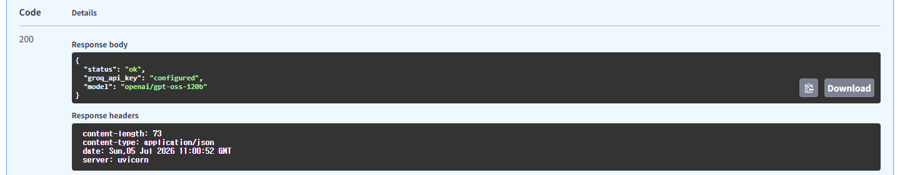

---
#### 일반 챗봇 응답

`POST /chat`

```json
{
  "message": "FastAPI와 Streamlit을 함께 쓰는 이유를 짧게 설명해줘.",
  "history": [],
  "temperature": 0.7,
  "max_tokens": 500
}
```
---
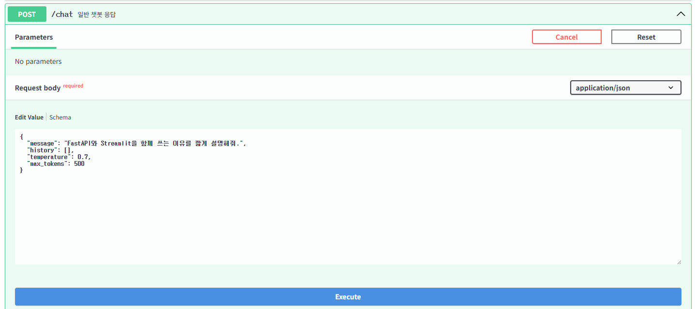

---
확인할 것:
- 응답에 `reply`가 들어옵니다.
- `elapsed_ms`로 응답 시간을 확인할 수 있습니다.

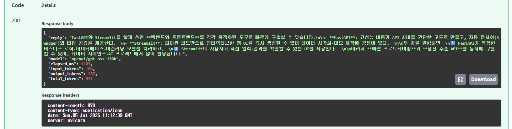

---
## Streamlit 실행
- FastAPI 실행하고 있는 상태에서 실행 
```shell
streamlit run frontend/app.py
```
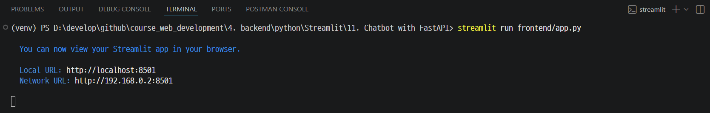

---
#### 챗봇 테스트 

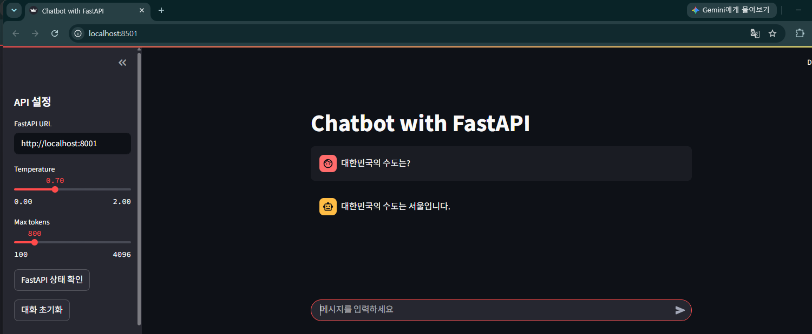

---
#### FastAPI 상태 확인 

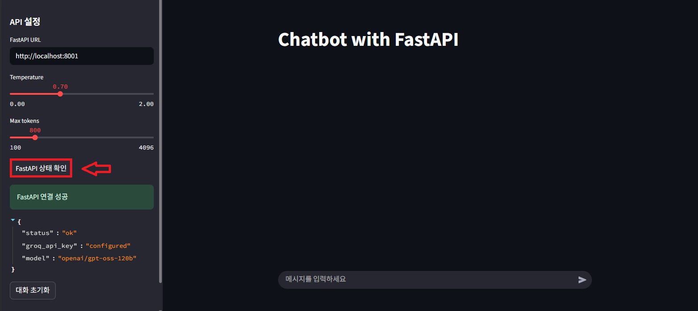
