# Supabase 프로젝트 설정과 ERD 설계

---
## [1. Supabase란](https://supabase.com/)

Supabase는 **오픈소스 Firebase 대안**으로, PostgreSQL 데이터베이스와 인증·저장소·실시간 구독 기능을 함께 제공합니다.

---
### Supabase 특징

| 특징 | 설명 |
|------|------|
| PostgreSQL 사용 | 업계 표준 RDBMS, 학습한 내용이 그대로 실무로 이어짐 |
| REST API 자동 생성 | Python 클라이언트(supabase-py)로 바로 사용 가능 |
| Auth 내장 | 회원가입·로그인을 직접 구현하지 않아도 됨 |
| [무료 플랜](https://supabase.com/pricing) | 개인 프로젝트·학습에 충분 |
| 대시보드 | SQL Editor, Table Editor 등 시각적 도구 제공 |

---
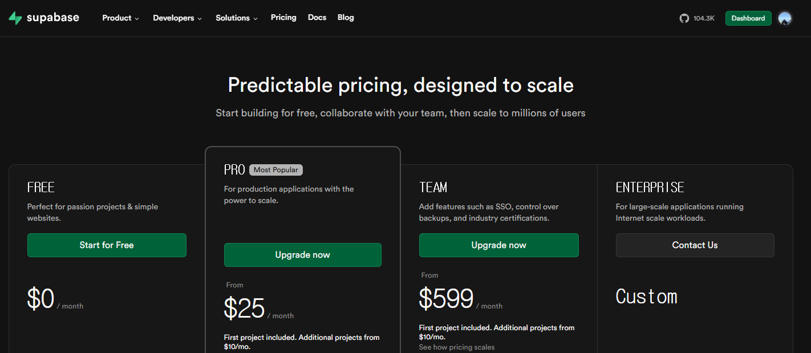

---
## 2. Supabase 프로젝트 생성

---
### 2-1. 가입 및 프로젝트 생성

1. [supabase.com](https://supabase.com) → **Start your project** → GitHub 또는 이메일로 가입
2. **New project** 버튼 클릭

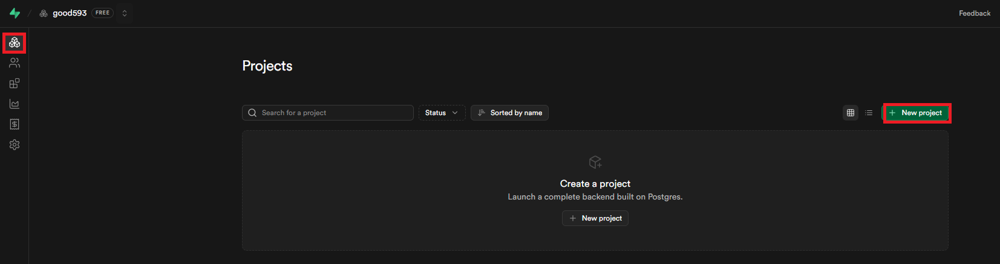

---
3. 아래 항목 입력:

| 항목 | 권장 값 |
|------|--------|
| Project Name | `fastapi-lecture` |
| Database Password | 강력한 비밀번호 (기록해 두기!) |
| Region | `Asia-Pacific` |

4. **Create new project** 클릭 → 데이터베이스 초기화 1~2분 대기

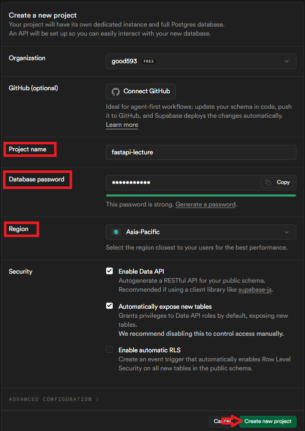

---
### 2-2. 프로젝트 대시보드 구성
> 초기화 완료 후 보이는 메뉴:

```
좌측 메뉴
  ├── Table Editor   — 테이블 데이터를 GUI로 조회·수정
  ├── SQL Editor     — SQL 직접 실행
  ├── Authentication — 사용자 계정 관리 (6교시)
  ├── Storage        — 파일 저장
  └── Project Settings
          ├── General  — 프로젝트 URL
          └── API      — API 키
```

---
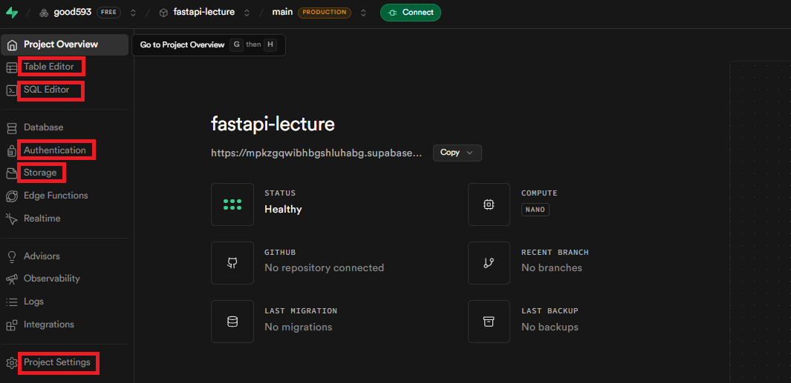

---
## 3. API 키 이해하기
> **Project Settings → API** 에서 아래 값들을 확인합니다.

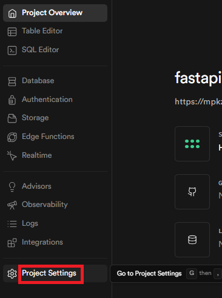

---
| 항목 | 위치 | 공개 가능 여부 | 용도 |
|------|------|---------------|------|
| Project URL | URL 섹션 | 공개 가능 | `SUPABASE_URL` |
> `https://<Proejct ID>.supabase.co`
> 예시: `https://mpkzgqwibhbgshluhabg.supabase.co`

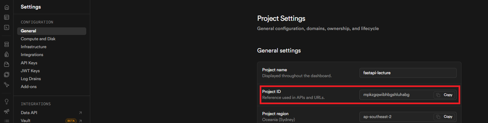

---
| 항목 | 위치 | 공개 가능 여부 | 용도 |
|------|------|---------------|------|
| Publishable key(`anon public`) | API Keys | 공개 가능 (RLS 필수) | 클라이언트 앱 |
| Secret keys(`service_role`) | API Keys | **절대 공개 금지** | FastAPI 서버 전용 |

---
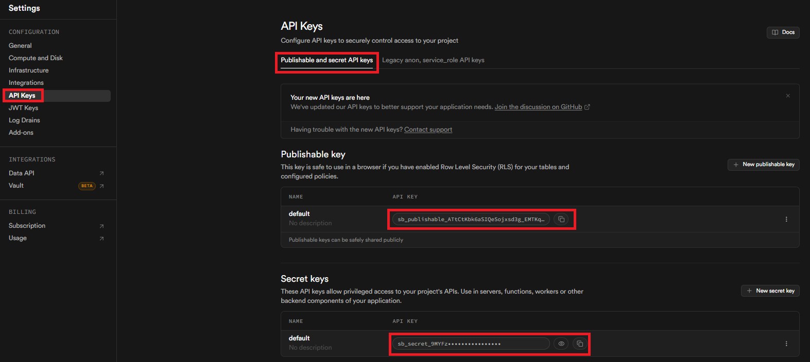

---
### Secret keys(`service_role`) 키 보안 규칙

```
>   service_role 키는 RLS(행 수준 보안)를 우회합니다.
    이 키를 가진 사람은 모든 테이블의 모든 데이터를 읽고 쓸 수 있습니다.

절대 안 되는 것:
  - GitHub에 올리기
  - 프론트엔드(React, Vue) 코드에 넣기
  - 동료에게 채팅으로 전송하기

해야 하는 것:
  - .env 파일에만 저장
  - .env를 .gitignore에 추가
  - 서버(FastAPI) 코드에서만 사용
```

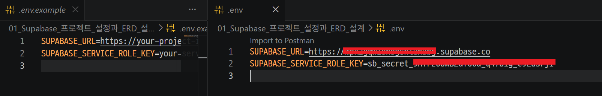

---
## 4. 대화 서비스 ERD 설계
> 이번 과정 전체에서 사용할 도메인: **사용자별 AI 대화 서비스**

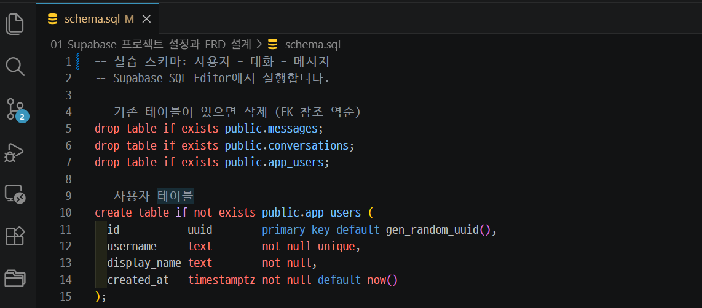

---
### ERD (Entity-Relationship Diagram)

```
app_users          conversations          messages
    │                    │                    │
    │   1 : N            │   1 : N            │
    └───────────────────►│                    │
                         └───────────────────►│
```

- 1명의 사용자 → N개의 대화방 (1:N)
- 1개의 대화방 → N개의 메시지 (1:N)

---
### 설계 결정 이유

| 결정 | 이유 |
|------|------|
| 사용자/대화/메시지를 3개 테이블로 분리 | 각자 독립적으로 수정 가능, 데이터 중복 제거 |
| `role` 컬럼으로 구분 | OpenAI API 형식과 동일 — LLM에 바로 전달 가능 |
| `created_at` 저장 | 메시지 순서 복원, 최신 대화 정렬에 필수 |
| `id`를 UUID로 | 여러 서버에서 동시 생성해도 충돌 없음, Supabase Auth(`auth.users.id`)와 자연스럽게 연동 |
| `on delete cascade` | 사용자 삭제 시 대화방·메시지 자동 삭제 |
| `CHECK (role IN (...))` | DB 레벨에서 잘못된 role 저장 차단 |

---
### 외래 키와 ON DELETE CASCADE

```sql
user_id UUID NOT NULL REFERENCES app_users(id) ON DELETE CASCADE
```

사용자를 삭제하면:

```
DELETE app_users WHERE id = 'u1'
  ↓ cascade
  conversations WHERE user_id = 'u1' → 자동 삭제
    ↓ cascade
    messages WHERE conversation_id IN (...) → 자동 삭제
```

`ON DELETE CASCADE`가 없다면 FK를 참조하는 하위 데이터가 있는 한 삭제가 거부됩니다.
직접 삭제하려면 messages → conversations → app_users 순서로 삭제해야 합니다.

---
## 5. `schema.sql`을 SQL Editor에서 실행

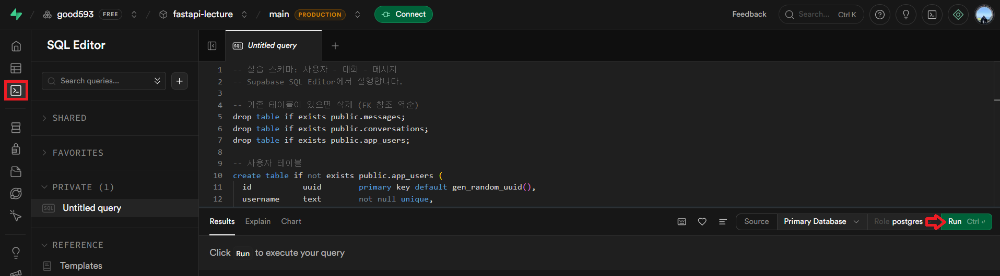

---
### 결과 확인 

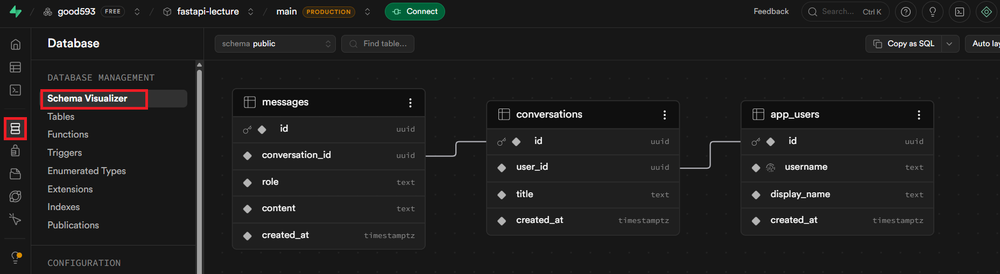


