# SQL Editor 실습 & Table Editor 활용

---
## 1. 제약 조건 동작 확인
> SQL Editor에서 아래 쿼리들을 실행해서 제약이 실제로 동작하는지 확인합니다.

---
### Insert Data

```sql
INSERT INTO public.app_users (username, display_name) VALUES ('kim', '김학생');
```
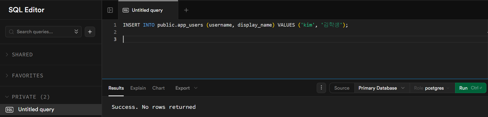

---
### UNIQUE 위반

```sql
-- 같은 username으로 다시 추가 시도 → 오류 발생!
INSERT INTO public.app_users (username, display_name) VALUES ('kim', '김이름');
-- ERROR: duplicate key value violates unique constraint "app_users_username_key"
```
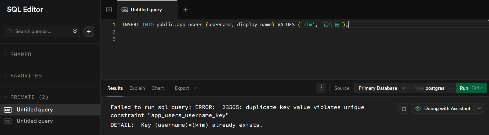

---
### NOT NULL 위반
```sql
INSERT INTO public.app_users (username) VALUES ('noname');
-- ERROR: null value in column "display_name" violates not-null constraint
```
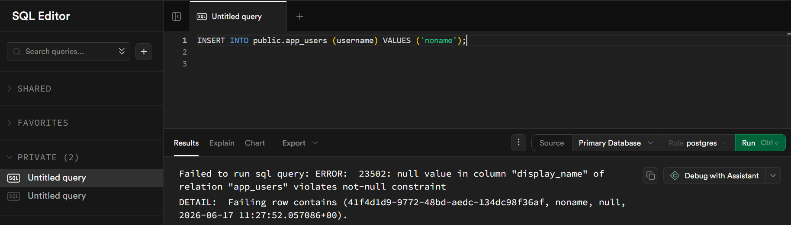

---
### FK 위반: 존재하지 않는 user_id
```sql
INSERT INTO public.conversations (user_id, title)
VALUES ('00000000-0000-0000-0000-000000000000', '테스트');
-- ERROR: violates foreign key constraint
```
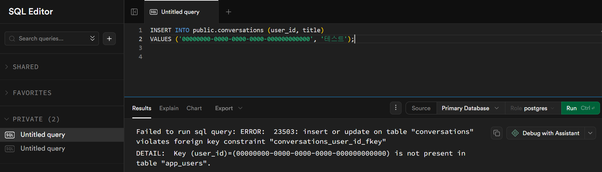

---
### CHECK 위반: 허용되지 않은 role
```sql
INSERT INTO public.messages (conversation_id, role, content)
VALUES ('대화_UUID', 'bot', '안녕');
-- ERROR: violates check constraint
```
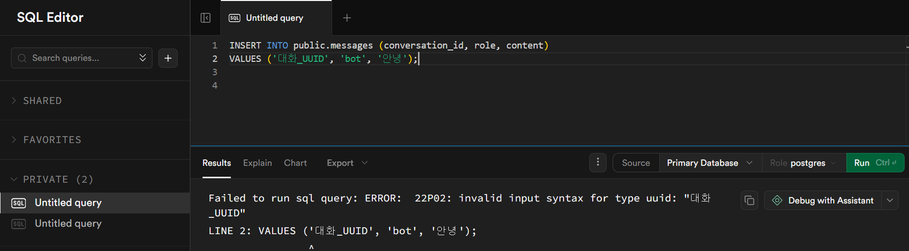

---
## 2. 데이터 준비 실습

```sql
INSERT INTO public.app_users (username, display_name) VALUES ('lee', '이학생');
```
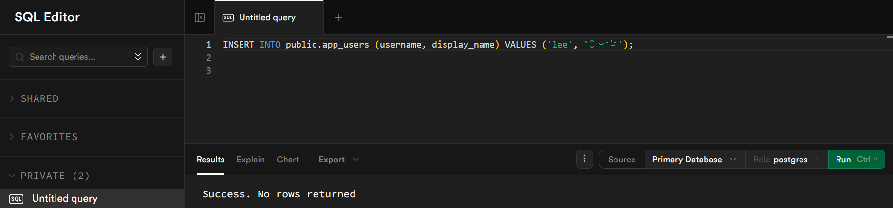

---
```sql
-- kim의 UUID를 복사
select * from public.app_users
where 1=1 
and username = 'kim';
```
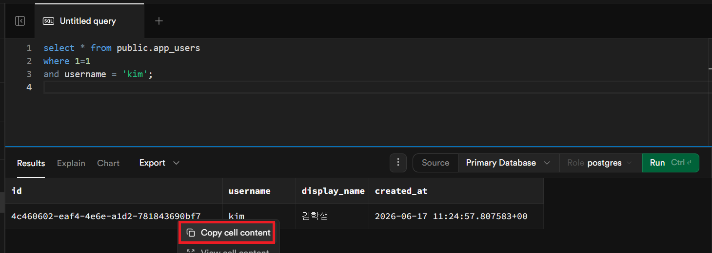

---
```sql
INSERT INTO public.conversations (user_id, title)
VALUES ('복사한-UUID', 'FastAPI 공부')
RETURNING *;  -- 저장된 행을 바로 반환
```
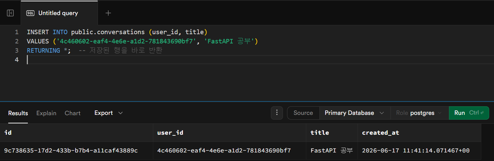

---
```sql
-- 대화방의 UUID를 복사하여 메시지 추가
INSERT INTO public.messages (conversation_id, role, content)
VALUES ('대화방-UUID', 'user', '안녕하세요!');
INSERT INTO public.messages (conversation_id, role, content)
VALUES ('대화방-UUID', 'assistant', '안녕하세요! 무엇을 도와드릴까요?');
```
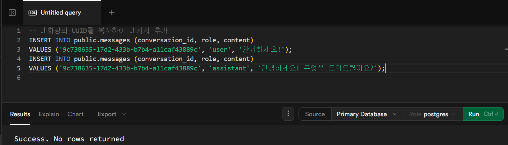

---
## 3. JOIN 실습 — 3개 테이블 연결

```sql
SELECT
  u.username,
  u.display_name,
  c.title         AS conversation_title,
  m.role,
  m.content,
  m.created_at
FROM public.messages m
JOIN public.conversations c ON c.id = m.conversation_id
JOIN public.app_users    u ON u.id = c.user_id
ORDER BY m.created_at ASC;
```

---
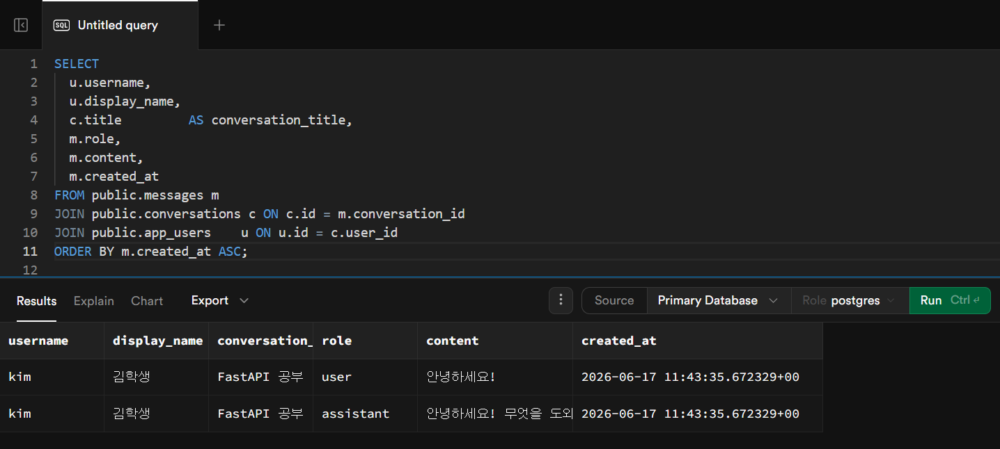

---
## 4. 집계 실습 — GROUP BY, HAVING

```sql
-- 사용자별 대화 수
SELECT u.username, COUNT(c.id) AS 대화수
FROM public.app_users u
LEFT JOIN public.conversations c ON c.user_id = u.id
GROUP BY u.id, u.username
ORDER BY 대화수 DESC;
```

---
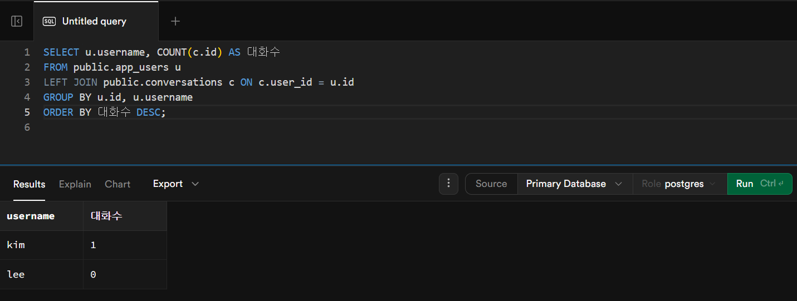

---
```sql
-- 메시지가 2개 이상인 대화방만 조회 (HAVING — 집계 후 필터)
SELECT conversation_id, COUNT(*) AS 메시지수
FROM public.messages
GROUP BY conversation_id
HAVING COUNT(*) >= 2
ORDER BY 메시지수 DESC;
```
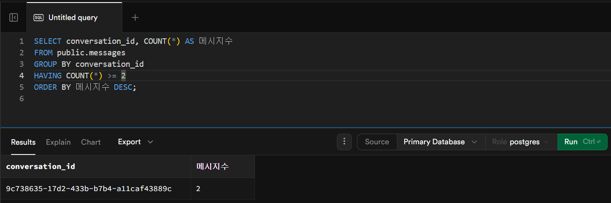

---
## 5. Supabase Table Editor 활용

SQL만으로는 직관적이지 않을 때 Table Editor를 사용합니다.

- **테이블 내용 보기**: 좌측 메뉴 → Table Editor → 테이블 선택
- **행 직접 추가/수정/삭제**: `+ Insert row`, 셀 클릭 편집, 행 선택 후 Delete
- **필터/정렬**: 상단 바의 Filter, Sort 버튼

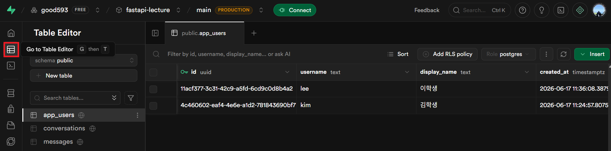

