# Supabase Python 클라이언트와 FastAPI 연동

---
## 1. 가상환경 생성
```bash
# pyproject.toml과 uv.lock 기준으로 의존성 설치
uv sync
```
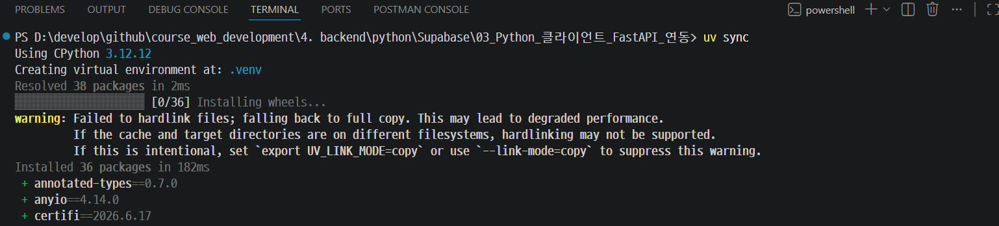

---
## 2. 환경 변수로 API 키 관리

---
### 왜 환경 변수를 써야 하는가

> 해킹의 위험이 발생함 
```python
# 하드코딩 — GitHub에 올리면 즉시 노출
supabase = create_client(
    "https://abcdef.supabase.co",
    "eyJhbGciOiJIUzI1NiIsInR5cCI6IkpXVCJ9...",
)
```
> 중요한 정보(키)를 코드에서 확인이 불가능함 -> 해킹 위험이 없음 
```python
# 환경 변수 — 코드에 키가 없음
import os
from dotenv import load_dotenv

load_dotenv()  # .env 파일 읽기
supabase = create_client(
    os.environ["SUPABASE_URL"], os.environ["SUPABASE_SERVICE_ROLE_KEY"],
)
```

---
### .env.example → .env 파일 구성
> Supabase의 Settings를 통해 API Key 확인

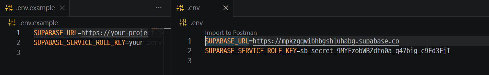

---
## 3. Supabase 클라이언트 vs SQL 비교

`Supabase 클라이언트`는 SQL을 Python 메서드 체이닝으로 표현합니다.

| SQL 문법 | Supabase 클라이언트 |
|----------|--------------------|
| `SELECT * FROM app_users` | `.table("app_users").select("*")` |
| `SELECT id, username FROM ...` | `.select("id, username")` |
| `WHERE id = 'xxx'` | `.eq("id", "xxx")` |
| `WHERE role != 'system'` | `.neq("role", "system")` |
| `ORDER BY created_at DESC` | `.order("created_at", desc=True)` |
| `ORDER BY created_at ASC` | `.order("created_at", desc=False)` |

---
| SQL 문법 | Supabase 클라이언트 |
|----------|--------------------|
| `LIMIT 10` | `.limit(10)` |
| `INSERT INTO ... VALUES (...)` | `.insert({...})` |
| `INSERT ... RETURNING *` | `.insert({...})` (기본적으로 생성된 행 반환) |
| `UPDATE ... SET ... WHERE` | `.update({...}).eq("id", id)` |
| `DELETE FROM ... WHERE` | `.delete().eq("id", id)` |

마지막에 반드시 `.execute()`를 붙여야 실행됩니다.

```python
# execute() 없으면 실행 안 됨!
result = supabase.table("app_users").select("*").execute()
#                                                ↑ 반드시 필요
```

---
## 3. Supabase 클라이언트 테스트 
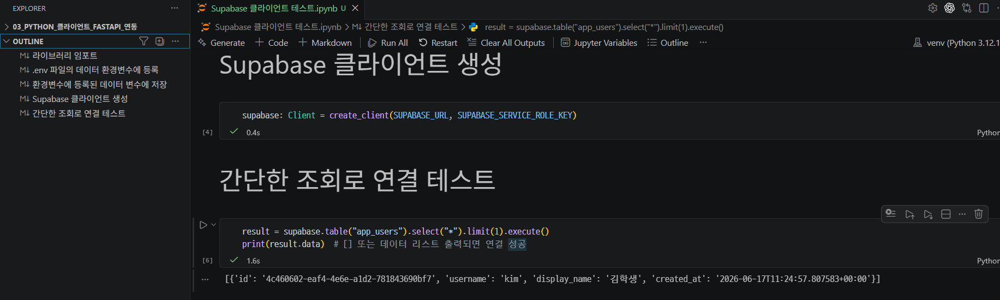

---
## 4. FastAPI 엔드포인트 연결
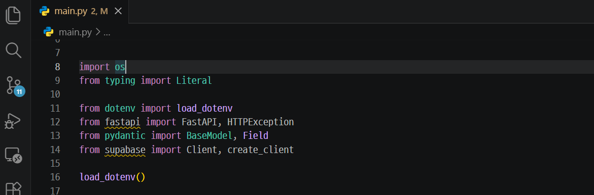

---
### Pydantic 모델 데이터를 딕셔너리로 변환

```python
from pydantic import BaseModel

class UserCreate(BaseModel):
    username: str
    display_name: str

data = UserCreate(username="kim", display_name="김학생")

# .model_dump()로 딕셔너리로 변환
payload = data.model_dump()  # {"username": "kim", "display_name": "김학생"}

result = supabase.table("app_users").insert(payload).execute()
```

---
### 사용자 생성

```python
from fastapi import FastAPI, HTTPException
from pydantic import BaseModel, Field

app = FastAPI()

class UserCreate(BaseModel):
    username: str = Field(..., min_length=2, max_length=30)
    display_name: str = Field(..., min_length=1, max_length=50)


@app.post("/users", status_code=201)
def create_user(data: UserCreate):
    ...
```

---
### 사용자 목록 조회

```python
@app.get("/users")
def list_users():
    result = (
        supabase.table("app_users")
        .select("*")
        .order("created_at", desc=True)
        .execute()
    )
    return result.data  # 빈 리스트여도 그냥 반환
```

---
### 대화방 메시지 조회

```python
@app.get("/conversations/{conversation_id}/messages")
def list_messages(conversation_id: str):
    result = (
        supabase.table("messages")
        .select("*")
        .eq("conversation_id", conversation_id)
        .order("created_at")  # 오래된 것부터 (기본 ASC)
        .execute()
    )
    return result.data
```

---
## 5. 서버 실행 및 Swagger 실습

---
### 서버 실행

```bash
# 1. .env 파일에 실제 키 입력
# 2. 서버 실행
uvicorn main:app --reload --port 8001
```
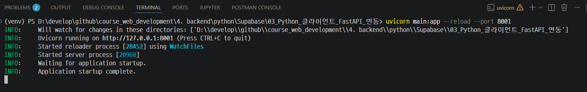

---
### Swagger UI 실습 (http://localhost:8001/docs)

---
> `POST /users` → Body에 `{"username": "hong", "display_name": "홍길동"}` → Execute

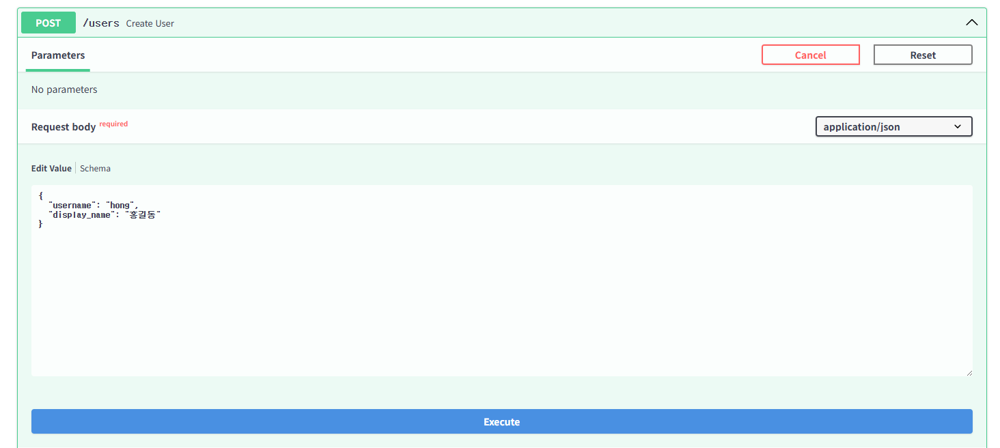

---
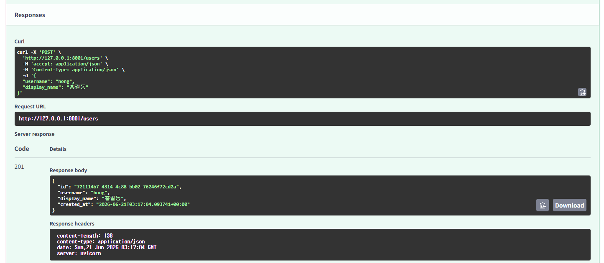

---
> `GET /users` 목록 확인

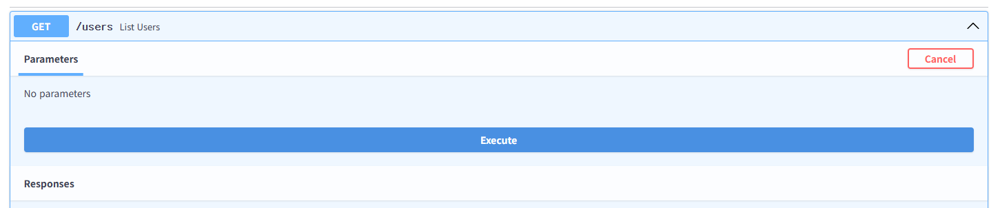

---
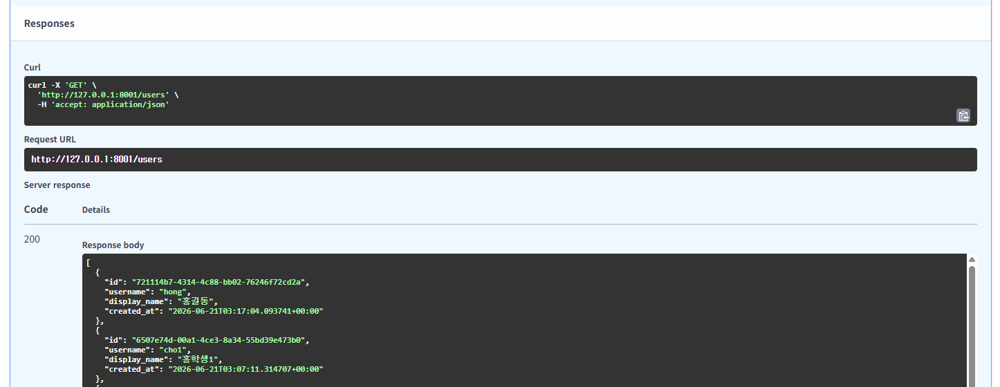

---
> `GET /users` 목록 확인을 통해 user_id 복사 
> `POST /conversations` → Body에 `{"user_id": "복사한-UUID", "title": "첫 대화"}` → Execute → `id` 복사

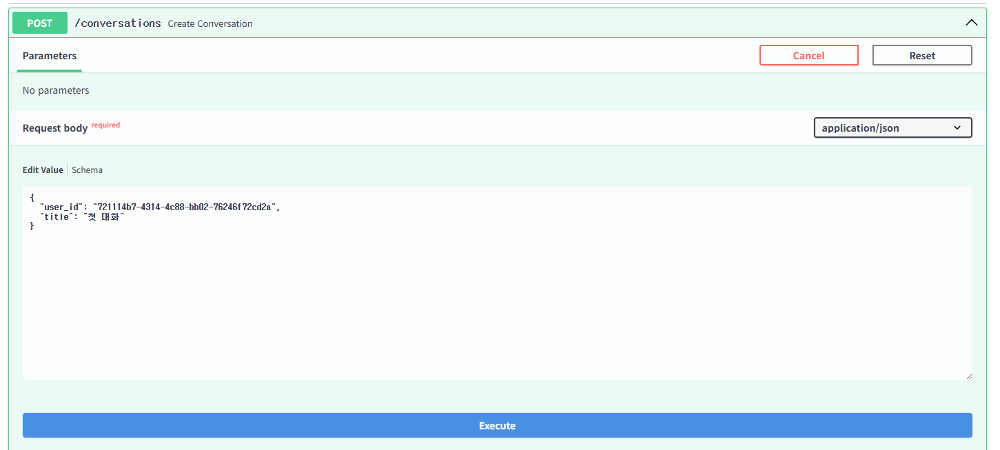

---
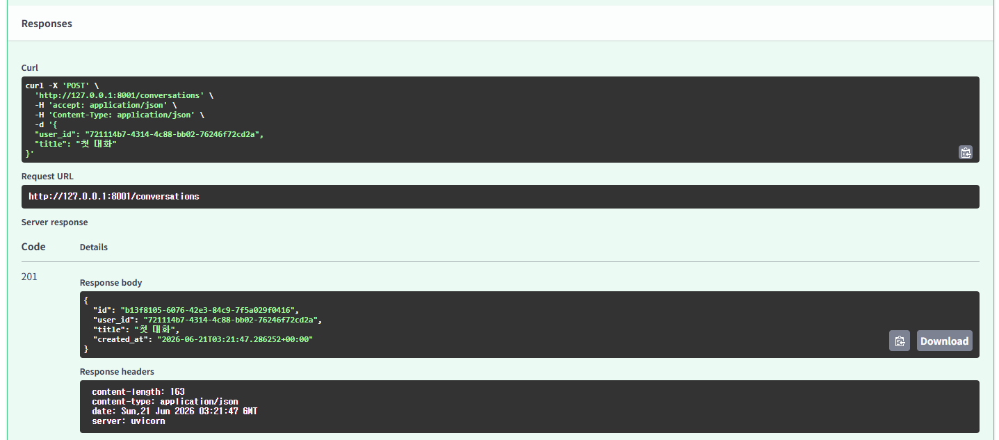

---
> `POST /conversations/{id}/messages` → Body에 `{"role": "user", "content": "안녕!"}` → Execute

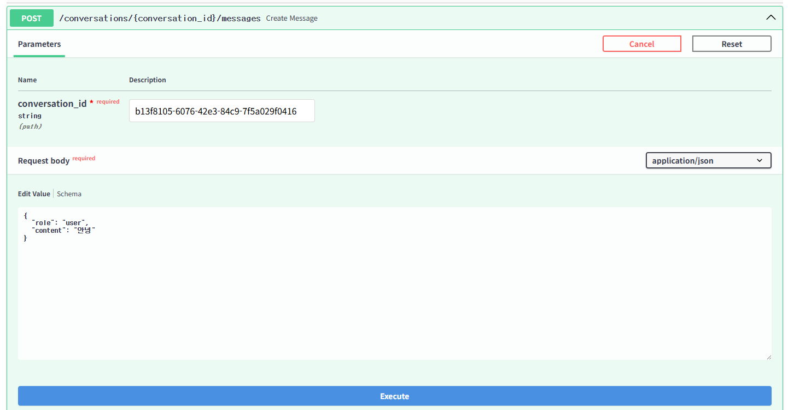

---
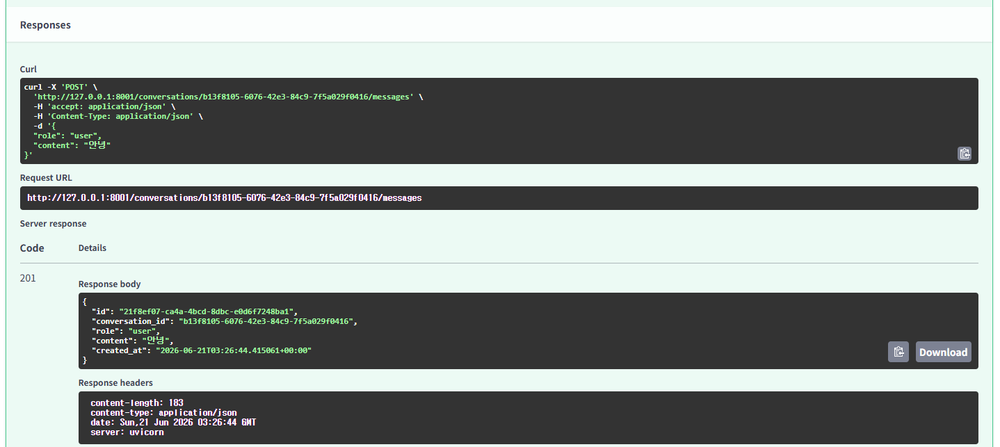

---
> `POST /conversations/{id}/messages` → Body에 `{"role": "assistant", "content": "안녕하세요!"}` → Execute

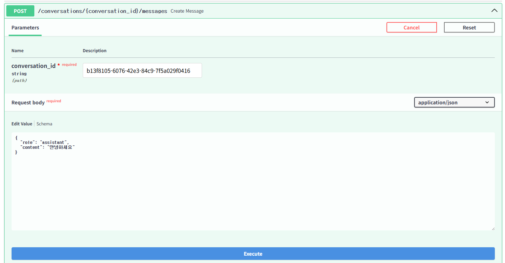

---
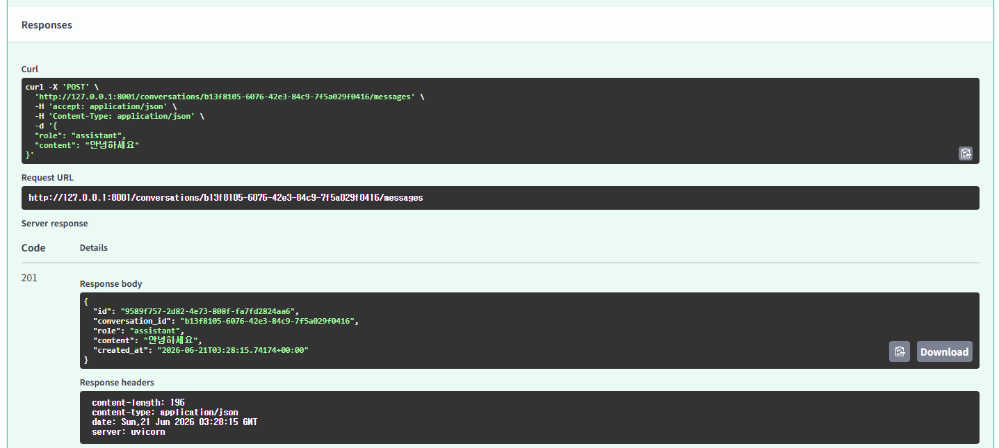

---
> `GET /conversations/{id}/messages` → 메시지 2개 확인

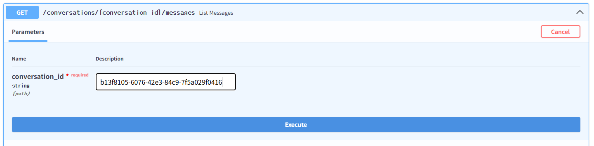

---
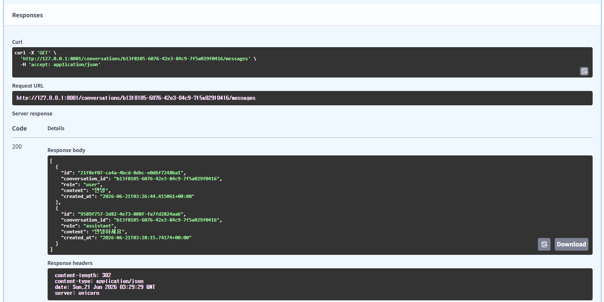

---
> Supabase Table Editor에서 저장된 데이터 직접 확인

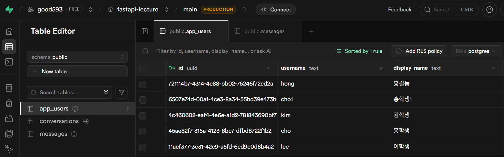
