# Pydantic 스키마 설계와 Repository 패턴

---
## 1. Pydantic Field 제약

`Field`를 사용하면 입력값에 세밀한 규칙을 설정할 수 있습니다.

```python
from pydantic import BaseModel, Field
from typing import Literal, Optional

class UserCreate(BaseModel):
    username: str = Field(..., min_length=2, max_length=30)
    #                     ↑    ↑             ↑
    #                   필수  최소 2자       최대 30자
    display_name: str = Field(..., min_length=1, max_length=50)
```

---
| 파라미터 | 의미 | 예시 |
|---------|------|------|
| `...` | 필수 필드 (생략 불가) | `Field(...)` |
| `"기본값"` | 기본값 설정 | `Field("새 대화")` |
| `min_length` | 최소 문자 수 | `Field(..., min_length=2)` |
| `max_length` | 최대 문자 수 | `Field(..., max_length=50)` |
| `ge` | 이상 (greater or equal) | `Field(..., ge=1)` |
| `le` | 이하 (less or equal) | `Field(..., le=100)` |
| `gt` | 초과 | `Field(..., gt=0)` |
| `lt` | 미만 | `Field(..., lt=1000)` |

---
### Literal 타입 — 허용 값 목록
```python
from typing import Literal

class MessageCreate(BaseModel):
    role: Literal["user", "assistant", "system"]
    #     ↑ "user", "assistant", "system" 이외의 값은 422 오류
    content: str = Field(..., min_length=1, max_length=2000)
```

---
## 2. 422 Unprocessable Entity

입력값이 Pydantic 검증을 통과하지 못하면 FastAPI가 자동으로 422를 반환합니다.

```json
// POST /users 에 {"username": "a"} 보내면
{
  "detail": [
    {
      "type": "string_too_short",
      "loc": ["body", "username"],
      "msg": "String should have at least 2 characters",
      "input": "a",
      "ctx": {"min_length": 2}
    }
  ]
}
```

---
| 검증 규칙 위반 | HTTP 상태 | 오류 type |
|--------------|-----------|-----------|
| `min_length` 미달 | 422 | `string_too_short` |
| `max_length` 초과 | 422 | `string_too_long` |
| `Literal` 값 불일치 | 422 | `literal_error` |
| 필수 필드 누락 | 422 | `missing` |
| 타입 불일치 | 422 | `type_error` |

---
### Swagger에서 422 테스트

1. `POST /users` 클릭 → **Try it out**
2. Body에 `{"username": "a"}` 입력 (min_length=2 위반)
3. **Execute** → 422 응답 확인
4. `detail` 배열에서 어느 필드가 왜 실패했는지 확인

---
## 3. Repository 패턴이란

Repository 패턴은 **데이터 접근 코드를 별도 클래스에 모으는** 설계 패턴입니다.

---
### Repository 패턴 없이 (비추천)
> 엔드포인트마다 쿼리 코드가 직접 들어감

```python
@app.post("/users", status_code=201)
def create_user(data: UserCreate):
    result = (
        supabase.table("app_users")
        .insert(data.model_dump())
        .execute()
    )
    if not result.data:
        raise HTTPException(500, "저장 실패")
    return result.data[0]

# 패턴 반복...
```

---
### Repository 패턴 적용 (추천)
> Repository 클래스에 쿼리 로직을 모음

```python
class SupabaseRepository:
    def __init__(self, db: Client):
        self.db = db

    def one_or_404(self, rows: list[dict], detail: str) -> dict:
        if not rows:
            raise HTTPException(status_code=404, detail=detail)
        return rows[0]

    ...
```

---
> 엔드포인트는 경로·상태코드·흐름만 담당
```python
@app.post("/users", status_code=201, tags=["Users"])
def create_user(data: UserCreate, repo: SupabaseRepository = Depends(get_repo)):
    return repo.create_user(data)

@app.get("/users/{user_id}", tags=["Users"])
def get_user(user_id: str, repo: SupabaseRepository = Depends(get_repo)):
    return repo.get_user(user_id)
```

---
### Repository 패턴의 장점

| 장점 | 설명 |
|------|------|
| 코드 중복 제거 | 같은 쿼리 패턴을 한 곳에만 작성 |
| 엔드포인트 가독성 | 엔드포인트가 짧고 의도가 명확 |
| 오류 처리 일관성 | `one_or_404` 한 곳에서 관리 |
| 테스트 용이 | Repository만 교체해서 테스트 가능 |

---
## 4. one_or_404 헬퍼

```python
def one_or_404(self, rows: list[dict], detail: str) -> dict:
    if not rows:
        raise HTTPException(status_code=404, detail=detail)
    return rows[0]
```

사용 예:
```python
# 사용자 조회 — 없으면 404
result = self.db.table("app_users").select("*").eq("id", user_id).execute()
return self.one_or_404(result.data, "사용자를 찾을 수 없습니다")

# 대화방 조회 — 없으면 404
result = self.db.table("conversations").select("*").eq("id", conv_id).execute()
return self.one_or_404(result.data, "대화방을 찾을 수 없습니다")
```

---
## 5. 의존성 주입 (Depends)
> Repository를 `Depends`로 주입하면 엔드포인트마다 `SupabaseRepository(supabase)`를 쓰지 않아도 됩니다.

```python
from fastapi import Depends

def get_repo() -> SupabaseRepository:
    return SupabaseRepository(supabase)


@app.get("/users/{user_id}")
def get_user(
    user_id: str,
    repo: SupabaseRepository = Depends(get_repo),
    #     ↑ FastAPI가 get_repo()를 자동 호출해서 주입
):
    return repo.get_user(user_id)
```

---
### Depends 없이 vs Depends 사용
> Depends 없이 — 엔드포인트마다 직접 생성
```python
@app.get("/users/{user_id}")
def get_user(user_id: str):
    repo = SupabaseRepository(supabase)  # 매번 반복
    return repo.get_user(user_id)
```

> Depends 사용 — 자동 주입
```python
@app.get("/users/{user_id}")
def get_user(user_id: str, repo: SupabaseRepository = Depends(get_repo)):
    return repo.get_user(user_id)  # repo를 어떻게 만드는지 신경 쓸 필요 없음
```

---
## 6. 연관 데이터 사전 검증
> 대화방을 만들 때 `user_id`가 실제로 존재하는지 먼저 확인합니다.

```python
def create_conversation(self, user_id: str, data: ConversationCreate) -> dict:
    # 사용자 존재 확인 — 없으면 404
    self.get_user(user_id)

    payload = data.model_dump() | {"user_id": user_id}
    result = (
        self.db.table("conversations")
        .insert(payload)
        .execute()
    )
    return self.one_or_404(result.data, "대화방이 생성되지 않았습니다")
```

---
| 방법 | 장점 | 단점 |
|------|------|------|
| 사전 검증 없이 DB에 맡김 | 쿼리 한 번 절약 | FK 오류 메시지가 영어·기술적 |
| 사전 검증 후 저장 | 명확한 한국어 오류 메시지 | 쿼리 한 번 추가 |

```
FK 오류 메시지: "insert or update on table violates foreign key constraint"
사전 검증 메시지: "사용자를 찾을 수 없습니다"

→ 사용자 입장에서 두 번째가 훨씬 친절합니다.
```

---
## 7. 서버 실행 및 Swagger 실습

---
### 가상환경 생성
```bash
# pyproject.toml과 uv.lock 기준으로 의존성 설치
uv sync
```

### 서버 실행

```bash
# 1. .env 파일에 실제 키 입력
# 2. 서버 실행
uvicorn main:app --reload --port 8001
```

---
### Swagger UI 실습 (http://localhost:8001/docs)

> 각 API에서 **Try it out**을 누른 뒤 아래 순서대로 입력합니다.

---
### 실습 1. 사용자 생성

`POST /users` → Body에 `{"username": "hong", "display_name": "홍길동"}` → **Execute**
→ `201 Created` 확인 → 응답의 `id`를 `USER_ID`로 복사

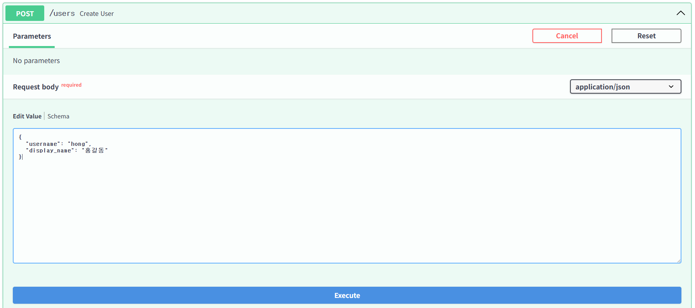

---
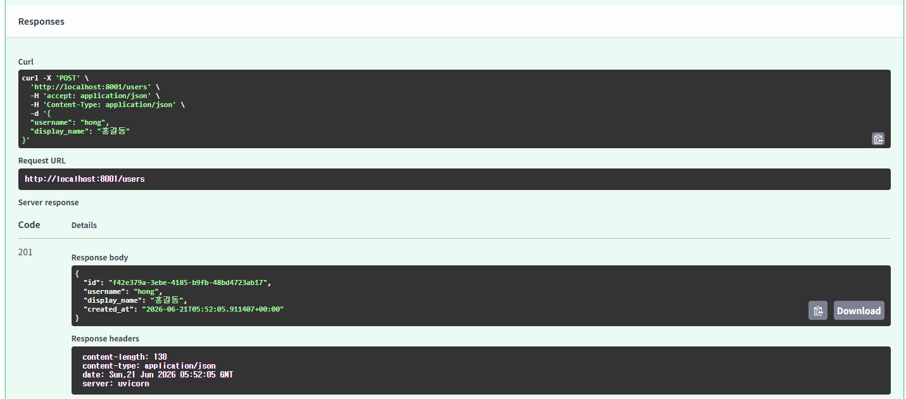

---
### 실습 2. Field 검증 실패

`POST /users` → Body에 `{"username": "a", "display_name": "홍길동"}` → **Execute**
→ `422 Unprocessable Entity` 확인 → 오류 type `string_too_short` 확인

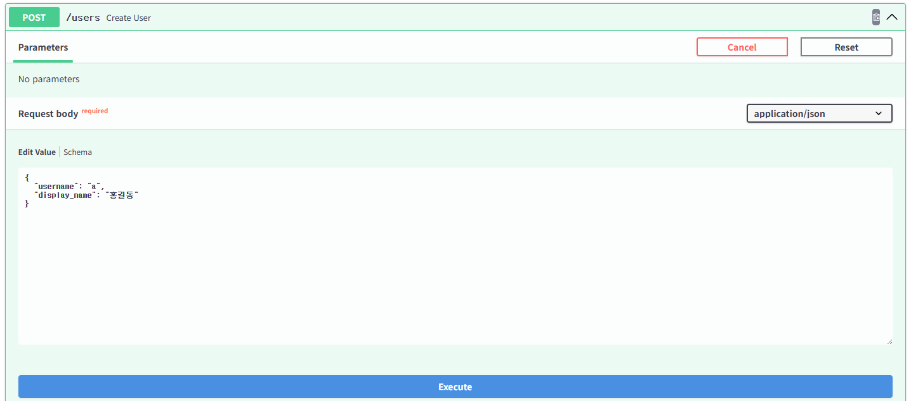

---
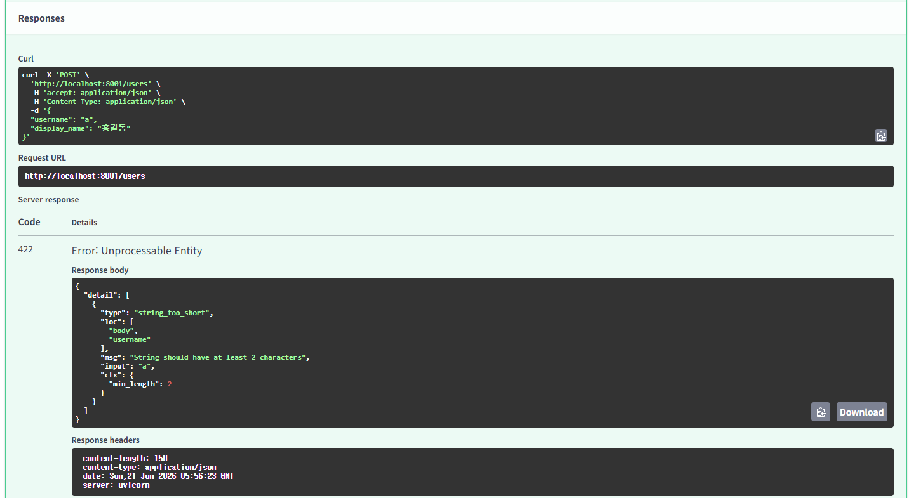

---
### 실습 3. 사용자 목록 및 단건 조회

`GET /users` → **Execute** → 전체 사용자 목록과 `200 OK` 확인

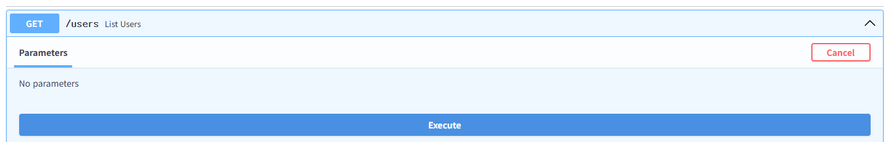

---
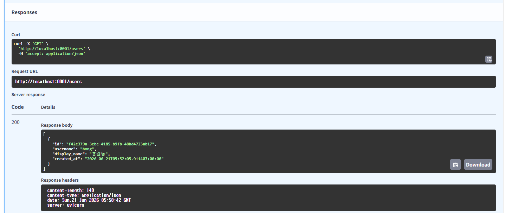

---
`GET /users/{user_id}` → `user_id`에 `USER_ID` 입력 → **Execute** → 홍길동 정보 확인

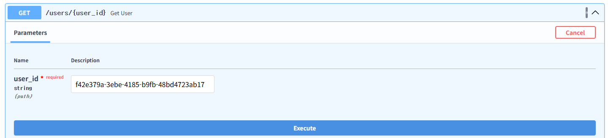

---
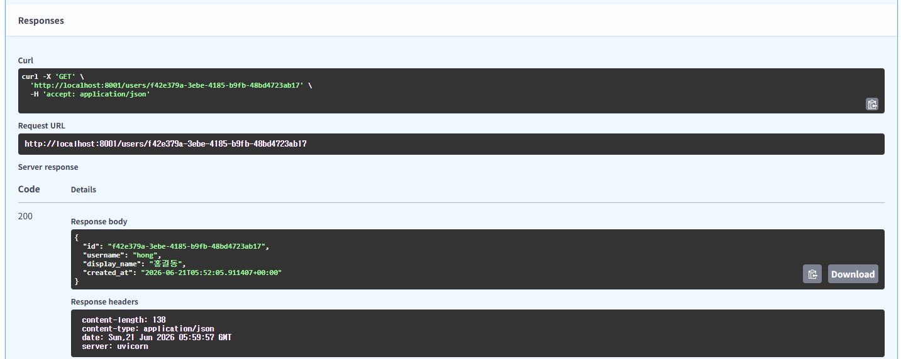

---
`GET /users/{user_id}` → `user_id`에 `00000000-0000-0000-0000-000000000000` 입력 → **Execute**
→ `404 Not Found`와 `{"detail": "사용자를 찾을 수 없습니다"}` 확인

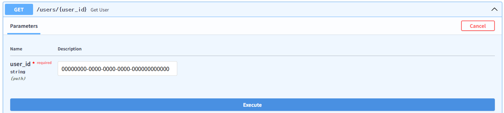

---
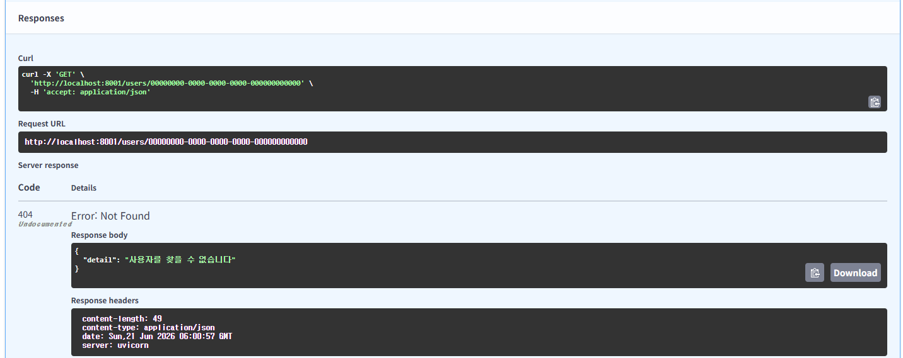

---
### 실습 4. 대화방 생성

`POST /users/{user_id}/conversations` → `user_id`에 `USER_ID` 입력 → Body에 `{"title": "FastAPI 공부"}` → **Execute**
→ `201 Created` 확인 → 응답의 `id`를 `CONVERSATION_ID`로 복사

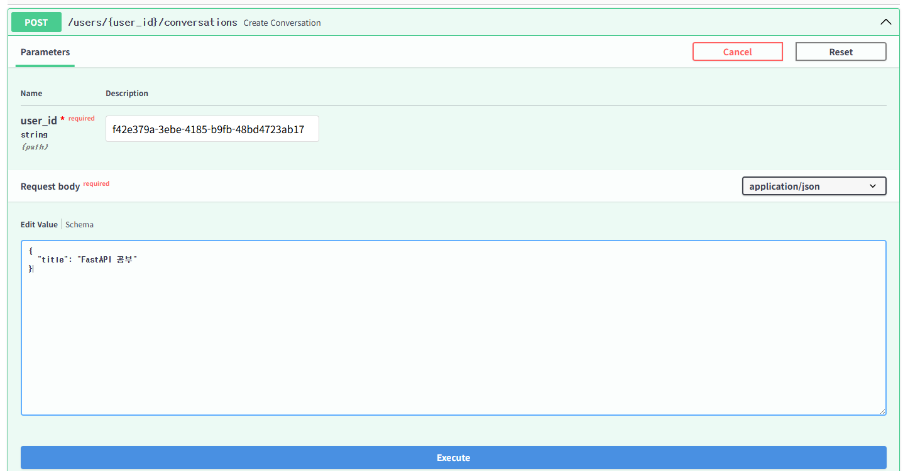

---
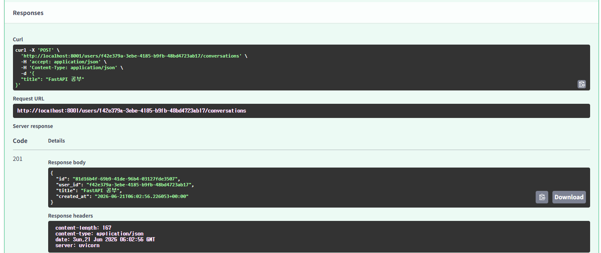

---
`POST /users/{user_id}/conversations` → `user_id`에 `USER_ID` 입력 → Body에 `{}` → **Execute**
→ 기본 제목이 `"새 대화"`인지 확인

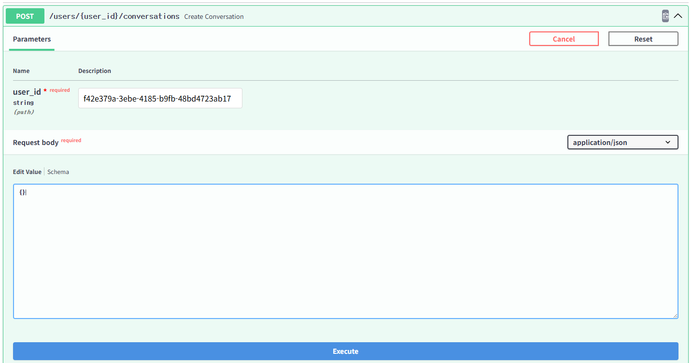

---
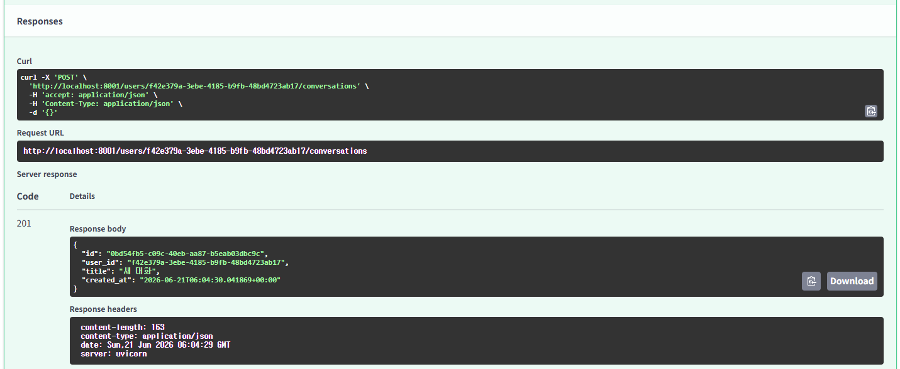

---
### 실습 5. 대화방 목록 조회

`GET /users/{user_id}/conversations` → `user_id`에 `USER_ID` 입력 → **Execute**
→ 대화방이 최신순으로 반환되는지 확인

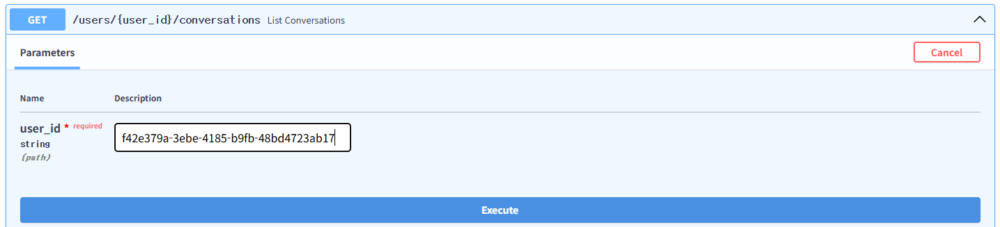

---
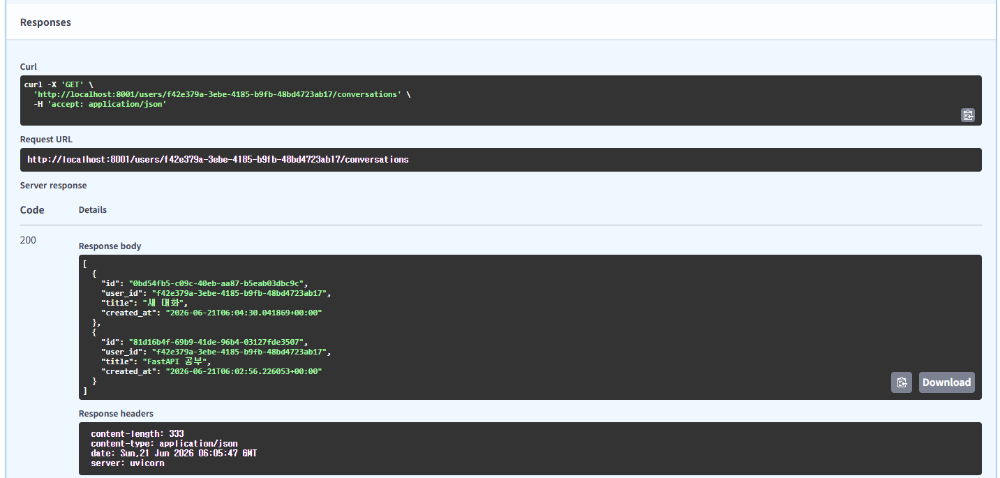

---
### 실습 6. 메시지 생성
`POST /conversations/{conversation_id}/messages` → `conversation_id`에 `CONVERSATION_ID` 입력 → Body에 `{"role": "user", "content": "첫 메시지입니다."}` → **Execute**
→ `201 Created` 확인

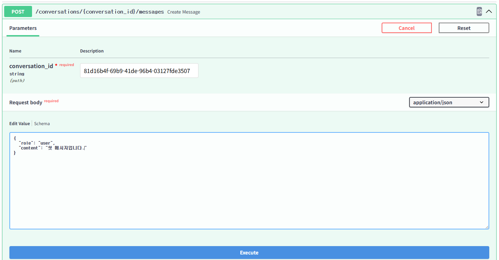

---
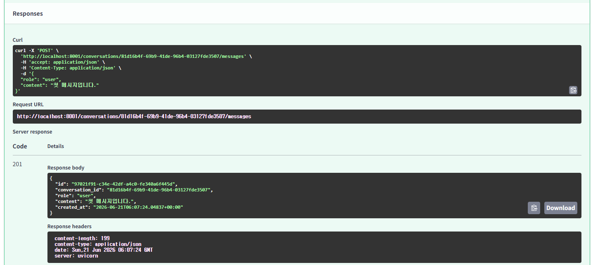

---
### 실습 7. Literal 검증 실패

`POST /conversations/{conversation_id}/messages` → `conversation_id`에 `CONVERSATION_ID` 입력 → Body에 `{"role": "bot", "content": "Literal 검증 테스트"}` → **Execute**
→ `422 Unprocessable Entity` 확인 → 오류 type `literal_error` 확인

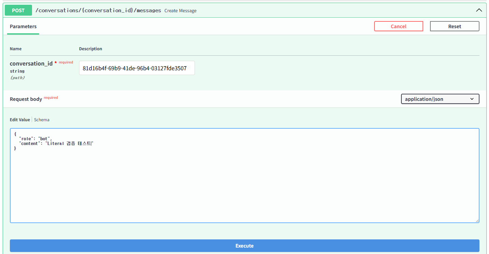

---
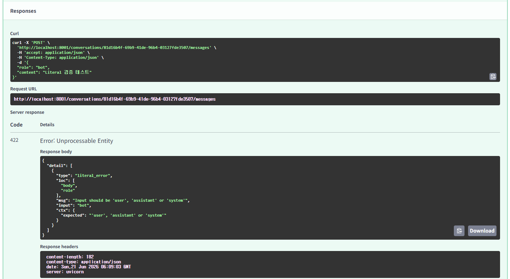

---
### 실습 8. 메시지 목록 조회

`GET /conversations/{conversation_id}/messages` → `conversation_id`에 `CONVERSATION_ID` 입력 → **Execute**
→ 메시지가 오래된 순서로 반환되는지 확인

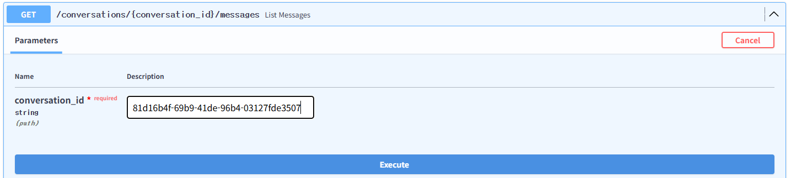

---
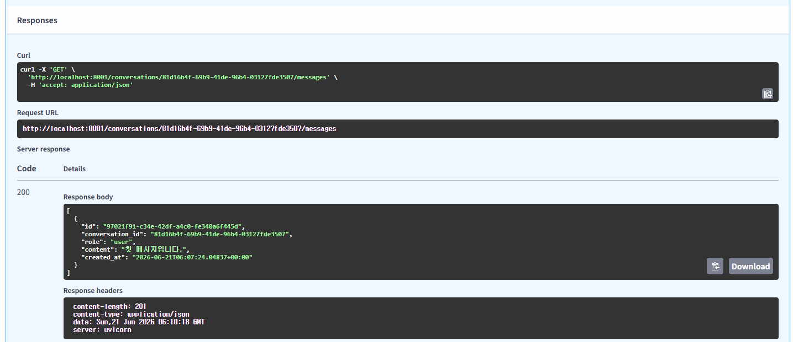

