# CRUD 완성 — PATCH·오류 처리·집계 API

---
## 1. PUT vs PATCH

| 메서드 | 의미 | 동작 방식 |
|--------|------|-----------|
| PUT | 전체 교체 | 보내지 않은 필드는 null/기본값으로 초기화 |
| PATCH | 부분 수정 | 보낸 필드만 수정, 나머지는 그대로 유지 |

---
### PUT 방식 — 문제점
> `display_name`만 바꾸고 싶어도 `username`을 함께 보내야 합니다.  
> 만약 `username`을 빠뜨리면 null로 초기화될 위험이 있습니다.
```python
# PUT /users/{id} — 전체를 보내야 함
{
  "username": "kim",
  "display_name": "김강사"  # display_name만 바꾸고 싶어도 username도 보내야 함
}
```

### PATCH 방식 — 올바른 설계

```python
# PATCH /users/{id} — 바꿀 것만 보내면 됨
{
  "display_name": "김강사"  # username은 보내지 않아도 됨
}
```

---
## 2. PATCH 구현 — Optional 필드와 exclude_unset
> PATCH를 위한 Pydantic 스키마는 모든 필드를 `Optional`로 만듭니다.

```python
from typing import Optional

class UserUpdate(BaseModel):
    display_name: Optional[str] = Field(default=None, min_length=1, max_length=50)
    # 보내지 않으면 None, 보내면 값이 들어옴
```

---
### [비추천] model_dump(): 보내지 않은 필드가 None으로 포함됨
```python
# 요청: {"display_name": "김강사"}
data = UserUpdate(display_name="김강사")

# model_dump() — 보내지 않은 필드가 None으로 포함됨
data.model_dump()
# {"display_name": "김강사"}  ← 이 경우엔 괜찮아 보이지만...
```
### [추천] model_dump(exclude_unset=True): 실제로 보낸 필드만
```python
# 예: username도 Optional이라면
# data.model_dump() → {"username": None, "display_name": "김강사"}
# → Supabase에 username=None으로 업데이트해서 데이터 손상!

# model_dump(exclude_unset=True) — 실제로 보낸 필드만
data.model_dump(exclude_unset=True)
# {"display_name": "김강사"}  ← username 제외
```

---
### Repository에서 PATCH 구현

```python
def update_user(self, user_id: str, data: UserUpdate) -> dict:
    payload = data.model_dump(exclude_unset=True)  # 보낸 필드만
    if not payload:
        raise HTTPException(status_code=400, detail="수정할 값이 없습니다")

    result = (
        self.db.table("app_users")
        .update(payload)
        .eq("id", user_id)
        .execute()
    )
    return self.one_or_404(result.data, "사용자를 찾을 수 없습니다")
```

---
### update()는 수정된 행을 기본 반환
> `supabase-py 2.x`의 `update()`는 수정된 행을 `result.data`로 기본 반환합니다.
```python
result = self.db.table("app_users").update(payload).eq("id", user_id).execute()
# result.data → [{"id": "...", "display_name": "김강사", ...}]
```

> 쓰기 쿼리 뒤에 `.select("*")`를 연결하면 `AttributeError`가 발생하므로 바로 `.execute()`를 호출합니다.

---
## 3. Query 파라미터로 메시지 개수 제한

```python
from fastapi import Query

@app.get("/conversations/{conversation_id}/messages")
def list_messages(
    conversation_id: str,
    limit: int = Query(default=50, ge=1, le=100),
    #             ↑       ↑          ↑    ↑
    #           기본 50   최소 1   최대 100
    repo: SupabaseRepository = Depends(get_repo),
):
    return repo.list_messages(conversation_id, limit)
```

Swagger에서 `limit` 쿼리 파라미터가 자동으로 UI에 표시됩니다.

```
GET /conversations/{id}/messages?limit=20
```

---
## 4. 집계 API — Summary

사용자가 몇 개의 대화방과 메시지를 가지고 있는지 요약합니다.

```python
def summary(self, user_id: str) -> ChatSummary:
    conversations = self.list_conversations(user_id)
    message_count = 0
    for conv in conversations:
        ...

    return ChatSummary(
        user_id=user_id,
        conversation_count=len(conversations),
        message_count=message_count,
    )
```

---
## 5. 서버 실행 및 Swagger 실습

---
### 가상환경 생성
```bash
# pyproject.toml과 uv.lock 기준으로 의존성 설치
uv sync
```

### 서버 실행

```bash
# 1. .env 파일에 실제 키 입력
# 2. 서버 실행
uvicorn main:app --reload --port 8001
```

---
### Swagger UI 실습 (http://localhost:8001/docs)

> 각 API에서 **Try it out**을 누른 뒤 아래 순서대로 입력합니다.

이번 실습에서는 앞 요청의 응답으로 받은 ID를 다음 요청에서 계속 사용합니다.

| 이름 | 저장할 값 |
|------|-----------|
| `USER_ID` | 사용자 생성 응답의 `id` |
| `CONVERSATION_ID` | 대화방 생성 응답의 `id` |

---
### 실습 1. 사용자 생성

`POST /users` → **Try it out** → Body 입력 → **Execute**

```json
{
  "username": "swagger05",
  "display_name": "스웨거 학생"
}
```

→ `201 Created` 확인  
→ 응답의 `id`를 `USER_ID`로 복사  
→ 같은 username이 이미 있다면 숫자를 바꾸어 다시 실행

---
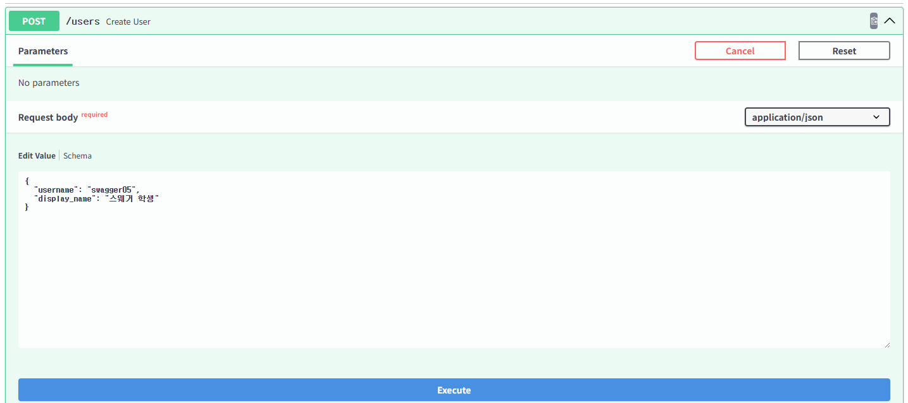

---
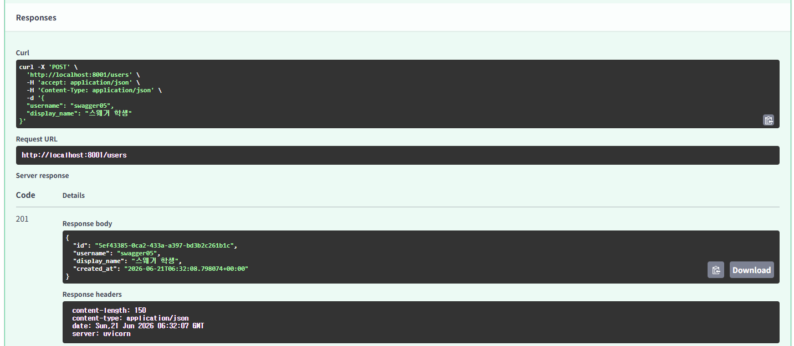

---
### 실습 2. PATCH로 사용자 일부 수정

`PATCH /users/{user_id}` → `user_id`에 `USER_ID` 입력 → Body 입력 → **Execute**

```json
{
  "display_name": "FastAPI 수강생"
}
```

→ `200 OK`와 변경된 `display_name` 확인  
→ 요청에 `username`을 보내지 않았지만 기존 값 `"swagger05"`가 유지되는지 확인

> `app.patch()`가 PATCH 요청을 연결하고, `exclude_unset=True`가 보내지 않은 필드를 UPDATE에서 제외합니다.

---
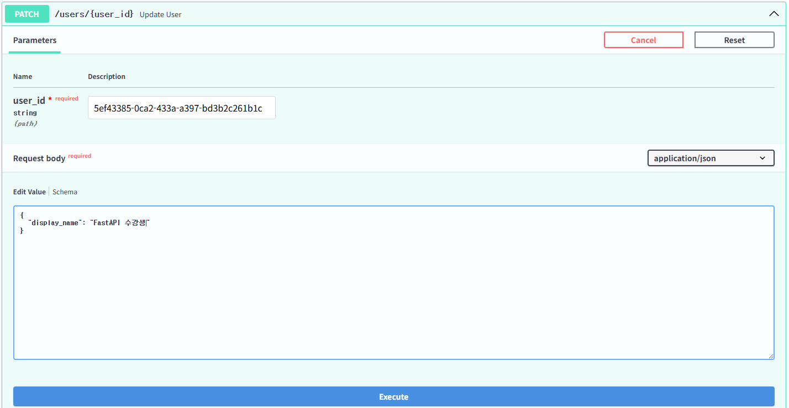

---


---
### 실습 3. 수정할 값이 없을 때 400 확인

`PATCH /users/{user_id}` → `user_id`에 `USER_ID` 입력 → Body에 `{}` 입력 → **Execute**

→ `400 Bad Request` 확인

```json
{
  "detail": "수정할 값이 없습니다"
}
```

`{}`는 Pydantic 스키마를 통과하지만 `exclude_unset=True`의 결과가 빈 딕셔너리이므로 Repository가 400을 반환합니다.

---
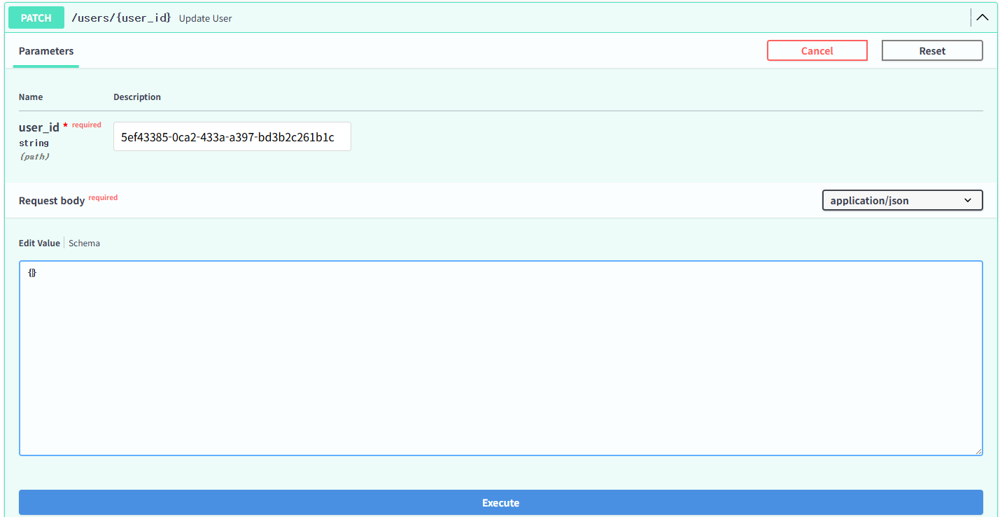

---
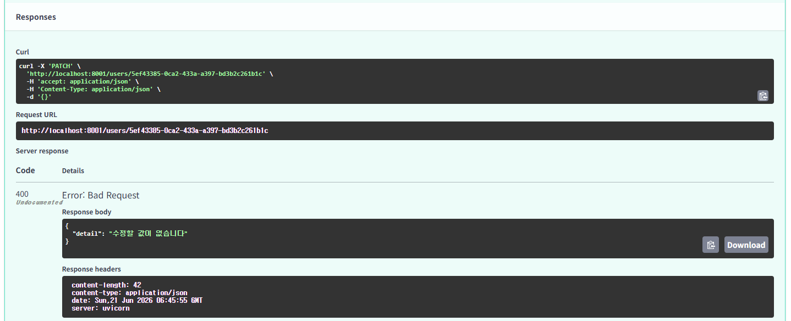

---
### 실습 4. 존재하지 않는 사용자 수정 시 404 확인

`PATCH /users/{user_id}` → 아래 값을 `user_id`에 입력 → Body 입력 → **Execute**

```text
00000000-0000-0000-0000-000000000000
```

```json
{
  "display_name": "없는 사용자"
}
```

→ `404 Not Found`와 `{"detail": "사용자를 찾을 수 없습니다"}` 확인  
→ UPDATE 결과가 빈 목록이면 `one_or_404()`가 404로 변환

---
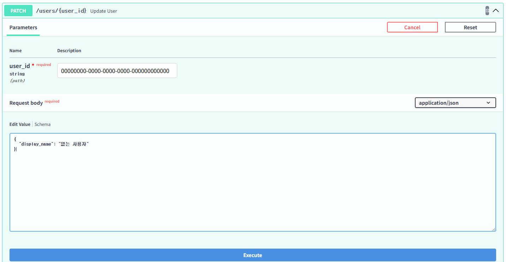

---
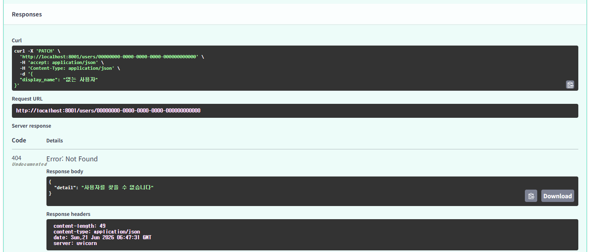

---
### 실습 5. 대화방 생성

`POST /users/{user_id}/conversations` → `user_id`에 `USER_ID` 입력 → Body 입력 → **Execute**

```json
{
  "title": "PATCH와 집계 실습"
}
```

→ `201 Created` 확인  
→ 응답의 `id`를 `CONVERSATION_ID`로 복사

---
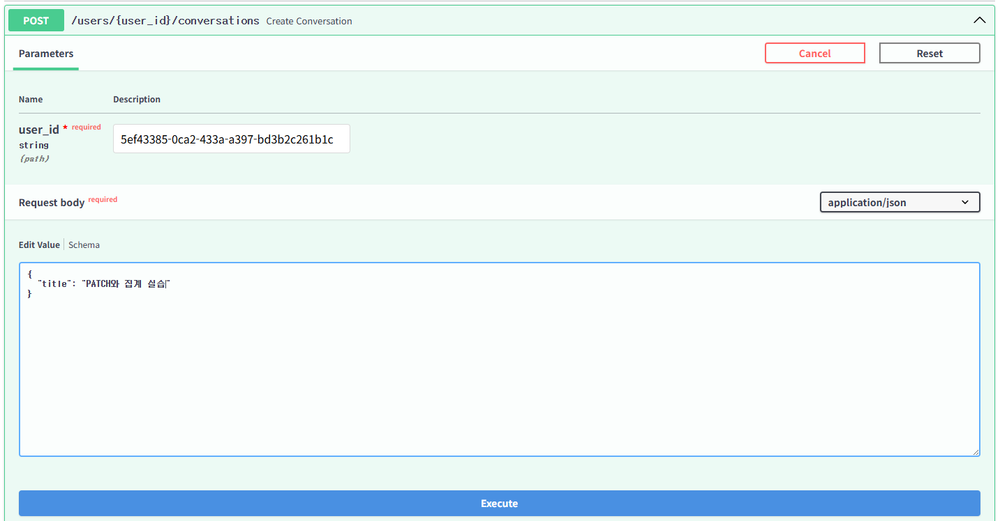

---
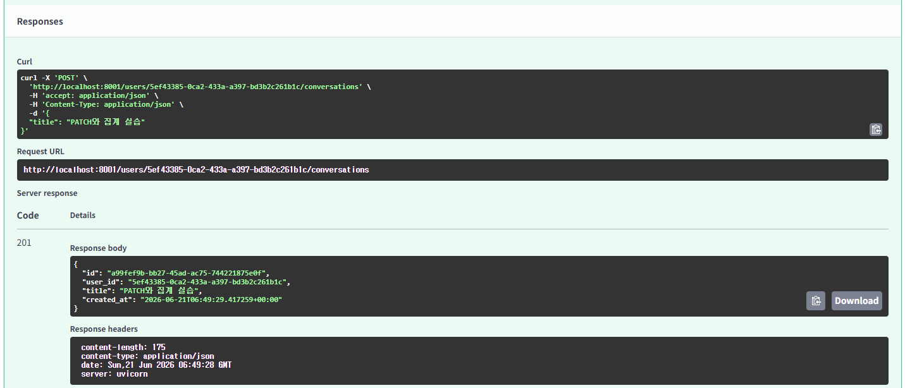

---
### 실습 6. 대화방 제목 수정

`PATCH /conversations/{conversation_id}` → `conversation_id`에 `CONVERSATION_ID` 입력 → Body 입력 → **Execute**

```json
{
  "title": "Swagger 실습 완료하기"
}
```

→ `200 OK`와 변경된 `title` 확인

> 현재 `ConversationUpdate`의 수정 가능 필드는 `title` 하나이며 필수이므로 `exclude_unset=True`를 사용하지 않습니다.

---
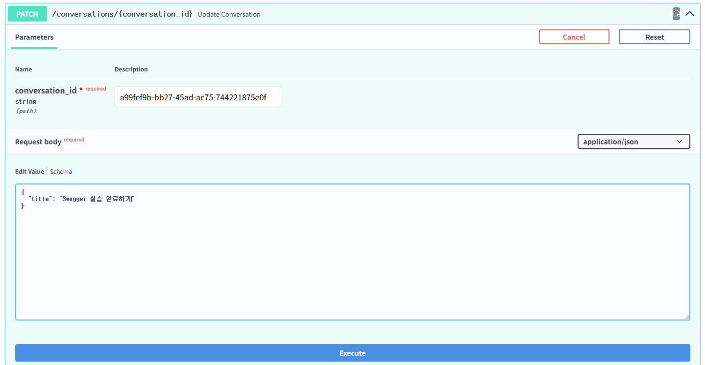

---
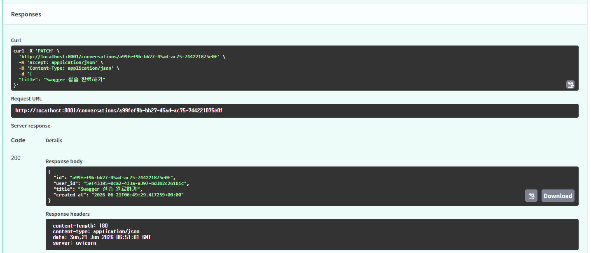

---
### 실습 7. 메시지 3개 생성

`POST /conversations/{conversation_id}/messages`에서 `conversation_id`에 `CONVERSATION_ID`를 입력하고, Body만 바꾸어 세 번 실행합니다.

---
```json
{"role": "user", "content": "첫 번째 메시지"}
```
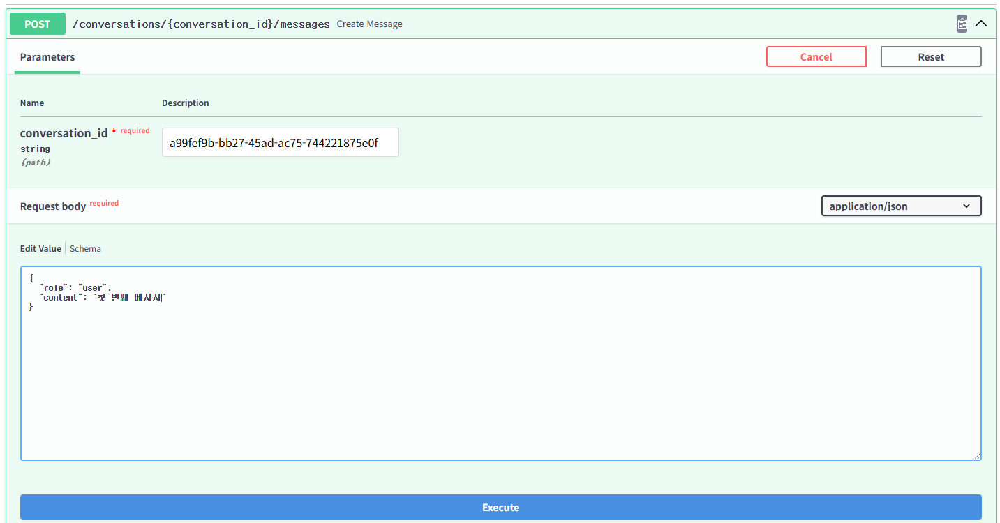

---
```json
{"role": "assistant", "content": "두 번째 메시지"}
```
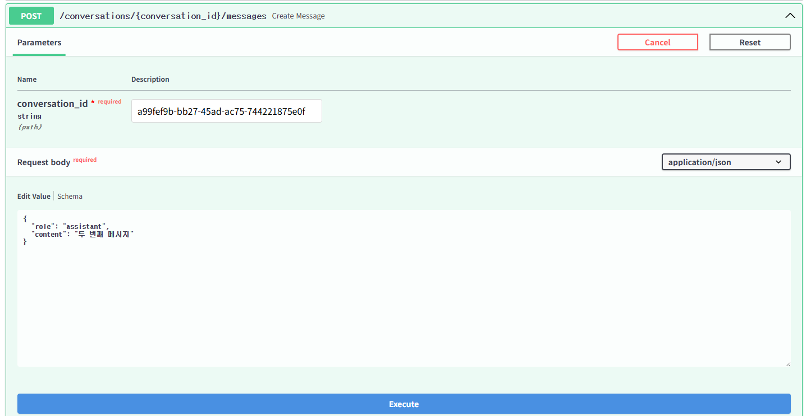

---
```json
{"role": "user", "content": "세 번째 메시지"}
```
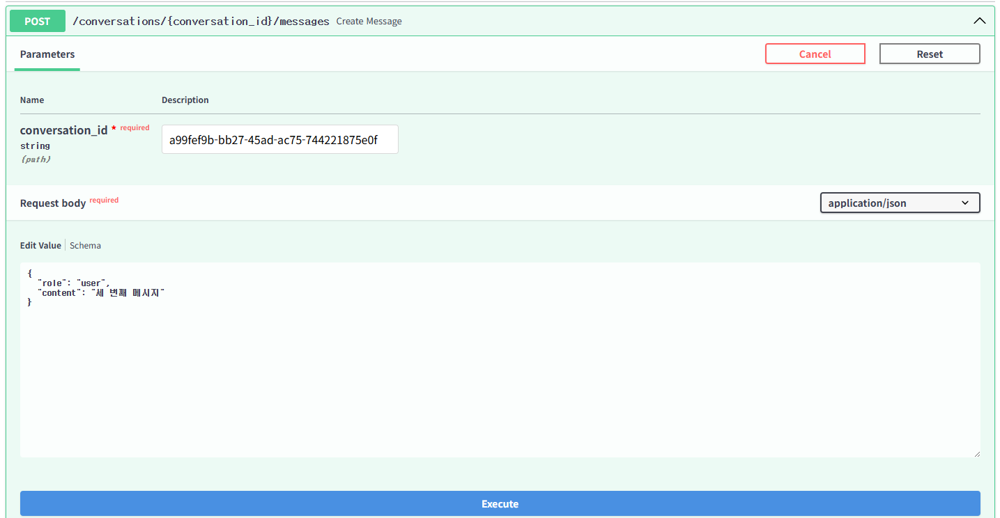

---
### 실습 8. Query 파라미터로 2개만 조회

`GET /conversations/{conversation_id}/messages`

- `conversation_id`: `CONVERSATION_ID`
- `limit`: `2`

→ **Execute** → `200 OK` 확인  
→ 메시지가 오래된 순서로 정확히 2개만 반환되는지 확인

---
```text
GET /conversations/{CONVERSATION_ID}/messages?limit=2
```
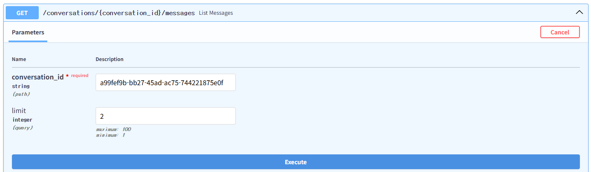

---
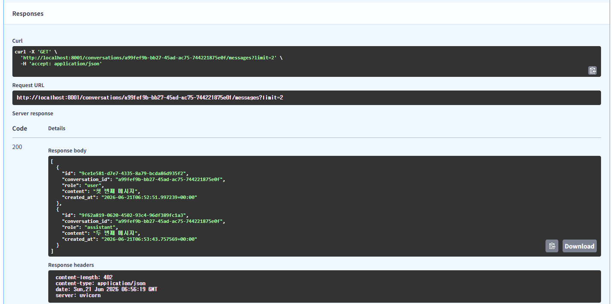

---
### 실습 9. limit 범위 검증 실패

`GET /conversations/{conversation_id}/messages`

- `conversation_id`: `CONVERSATION_ID`
- `limit`: `0`

→ **Execute** → `422 Unprocessable Entity` 확인  
→ 오류의 `loc`에 `"query", "limit"`가 표시되는지 확인

---
> `Query(50, ge=1, le=100)`이므로 1보다 작거나 100보다 큰 값은 엔드포인트 실행 전에 거부됩니다.

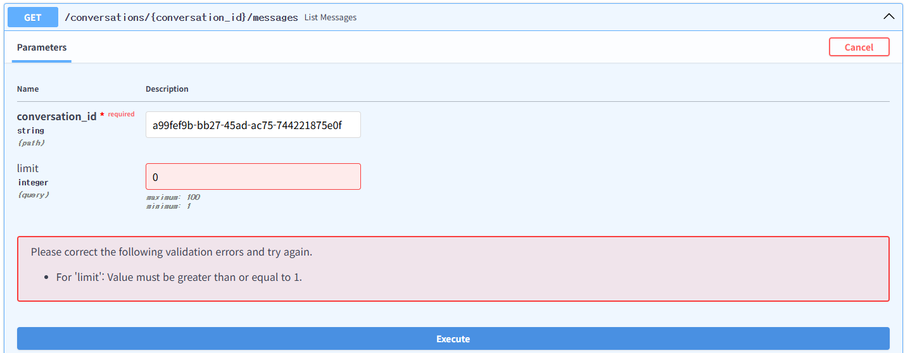

---
### 실습 10. 사용자별 대화·메시지 집계

`GET /users/{user_id}/summary` → `user_id`에 `USER_ID` 입력 → **Execute**
→ `200 OK`와 다음 형태의 응답 확인

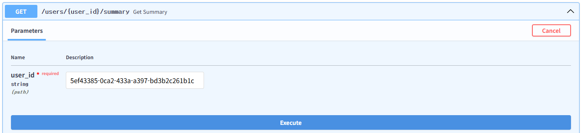

---
> 이 실습에서 만든 데이터만 있다면 대화방은 1개, 메시지는 3개입니다. 같은 사용자로 추가 데이터를 만들었다면 집계 값은 그만큼 증가합니다.

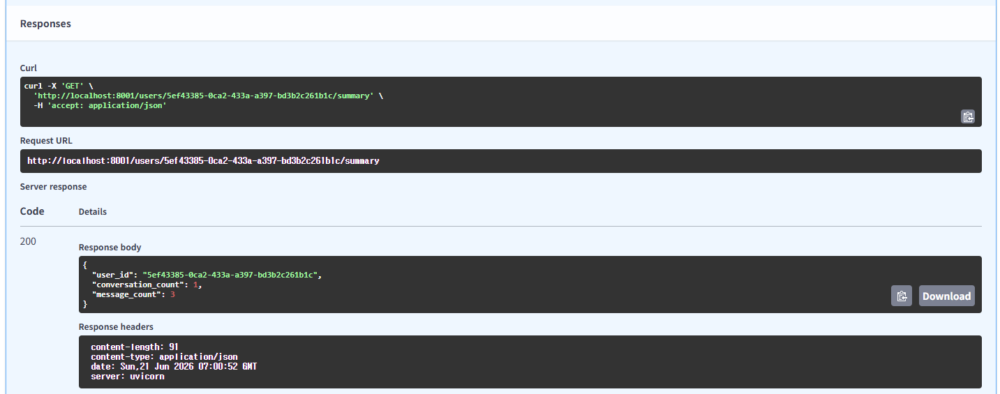


