# RLS와 서버 측 접근 제어
> `RLS(Row Level Security)`는 테이블의 행(Row) 단위로 접근 권한을 제어하는 보안 기능

`Supabase`에서는 기본 데이터베이스인 **PostgreSQL**의 `RLS 기능`을 그대로 사용하며, 인증된 사용자별로 조회(SELECT), 추가(INSERT), 수정(UPDATE), 삭제(DELETE) 권한을 세밀하게 제어할 수 있습니다.

---
## RLS 동작 과정

| 단계 | 설명                            |
| -- | ----------------------------- |
| 1  | 사용자가 로그인                      |
| 2  | Supabase Auth가 JWT 발급         |
| 3  | 클라이언트가 JWT와 함께 SQL 요청         |
| 4  | PostgreSQL이 RLS Policy 검사     |
| 5  | Policy를 만족하면 데이터 반환           |
| 6  | 만족하지 않으면 조회 결과 없음 또는 권한 오류 발생 |

---
## RLS 사용 전/후 비교

| 구분       | RLS 미사용          | RLS 사용         |
| -------- | ---------------- | -------------- |
| 데이터 조회   | 모든 사용자 데이터 조회 가능 | 자신의 데이터만 조회 가능 |
| 데이터 수정   | 다른 사용자 데이터 수정 가능 | 자신의 데이터만 수정 가능 |
| 데이터 삭제   | 다른 사용자 데이터 삭제 가능 | 자신의 데이터만 삭제 가능 |
| 보안 수준    | 낮음               | 매우 높음          |
| 서버 권한 검사 | 애플리케이션에서 직접 구현   | 데이터베이스에서 자동 수행 |


---

## 1. 두 종류의 Supabase 클라이언트

Supabase 작업은 **Auth 작업**과 **DB 작업**으로 나뉩니다.

```python
def public_client() -> Client:
    """anon 키 — Auth API 전용 (로그인, 회원가입, 토큰 검증)"""
    return create_client(SUPABASE_URL, SUPABASE_ANON_KEY)


def admin_client() -> Client:
    """service_role 키 — DB 작업 전용 (CRUD, RLS 우회)"""
    return create_client(SUPABASE_URL, SUPABASE_SERVICE_ROLE_KEY)
```

---
| 작업 | 클라이언트 | 이유 |
|------|-----------|------|
| `auth.sign_up()` | `public_client()` | Auth API는 anon 키로 호출 |
| `auth.sign_in_with_password()` | `public_client()` | Auth API |
| `auth.get_user(token)` | `public_client()` | 토큰 검증도 Auth API |
| `table("profiles").insert()` | `admin_client()` | DB 쿼리는 service_role |
| `table("chat_conversations").select()` | `admin_client()` | DB 쿼리 |

---
### 왜 DB에 admin_client를 쓰는가
- `service_role` 키는 RLS를 우회합니다.  
- FastAPI 서버는 인증된 사용자의 요청만 처리하므로, 서버에서 직접 소유자를 확인한 뒤 admin_client로 데이터를 가져옵니다.

---
## 2. Auth 사용자와 서비스 테이블 연결

Supabase Auth는 `auth.users` 테이블에 계정을 저장합니다.  
서비스에서 필요한 추가 데이터(display_name 등)는 `public.profiles`에 저장합니다.

```
auth.users (Supabase 내부 관리)
  └── 1:1 → public.profiles      (display_name 등 서비스 데이터)
  └── 1:N → public.chat_conversations
               └── 1:N → public.chat_messages
```

---
### 회원가입 시 profiles 자동 생성

```python
@app.post("/auth/signup", status_code=201)
def signup(data: SignupRequest):
    # 1. Supabase Auth 계정 생성 (public_client 사용)
    result = public_client().auth.sign_up({
        "email": data.email,
        "password": data.password,
    })
    user_id = str(result.user.id)

    # 2. profiles 테이블에 추가 정보 저장 (admin_client 사용)
    admin_client().table("profiles").upsert({
        "id": user_id,
        "email": data.email,
        "display_name": data.display_name,
    }).execute()

    return {"user_id": user_id, "email": data.email}
```
> `upsert`는 `id`가 이미 있으면 UPDATE, 없으면 INSERT합니다.

---
## 3. service_role과 소유자 필터

`service_role` 키는 RLS를 **우회**합니다.  
이 말은 필터 없이 조회하면 **모든 사용자의 데이터가 반환된다**는 뜻입니다.

```python
# service_role로 소유자 필터 없이 조회 — 모든 사용자 대화 반환!
result = (
    admin_client()
    .table("chat_conversations")
    .select("*")
    .execute()
)
# 사용자 A, B, C의 모든 대화가 다 반환됨
```

---
>  service_role로 소유자 필터 없이 조회하는 경우, 반드시 소유자 필터 추가
```python
# 반드시 소유자 필터 추가
result = (
    admin_client()
    .table("chat_conversations")
    .select("*")
    .eq("owner_id", current.id)   # 현재 사용자의 것만
    .order("created_at", desc=True)
    .execute()
)
```

---
### 소유권 확인 헬퍼 함수

```python
def get_owned_conversation(conversation_id: str, user_id: str) -> dict:
    """대화방이 현재 사용자의 것인지 확인. 아니면 404"""
    result = (
        admin_client()
        .table("chat_conversations")
        .select("*")
        .eq("id", conversation_id)
        .eq("owner_id", user_id)   # 내 대화방인지 확인
        .limit(1)
        .execute()
    )
    if not result.data:
        raise HTTPException(404, "대화방을 찾을 수 없습니다")
    return result.data[0]
```

---
> 메시지 엔드포인트에서 반드시 이 함수(`get_owned_conversation`)를 먼저 호출합니다:

```python
@app.post("/conversations/{conversation_id}/messages", status_code=201)
def create_message(
    conversation_id: str,
    data: MessageCreate,
    current: CurrentUser = Depends(get_current_user),
):
    get_owned_conversation(conversation_id, current.id)  # 소유권 확인
    # ...메시지 저장
```

---
## 4. RLS(Row Level Security) 정책
- `RLS`는 **DB 레벨**에서 행 단위 접근을 제어합니다.  
- 서버 코드의 실수를 DB가 방어선으로 막아줍니다.

---
### RLS 활성화

```sql
ALTER TABLE public.chat_conversations ENABLE ROW LEVEL SECURITY;
ALTER TABLE public.chat_messages ENABLE ROW LEVEL SECURITY;
ALTER TABLE public.profiles ENABLE ROW LEVEL SECURITY;
```

RLS를 활성화하면 정책이 없는 한 아무도 접근할 수 없습니다.  
(`anon` 또는 `authenticated` 역할에 정책을 추가해야 접근 가능)

---
### SELECT 정책 — 자신의 데이터만 조회

```sql
CREATE POLICY "conversations_select_own"
ON public.chat_conversations FOR SELECT
TO authenticated  -- 로그인한 사용자에게 적용
USING ((SELECT auth.uid()) = owner_id);
--     ↑ 현재 로그인한 사용자의 UUID = 행의 owner_id
```

---
### INSERT 정책 — 자신의 owner_id로만 삽입

```sql
CREATE POLICY "conversations_insert_own"
ON public.chat_conversations FOR INSERT
TO authenticated
WITH CHECK ((SELECT auth.uid()) = owner_id);
--  ↑ 새로 삽입하는 행의 owner_id가 현재 사용자여야 함
```

---
### DELETE 정책 — 자신의 데이터만 삭제

```sql
CREATE POLICY "conversations_delete_own"
ON public.chat_conversations FOR DELETE
TO authenticated
USING ((SELECT auth.uid()) = owner_id);
```

---
### USING vs WITH CHECK

| 절 | 적용 대상 | 의미 |
|----|----------|------|
| `USING (조건)` | SELECT, UPDATE, DELETE | 기존 행에 대한 접근 조건 |
| `WITH CHECK (조건)` | INSERT, UPDATE | 새로 쓰거나 수정하는 행에 대한 조건 |

---
## 5. 두 레이어 방어 전략

실무에서는 서버 코드와 RLS를 함께 사용합니다.

```
[요청] → FastAPI 서버 → [서버 코드 소유자 필터] → Supabase
                                                       ↓
                                                  [RLS 정책 검증]
                                                       ↓
                                                  [데이터 반환]
```

> 서버 코드가 실수해도 RLS가 막아주고, RLS가 없어도 서버 코드가 막아줍니다.

| 레이어 | 위치 | 역할 |
|--------|------|------|
| 서버 코드 | FastAPI | `.eq("owner_id", current.id)` |
| RLS 정책 | DB | `USING (auth.uid() = owner_id)` |

---
## 6. Supabase 설정 

---
### [New project](https://supabase.com/dashboard)
> 기존에 만들어진 프로젝트 삭제 

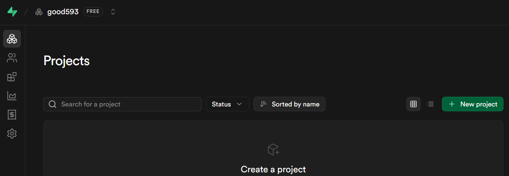

---
| 항목 | 권장 값 |
|------|--------|
| Project Name | `RLS Toturial` |
| Database Password | 강력한 비밀번호 (기록해 두기!) |
| Region | `Asia-Pacific` |
| Enable automatic RLS | `적용` |

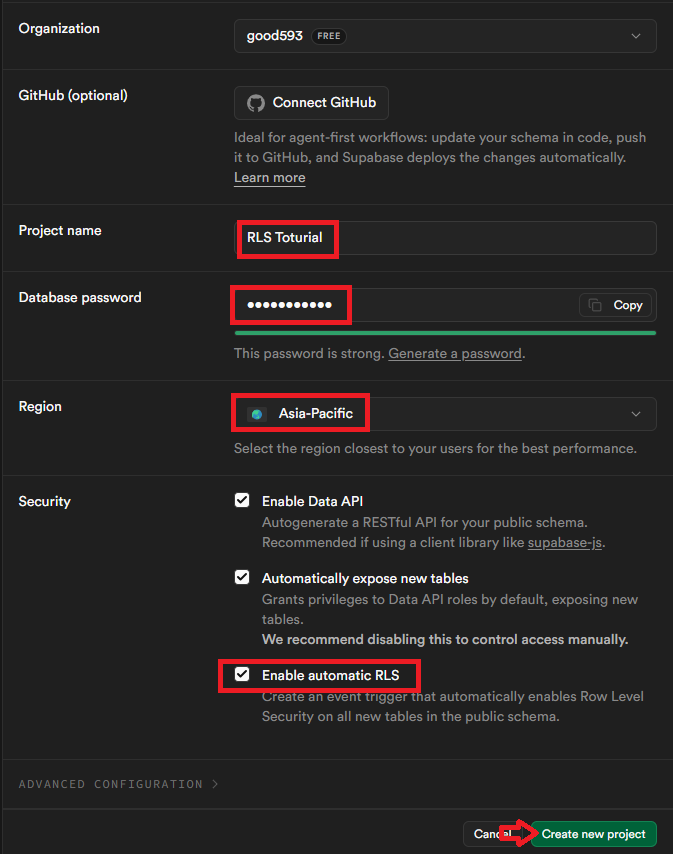

---
### Supabase의 API KEY 복사 
> SUPABASE_URL 복사 

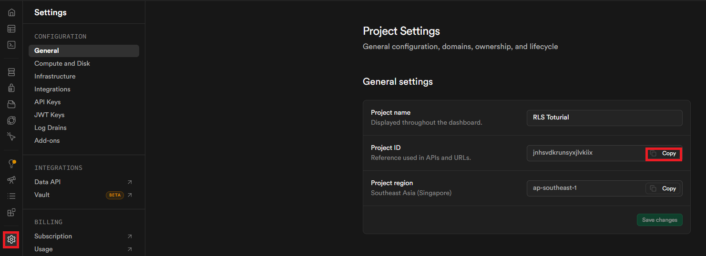

---
> SUPABASE_ANON_KEY 복사 

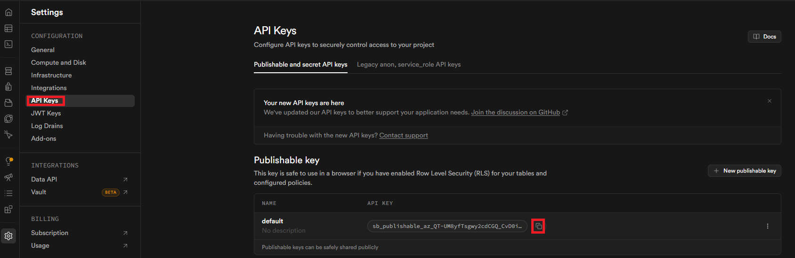

---
> SUPABASE_SERVICE_ROLE_KEY

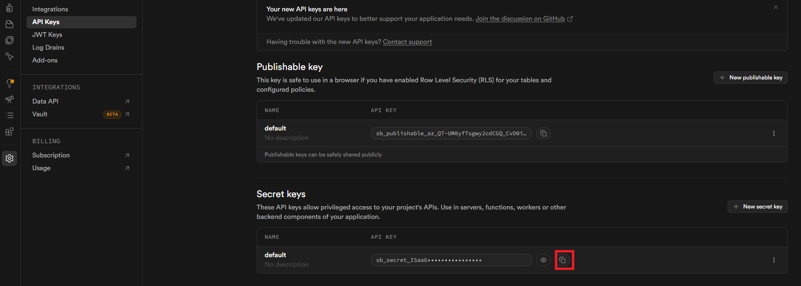

---
> .env 생성


---
### Supabase에 테이블 생성 
> `schema.sql`을 이용해서 테이블 생성 

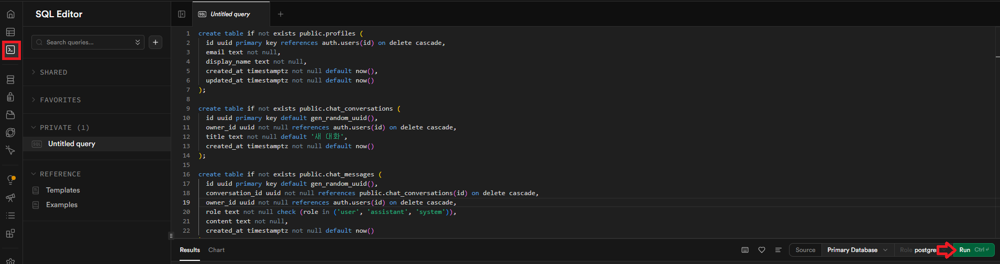

---
> 생성된 테이블들 확인 

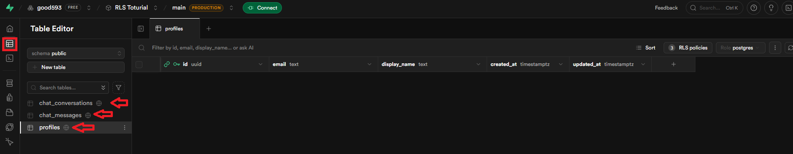

---
> 테이블별 RLS 정책 적용확인 

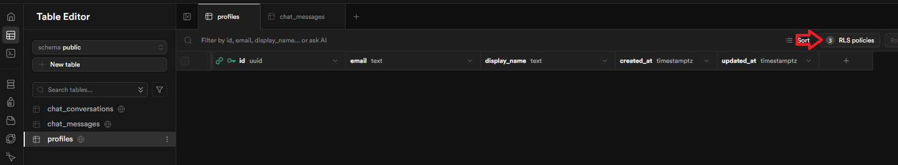

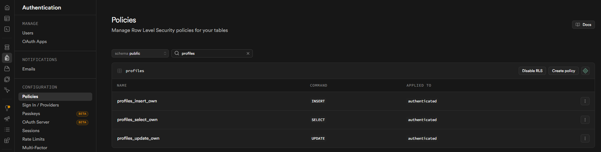

---
### 이메일 인증 비활성화 (개발용)
> "Confirm email" 옵션을 끄기 (OFF)

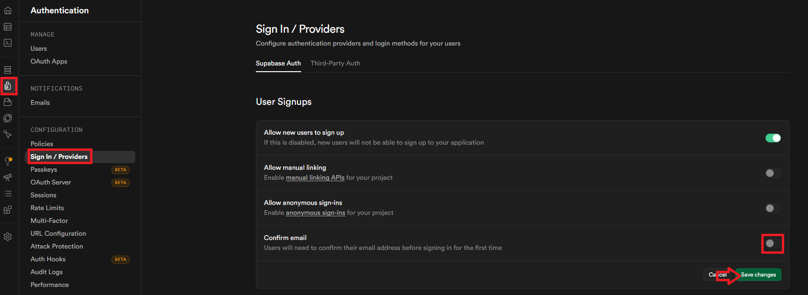

---
## 7. 서버 실행 및 Swagger 실습

---
### 가상환경 생성
```bash
# pyproject.toml과 uv.lock 기준으로 의존성 설치
uv sync
```

### 서버 실행

```bash
# 1. .env 파일에 실제 키 입력
# 2. 서버 실행
uvicorn main:app --reload --port 8001
```

---
### Swagger UI 실습 (http://localhost:8001/docs)

> 각 API에서 **Try it out**을 누른 뒤 아래 순서대로 입력합니다.

| 이름 | 저장할 값 |
|------|-----------|
| `USER_A_EMAIL` | `swagger07-a@example.com` |
| `USER_A_ACCESS_TOKEN` | 사용자 A 로그인 응답의 `access_token` |
| `USER_A_CONVERSATION_ID` | 사용자 A가 생성한 대화방 응답의 `id` |
| `USER_B_EMAIL` | `swagger07-b@example.com` |
| `USER_B_ACCESS_TOKEN` | 사용자 B 로그인 응답의 `access_token` |

---
### 실습 1. 사용자 A 회원가입

`POST /auth/signup` → **Try it out** → Body 입력 → **Execute**

```json
{
  "email": "swagger07-a@example.com",
  "password": "swagger1234",
  "display_name": "사용자 A"
}
```

→ `200 OK` 확인  
→ 응답의 `user_id`, `email`, `token_type` 확인

> `400 Bad Request`와 `Email address ... is invalid`가 반환되면
> `Confirm email` 설정을 끄고, 아직 가입되지 않은 새로운 이메일로 다시 실행합니다.

---
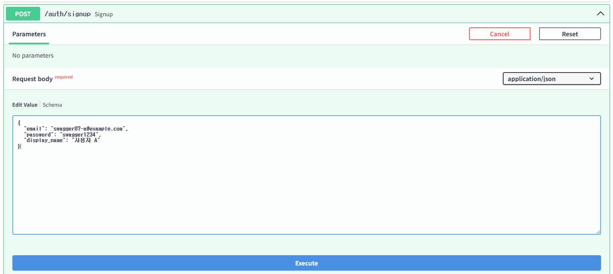

---
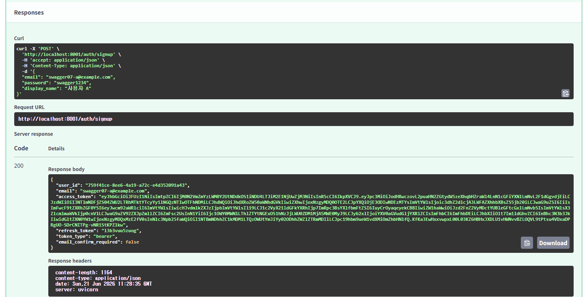

---
### 실습 2. 사용자 A 로그인 및 토큰 저장

`POST /auth/login` → 회원가입에 사용한 이메일과 비밀번호 입력 → **Execute**

```json
{
  "email": "swagger07-a@example.com",
  "password": "swagger1234"
}
```

→ `200 OK` 확인  
→ 응답의 `access_token`을 `USER_A_ACCESS_TOKEN`으로 복사

> 이후 인증에는 `refresh_token`이 아니라 `access_token`을 사용합니다.

---
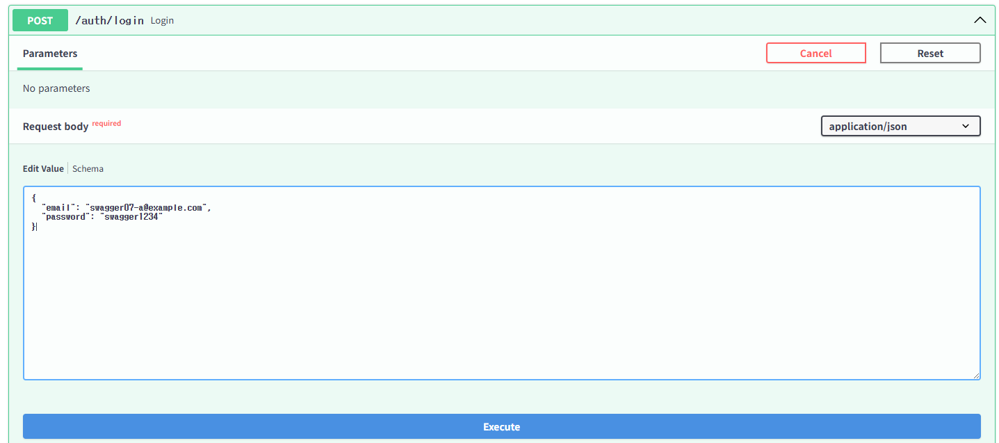

---
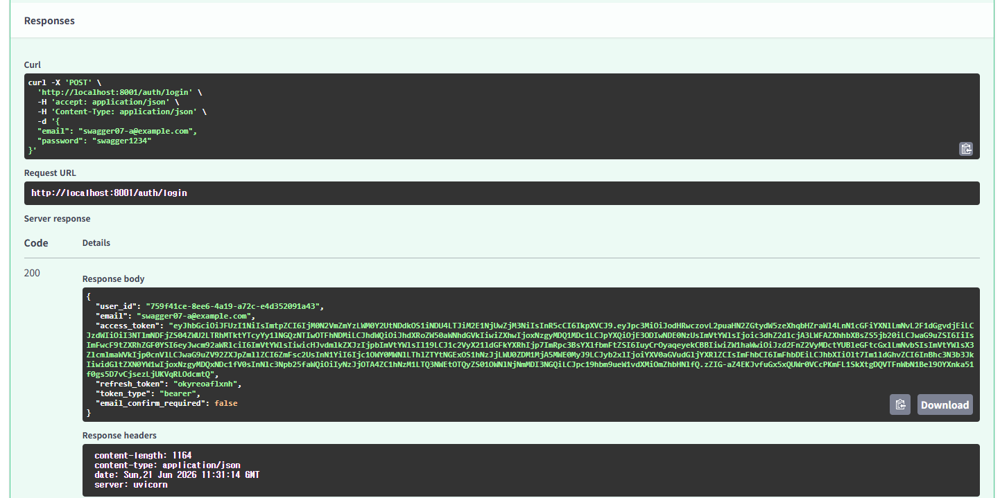

---
### 실습 3. 인증 없이 보호된 API 요청

아직 **Authorize**를 실행하지 않은 상태에서
`GET /me` → **Try it out** → **Execute**

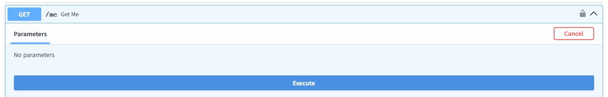

---
→ `403 Forbidden` 확인

> 이미 인증했다면 Swagger UI 우측 상단의
> **Authorize → Logout → Close**를 눌러 토큰을 제거한 뒤 실행합니다.

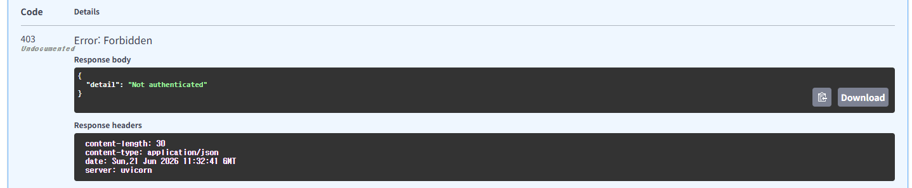

---
### 실습 4. 사용자 A 토큰 등록 및 프로필 조회

1. Swagger UI 우측 상단의 **Authorize** 클릭

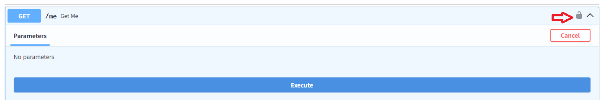

---
2. Value에 `USER_A_ACCESS_TOKEN` 값만 입력
3. **Authorize → Close** 클릭

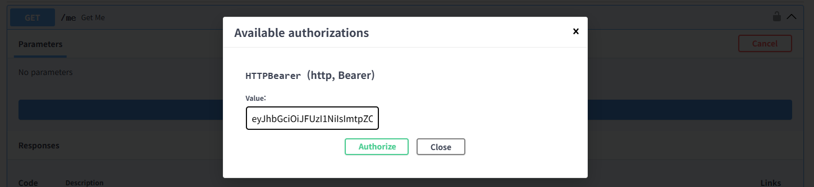

---
4. `GET /me` → **Try it out** → **Execute**

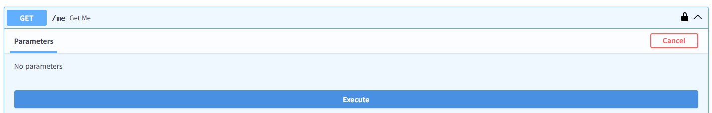

---
→ `200 OK` 확인  
→ 응답의 `email`이 `USER_A_EMAIL`과 같은지 확인

> `Bearer `는 직접 입력하지 않습니다. Swagger UI가 요청 헤더에
> `Authorization: Bearer {USER_A_ACCESS_TOKEN}`을 자동으로 추가합니다.

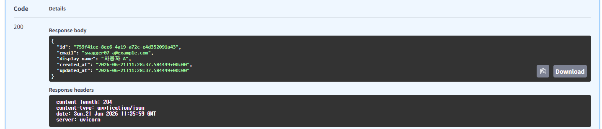

---
### 실습 5. 사용자 A 프로필 수정

`PATCH /me` → **Try it out** → Body 입력 → **Execute**

```json
{
  "display_name": "RLS 실습 사용자 A"
}
```

→ `200 OK` 확인  
→ 응답의 `display_name`이 변경되었는지 확인

---
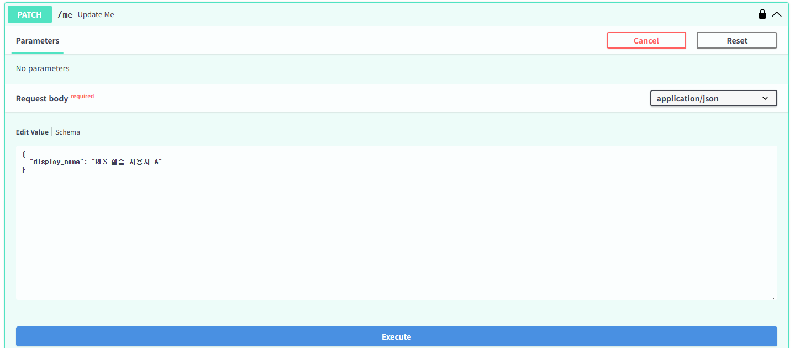

---
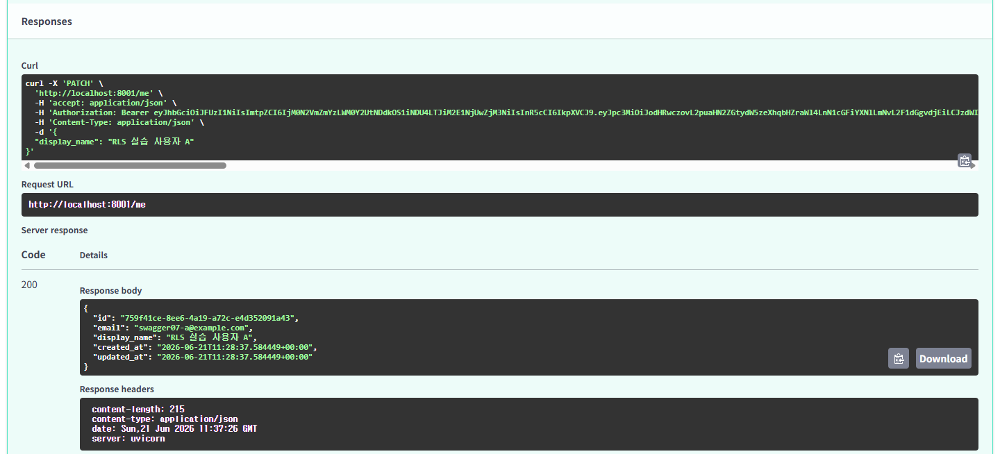

---
### 실습 6. 사용자 A 대화방 생성

`POST /conversations` → **Try it out** → Body 입력 → **Execute**

```json
{
  "title": "사용자 A의 첫 대화"
}
```

→ `201 Created` 확인  
→ 응답의 `id`를 `USER_A_CONVERSATION_ID`로 복사  
→ 응답의 `owner_id`가 사용자 A의 `user_id`와 같은지 확인

---
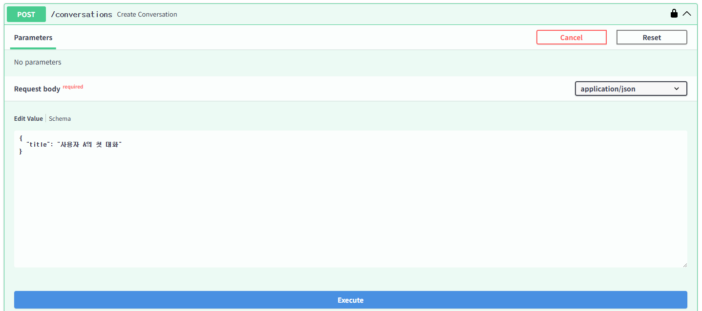

---
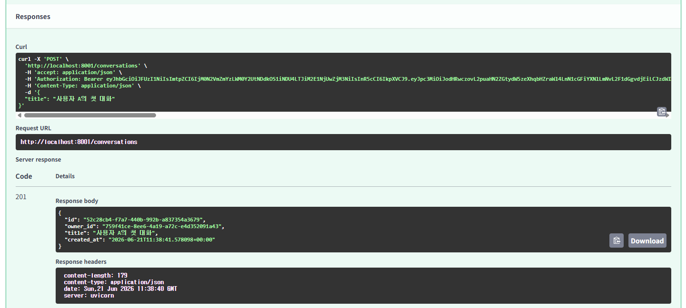

---
### 실습 7. 사용자 A의 대화방 목록 조회

`GET /conversations` → **Try it out** → **Execute**

→ `200 OK` 확인  
→ 방금 생성한 `USER_A_CONVERSATION_ID`가 목록에 있는지 확인  
→ 반환된 모든 행의 `owner_id`가 사용자 A의 `user_id`와 같은지 확인

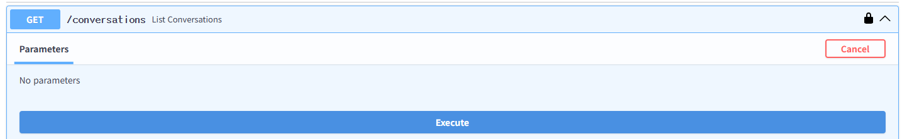

---
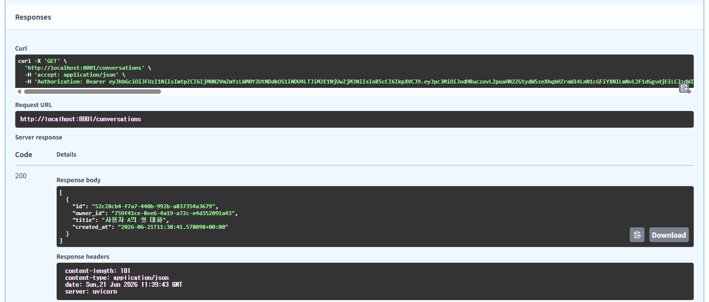

---
### 실습 8. 사용자 A의 대화방에 메시지 저장

`POST /conversations/{conversation_id}/messages` → **Try it out**

Path parameter의 `conversation_id`에 `USER_A_CONVERSATION_ID`를 입력하고,
Body에 다음 내용을 입력한 뒤 **Execute**를 누릅니다.

```json
{
  "role": "user",
  "content": "RLS와 서버 측 접근 제어의 차이를 설명해 줘."
}
```

→ `201 Created` 확인  
→ 응답의 `conversation_id`가 `USER_A_CONVERSATION_ID`와 같은지 확인  
→ 응답의 `owner_id`가 사용자 A의 `user_id`와 같은지 확인

> `role`에는 `user`, `assistant`, `system` 중 하나만 입력할 수 있습니다.

---
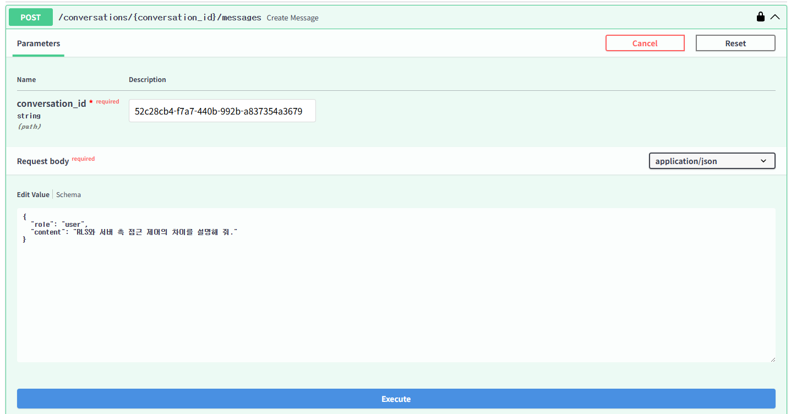

---
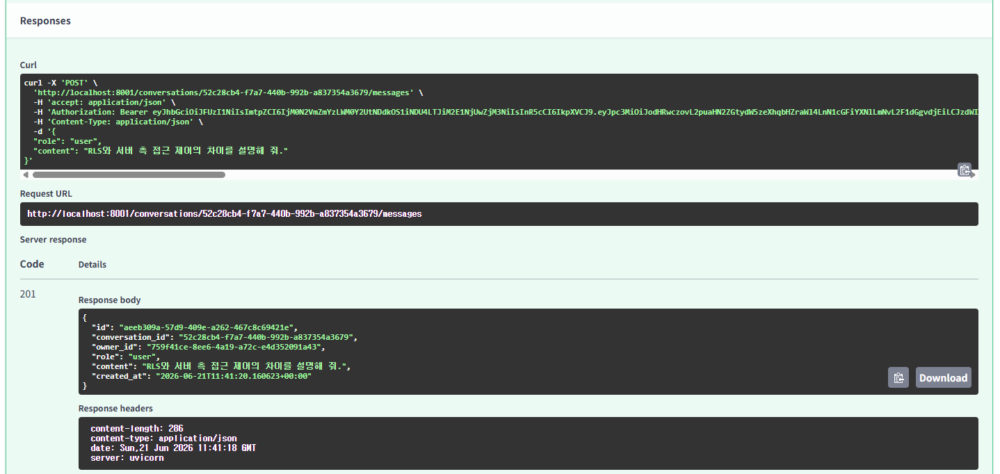

---
### 실습 9. 사용자 A의 메시지 목록 조회

`GET /conversations/{conversation_id}/messages` → **Try it out**

Path parameter의 `conversation_id`에 `USER_A_CONVERSATION_ID`를 입력한 뒤
**Execute**를 누릅니다.

→ `200 OK` 확인  
→ 실습 8에서 저장한 메시지가 반환되는지 확인

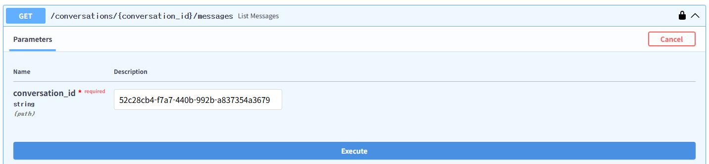

---
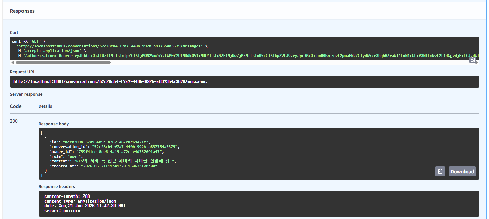

---
### 실습 10. 사용자 B 회원가입 및 로그인

1. **Authorize → Logout → Close**로 사용자 A의 토큰 제거

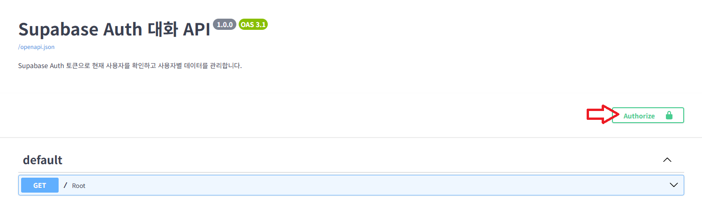

---
2. `POST /auth/signup`에서 다음 사용자 B 정보로 회원가입

```json
{
  "email": "swagger07-b@example.com",
  "password": "swagger1234",
  "display_name": "사용자 B"
}
```
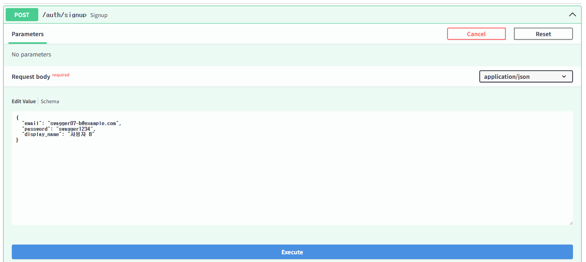

---
3. `POST /auth/login`에서 사용자 B 정보로 로그인

```json
{
  "email": "swagger07-b@example.com",
  "password": "swagger1234"
}
```
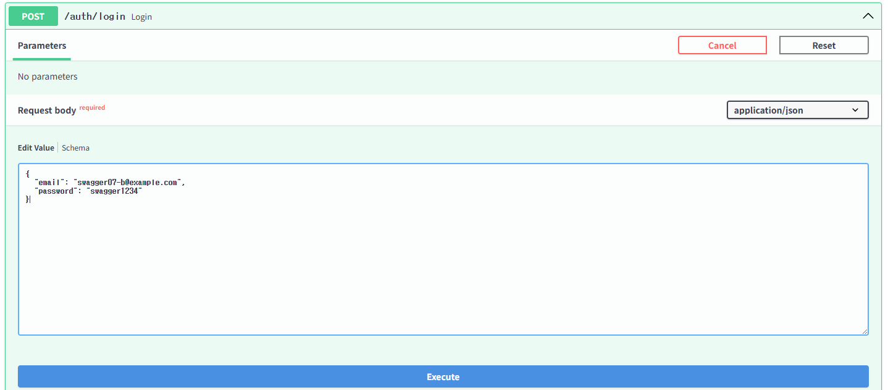

---
4. 로그인 응답의 `access_token`을 `USER_B_ACCESS_TOKEN`으로 복사
5. **Authorize**의 Value에 `USER_B_ACCESS_TOKEN` 값만 입력
6. **Authorize → Close** 클릭

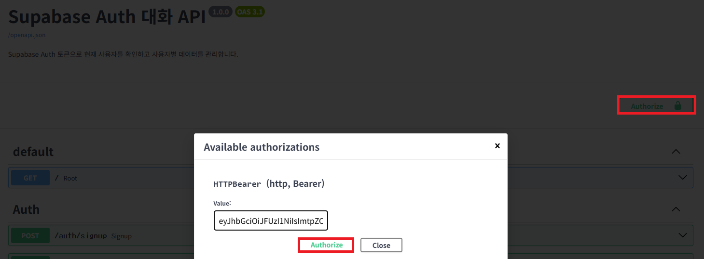

---
### 실습 11. 다른 사용자의 대화방 접근 차단 확인

사용자 B로 인증된 상태에서 먼저
`GET /conversations` → **Try it out** → **Execute**를 실행합니다.

→ `200 OK` 확인  
→ 사용자 A의 `USER_A_CONVERSATION_ID`가 목록에 없는지 확인

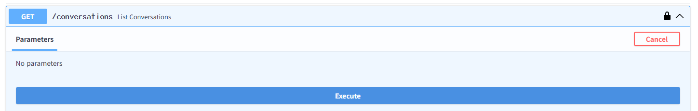

---
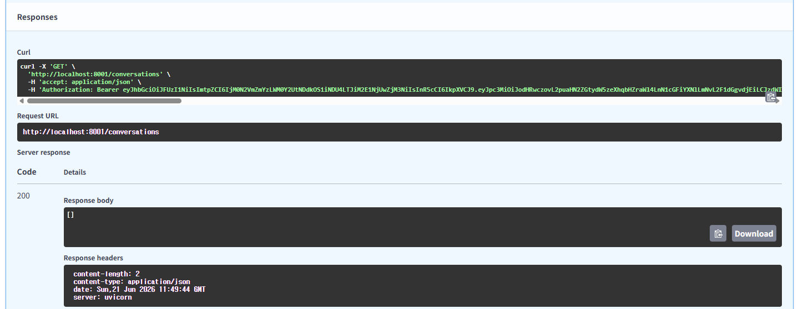

---
사용자 A의 `USER_A_CONVERSATION_ID` 확인 

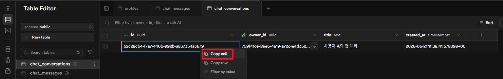

이어서 `GET /conversations/{conversation_id}/messages`의 `conversation_id`에
사용자 A의 `USER_A_CONVERSATION_ID`를 입력하고 **Execute**를 누릅니다.

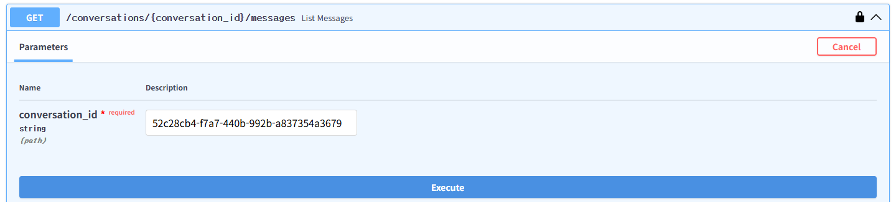

---
→ `404 Not Found` 확인

> 존재 여부를 노출하지 않도록 다른 사용자의 대화방도 `403` 대신 `404`로
> 응답합니다. 이 결과는 `get_owned_conversation()`의 `owner_id` 조건이
> 서버에서 소유권을 검사하고 있음을 보여 줍니다.

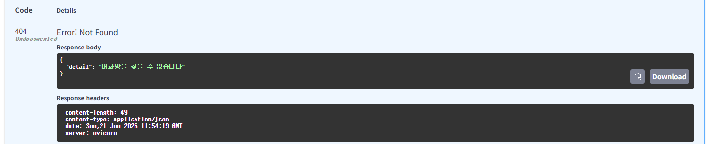
