# Redis 세션 관리와 Supabase 통합

---
## 1. Docker Compose로 Redis 환경 준비

---
### 구성 서비스

이 실습은 `docker-compose.yml`로 Redis Stack과 RedisInsight를 함께 실행합니다.

| 서비스 | 컨테이너 | 포트 | 역할 |
|--------|----------|------|------|
| `redis` | `redis-stack` | `6379` | Redis 데이터 저장 및 조회 |
| `redis` 내장 UI | `redis-stack` | `8001` | Redis Stack에 포함된 RedisInsight |

> RedisInsight는 `http://localhost:8001` 사용하면 됩니다.

---
### 실행 및 상태 확인
```bash
docker compose up -d
```
> 결과 확인 

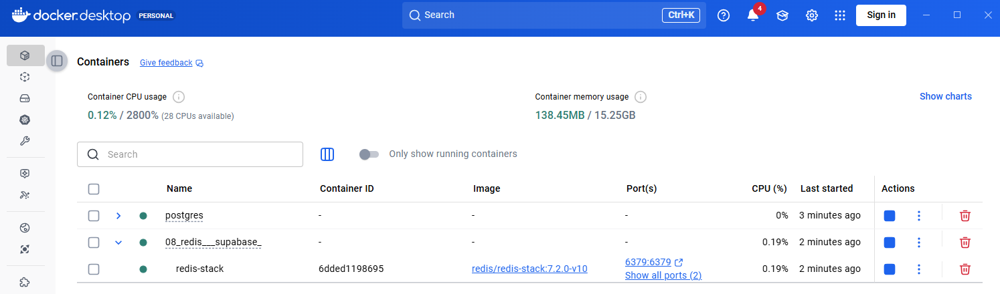

---
### [Redis UI 접속 주소](http://localhost:8001)

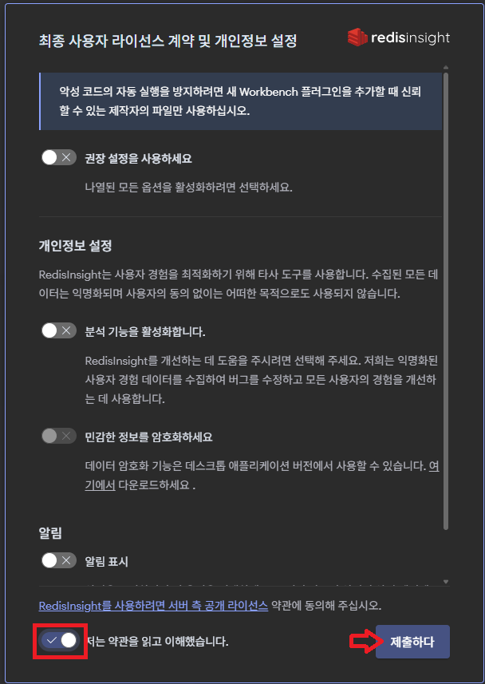

---
> Redis UI 접속 성공 

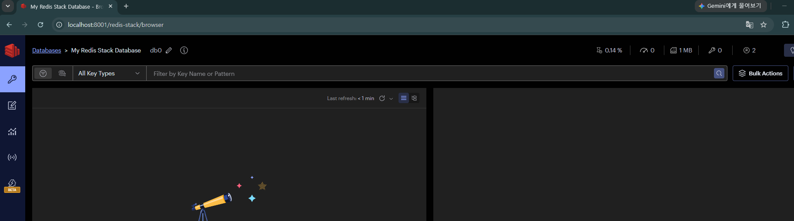

---
따라서 `.env`의 설정은 다음과 같습니다.

```env
REDIS_URL=redis://localhost:6379/0
```

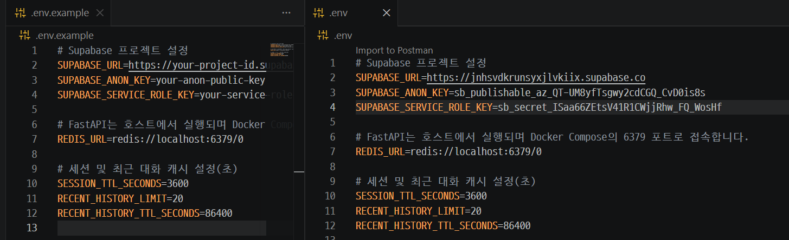

---
> `--protected-mode no` 설정은 로컬 실습용입니다. `6379` 포트를 외부 인터넷에 공개하는 운영 환경에서는 인증과 네트워크 접근 제어를 반드시 설정해야 합니다.

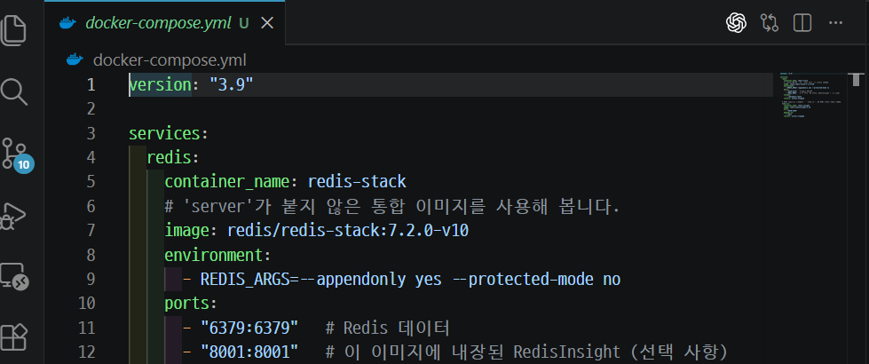

---
### FastAPI Redis 클라이언트 초기화

```python
import redis

r = redis.from_url(
    "redis://localhost:6379/0",
    decode_responses=True,   # bytes → str 자동 변환
)
r.ping()  # True
```

`decode_responses=True`가 없으면 모든 값이 `bytes`로 반환되어 JSON 파싱·딕셔너리 비교 시 `AttributeError: 'bytes' object`가 발생합니다.

---
### 키 이름 설계

```
권장 패턴: {도메인}:{식별자}

app_session:{session_id}                 → 앱 세션 Hash
recent_history:{user_id}:{conversation_id} → 최근 대화 캐시 List
```

```bash
KEYS app_session:*      # 키 목록 (운영 환경에서 사용 금지!)
TYPE app_session:abc    # hash
DEL app_session:abc     # 키 삭제
```

---

## 2. 전체 아키텍처

```
[클라이언트]
     │
     │ 로그인 (email + password)
     ▼
[FastAPI] ──────────────────────► Supabase Auth
     │                              access_token 발급
     │ session_id 반환
     │ (access_token은 서버만 보관)
     ▼
[Redis]                        [Supabase PostgreSQL]
app_session:{id}               profiles (영구)
  user_id                      chat_conversations (영구)
  access_token                 chat_messages (영구)
  created_at
recent_history:{uid}:{conv_id}  ← 최근 N개 캐시
```

---
### Supabase vs Redis 역할 분리

| 데이터 | 저장 위치 | 이유 |
|--------|-----------|------|
| 회원 계정 | Supabase Auth | 인증 전용 시스템 |
| 프로필, 대화, 메시지 | Supabase PostgreSQL | 영구 보관 필요 |
| 앱 세션 | Redis | TTL 자동 만료, 빠른 조회 |
| 최근 대화 캐시 | Redis | LLM 컨텍스트용 빠른 읽기 |

---

## 3. 로그인 흐름 — Auth → 앱 세션
> Supabase Auth 로그인 결과를 Redis에 저장하고 자체 `session_id`를 발급합니다.
> `access_token`은 Redis 안에만 있으므로 클라이언트에 노출되지 않습니다.

```python
@app.post("/auth/login")
def login(data: LoginRequest):
    # 1. Supabase Auth로 이메일/비밀번호 검증
    result = public_client().auth.sign_in_with_password({
    ... 

    # 2. Redis에 앱 세션 저장 (access_token 포함)
    session_id = str(uuid4())
    key = f"app_session:{session_id}"
    ...

    # 3. 클라이언트에게는 session_id만 반환 (access_token 노출 안 함)
    return {"session_id": session_id, "user_id": user_id}
```

---
## 4. 이중 검증 — Redis 세션 + Supabase 토큰
> Redis 세션 안의 Supabase `access_token`도 유효한지 함께 검증합니다.

```python
    # 1단계: Redis 세션 존재 확인
    if not data:
        raise HTTPException(401, "세션이 없거나 만료되었습니다. 다시 로그인하세요.")

    # 2단계: Supabase access_token 검증
    try:
        auth_result = public_client().auth.get_user(data
    ...

    # 3단계: user_id 일치 확인 (변조 방지)
    if str(auth_result.user.id) != data["user_id"]:
        ...

    # 4단계: TTL 갱신 (Sliding Expiry)
    r.expire(key, SESSION_TTL_SECONDS)
    ...
```

---
### 검증 단계 요약

| 단계 | 확인 내용 | 실패 시 |
|------|----------|---------|
| 1 | Redis 세션 존재 | 401 + 재로그인 안내 |
| 2 | Supabase access_token 유효성 | 세션 삭제 + 401 |
| 3 | Redis user_id == Auth user_id | 세션 삭제 + 401 |
| 4 | TTL 갱신 | - |

---
## 5. 메시지 이중 저장 — Supabase 먼저

메시지를 영구 저장소(Supabase)와 캐시(Redis) 두 곳에 저장합니다.

---
### 저장 순서가 중요한 이유

```
Redis 먼저 → Supabase 실패
   Redis에는 있지만 Supabase에는 없음
   서버 재시작 후 캐시 만료 → 메시지 영구 유실!

Supabase 먼저 → Redis 실패
   Supabase에 원본이 있으므로
   POST /recent/rebuild 로 캐시 복구 가능
```

---
```python
@app.post("/conversations/{conversation_id}/messages", status_code=201)
def create_message(
    conversation_id: str,
    data: MessageCreate,
    session: AppSession = Depends(get_current_session),
):
    # 소유권 확인
    get_owned_conversation(conversation_id, session.user_id)

    # 1. Supabase에 영구 저장 (반드시 성공해야 함)
    result = (
        admin_client()
        .table("chat_messages")
    ...

    # 2. Redis 캐시 저장 (실패해도 원본은 Supabase에 있음)
    cache_key = f"recent_history:{session.user_id}:{conversation_id}"
    r.rpush(cache_key, json.dumps(message, ensure_ascii=False))
    r.ltrim(cache_key, -RECENT_HISTORY_LIMIT, -1)
    r.expire(cache_key, RECENT_HISTORY_TTL_SECONDS)

    return message
```

---
## 6. 두 가지 조회 엔드포인트

| 엔드포인트 | 데이터 소스 | 특징 |
|-----------|-----------|------|
| `GET /conversations/{id}/messages` | Supabase | 전체 이력, 느릴 수 있음 |
| `GET /conversations/{id}/recent` | Redis | 최근 N개만, 초고속 |

```python
@app.get("/conversations/{conversation_id}/recent")
def get_recent(
    conversation_id: str,
    session: AppSession = Depends(get_current_session),
):
    get_owned_conversation(conversation_id, session.user_id)
    key = f"recent_history:{session.user_id}:{conversation_id}"
    return [json.loads(m) for m in r.lrange(key, 0, -1)]
```

---
## 7. 캐시 복구 (Rebuild)
> Redis 캐시가 만료되거나 `./database` 데이터가 유실되면, Supabase의 영구 데이터로 캐시를 다시 채웁니다.

```python
@app.post("/conversations/{conversation_id}/recent/rebuild")
def rebuild_recent(conversation_id: str, session: AppSession = Depends(get_current_session),
):
    get_owned_conversation(conversation_id, session.user_id)

    # 1. Supabase에서 최근 메시지 조회
    result = (
        ...
    )
    messages = list(reversed(result.data))  # 오래된 것부터 순서 복원

    # 2. Redis 캐시 재생성
    cache_key = f"recent_history:{session.user_id}:{conversation_id}"
    r.delete(cache_key)
    ...
```

---
### 왜 reversed가 필요한가

```
Supabase에서 최신순으로 조회:
  order("created_at", desc=True) → [msg5, msg4, msg3, msg2, msg1]

Redis List는 오래된 것부터 순서대로 저장해야 함:
  list(reversed(...)) → [msg1, msg2, msg3, msg4, msg5]

RPUSH 순서대로 넣으면:
  List: [msg1, msg2, msg3, msg4, msg5]  ← 올바른 순서
```

---
## 8. 서버 실행 및 Swagger 실습

---
### Supabase에 schema.sql 실행 (기존 테이블 삭제한 후 실행)
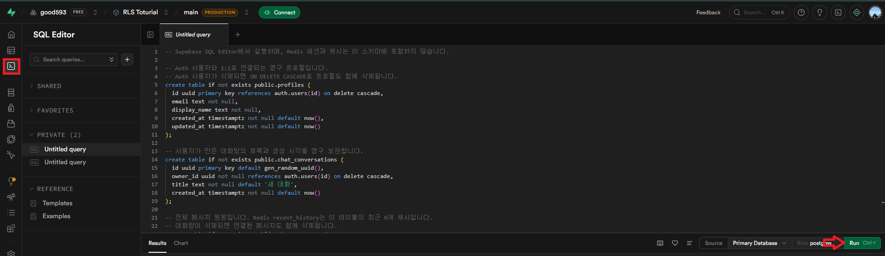

---
### 가상환경 생성
```bash
# pyproject.toml과 uv.lock 기준으로 의존성 설치
uv sync
```

### 서버 실행

```bash
# 1. .env 파일에 실제 키 입력
# 2. 서버 실행
uv run uvicorn main:app --reload --port 8002
```
> `8001` 포트는 Docker Compose의 RedisInsight가 사용하므로 FastAPI는 `8002` 포트로 실행합니다.

---
### Swagger UI 실습 (http://localhost:8002/docs)

> 각 API에서 **Try it out**을 누른 뒤 아래 순서대로 입력합니다.

이번 실습은 Swagger UI 우측 상단의 **Authorize** 기능을 사용하지 않습니다.
로그인 응답으로 받은 `session_id`를 보호된 API의 `X-Session-Id` 헤더에 직접 입력합니다.


---
### 실습 1. Redis 연결 상태 확인

`GET /health` → **Try it out** → **Execute**

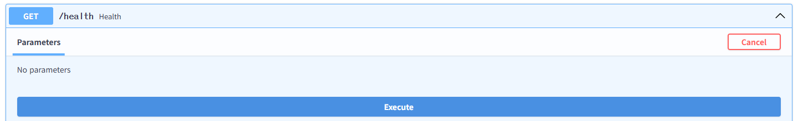

---
→ `200 OK` 확인

> Redis 연결 오류가 발생하면 `docker compose ps`와
> `docker compose exec redis redis-cli ping`을 먼저 확인합니다.

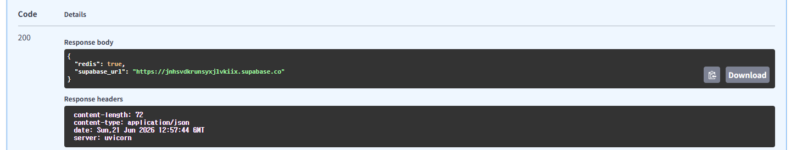

---
### 실습 2. 사용자 A 회원가입

`POST /auth/signup` → **Try it out** → Body 입력 → **Execute**

```json
{
  "email": "swagger08-a@example.com",
  "password": "swagger1234",
  "display_name": "사용자 A"
}
```

→ `200 OK` 확인  
→ 응답의 `user_id`, `email`, `email_confirm_required` 확인

> `email_confirm_required`가 `true`이면 이메일 인증을 완료합니다. 또는 Supabase
> Auth 설정에서 Confirm email을 비활성화한 뒤, 기존 사용자를 삭제하고 새로운
> 이메일로 다시 가입합니다.

---
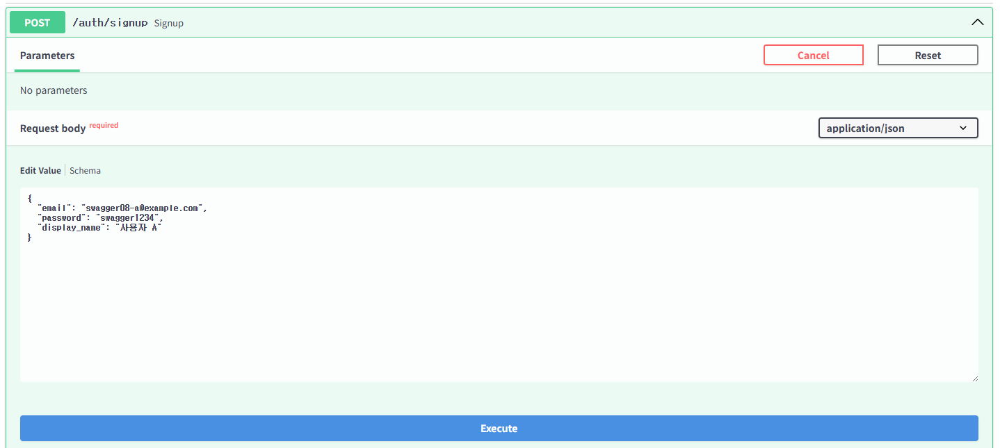

---
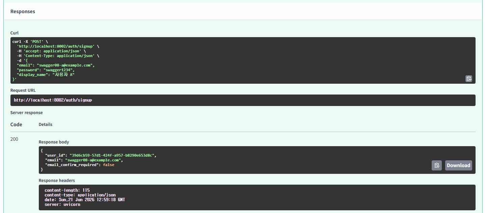

---
> Supabase에서 저장된 사용자 확인 

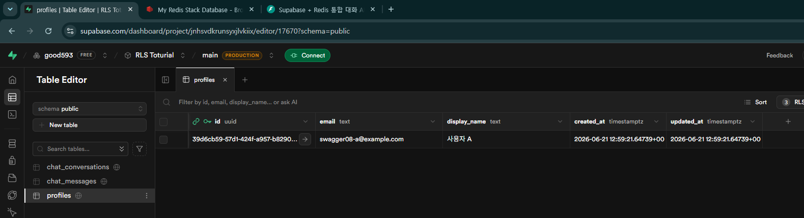

---
### 실습 3. 사용자 A 로그인 및 앱 세션 저장

`POST /auth/login` → **Try it out** → Body 입력 → **Execute**

```json
{
  "email": "swagger08-a@example.com",
  "password": "swagger1234"
}
```

---
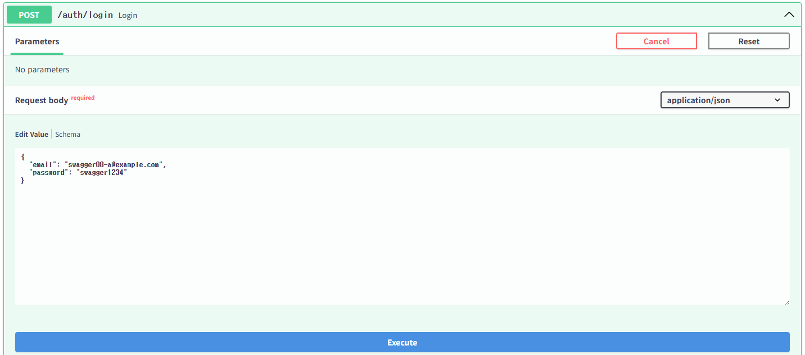

---
→ `200 OK` 확인  
→ 응답의 `user_id`를 `USER_A_USER_ID`로 저장  
→ 응답의 `session_id`를 `USER_A_SESSION_ID`로 저장  
→ `ttl_seconds`가 `SESSION_TTL_SECONDS`와 비슷한 값인지 확인

```json
{
  "session_id": "발급된-session-id",
  "user_id": "사용자-A-UUID",
  "email": "swagger08-a@example.com",
  "ttl_seconds": 3600
}
```

> Supabase의 `access_token`과 `refresh_token`은 Redis에 보관되며 클라이언트에는 앱의 `session_id`만 반환됩니다.

---
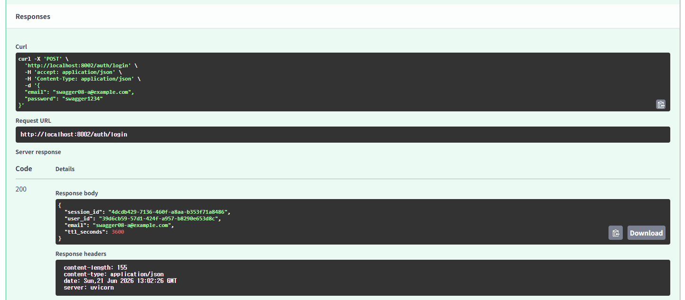

---
> [Redis에서 저장된 token 확인](http://localhost:8001/redis-stack/browser)

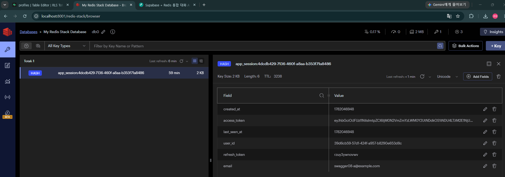

---
### 실습 4. 세션 없이 보호된 API 요청

`GET /me` → **Try it out** → `X-Session-Id`를 비운 상태로 **Execute**

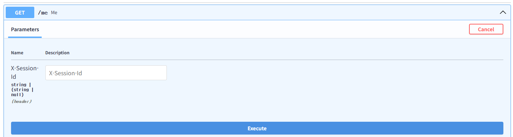

---
→ `401 Unauthorized` 확인

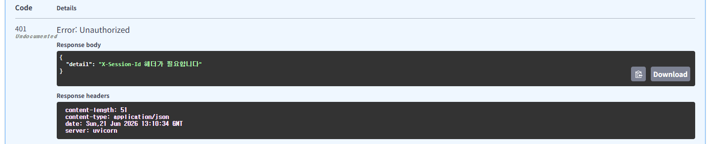

---
### 실습 5. 사용자 A 프로필과 세션 TTL 조회

`GET /me` → **Try it out**

1. `X-Session-Id`에 `USER_A_SESSION_ID` 입력
2. **Execute** 클릭

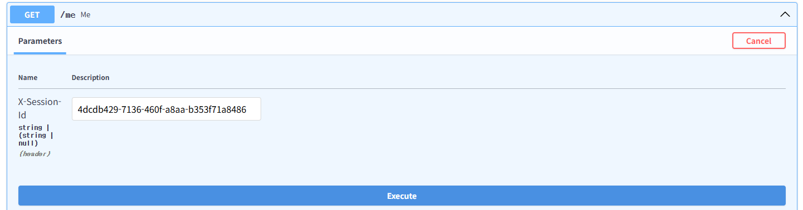

---
→ `200 OK` 확인  
→ `profile.email`이 `USER_A_EMAIL`과 같은지 확인  
→ `session_ttl_seconds`가 갱신되었는지 확인

> 보호된 API를 정상 호출할 때마다 Redis 세션의 TTL이 다시 설정되는
> Sliding Expiry 방식입니다.

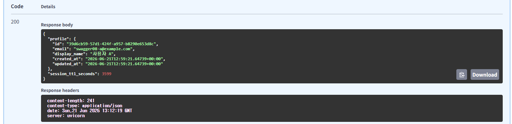

---
### 실습 6. 사용자 A 대화방 생성

`POST /conversations` → **Try it out**

1. `X-Session-Id`에 `USER_A_SESSION_ID` 입력
2. Body 입력
3. **Execute** 클릭

```json
{
  "title": "Redis 세션 실습 대화"
}
```

---
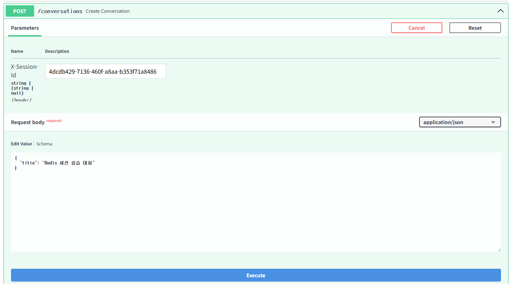

---
→ `201 Created` 확인  
→ 응답의 `id`를 `USER_A_CONVERSATION_ID`로 저장  
→ 응답의 `owner_id`가 `USER_A_USER_ID`와 같은지 확인

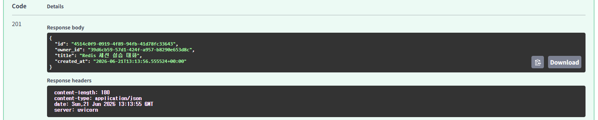

---
### 실습 7. 사용자 A 대화방 목록 조회

`GET /conversations` → **Try it out**

1. `X-Session-Id`에 `USER_A_SESSION_ID` 입력
2. **Execute** 클릭

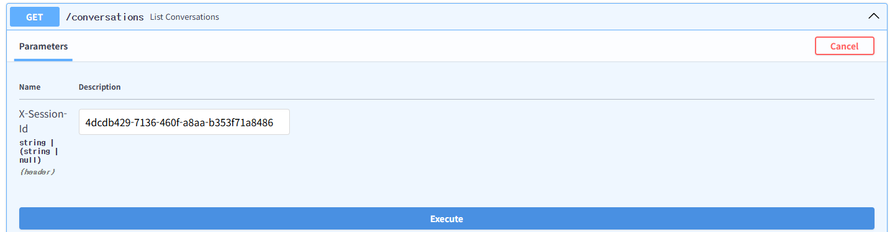

---
→ `200 OK` 확인  
→ `USER_A_CONVERSATION_ID`가 목록에 있는지 확인  
→ 반환된 모든 행의 `owner_id`가 `USER_A_USER_ID`와 같은지 확인

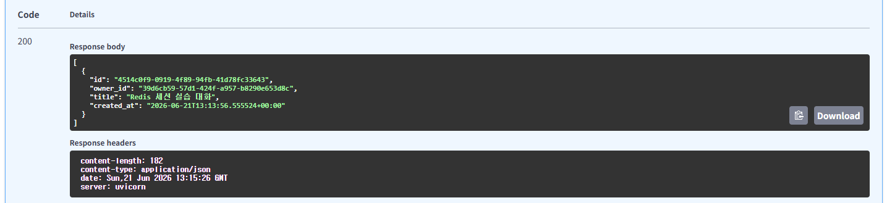

---
### 실습 8. Supabase와 Redis에 메시지 저장

`POST /conversations/{conversation_id}/messages` → **Try it out**

1. `conversation_id`에 `USER_A_CONVERSATION_ID` 입력
2. `X-Session-Id`에 `USER_A_SESSION_ID` 입력
3. 다음 Body를 입력하고 **Execute** 클릭

```json
{
  "role": "user",
  "content": "Supabase와 Redis의 역할 차이를 설명해 줘."
}
```

---
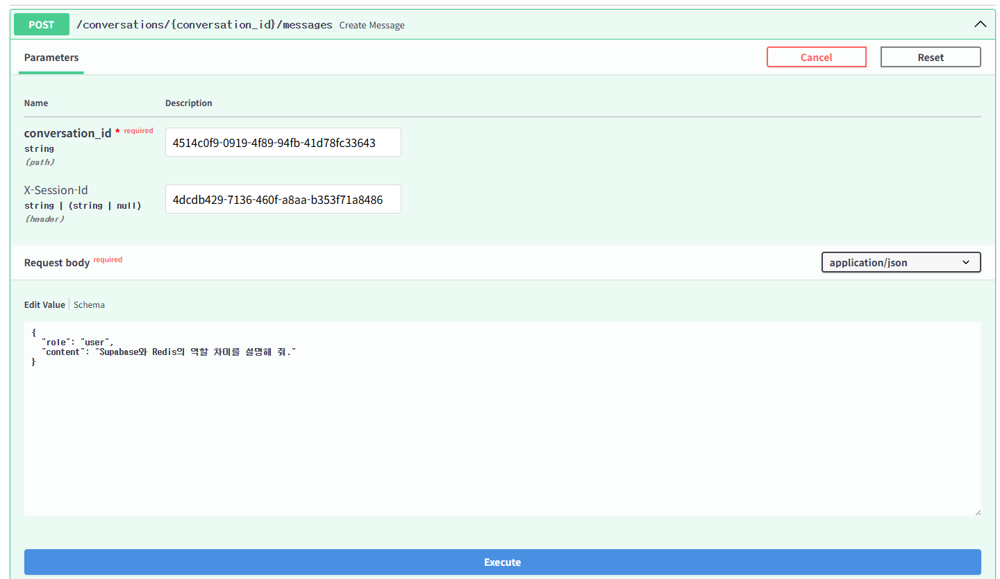

---
→ `201 Created` 확인  
→ 응답의 `conversation_id`와 `owner_id` 확인

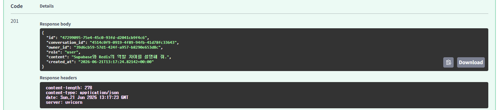

---
같은 API에서 두 번째 메시지도 저장합니다.

```json
{
  "role": "assistant",
  "content": "Supabase는 원본을 영구 저장하고 Redis는 최근 데이터를 캐시합니다."
}
```

> 메시지는 Supabase에 먼저 저장된 뒤 Redis의 최근 대화 List에 추가됩니다.
> `role`에는 `user`, `assistant`, `system` 중 하나만 입력할 수 있습니다.

---
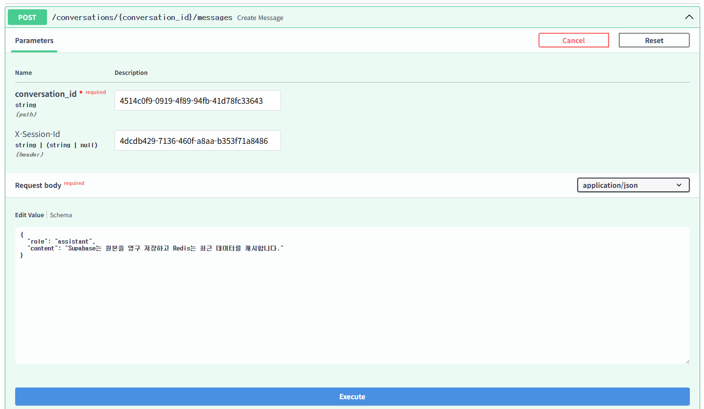

---
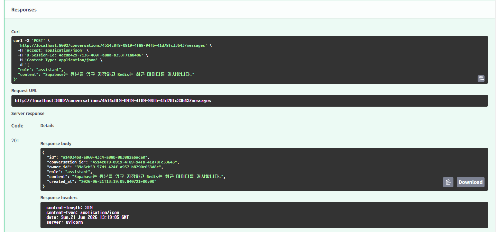

---
> Redis Stack Database 확인 

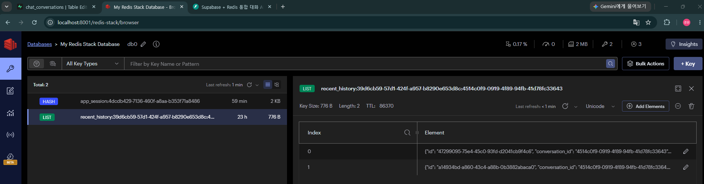

---
> Supabase Database 확인 

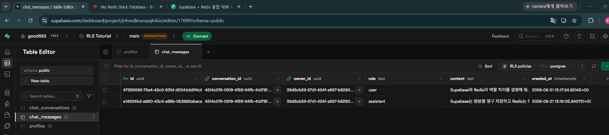

---
### 실습 9. 전체 이력과 최근 캐시 비교

먼저 `GET /conversations/{conversation_id}/messages`를 실행합니다.

1. `conversation_id`에 `USER_A_CONVERSATION_ID` 입력
2. `X-Session-Id`에 `USER_A_SESSION_ID` 입력
3. **Execute** 클릭

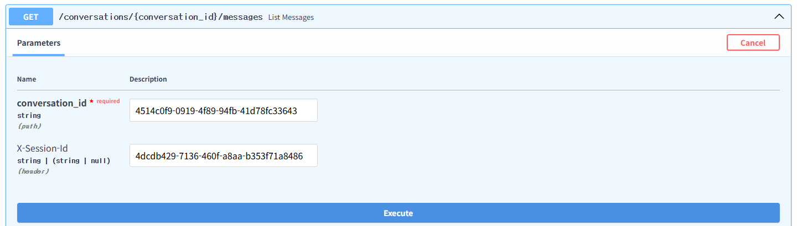

---
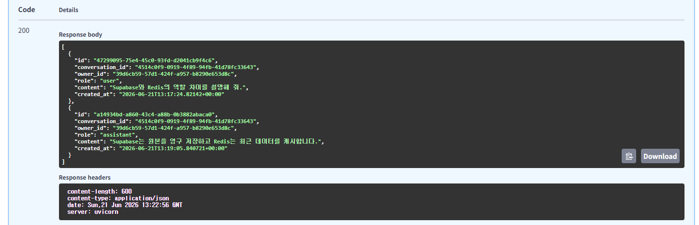

---
→ Supabase에 저장된 전체 메시지가 시간순으로 반환되는지 확인

이어서 `GET /conversations/{conversation_id}/recent`를 같은 값으로 실행합니다.

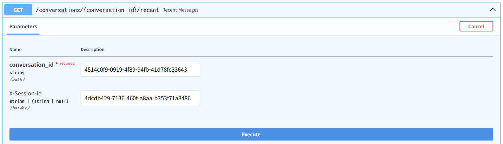

---


---
### 실습 10. Redis 최근 캐시 삭제

[RedisInsight의 Browser](http://localhost:8001/redis-stack/browser)에서 다음 키를 찾습니다.

```text
recent_history:{USER_A_USER_ID}:{USER_A_CONVERSATION_ID}
```
1. 해당 키를 삭제

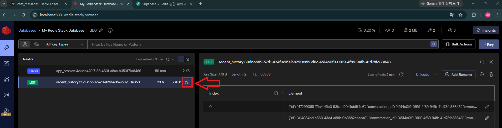

---
2. Swagger UI로 돌아와 `GET /conversations/{conversation_id}/recent` 실행
3. `conversation_id`와 `X-Session-Id`에 사용자 A의 값 입력


---
→ `200 OK`와 빈 배열 `[]` 확인

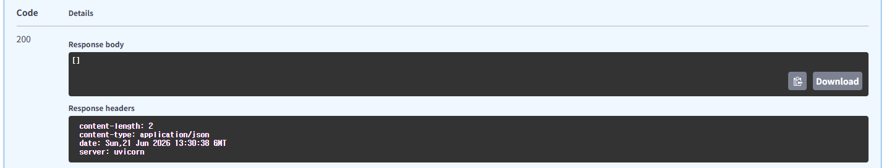

---
> Redis 캐시만 삭제했으므로 Supabase의 원본 메시지는 그대로 남아 있습니다.

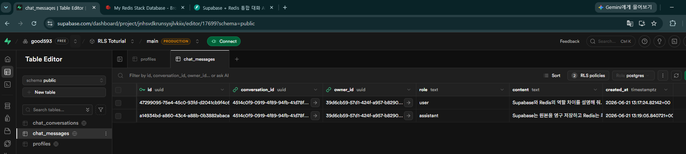

---
### 실습 11. Supabase 원본으로 캐시 복구

`POST /conversations/{conversation_id}/recent/rebuild` → **Try it out**

1. `conversation_id`에 `USER_A_CONVERSATION_ID` 입력
2. `X-Session-Id`에 `USER_A_SESSION_ID` 입력
3. **Execute** 클릭

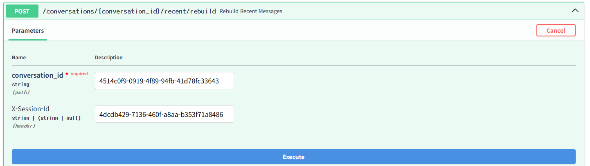

---
→ `200 OK` 확인  
→ `rebuilt`가 `2`인지 확인  
→ `recent_key`가 실습 10에서 삭제한 키와 같은지 확인

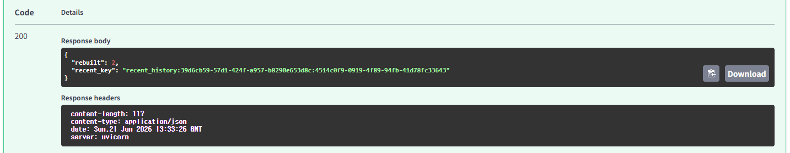

---
다시 `GET /conversations/{conversation_id}/recent`를 실행합니다.
→ 두 메시지가 오래된 것부터 올바른 순서로 복구되었는지 확인

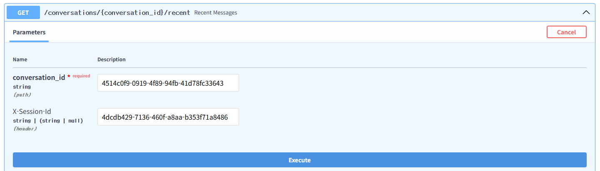

---
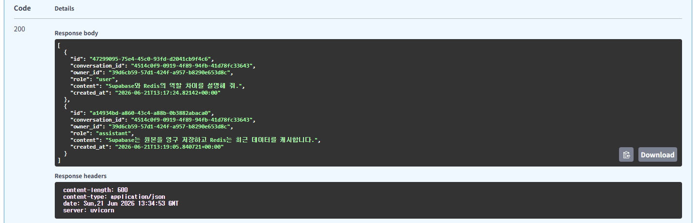

---
> Redis Stack Database에 데이터가 생성된 것 확인 

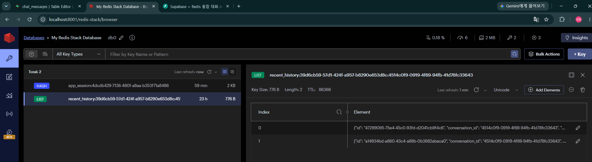

---
### 실습 12. 로그아웃 후 세션 무효화

`POST /auth/logout` → **Try it out**

1. `X-Session-Id`에 `USER_A_SESSION_ID` 입력
2. **Execute** 클릭

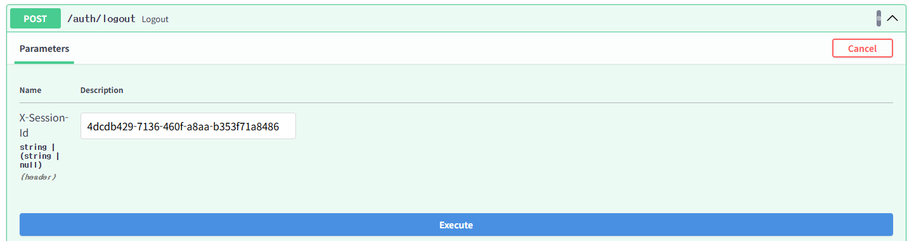

---
→ `200 OK`와 `"deleted": true` 확인

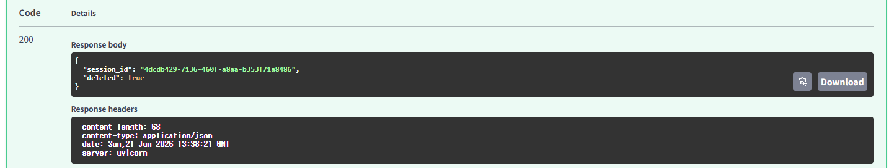

---
같은 `USER_A_SESSION_ID`로 `GET /me`를 다시 실행합니다.

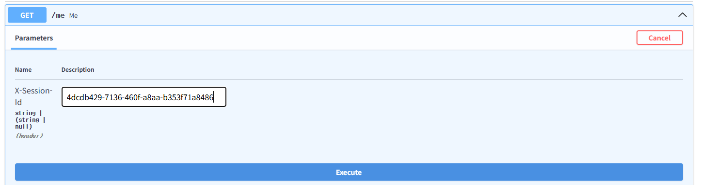

---
→ `401 Unauthorized` 확인

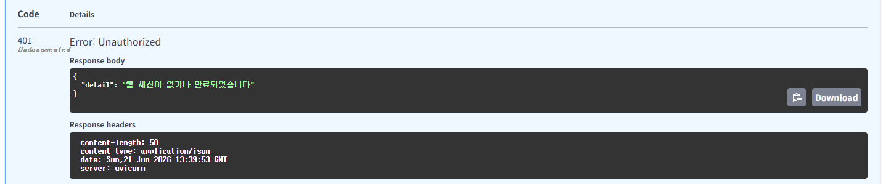

